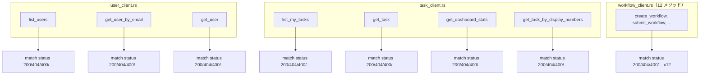
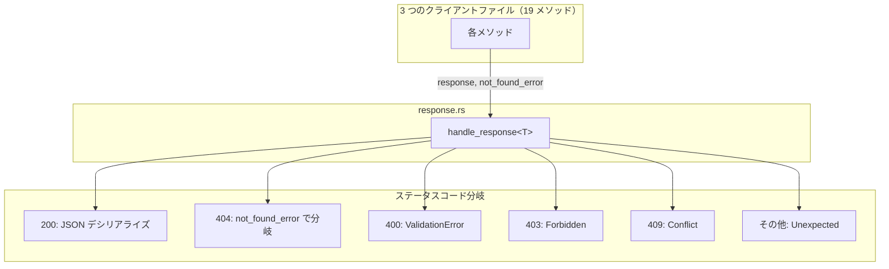
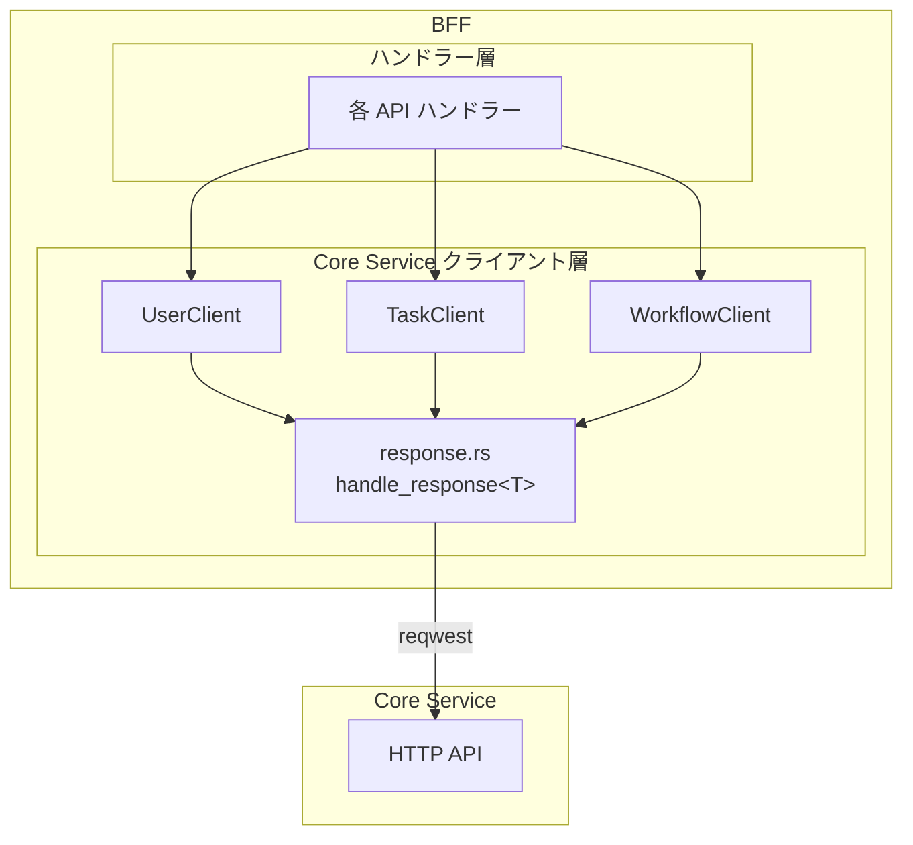

# BFF レスポンスハンドリング共通化 - 機能解説

対応 PR: #421
対応 Issue: #377

## 概要

BFF Client の Core Service 呼び出しにおけるレスポンスハンドリングの重複を解消した。19 メソッド（3 ファイル）で繰り返されていた `match response.status()` パターンを、単一の `handle_response<T>` 関数に集約した。

## 背景

### BFF Client の構成

BFF は Core Service の HTTP API を呼び出すクライアント層を持つ。ISP（Interface Segregation Principle）に基づき、3 つのサブトレイトに分割されている:

| トレイト | メソッド数 | 対象 |
|---------|-----------|------|
| `CoreServiceUserClient` | 3 | ユーザー |
| `CoreServiceTaskClient` | 4 | タスク・ダッシュボード |
| `CoreServiceWorkflowClient` | 12 | ワークフロー |

### 変更前の課題

全 19 メソッドが以下のパターンを個別に実装していた:

1. HTTP リクエストを送信
2. ステータスコードで分岐（`match response.status()`）
3. 成功なら JSON デシリアライズ、エラーならエラー型にマッピング

この分岐ロジックの差異は「404 の場合にどのエラーを返すか」だけであった。リスト取得系は 404 をハンドリングせず、個別取得系はリソース固有の NotFound エラーを返す。

残りのステータスコード（200, 400, 403, 409, 500 等）の処理は全メソッドで同一だった。

課題:
- jscpd（コピー&ペースト検出）でクローン数 126、重複率 12.21%
- 新メソッド追加時にステータスコード処理のコピーが必要
- 一部メソッドで 400/403/409 のハンドリングが漏れていた（一貫性の欠如）

### #377 全体の中での位置づけ

Issue #377 は BFF Client のリファクタリング全般を扱う。本 PR はそのうちレスポンスハンドリングの共通化に集中した。

## 用語・概念

| 用語 | 説明 | 関連コード |
|------|------|-----------|
| `ApiResponse<T>` | Core Service の成功レスポンスのラッパー型。`data: T` を持つ | `ringiflow_shared::ApiResponse` |
| `CoreServiceError` | Core Service 呼び出し時のエラー型。9 バリアント | `error::CoreServiceError` |
| NOT_FOUND マッピング | 404 を受けたときに返す具体的なエラーバリアント。メソッドごとに異なる | `Option<CoreServiceError>` |

## ビフォー・アフター

### Before（変更前）

各メソッドが個別にレスポンスハンドリングを実装していた。

#### 制約・課題

- 19 箇所に同じ分岐ロジックが散在
- 一部メソッドで 400/403/409 のハンドリングが欠如

### After（変更後）

単一の `handle_response<T>` 関数にレスポンスハンドリングを集約した。

#### 改善点

- 重複コード削減: +201 / -360（net -159 行）
- jscpd: クローン数 126 → 120（-6）、重複率 12.21% → 10.69%（-1.52pp）
- 全メソッドで 400/403/409 が一律ハンドリングされるようになった

## アーキテクチャ

`handle_response` は `pub(super)` visibility で `core_service` モジュール内部のみに公開。クライアント層の実装詳細として位置づけている。

## エラーハンドリング

| ステータスコード | エラーバリアント | 備考 |
|-----------------|----------------|------|
| 200-299 | （成功） | `ApiResponse<T>` にデシリアライズ |
| 400 | `ValidationError(body)` | レスポンスボディをそのまま保持 |
| 403 | `Forbidden(body)` | 同上 |
| 404 | `not_found_error` 引数で決定 | `Some` → 指定エラー、`None` → `Unexpected` |
| 409 | `Conflict(body)` | 同上 |
| その他 | `Unexpected(msg)` | ステータスコードとボディを含む |
| JSON パースエラー | `Network` | `reqwest::Error` → `From` impl |

### NOT_FOUND マッピングの一覧

| メソッド | `not_found_error` |
|---------|------------------|
| `list_users` | `None` |
| `get_user_by_email` | `Some(UserNotFound)` |
| `get_user` | `Some(UserNotFound)` |
| `list_my_tasks` | `None` |
| `get_task` | `Some(StepNotFound)` |
| `get_dashboard_stats` | `None` |
| `get_task_by_display_numbers` | `Some(StepNotFound)` |
| `list_workflow_definitions` | `None` |
| `get_workflow_definition` | `Some(WorkflowDefinitionNotFound)` |
| `list_my_workflows` | `None` |
| `get_workflow` | `Some(WorkflowInstanceNotFound)` |
| `create_workflow` | `Some(WorkflowDefinitionNotFound)` |
| `submit_workflow` | `Some(WorkflowInstanceNotFound)` |
| `approve_step` | `Some(StepNotFound)` |
| `reject_step` | `Some(StepNotFound)` |
| `get_workflow_by_display_number` | `Some(WorkflowInstanceNotFound)` |
| `submit_workflow_by_display_number` | `Some(WorkflowInstanceNotFound)` |
| `approve_step_by_display_number` | `Some(StepNotFound)` |
| `reject_step_by_display_number` | `Some(StepNotFound)` |

## 設計判断

機能・仕組みレベルの判断を記載する。コード実装レベルの判断は[コード解説](./02_レスポンスハンドリング共通化_コード解説.md#設計解説)を参照。

### 1. 共通化の手段をどうするか

19 メソッドの重複ロジックを共通化する手段として、関数・トレイト・マクロの 3 つを検討した。

| 案 | 柔軟性 | 実装コスト | 可読性 |
|----|--------|-----------|--------|
| **関数（採用）** | 差異が引数で吸収可能 | 低い | 高い |
| トレイトのデフォルト実装 | 高い（メソッド単位でオーバーライド可） | 中程度 | 中程度 |
| マクロ | 高い | 中程度 | 低い |

**採用理由**: メソッド間の差異が「404 のマッピング先」だけであり、`Option<CoreServiceError>` 引数で表現できる。最もシンプルな手段で十分。

### 2. 一部メソッドの 400/403/409 ハンドリング追加をどうするか

変更前は一部メソッドで 400/403/409 をハンドリングしておらず、`Unexpected` にフォールスルーしていた。共通化により全メソッドで一律ハンドリングされるようになる。

| 案 | 一貫性 | リスク | 複雑さ |
|----|--------|-------|-------|
| **一律処理（採用）** | 全メソッド統一 | 低い（既存動作と互換） | 低い |
| メソッドごとに処理するステータスを選択可能にする | メソッド固有 | なし | 高い |

**採用理由**: 400/403/409 の処理は本来全メソッドで必要。個別にハンドリングしていなかったのは実装漏れに近い。一律処理による副作用リスクより、一貫性向上のメリットが上回る。

## 関連ドキュメント

- [コード解説](./02_レスポンスハンドリング共通化_コード解説.md)
- [セッションログ](../../../prompts/runs/2026-02/2026-02-11_1043_BFFレスポンスハンドリング共通化.md)
