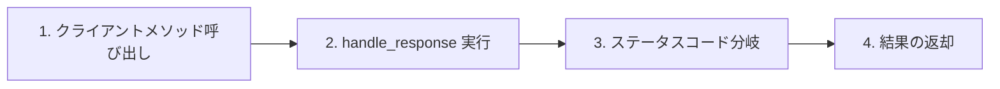
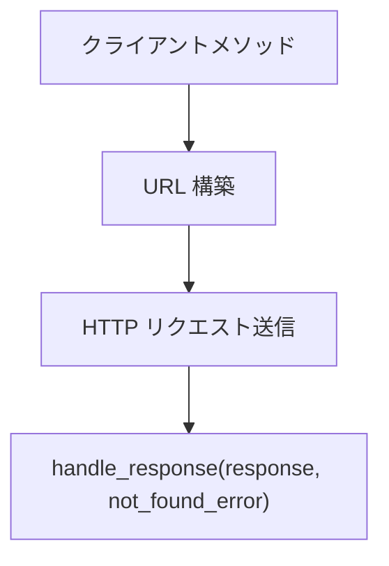
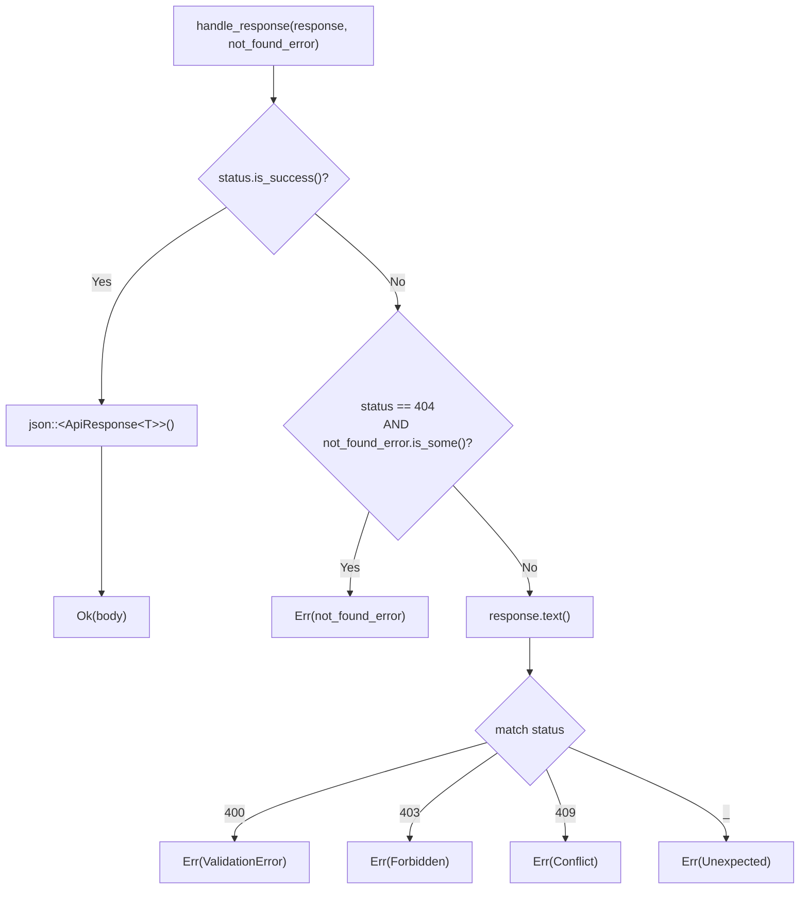
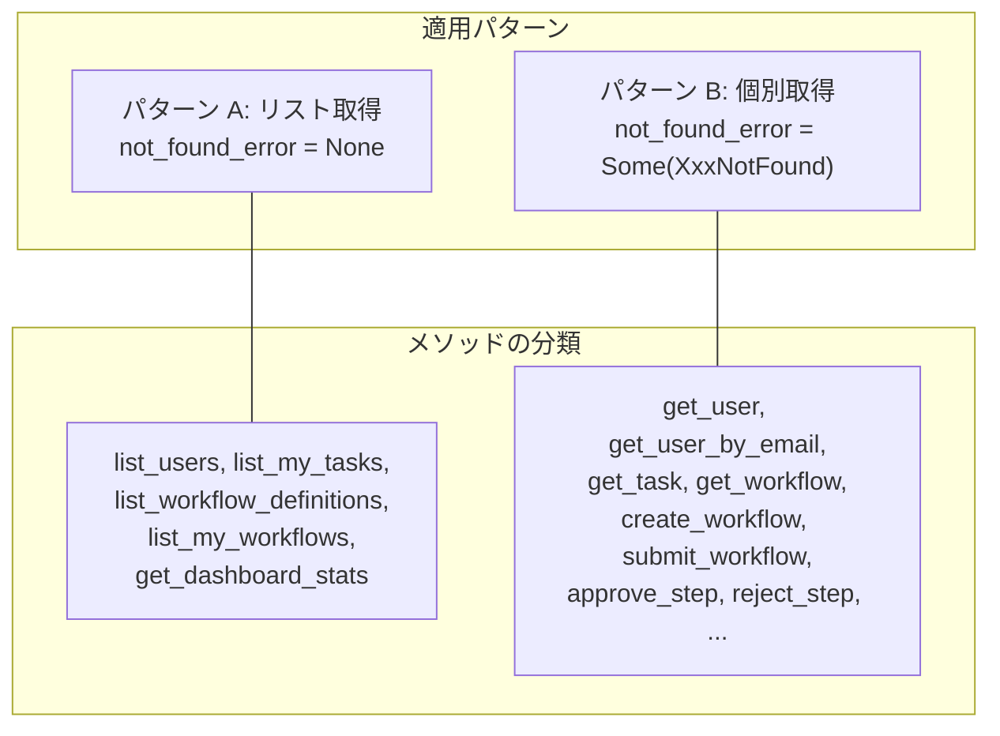
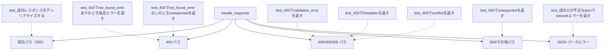

# BFF レスポンスハンドリング共通化 - コード解説

対応 PR: #421
対応 Issue: #377

## 主要な型・関数

| 型/関数 | ファイル | 責務 |
|--------|---------|------|
| `handle_response<T>` | [`response.rs:17`](../../../backend/apps/bff/src/client/core_service/response.rs) | HTTP レスポンスを `Result<ApiResponse<T>, CoreServiceError>` に変換 |
| `CoreServiceError` | [`error.rs:7`](../../../backend/apps/bff/src/client/core_service/error.rs) | Core Service 呼び出しのエラー型（9 バリアント） |
| `ApiResponse<T>` | `ringiflow_shared` | Core Service の成功レスポンスラッパー |

### 型の関係

```mermaid
classDiagram
    class handle_response~T~ {
        +response: reqwest::Response
        +not_found_error: Option~CoreServiceError~
        Result~ApiResponse~T~, CoreServiceError~
    }
    class CoreServiceError {
        UserNotFound
        WorkflowDefinitionNotFound
        WorkflowInstanceNotFound
        StepNotFound
        ValidationError(String)
        Forbidden(String)
        Conflict(String)
        Network(String)
        Unexpected(String)
    }
    class ApiResponse~T~ {
        +data: T
    }

    handle_response~T~ --> CoreServiceError : エラー時
    handle_response~T~ --> ApiResponse~T~ : 成功時
    CoreServiceError <|-- "reqwest::Error" : From impl
```

## コードフロー

コードをライフサイクル順に追う。各ステップの構造を図で示した後、対応するコードを解説する。



### 1. クライアントメソッド呼び出し（各クライアントファイル）

各クライアントメソッドは HTTP リクエスト送信後、レスポンスを `handle_response` に委譲する。差異は URL 構築と `not_found_error` 引数のみ。



リスト取得系の例（`not_found_error: None`）:

```rust
// user_client.rs:70-78
async fn list_users(
   &self,
   tenant_id: Uuid,
) -> Result<ApiResponse<Vec<UserItemDto>>, CoreServiceError> {
   let url = format!("{}/internal/users?tenant_id={}", self.base_url, tenant_id);

   let response = self.client.get(&url).send().await?;       // ① HTTP 送信
   handle_response(response, None).await                      // ② 404 は Unexpected
}
```

個別取得系の例（`not_found_error: Some(...)`）:

```rust
// user_client.rs:80-94
async fn get_user_by_email(
   &self,
   tenant_id: Uuid,
   email: &str,
) -> Result<ApiResponse<UserResponse>, CoreServiceError> {
   let url = format!(
      "{}/internal/users/by-email?email={}&tenant_id={}",
      self.base_url,
      urlencoding::encode(email),
      tenant_id
   );

   let response = self.client.get(&url).send().await?;
   handle_response(response, Some(CoreServiceError::UserNotFound)).await  // ① 404 → UserNotFound
}
```

注目ポイント:

- ① `not_found_error` が `None`（リスト系）か `Some`（個別取得系）かが、メソッド間の唯一の差異
- URL 構築とリクエスト送信は各メソッド固有のため共通化対象外

### 2. handle_response の実行（response.rs）

レスポンスのステータスコードに応じた分岐処理を行う。



```rust
// response.rs:17-44
pub(super) async fn handle_response<T: DeserializeOwned>(
   response: reqwest::Response,
   not_found_error: Option<CoreServiceError>,
) -> Result<ApiResponse<T>, CoreServiceError> {
   let status = response.status();

   if status.is_success() {                                      // ① 成功パス
      let body = response.json::<ApiResponse<T>>().await?;
      return Ok(body);
   }

   if status == reqwest::StatusCode::NOT_FOUND                   // ② let-chain 構文
      && let Some(err) = not_found_error
   {
      return Err(err);
   }

   let body = response.text().await.unwrap_or_default();         // ③ エラーボディ取得

   let error = match status {                                    // ④ ステータスコード分岐
      reqwest::StatusCode::BAD_REQUEST => CoreServiceError::ValidationError(body),
      reqwest::StatusCode::FORBIDDEN => CoreServiceError::Forbidden(body),
      reqwest::StatusCode::CONFLICT => CoreServiceError::Conflict(body),
      _ => CoreServiceError::Unexpected(format!("予期しないステータス {}: {}", status, body)),
   };

   Err(error)
}
```

注目ポイント:

- ① 成功パス: `is_success()` で 2xx 全体をカバー。`json()` は `reqwest::Error` → `From` impl → `CoreServiceError::Network` に変換
- ② let-chain 構文（Rust 2024 安定化）: `if status == NOT_FOUND && let Some(err) = not_found_error` で条件とパターンマッチを 1 つの `if` に結合。`not_found_error` が `None` なら `Unexpected` にフォールスルー
- ③ エラーボディ取得: `unwrap_or_default()` でボディ読み取り失敗時も空文字で継続
- ④ ステータスコード分岐: 400/403/409 を個別にマッピングし、それ以外は `Unexpected` でキャッチオール

### 3. 各クライアントへの適用パターン



| パターン | `not_found_error` | メソッド数 | 典型例 |
|---------|-------------------|-----------|--------|
| A: リスト取得 | `None` | 5 | `list_users`, `list_my_tasks` |
| B: 個別取得/操作 | `Some(XxxNotFound)` | 14 | `get_user`, `approve_step` |

## テスト

各テストがライフサイクルのどのステップを検証しているかを示す。



| テスト | 検証対象 | 検証内容 |
|-------|---------|---------|
| `test_成功レスポンスをデシリアライズする` | 成功パス | 200 レスポンスが `ApiResponse<T>` にデシリアライズされる |
| `test_404でnot_found_errorありのとき指定エラーを返す` | 404 + Some | 指定した `CoreServiceError` が返る |
| `test_404でnot_found_errorなしのときunexpectedを返す` | 404 + None | `Unexpected` にフォールスルーする |
| `test_400でvalidation_errorを返す` | 400 | `ValidationError` にボディが含まれる |
| `test_403でforbiddenを返す` | 403 | `Forbidden` にボディが含まれる |
| `test_409でconflictを返す` | 409 | `Conflict` にボディが含まれる |
| `test_500でunexpectedを返す` | 500 | `Unexpected` にステータスとボディが含まれる |
| `test_成功だが不正なjsonでnetworkエラーを返す` | JSON パースエラー | `Network` エラーが返る |

### 実行方法

```bash
cd backend && cargo test --package ringiflow-bff handle_response
```

## 依存関係

| クレート | バージョン | 追加理由 |
|---------|-----------|---------|
| `http` | `1` | テストでの `reqwest::Response` 構築（`From<http::Response>` trait） |

`http` は dev-dependencies としてのみ追加。プロダクションコードでは不使用。

## 設計解説

コード実装レベルの判断を記載する。機能・仕組みレベルの判断は[機能解説](./01_レスポンスハンドリング共通化_機能解説.md#設計判断)を参照。

### 1. `pub(super)` visibility の選択

場所: `response.rs:17`

```rust
pub(super) async fn handle_response<T: DeserializeOwned>(
```

なぜこの実装か:
`handle_response` は `core_service` モジュール内部の実装詳細であり、外部（ハンドラー層など）が直接利用する必要がない。`pub(super)` で親モジュール（`core_service`）内のみに公開し、内部 API の表面積を最小化した。

代替案:

| 案 | メリット | デメリット | 判断 |
|----|---------|-----------|------|
| `pub(super)` | 最小限の公開範囲 | サブモジュール追加時に自動公開 | 採用 |
| `pub(crate)` | クレート内で再利用可能 | 不要な公開範囲 | 見送り |
| `pub` + `re-export` しない | `mod response` が非公開なら実質同じ | 意図が不明確 | 見送り |

### 2. let-chain 構文の採用

場所: `response.rs:28-32`

```rust
if status == reqwest::StatusCode::NOT_FOUND
   && let Some(err) = not_found_error
{
   return Err(err);
}
```

なぜこの実装か:
Rust 2024 edition で安定化された let-chain 構文を使用。条件チェックとパターンマッチを 1 つの `if` 式で表現でき、ネストが浅くなる。

代替案:

| 案 | メリット | デメリット | 判断 |
|----|---------|-----------|------|
| let-chain | フラット、宣言的 | Rust 2024 が必要 | 採用 |
| ネストした `if` | 古い edition でも動作 | ネストが深い | 見送り |
| `matches!` + 分割 | パターンが明確 | 2 ステップになる | 見送り |

### 3. テストでの `http` crate 活用

場所: `response.rs:59-66`

```rust
fn make_response(status: u16, body: &str) -> reqwest::Response {
   let http_resp = http::Response::builder()
      .status(status)
      .header("content-type", "application/json")
      .body(body.to_string())
      .unwrap();
   reqwest::Response::from(http_resp)
}
```

なぜこの実装か:
`reqwest::Response` はコンストラクタを公開していないが、`From<http::Response<impl Into<Body>>>` を実装している。`http` crate の `Response::builder()` を経由することで、テスト用レスポンスを簡潔に構築できる。

代替案:

| 案 | メリット | デメリット | 判断 |
|----|---------|-----------|------|
| `http` crate の `From` impl | 簡潔、型安全 | dev-dependency の追加 | 採用 |
| モックサーバー（`mockito` 等） | 実際の HTTP 通信をテスト | テスト速度が遅い、セットアップが煩雑 | 見送り |
| `reqwest_mock` 等 | reqwest 固有の機能 | 追加クレート、メンテナンス不安 | 見送り |

### 4. エラーボディ取得時の `unwrap_or_default()`

場所: `response.rs:34`

```rust
let body = response.text().await.unwrap_or_default();
```

なぜこの実装か:
エラーレスポンスのボディ読み取りが失敗する可能性は低いが、仮に失敗してもエラーハンドリング自体が失敗するべきではない。空文字をデフォルトとすることで、ボディ読み取り失敗を静かに処理する。

## 関連ドキュメント

- [機能解説](./01_レスポンスハンドリング共通化_機能解説.md)
- [セッションログ](../../../prompts/runs/2026-02/2026-02-11_1043_BFFレスポンスハンドリング共通化.md)
