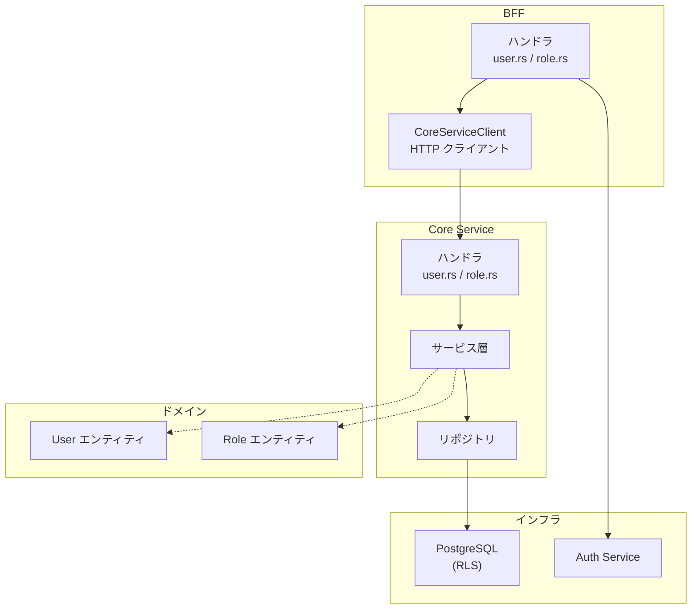
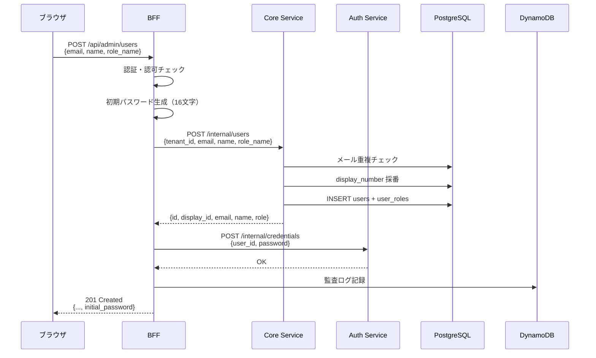
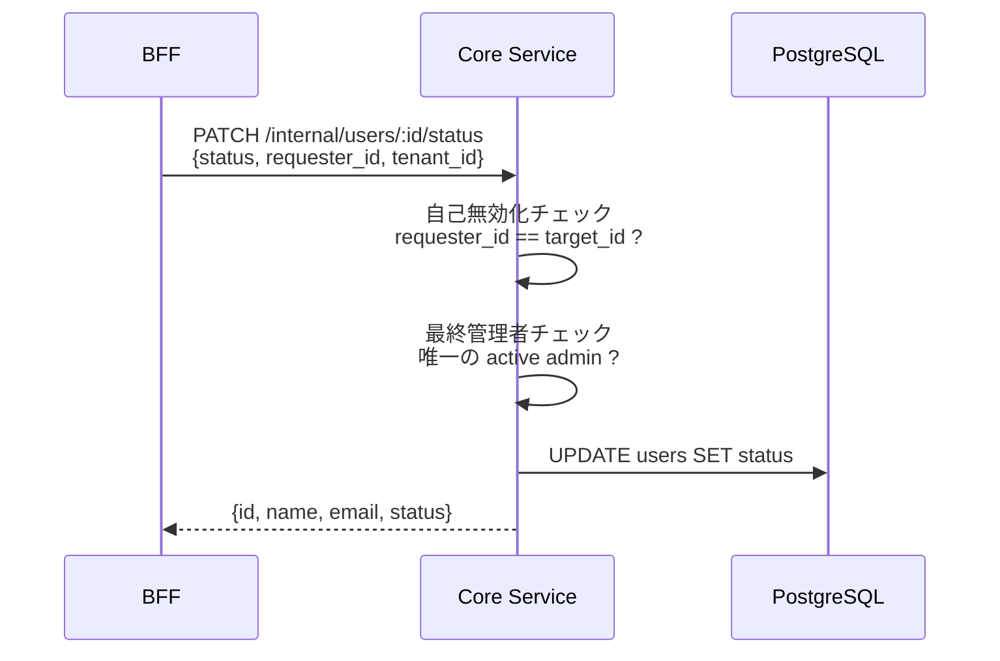
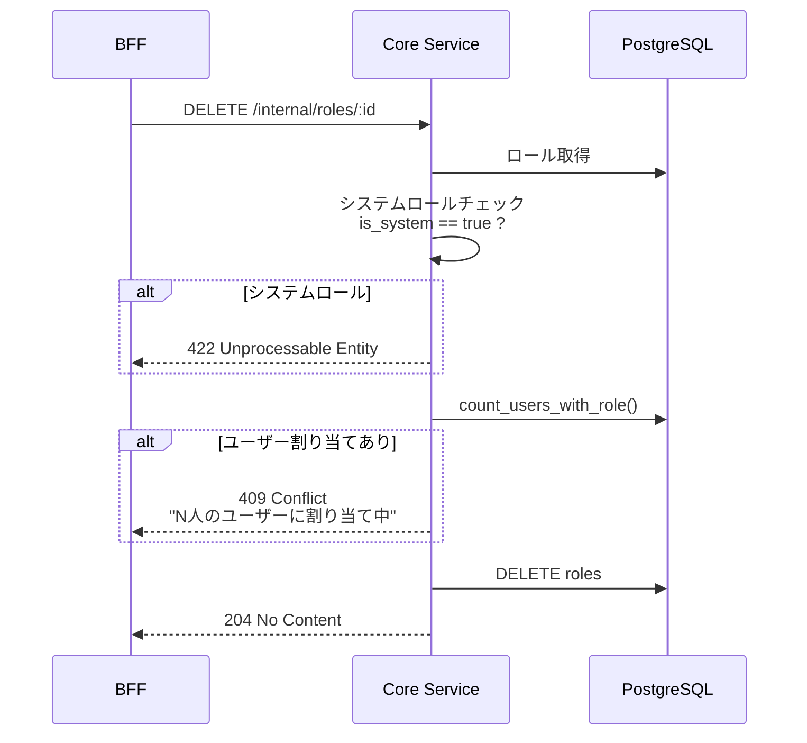

# ユーザー・ロール管理 API 機能解説

対応 PR: #426
対応 Issue: #403 (Epic), #428 (Story: ユーザー管理), #429 (Story: ロール管理)

## 概要

テナント管理者がユーザーとロールを CRUD 操作するための API を、ドメイン層から BFF 層まで一気通貫で実装した。ユーザー作成時の初期パスワード生成、メール重複防止、自己無効化防止、システムロールの保護、ユーザー割り当て中のロール削除防止を含む。

## 背景

### 解決する課題

Phase 2-1 でマルチテナント基盤（RLS、テナント情報取得）を構築したが、テナント管理者がユーザーやロールを管理する手段がなかった。管理画面のバックエンド API として、セキュリティとデータ整合性を考慮した CRUD API を提供する必要がある。

### API 設計方針

BFF は公開 API を提供し、Core Service は内部 API を提供する。BFF → Core Service の呼び出しはプロキシ的だが、BFF は認証・認可・監査ログ・レスポンス加工の責務を持つ。

## 用語・概念

| 用語 | 定義 |
|------|------|
| BFF ハンドラ | 公開 API エンドポイント。認証・認可後にCoreServiceを呼び出す |
| CoreServiceClient | BFF → Core Service の HTTP クライアント |
| display_number | ユーザーの表示用連番。テナント内で一意 |
| display_id | `USR-{display_number:06}` 形式のユーザー表示 ID |

## アーキテクチャ

### レイヤー構成



### エンドポイント一覧

| メソッド | BFF パス | Core パス | 権限 |
|---------|---------|-----------|------|
| GET | `/api/admin/users` | `/internal/users` | `user:read` |
| POST | `/api/admin/users` | `/internal/users` | `user:create` |
| GET | `/api/admin/users/:dn` | `/internal/users/by-display-number/:dn` | `user:read` |
| PATCH | `/api/admin/users/:dn` | `/internal/users/:id` | `user:update` |
| PATCH | `/api/admin/users/:dn/status` | `/internal/users/:id/status` | `user:update` |
| GET | `/api/admin/roles` | `/internal/roles` | `role:read` |
| POST | `/api/admin/roles` | `/internal/roles` | `role:create` |
| GET | `/api/admin/roles/:id` | `/internal/roles/:id` | `role:read` |
| PATCH | `/api/admin/roles/:id` | `/internal/roles/:id` | `role:update` |
| DELETE | `/api/admin/roles/:id` | `/internal/roles/:id` | `role:delete` |

## データフロー

### ユーザー作成フロー



注目ポイント: 初期パスワードは BFF でのみ生成・返却される。Core Service と Auth Service はパスワードの存在を知らない（関心の分離）。

### ユーザーステータス変更フロー



### ロール削除フロー



## 設計判断

### 1. BFF と Core Service の責務分離

| 責務 | BFF | Core Service |
|------|-----|-------------|
| 認証・認可 | セッション検証、RBAC | なし（内部通信） |
| 初期パスワード生成 | 生成・返却 | 関知しない |
| 監査ログ記録 | DynamoDB に記録 | 関知しない |
| display_number → UUID 解決 | ルーティング時 | 内部 API は UUID |
| ビジネスルール | なし | メール重複、自己無効化、最終管理者保護 |

BFF は「誰が」「何を」の文脈情報（セッション、IP、操作者名）を持ち、Core Service は「ビジネスルール」を持つ。

### 2. display_number を公開 URL に使う理由

| 案 | メリット | デメリット | 判断 |
|----|---------|-----------|------|
| display_number（採用） | 人間が読みやすい、URL が短い | BFF で UUID への解決が必要 |  |
| UUID | 解決処理不要 | URL が長い、ユーザーに不親切 |  |

BFF が `GET /internal/users/by-display-number/:dn` で UUID を解決するオーバーヘッドは許容範囲。ユーザー体験を優先した。

### 3. ユーザーステータス変更の安全性

3 つの保護ルールを Core Service のドメインロジックで実装:

1. 自己無効化防止: `requester_id == target_id` のとき、`inactive` への変更を拒否
2. 最終管理者保護: テナント内の最後の active admin を無効化することを拒否
3. システムロール保護: system role の更新・削除を拒否

これらのルールは API レベルではなくドメインレベルで強制される。UI のバリデーションを迂回しても保護される。

### 4. ロール CRUD とユーザー CRUD の統一パターン

Story #428（ユーザー）と Story #429（ロール）で同一のレイヤー構成パターンを採用:

```
BFF ハンドラ → CoreServiceClient → Core Service ハンドラ → リポジトリ → DB
```

パターンの統一により、新しいリソース（テナント設定等）を追加する際に一貫したアプローチを踏襲できる。

## 関連ドキュメント

- [機能仕様書: テナント管理](../../01_要件定義書/機能仕様書/)
- [OpenAPI 仕様](../../../openapi/openapi.yaml)
- [RBAC 認可ミドルウェア 機能解説](01_RBAC認可ミドルウェア_機能解説.md)
