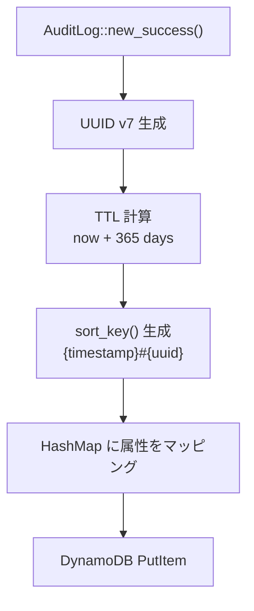
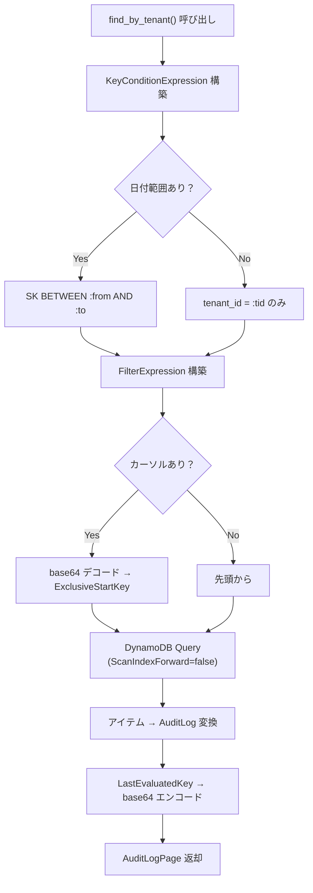

# DynamoDB 監査ログ基盤 コード解説

対応 PR: #426
対応 Issue: #403 (Epic), #430 (Story)

## 主要な型・関数

### ドメイン層

| 型/関数 | ファイル | 責務 |
|--------|---------|------|
| `AuditLog` | `backend/crates/domain/src/audit_log.rs:112` | 監査ログエンティティ。不変 |
| `AuditLog::new_success()` | `backend/crates/domain/src/audit_log.rs:133` | 成功時の監査ログ作成。TTL 自動計算 |
| `AuditLog::sort_key()` | `backend/crates/domain/src/audit_log.rs:168` | DynamoDB Sort Key 生成 |
| `AuditLog::from_stored()` | `backend/crates/domain/src/audit_log.rs:174` | Sort Key からエンティティ復元 |
| `AuditAction` | `backend/crates/domain/src/audit_log.rs:34` | 監査対象アクション（7 バリアント） |
| `AuditResult` | `backend/crates/domain/src/audit_log.rs:78` | 操作結果（Success / Failure） |

### リポジトリ層

| 型/関数 | ファイル | 責務 |
|--------|---------|------|
| `AuditLogRepository` | `backend/crates/infra/src/repository/audit_log_repository.rs:44` | リポジトリトレイト |
| `DynamoDbAuditLogRepository` | `backend/crates/infra/src/repository/audit_log_repository.rs:59` | DynamoDB 実装 |
| `AuditLogFilter` | `backend/crates/infra/src/repository/audit_log_repository.rs:27` | 検索フィルタ |
| `AuditLogPage` | `backend/crates/infra/src/repository/audit_log_repository.rs:37` | ページネーション結果 |

### BFF 層

| 型/関数 | ファイル | 責務 |
|--------|---------|------|
| `list_audit_logs()` | `backend/apps/bff/src/handler/audit_log.rs:77` | 監査ログ一覧ハンドラ |
| `AuditLogState` | `backend/apps/bff/src/handler/audit_log.rs:34` | 監査ログ API の共有状態 |

## コードフロー

### 監査ログの記録



### 監査ログの検索



## コード解説

### AuditLog ドメインモデル

```rust
// backend/crates/domain/src/audit_log.rs:112-126

pub struct AuditLog {
    pub id: Uuid,
    pub tenant_id: TenantId,
    pub actor_id: UserId,
    pub actor_name: String,
    pub action: AuditAction,
    pub result: AuditResult,
    pub resource_type: String,
    pub resource_id: String,
    pub detail: Option<serde_json::Value>,
    pub source_ip: Option<String>,
    pub created_at: DateTime<Utc>,
    pub ttl: i64,
}
```

注目ポイント:

1. フィールドが `pub` — 他のエンティティ（User, Role）と異なり、AuditLog は不変（作成後に変更しない）のため、getter メソッドのボイラープレートを省略
2. `detail: Option<serde_json::Value>` — 操作詳細を JSON で柔軟に格納。スキーマレスのため、アクション種別ごとに異なる情報を記録可能
3. `ttl: i64` — DynamoDB TTL。epoch seconds で格納し、DynamoDB が自動で期限切れアイテムを削除

### Sort Key の設計と生成

```rust
// backend/crates/domain/src/audit_log.rs:168-170

pub fn sort_key(&self) -> String {
    format!("{}#{}", self.created_at.to_rfc3339(), self.id)
}
```

```rust
// backend/crates/domain/src/audit_log.rs:186-196

// Sort Key からエンティティを復元
let (timestamp_str, id_str) = sk
    .rsplit_once('#')
    .ok_or_else(|| format!("不正な Sort Key 形式: {sk}"))?;

let created_at = DateTime::parse_from_rfc3339(timestamp_str)
    .map_err(|e| format!("タイムスタンプのパースに失敗: {e}"))?
    .with_timezone(&Utc);

let id = Uuid::parse_str(id_str)
    .map_err(|e| format!("UUID のパースに失敗: {e}"))?;
```

注目ポイント:

1. `rsplit_once('#')` で右端の `#` で分割。UUID 内に `#` は含まれないため安全
2. `to_rfc3339()` で ISO 8601 形式のタイムスタンプを生成。レキシカル順（辞書順）でソートすると時系列順になる
3. Sort Key はドメインモデルの関心事としてドメイン層に定義。リポジトリはこの形式を前提にクエリを構築

### DynamoDB リポジトリの検索クエリ構築

```rust
// backend/crates/infra/src/repository/audit_log_repository.rs:157-179

// 日付範囲フィルタ（SK の KeyConditionExpression で実現）
match (&filter.from, &filter.to) {
    (Some(from), Some(to)) => {
        key_condition.push_str(" AND sk BETWEEN :sk_from AND :sk_to");
        expr_attr_values.insert(":sk_from".to_string(),
            AttributeValue::S(from.to_rfc3339()));
        // to の末尾に ~ を付与して、同一タイムスタンプの全エントリを含める
        expr_attr_values.insert(":sk_to".to_string(),
            AttributeValue::S(format!("{}~", to.to_rfc3339())));
    }
    // ... 片側のみのケースも処理
}
```

注目ポイント:

1. 日付範囲は `KeyConditionExpression` で実現。DynamoDB の SK が `{timestamp}#...` 形式のため、タイムスタンプの前方一致で効率的にフィルタ
2. `to` の末尾に `~` を付与。`~` は ASCII で `z` より後ろのため、同一タイムスタンプの全 UUID サフィックスを包含
3. `actor_id`, `action`, `result` は `FilterExpression`（サーバーサイドフィルタ）で処理。Key 以外の属性はスキャン後にフィルタされるため、大量データではパフォーマンスに注意

### DynamoDB 予約語の回避

```rust
// backend/crates/infra/src/repository/audit_log_repository.rs:207-209

// "action" は DynamoDB の予約語のため、ExpressionAttributeNames で回避
filter_parts.push(format!("#action_attr IN ({})", placeholders.join(", ")));
query = query.expression_attribute_names("#action_attr", "action");
```

DynamoDB には予約語があり、`action` と `result` は直接使えない。`#action_attr` → `action` のエイリアスで回避する。

### カーソルの base64 エンコード/デコード

```rust
// backend/crates/infra/src/repository/audit_log_repository.rs:261-268

// 次ページのカーソル: LastEvaluatedKey → HashMap<String, String> → JSON → base64
let next_cursor = output.last_evaluated_key().map(|key| {
    let key_strings: HashMap<String, String> = key
        .iter()
        .filter_map(|(k, v)| v.as_s().ok().map(|s| (k.clone(), s.clone())))
        .collect();
    let json = serde_json::to_vec(&key_strings).unwrap_or_default();
    BASE64.encode(json)
});
```

注目ポイント:

1. `AttributeValue` は `Serialize` / `Deserialize` 非対応のため、`HashMap<String, String>` に変換してからシリアライズ
2. base64 エンコードにより、クライアントにとって opaque（中身を意識しない）なトークンとして扱える
3. デコード時は逆変換: base64 → JSON → `HashMap<String, String>` → `HashMap<String, AttributeValue>`

## テスト

### ドメインモデルのテスト

| テスト | 検証内容 | ファイル |
|--------|---------|---------|
| `test_audit_actionの各バリアントがドット区切り文字列に変換される` | Display 実装の正確性 | `audit_log.rs:220` |
| `test_audit_actionが文字列からパースできる` | FromStr のラウンドトリップ | `audit_log.rs:231` |
| `test_audit_logのttlがcreated_atから1年後に設定される` | TTL 自動計算 | `audit_log.rs:248` |
| `test_sort_keyがtimestamp_uuid形式で生成される` | Sort Key フォーマット | `audit_log.rs:266` |
| `test_from_storedでsort_keyからエンティティを復元できる` | ラウンドトリップ | `audit_log.rs:292` |

Sort Key のテストでは、生成した SK が逆変換可能であることを検証（ラウンドトリップテスト）:

```rust
let sk = log.sort_key();
let restored = AuditLog::from_stored(/* ... */, &sk, /* ... */).unwrap();
assert_eq!(restored.id, original.id);
assert_eq!(restored.created_at, original.created_at);
```

## 設計解説

### なぜ AuditAction は enum で定義するか

| 案 | メリット | デメリット | 判断 |
|----|---------|-----------|------|
| enum（採用） | コンパイル時型検証、網羅性チェック | アクション追加時に enum を変更 |  |
| String | 柔軟、変更不要 | タイポ検出不可、一覧が見えない |  |

enum により、新しいアクションの追加時に `match` の網羅性チェックでコンパイラが漏れを検出する。`Display` と `FromStr` の双方向変換でストレージとの境界を安全に型変換する。

### なぜ detail フィールドは JSON（serde_json::Value）か

操作の種類によって記録すべき詳細が異なる:

- ユーザー作成: `{email, name, role}`
- ロール更新: `{name, permissions}`
- ロール削除: `{role_id}`

固定スキーマの構造体ではアクションごとに型を定義する必要がある。`serde_json::Value` により柔軟に構造化データを格納でき、フロントエンドでは JSON として直接表示できる。

## 関連ドキュメント

- [ドメインモデル: audit_log.rs](../../../backend/crates/domain/src/audit_log.rs)
- [リポジトリ: audit_log_repository.rs](../../../backend/crates/infra/src/repository/audit_log_repository.rs)
- [BFF ハンドラ: audit_log.rs](../../../backend/apps/bff/src/handler/audit_log.rs)
