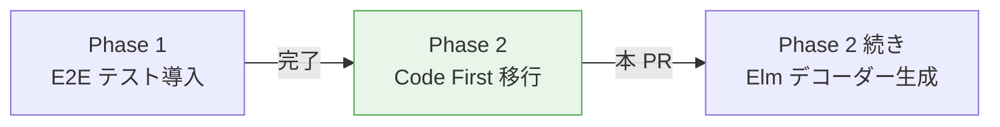
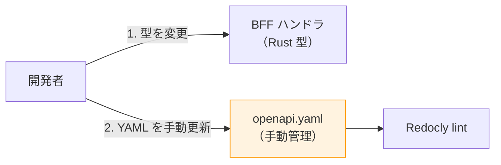
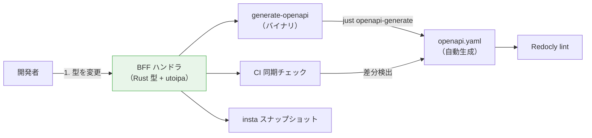
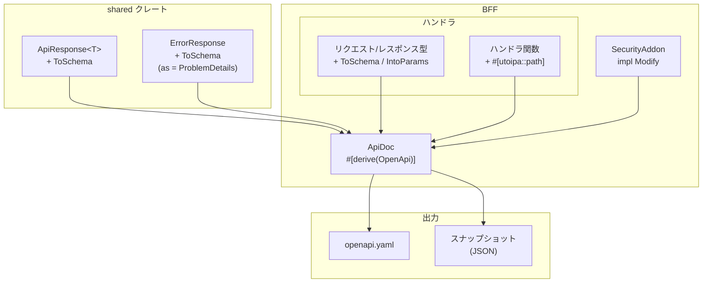
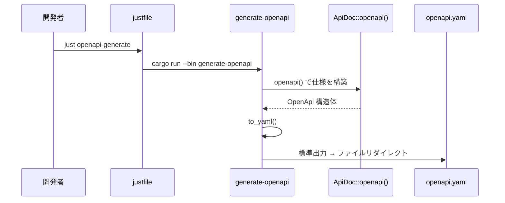
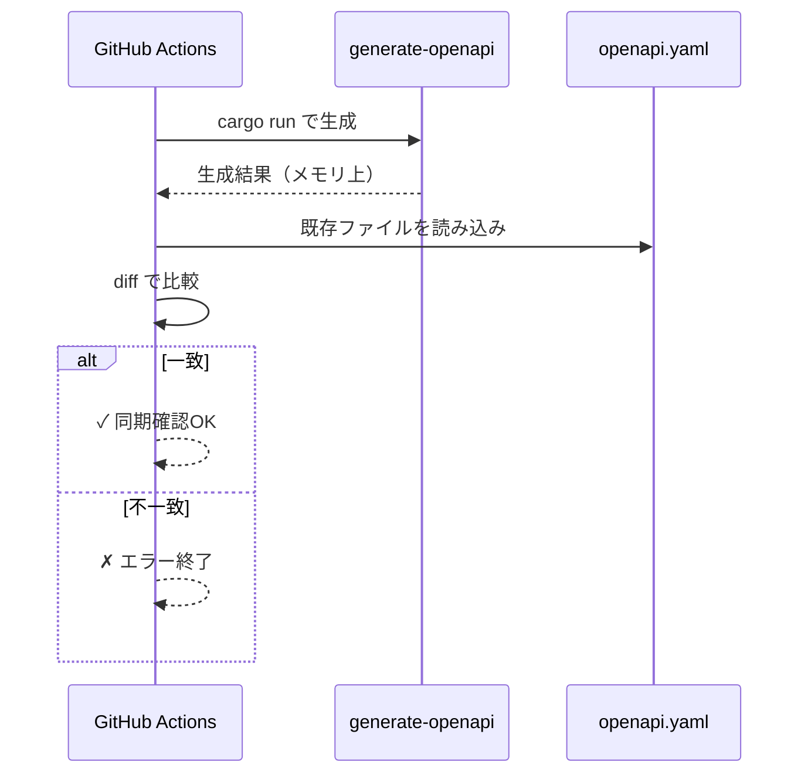

# OpenAPI Code First（utoipa 導入）- 機能解説

対応 PR: #444
対応 Issue: #137（Phase 2 タスク 1, 2）

## 概要

Rust の型定義を Single Source of Truth（SSOT）として、OpenAPI 仕様を自動生成する Code First アプローチを導入した。utoipa ライブラリにより、BFF のハンドラ型から OpenAPI 3.1.0 準拠の YAML を生成し、CI で仕様と実装の同期を自動検証する。

## 背景

### 手動管理の限界

OpenAPI 仕様（`openapi/openapi.yaml`）は手動で管理していた。BFF のハンドラ型を変更しても YAML が自動更新されず、以下の問題があった。

- フィールド追加・変更時に YAML の更新忘れが発生する
- レビューで差異を検出しづらい
- エンドポイント増加に比例して手動同期のコストが増大する

### Issue #137 の全体像

Issue #137 は API 仕様と実装の整合性を担保する取り組みで、2つの Phase で構成される。

| Phase | 内容 | 状態 |
|-------|------|------|
| Phase 1 | Playwright による E2E テスト導入 | 完了 |
| Phase 2（本 PR） | utoipa 導入、OpenAPI 自動生成、CI 同期チェック | 完了 |
| Phase 2 続き | Elm デコーダー生成ツール評価・移行 | 未着手 |

## 用語・概念

| 用語 | 説明 | 関連コード |
|------|------|-----------|
| Code First | Rust の型からOpenAPI仕様を生成するアプローチ | `openapi.rs` |
| Design First | YAML を先に書き、実装を合わせるアプローチ | 旧 `openapi.yaml`（手動管理） |
| ToSchema | 構造体を OpenAPI スキーマに変換する derive マクロ | `#[derive(utoipa::ToSchema)]` |
| IntoParams | 構造体を Path/Query パラメータに変換する derive マクロ | `#[derive(utoipa::IntoParams)]` |
| ProblemDetails | RFC 9457 準拠のエラーレスポンス形式 | `ErrorResponse` に `schema(as = ProblemDetails)` |

## ビフォー・アフター

### Before（変更前）

制約・課題:

- 手順 2 の忘れを検出する仕組みがない
- `openapi.yaml` は 1700 行超で手動編集が困難

### After（変更後）

改善点:

- Rust 型が SSOT。型を変更すれば `just openapi-generate` で YAML が更新される
- CI が自動で同期チェック。更新忘れは CI で検出される
- insta スナップショットで OpenAPI 仕様全体の回帰テストを実施

## アーキテクチャ

## データフロー

### フロー 1: OpenAPI YAML 生成

### フロー 2: CI 同期チェック

## 設計判断

機能・仕組みレベルの判断を記載する。コード実装レベルの判断は[コード解説](./01_utoipa導入_コード解説.md#設計解説)を参照。

### 1. OpenAPI 仕様の管理方式をどうするか

手動管理では仕様と実装の乖離が避けられず、エンドポイント数の増加に伴い課題が深刻化していた。

| 案 | 仕様と実装の同期 | 初期コスト | 運用コスト |
|----|----------------|-----------|-----------|
| **Code First（utoipa）（採用）** | 自動（型が SSOT） | 全ハンドラにアノテーション追加 | ほぼゼロ |
| Design First（手動管理） | 手動（忘れやすい） | なし | YAML の手動編集が増大 |
| Design First + コード生成 | 自動（YAML が SSOT） | コード生成ツール導入 | YAML を先に編集する必要 |

**採用理由**: Rust の型が既に存在する状況では、型にアノテーションを追加するだけで仕様を生成できる Code First が最も自然。

### 2. 同期チェックのタイミングをどうするか

生成結果とコミット済みの `openapi.yaml` の乖離を検出する仕組みが必要だった。

| 案 | 検出タイミング | 開発体験 | CI 負荷 |
|----|-------------|---------|---------|
| **CI + ローカル check（採用）** | CI と `just check` の両方 | ローカルでも早期検出可能 | Rust ビルド内で実行 |
| CI のみ | プッシュ後 | ローカルで気づけない | 同上 |
| pre-commit hook | コミット時 | 毎コミットでビルド待ち | なし |

**採用理由**: CI で確実に検出しつつ、`just check` にも含めることでローカルでの早期発見も可能にした。pre-commit hook はビルド待ちが発生するため不採用。

### 3. utoipa 依存の波及をどう制御するか

utoipa は BFF でのみ必要だが、`ApiResponse` や `ErrorResponse` は shared クレートに定義されている。

| 案 | 依存の波及 | 条件付きコンパイル | 複雑さ |
|----|----------|-----------------|--------|
| **feature flag（openapi）（採用）** | BFF のみ | `cfg_attr` で切り替え | 低 |
| shared に常時依存 | 全サービスに波及 | 不要 | 最低 |
| BFF 内で wrapper 型を定義 | なし | 不要 | 高（型の二重管理） |

**採用理由**: `openapi` feature flag により、BFF だけが utoipa を有効化する。Core Service や Auth Service のビルドには影響しない。

## 関連ドキュメント

- [コード解説](./01_utoipa導入_コード解説.md)
- [ナレッジベース: utoipa](../../06_ナレッジベース/rust/utoipa.md)
- [Issue #137](https://github.com/ka2kama/ringiflow/issues/137)
