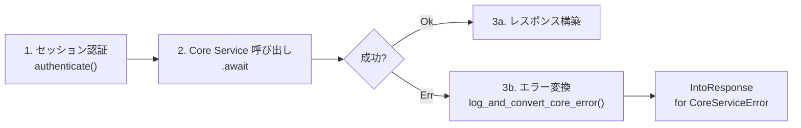
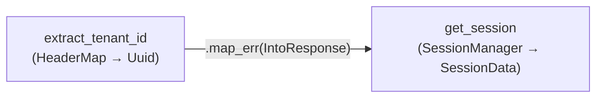
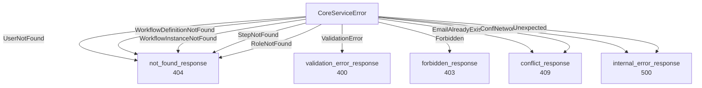
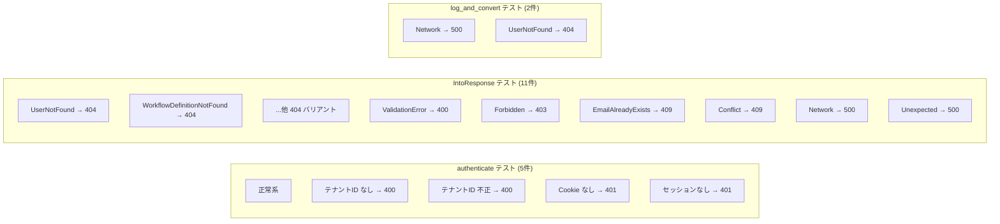

# BFF ハンドラクローン削減 - コード解説

対応 PR: #573
対応 Issue: #526

## 主要な型・関数

| 型/関数 | ファイル | 責務 |
|--------|---------|------|
| `authenticate()` | [`error.rs:89`](../../../backend/apps/bff/src/error.rs) | セッション認証の統合ヘルパー |
| `IntoResponse for CoreServiceError` | [`error.rs:100`](../../../backend/apps/bff/src/error.rs) | エラー → HTTP レスポンス変換 |
| `log_and_convert_core_error()` | [`error.rs:143`](../../../backend/apps/bff/src/error.rs) | コンテキスト付きログ + レスポンス変換 |
| `CoreServiceError` | [`client/core_service/error.rs:7`](../../../backend/apps/bff/src/client/core_service/error.rs) | Core Service クライアントエラー型（11バリアント） |

## コードフロー

コードをリクエスト処理のライフサイクル順に追う。



### 1. セッション認証（`authenticate`）

全27ハンドラの冒頭で呼ばれる統合ヘルパー。テナント ID 抽出とセッション取得を1行で行う。



```rust
// error.rs:89-96
pub async fn authenticate(
    session_manager: &dyn SessionManager,
    headers: &HeaderMap,
    jar: &CookieJar,
) -> Result<SessionData, Response> {
    let tenant_id = extract_tenant_id(headers).map_err(IntoResponse::into_response)?; // ①
    get_session(session_manager, jar, tenant_id).await // ②
}
```

注目ポイント:

- ① `TenantIdError` は既に `IntoResponse` を実装しているため、`IntoResponse::into_response` をメソッド参照として `map_err` に渡せる
- ② `get_session` は `Result<SessionData, Response>` を返すため、そのまま返せば `?` で伝播される

#### ハンドラでの使用（カテゴリ A）

```rust
// workflow/query.rs（Before: 10行）
let tenant_id = match extract_tenant_id(&headers) {
    Ok(id) => id,
    Err(e) => return e.into_response(),
};
let session_data = match get_session(state.session_manager.as_ref(), &jar, tenant_id).await {
    Ok(data) => data,
    Err(response) => return response,
};

// workflow/query.rs（After: 1行）
let session_data = authenticate(state.session_manager.as_ref(), &headers, &jar).await?;
```

### 2. エラー変換（`IntoResponse for CoreServiceError`）

`CoreServiceError` の11バリアントを既存のレスポンスヘルパーにマッピングする。



```rust
// error.rs:100-137
impl IntoResponse for CoreServiceError {
    fn into_response(self) -> Response {
        match self {
            CoreServiceError::UserNotFound => not_found_response(      // ①
                "user-not-found", "User Not Found", "ユーザーが見つかりません",
            ),
            // ... 他の 404 バリアント
            CoreServiceError::ValidationError(ref detail) => validation_error_response(detail), // ②
            CoreServiceError::Forbidden(ref detail) => forbidden_response(detail),
            CoreServiceError::EmailAlreadyExists => {
                conflict_response("このメールアドレスは既に使用されています")
            }
            CoreServiceError::Conflict(ref detail) => conflict_response(detail),
            CoreServiceError::Network(_) | CoreServiceError::Unexpected(_) => {  // ③
                internal_error_response()
            }
        }
    }
}
```

注目ポイント:

- ① 各 Not Found バリアントに固有の `error_type_suffix` を割り当て、クライアントがエラー種別を識別可能にしている
- ② `ref detail` で所有権を借用し、`detail` を `&str` としてヘルパーに渡す
- ③ `Network`/`Unexpected` は内部エラーのため詳細をクライアントに公開しない

### 3. コンテキスト付きエラーログ（`log_and_convert_core_error`）

`IntoResponse::into_response()` にはコンテキスト引数がないため、ログ出力が必要なケースにはラッパー関数を使う。

```rust
// error.rs:143-151
pub fn log_and_convert_core_error(context: &str, err: CoreServiceError) -> Response {
    match &err {
        CoreServiceError::Network(_) | CoreServiceError::Unexpected(_) => {  // ①
            tracing::error!("{}で内部エラー: {}", context, err);
        }
        _ => {}  // ②
    }
    err.into_response()  // ③
}
```

注目ポイント:

- ① `Network`/`Unexpected` のみログ出力。404 や 400 はクライアント起因のため不要
- ② `ref` でなく `&err` で借用し、ログ出力後に ③ で所有権を消費
- ③ 上記の `IntoResponse` impl に委譲

#### ハンドラでの使用

```rust
// カテゴリ A: 完全に ?化
let core_response = state.core_service_client
    .list_workflow_definitions(*session_data.tenant_id().as_uuid()).await
    .map_err(|e| log_and_convert_core_error("ワークフロー定義一覧取得", e))?;

// カテゴリ B: Err パスのみ簡略化、Ok パスは match 維持
match state.core_service_client.create_user(&core_request).await {
    Ok(core_response) => {
        // 監査ログ記録 + レスポンス構築
    }
    Err(e) => Err(log_and_convert_core_error("ユーザー作成", e)),
}

// コンテキスト依存マッピング: StepNotFound をタスクコンテキストで task-not-found に変換
.map_err(|e| match e {
    CoreServiceError::StepNotFound => not_found_response(
        "task-not-found", "Task Not Found", "タスクが見つかりません",
    ),
    e => log_and_convert_core_error("タスク詳細取得", e),
})?;
```

## テスト

各テストがどの機能を検証しているかを示す。



| テスト | 検証対象 | 検証内容 |
|-------|---------|---------|
| `authenticate_正常系でsession_dataを返す` | authenticate | 正常フロー |
| `authenticate_テナントidヘッダーなしで400` | authenticate | Missing ヘッダー |
| `authenticate_テナントid不正形式で400` | authenticate | 不正 UUID |
| `authenticate_セッションcookieなしで401` | authenticate | Missing Cookie |
| `authenticate_セッション存在しない場合に401` | authenticate | セッション不在 |
| `core_service_error_*で{status}` (11件) | IntoResponse | 各バリアントのステータスコードと error_type |
| `log_and_convert_core_error_*` (2件) | log_and_convert_core_error | ログ有無の動作差 |

### 実行方法

```bash
cargo test -p ringiflow-bff --lib -- error::tests
```

## 設計解説

コード実装レベルの判断を記載する。機能・仕組みレベルの判断は[機能解説](./01_BFFハンドラクローン削減_機能解説.md#設計判断)を参照。

### 1. `map_err(IntoResponse::into_response)` パターン

場所: `error.rs:94`

```rust
let tenant_id = extract_tenant_id(headers).map_err(IntoResponse::into_response)?;
```

なぜこの実装か:
`TenantIdError` は `IntoResponse` を実装しているが、`Result<Uuid, TenantIdError>` を `Result<Uuid, Response>` に変換する必要がある。`IntoResponse::into_response` をメソッド参照として渡すことで、クロージャ `|e| e.into_response()` より簡潔に書ける。

### 2. `ref` キーワードの使用

場所: `error.rs:126-131`

```rust
CoreServiceError::ValidationError(ref detail) => validation_error_response(detail),
```

なぜこの実装か:
`match self` で `self` の所有権を消費するが、`detail` は `&str` としてヘルパーに渡すだけなので借用で十分。`ref` パターンで内部の `String` を借用する。

代替案:

| 案 | メリット | デメリット | 判断 |
|----|---------|-----------|------|
| `ref` パターン | 所有権消費なし、`&str` で渡せる | やや Rust 固有の構文 | 採用 |
| `match &self` | `ref` 不要 | 他のバリアントで所有権が必要な場合に不便 | 見送り |

### 3. `StubSessionManager` のテスト設計

場所: `error.rs:243-338`

`SessionManager` トレイトの全メソッドを実装するスタブ。`session` フィールドの有無でセッション存在/不在を切り替える。

なぜこの実装か:
`authenticate` のテストにはセッション取得のみが必要だが、`SessionManager` トレイトは CSRF トークン管理等を含む11メソッドのトレイト。mock ライブラリ（mockall 等）を使わず、最小限のスタブで必要な挙動を実現した。

## 関連ドキュメント

- [機能解説](./01_BFFハンドラクローン削減_機能解説.md)
- [BFF レスポンスハンドリング共通化](../17_BFFレスポンスハンドリング共通化/)（前回のリファクタリング）
