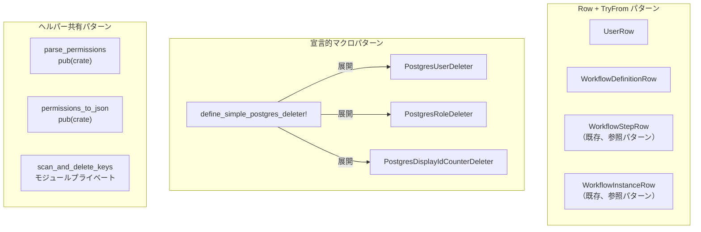
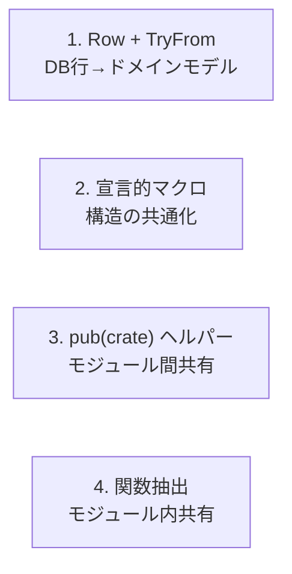
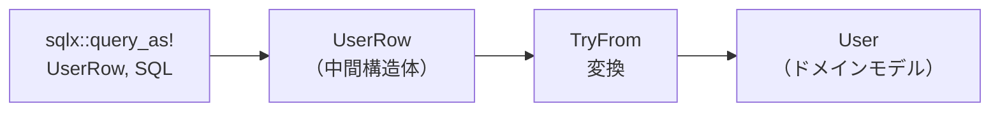
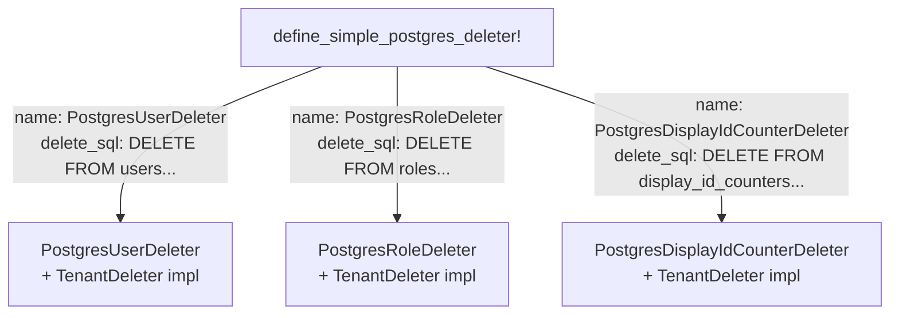
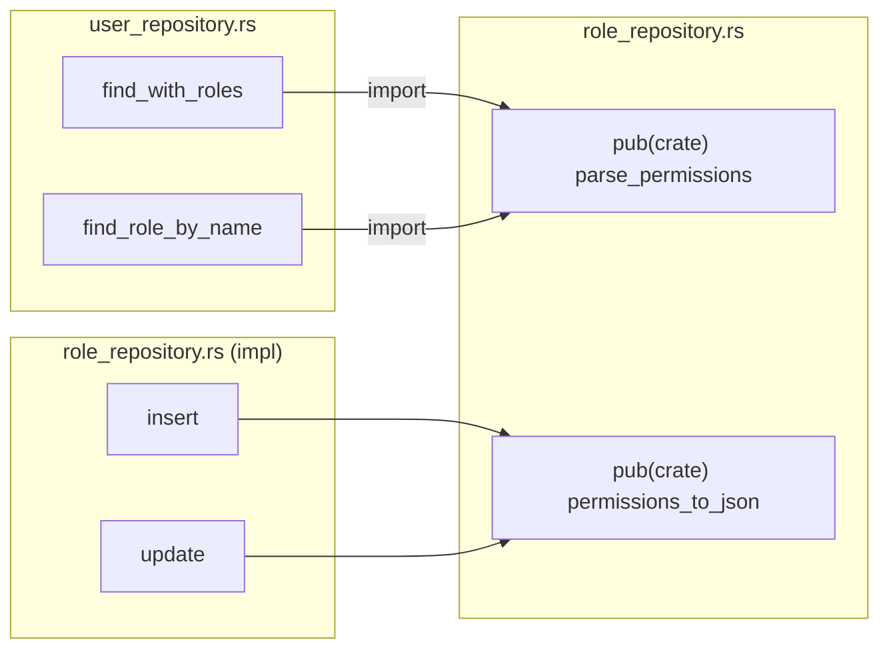
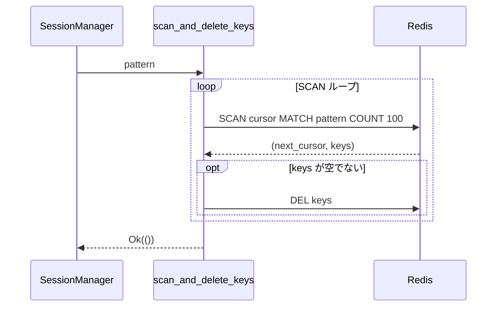

# インフラ層クローン削減 - コード解説

対応 PR: #577
対応 Issue: #529

## 主要な型・関数

| 型/関数 | ファイル | 責務 |
|--------|---------|------|
| `UserRow` | [`user_repository.rs:142`](../../../backend/crates/infra/src/repository/user_repository.rs) | users テーブルの行を表す中間構造体 |
| `TryFrom<UserRow> for User` | [`user_repository.rs:154`](../../../backend/crates/infra/src/repository/user_repository.rs) | UserRow → User ドメインモデルの変換 |
| `WorkflowDefinitionRow` | [`workflow_definition_repository.rs:74`](../../../backend/crates/infra/src/repository/workflow_definition_repository.rs) | workflow_definitions テーブルの行を表す中間構造体 |
| `TryFrom<WorkflowDefinitionRow>` | [`workflow_definition_repository.rs:87`](../../../backend/crates/infra/src/repository/workflow_definition_repository.rs) | WorkflowDefinitionRow → WorkflowDefinition の変換 |
| `parse_permissions` | [`role_repository.rs:69`](../../../backend/crates/infra/src/repository/role_repository.rs) | JSONB → `Vec<Permission>` の変換 |
| `permissions_to_json` | [`role_repository.rs:81`](../../../backend/crates/infra/src/repository/role_repository.rs) | `Vec<Permission>` → JSONB の変換 |
| `define_simple_postgres_deleter!` | [`postgres_simple.rs:17`](../../../backend/crates/infra/src/deletion/postgres_simple.rs) | 単一テーブル Deleter を生成するマクロ |
| `scan_and_delete_keys` | [`session.rs:397`](../../../backend/crates/infra/src/session.rs) | Redis SCAN+DELETE ループのヘルパー |

### パターンの関係



## コードフロー

本 PR はリファクタリングであり、ライフサイクルの変更はない。各手法の適用パターンをコードフローとして解説する。



### 1. Row + TryFrom パターン（user_repository.rs, workflow_definition_repository.rs）

`sqlx::query!`（匿名型）を `sqlx::query_as!`（名前付き構造体）に変更し、変換ロジックを `TryFrom` に集約する。



```rust
// backend/crates/infra/src/repository/user_repository.rs:138-172

/// DB の users テーブルの行を表す中間構造体
struct UserRow {
    id: Uuid,
    tenant_id: Uuid,
    display_number: i64,
    email: String,
    name: String,
    status: String,                        // ① DB は文字列、ドメインは enum
    last_login_at: Option<DateTime<Utc>>,
    created_at: DateTime<Utc>,
    updated_at: DateTime<Utc>,
}

impl TryFrom<UserRow> for User {
    type Error = InfraError;

    fn try_from(row: UserRow) -> Result<Self, Self::Error> {
        Ok(User::from_db(
            UserId::from_uuid(row.id),
            TenantId::from_uuid(row.tenant_id),
            DisplayNumber::new(row.display_number)         // ② バリデーション付き変換
                .map_err(|e| InfraError::Unexpected(e.to_string()))?,
            Email::new(&row.email)
                .map_err(|e| InfraError::Unexpected(e.to_string()))?,
            UserName::new(&row.name)
                .map_err(|e| InfraError::Unexpected(e.to_string()))?,
            row.status
                .parse::<UserStatus>()                     // ③ 文字列→enum のパース
                .map_err(|e| InfraError::Unexpected(e.to_string()))?,
            row.last_login_at,
            row.created_at,
            row.updated_at,
        ))
    }
}
```

注目ポイント:

- ① DB の文字列型カラムをドメインの enum に変換する。`TryFrom` なら `parse()` のエラーを自然に扱える
- ② `DisplayNumber::new()` 等のバリデーション付きコンストラクタが `Result` を返すため、`From` ではなく `TryFrom` を採用
- ③ `UserStatus` の `FromStr` 実装（strum の `EnumString` derive）を利用

呼び出し側のコード変更例:

```rust
// Before: インラインマッピング（10行以上の重複）
let row = sqlx::query!(r#"SELECT ... FROM users WHERE ..."#, ...)
    .fetch_optional(&self.pool).await?;
let Some(row) = row else { return Ok(None) };
Ok(Some(User::from_db(
    UserId::from_uuid(row.id),
    TenantId::from_uuid(row.tenant_id),
    // ... 7行のフィールド変換
)))

// After: TryFrom で1行
let row = sqlx::query_as!(UserRow, r#"SELECT ... FROM users WHERE ..."#, ...)
    .fetch_optional(&self.pool).await?;
row.map(User::try_from).transpose()
```

### 2. 宣言的マクロパターン（deletion/postgres_simple.rs）

テーブル名のみ異なる完全同一構造の Deleter を、マクロで生成する。



```rust
// backend/crates/infra/src/deletion/postgres_simple.rs:17-61

macro_rules! define_simple_postgres_deleter {
    (
        name: $name:ident,
        deleter_name: $deleter_name:literal,
        delete_sql: $delete_sql:literal,        // ① SQL リテラルを直接受け取る
        count_sql: $count_sql:literal,
        doc: $doc:literal
    ) => {
        #[doc = $doc]
        pub struct $name { pool: PgPool }

        impl $name {
            pub fn new(pool: PgPool) -> Self { Self { pool } }
        }

        #[async_trait]
        impl TenantDeleter for $name {
            fn name(&self) -> &'static str { $deleter_name }

            async fn delete(&self, tenant_id: &TenantId)
                -> Result<DeletionResult, InfraError>
            {
                let result = sqlx::query!($delete_sql, tenant_id.as_uuid())  // ② マクロ展開後もリテラル
                    .execute(&self.pool).await?;
                Ok(DeletionResult { deleted_count: result.rows_affected() })
            }

            async fn count(&self, tenant_id: &TenantId) -> Result<u64, InfraError> {
                let count = sqlx::query_scalar!($count_sql, tenant_id.as_uuid())
                    .fetch_one(&self.pool).await?;
                Ok(count as u64)
            }
        }
    };
}
```

注目ポイント:

- ① `$delete_sql:literal` で SQL をリテラル型として受け取る。`sqlx::query!` は proc macro であり、引数がリテラル文字列である必要がある。`concat!` の結果は受け取れない
- ② マクロ展開後、`sqlx::query!("DELETE FROM users WHERE tenant_id = $1", ...)` のようにリテラルが直接埋め込まれるため、コンパイル時 SQL 検証が維持される

### 3. pub(crate) ヘルパー共有（role_repository.rs → user_repository.rs）

Permission の JSON 変換を `pub(crate)` で共有する。



```rust
// backend/crates/infra/src/repository/role_repository.rs:68-88

/// JSONB から Permission の Vec に変換するヘルパー
pub(crate) fn parse_permissions(permissions: serde_json::Value) -> Vec<Permission> {
    permissions
        .as_array()
        .map(|arr| {
            arr.iter()
                .filter_map(|v| v.as_str().map(Permission::new))
                .collect()
        })
        .unwrap_or_default()
}

/// Permission の Vec を JSONB 用の serde_json::Value に変換するヘルパー
pub(crate) fn permissions_to_json(permissions: &[Permission]) -> serde_json::Value {
    serde_json::Value::Array(
        permissions
            .iter()
            .map(|p| serde_json::Value::String(p.as_str().to_string()))
            .collect(),
    )
}
```

### 4. 関数抽出（session.rs）

SCAN+DELETE ループをモジュールプライベート関数に抽出。



```rust
// backend/crates/infra/src/session.rs:396-422

/// SCAN でパターンにマッチするキーを全て削除する
async fn scan_and_delete_keys(
    conn: &mut ConnectionManager,      // ① &mut で所有権を渡さず借用
    pattern: &str,
) -> Result<(), InfraError> {
    let mut cursor = 0u64;
    loop {
        let (next_cursor, keys): (u64, Vec<String>) = redis::cmd("SCAN")
            .arg(cursor)
            .arg("MATCH")
            .arg(pattern)
            .arg("COUNT")
            .arg(100)
            .query_async(conn)
            .await?;

        if !keys.is_empty() {
            let _: () = conn.del(&keys).await?;  // ② バッチ削除
        }

        cursor = next_cursor;
        if cursor == 0 { break; }
    }
    Ok(())
}
```

注目ポイント:

- ① `ConnectionManager` を `&mut` で借用するパターンは session.rs 内の既存メソッドと一致
- ② `SCAN` で見つかったキーを `DEL` でバッチ削除。Redis の SCAN はカーソルベースのイテレーションで、全キーを安全に走査できる

## テスト

本 PR はリファクタリングのため、新規テストの追加はない。既存テストでリグレッションがないことを検証した。

| テスト種類 | 結果 | 検証内容 |
|-----------|------|---------|
| ユニットテスト (376 件) | 全通過 | 各リポジトリの構造体テスト、ドメインモデルテスト |
| 統合テスト | 全通過 | DB 接続を伴うリポジトリテスト |
| API テスト (24 ファイル, 148 リクエスト) | 全通過 | エンドツーエンドのリクエスト/レスポンス検証 |

### 実行方法

```bash
# ユニットテスト + 統合テスト
cd backend && cargo test --all-features

# API テスト
just test-api

# 全体チェック
just check-all
```

## 設計解説

コード実装レベルの判断を記載する。機能・仕組みレベルの判断は[機能解説](./01_クローン削減_機能解説.md#設計判断)を参照。

### 1. find_all_by_tenant の match 分岐統合

場所: `user_repository.rs:505-570`

`find_all_by_tenant` はステータスフィルタの有無で SQL が分岐する（`sqlx::query_as!` はリテラル SQL が必須のため）。元のコードでは各分岐内に `User::from_db(...)` が重複していた。

```rust
// After: rows を match の外に引き上げ、変換を一本化
let rows = match status_filter {
    Some(status) => {
        sqlx::query_as!(UserRow, r#"SELECT ... WHERE status = $2 ..."#,
            tenant_id.as_uuid(), status.as_str())
            .fetch_all(&self.pool).await?
    }
    None => {
        sqlx::query_as!(UserRow, r#"SELECT ... WHERE status != 'deleted' ..."#,
            tenant_id.as_uuid())
            .fetch_all(&self.pool).await?
    }
};
rows.into_iter().map(User::try_from).collect()
```

なぜこの実装か:
SQL の分岐は `sqlx` の制約で避けられないが、`UserRow` を共通の型にすることで、変換ロジック（`User::try_from`）を分岐の外に出せる。

代替案:

| 案 | メリット | デメリット | 判断 |
|----|---------|-----------|------|
| **rows 引き上げ（採用）** | 変換ロジックの重複が完全に解消 | match 式が値を返す形に変更 | 採用 |
| 各分岐内で try_from | 変更が最小限 | `.map(User::try_from).collect()` が重複 | 見送り |

### 2. scan_and_delete_keys の配置

場所: `session.rs:396-422`

`impl SessionManager` ブロックの外にモジュールレベル関数として配置した。

なぜこの実装か:
`SessionManager` のメソッドにすると `&self` が不要なのに受け取る形になる。`ConnectionManager` だけを受け取る純粋な関数として配置する方が、責務が明確で再利用性も高い。`impl` ブロック内の `delete_all_for_tenant` と `delete_all_csrf_for_tenant` から呼び出す。

### 3. マクロの名前付き引数パターン

場所: `postgres_simple.rs:17-61`

```rust
define_simple_postgres_deleter!(
    name: PostgresUserDeleter,          // 名前付き引数で可読性確保
    deleter_name: "postgres:users",
    delete_sql: "DELETE FROM users WHERE tenant_id = $1",
    count_sql: r#"SELECT COUNT(*) as "count!" FROM users WHERE tenant_id = $1"#,
    doc: "PostgreSQL ユーザー Deleter"
);
```

なぜこの実装か:
位置引数（`define_simple_postgres_deleter!(PostgresUserDeleter, "postgres:users", ...)`）だと 5 つの文字列リテラルが並び、どれが何の引数か判別しにくい。名前付き引数パターン（`name: $name:ident`）は Rust の宣言的マクロでよく使われるイディオムで、呼び出し側の可読性を確保する。

## 関連ドキュメント

- [機能解説](./01_クローン削減_機能解説.md)
- [セッションログ](../../../prompts/runs/2026-02/2026-02-16_2119_インフラ層クローン削減.md)
- [計画ファイル](../../../prompts/plans/529_infra-layer-clone-reduction.md)
