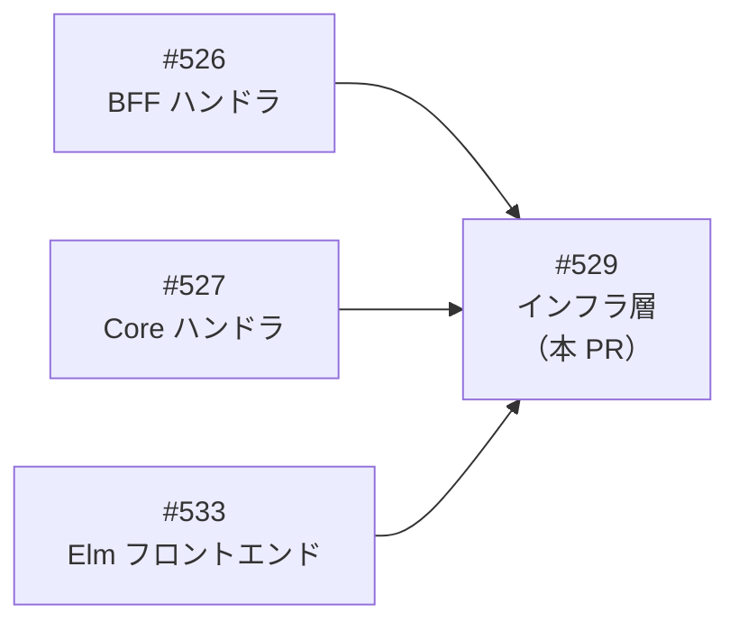
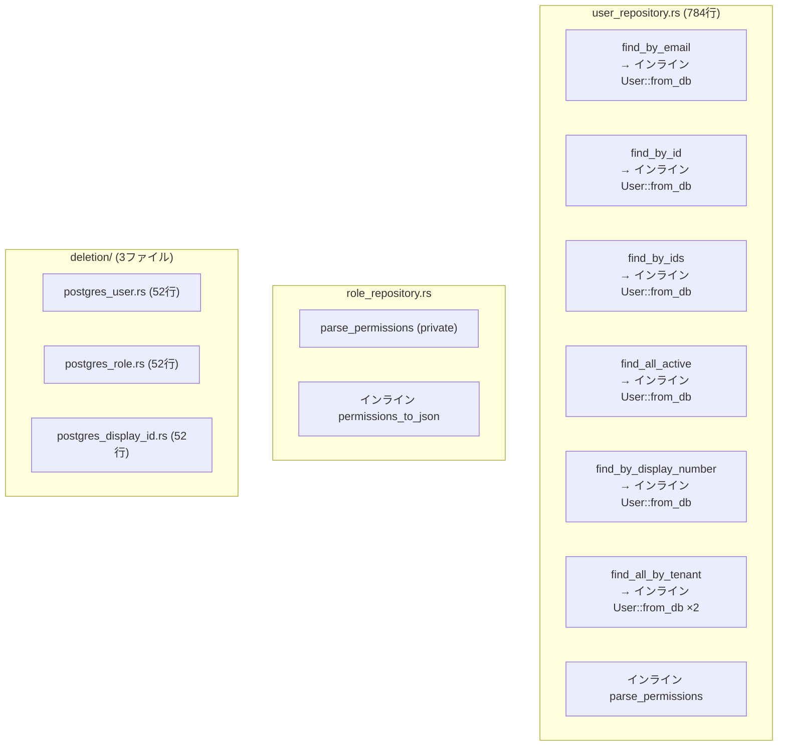
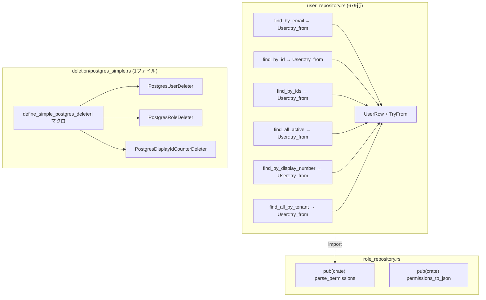

# インフラ層クローン削減 - 機能解説

対応 PR: #577
対応 Issue: #529

## 概要

インフラ層（`backend/crates/infra/src/`）のコードクローン（重複コード）を体系的に削減するリファクタリング。jscpd が検出した 21 クローン（338行、重複率 6.01%）のうち 14 クローンを対象とし、5 つの手法を適用して 13 クローンを解消した（残存 8 クローン、重複率 1.78%）。

## 背景

### DRY 違反検出の仕組み

Epic #467（`just check` / `check-all` の警告ゼロ化）の一環として、jscpd によるコードクローン検出を導入している。構造的劣化を定量的に検出し、保守性を継続的に改善することが目的。

### 変更前の課題

インフラ層に以下のクローンパターンが蓄積していた:

- DB の行 → ドメインモデルへの変換ロジックが各 find 関数にインラインで重複（user_repository.rs に 6 箇所）
- Permission の JSON パース/シリアライズが role_repository.rs と user_repository.rs に重複
- テナントデータ削除の PostgreSQL 実装が 3 ファイルで完全に同一構造
- Redis SCAN+DELETE ループが session.rs 内で重複

### Epic 全体の中での位置づけ

| Issue | 対象レイヤー | 状態 |
|-------|------------|------|
| #526 | BFF ハンドラ層 | 完了 |
| #527 | Core Service ハンドラ層 | 完了 |
| #533 | Elm フロントエンド | 完了 |
| #529 | インフラ層（本 PR） | 実装完了 |

## 用語・概念

| 用語 | 説明 | 関連コード |
|------|------|-----------|
| Row 構造体 | DB の行を表す中間構造体。`sqlx::query_as!` のマッピング先 | `UserRow`, `WorkflowDefinitionRow` |
| `TryFrom` パターン | Row → ドメインモデルの変換を `TryFrom` トレイトで一箇所に集約するパターン | `impl TryFrom<UserRow> for User` |
| 宣言的マクロ | `macro_rules!` による構造の共通化。同一パターンの型定義とトレイト実装を生成 | `define_simple_postgres_deleter!` |
| `pub(crate)` | クレート内でのみ公開する可視性修飾子。モジュール間でヘルパーを共有 | `parse_permissions`, `permissions_to_json` |

## ビフォー・アフター

### Before（変更前）

各リポジトリの find 関数内にインラインでマッピングロジックが散在していた。

#### 課題

- user_repository.rs の `User::from_db(...)` 呼び出しが 6 箇所で重複（各 10-15 行）
- Permission パース/シリアライズが role と user の間で重複
- deletion の 3 ファイルがテーブル名のみ異なる完全同一構造

### After（変更後）

Row + TryFrom パターンとマクロで変換ロジックを一箇所に集約。

#### 改善点

- マッピングロジックが各 Row 構造体の `TryFrom` 実装に集約
- Permission ヘルパーが `pub(crate)` で共有され、重複が解消
- deletion の 3 ファイルが 1 ファイルのマクロ呼び出しに統合
- user_repository.rs が 784 行 → 679 行（-105 行）

## 設計判断

機能・仕組みレベルの判断を記載する。コード実装レベルの判断は[コード解説](./01_クローン削減_コード解説.md#設計解説)を参照。

### 1. 行マッピングの共通化にどのパターンを使うか

6 箇所の `User::from_db(...)` インライン呼び出しを一箇所に集約する方法の選択。

| 案 | 変換ロジックの集約 | sqlx 型検証 | 既存パターンとの一貫性 |
|----|------------------|------------|---------------------|
| **Row + TryFrom（採用）** | TryFrom に集約 | query_as! で維持 | workflow_step/instance と同一 |
| ヘルパー関数 | 関数に集約 | query! のまま | 新パターン |
| From トレイト | From に集約 | query_as! で維持 | エラーハンドリングが不自然 |

**採用理由**: workflow_step_repository.rs と workflow_instance_repository.rs で確立済みのパターンであり、プロジェクト内の一貫性を維持できる。`TryFrom` はバリデーションエラーを自然に扱える。

### 2. deletion の重複をどう解消するか

テーブル名のみ異なる 3 つの同一構造ファイルの統合方法。

| 案 | 重複排除 | sqlx コンパイル時検証 | 複雑さ |
|----|---------|---------------------|-------|
| **宣言的マクロ（採用）** | 完全排除 | SQL リテラル直渡しで維持 | マクロ定義の学習コスト |
| トレイトデフォルト実装 | 部分排除 | テーブル名の動的組み立てが必要 | 低い |
| ジェネリクス | 完全排除 | 動的 SQL で検証不可 | 高い |

**採用理由**: `sqlx::query!` は proc macro であり `concat!` や変数の結果を受け取れない。SQL 全文をリテラルとしてマクロに渡す方式なら、コンパイル時検証を維持しつつ構造を共通化できる。

### 3. Permission ヘルパーの配置場所

role_repository.rs と user_repository.rs で共有する Permission パース/シリアライズ関数の置き場所。

| 案 | モジュール構成 | インポートの自然さ |
|----|-------------|-----------------|
| **role_repository.rs に pub(crate)（採用）** | 変更なし | `crate::repository::role_repository::parse_permissions` |
| 新規 helpers.rs | モジュール追加 | `crate::repository::helpers::parse_permissions` |
| repository/mod.rs | mod.rs 肥大化 | `crate::repository::parse_permissions` |

**採用理由**: 関数が 2 つだけで、新モジュールを作るほどの複雑さではない。Permission はロールの概念と強く結びつくため、role_repository.rs に置くのが意味的にも自然。

### 4. 対象外クローンの判断

21 クローン中 7 つを対象外とした判断基準。

| 対象外カテゴリ | クローン数 | 理由 |
|--------------|-----------|------|
| workflow_step/instance の SELECT 句 | 4 | sqlx マクロの制約（SQL はリテラル必須） |
| replace_user_roles の DELETE+INSERT | 1 | 2-3 行のボイラープレートは統一しない（#527 の判断踏襲） |
| count_active の match | 1 | sqlx::query_scalar! の制約で SQL が異なる |
| redis_session.rs の scan_count/scan_and_delete | 1 | async 処理の差異があり、共通化に async クロージャが必要 |

## 関連ドキュメント

- [コード解説](./01_クローン削減_コード解説.md)
- [セッションログ](../../../prompts/runs/2026-02/2026-02-16_2119_インフラ層クローン削減.md)
- [計画ファイル](../../../prompts/plans/529_infra-layer-clone-reduction.md)
