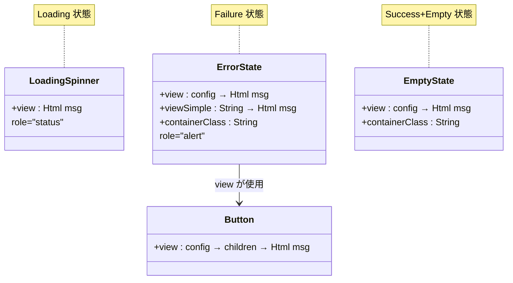
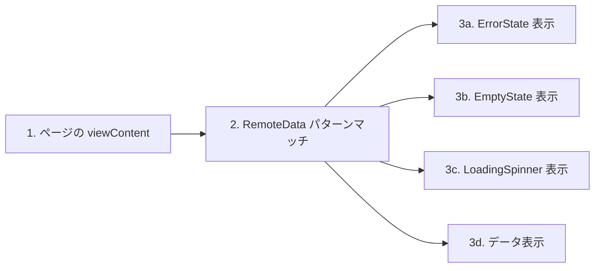
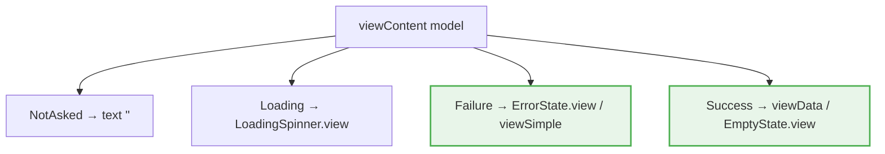
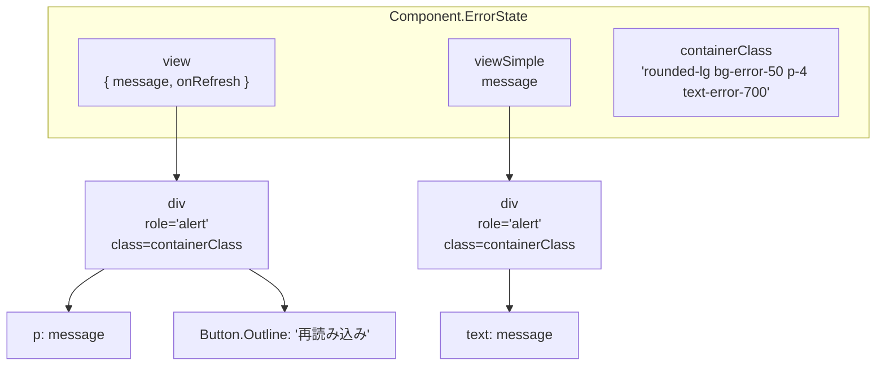
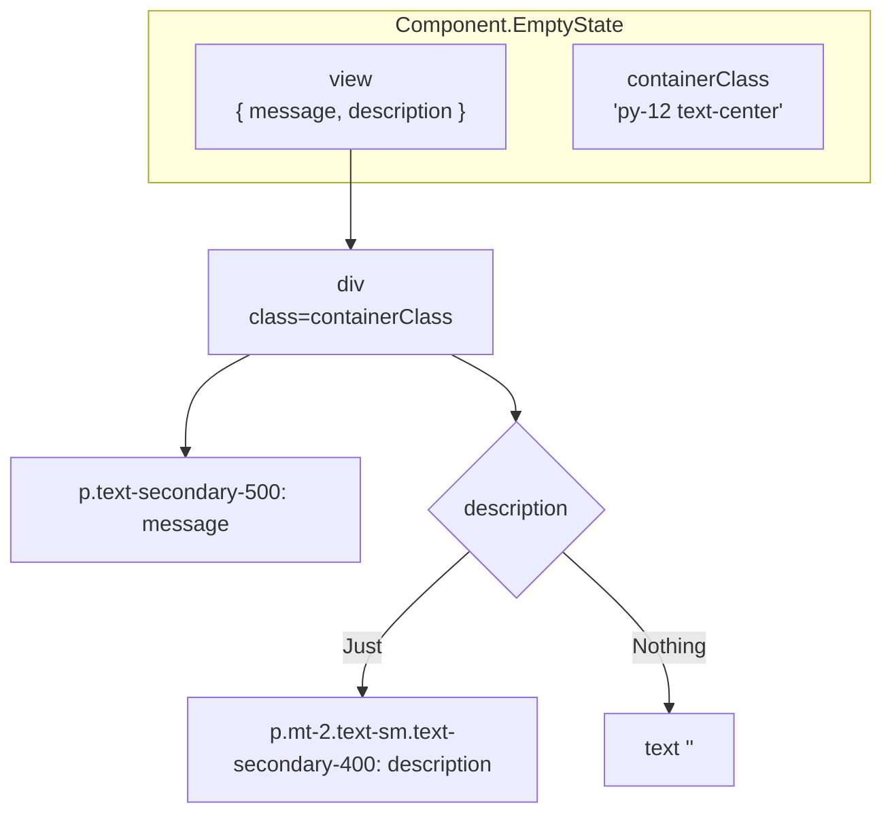
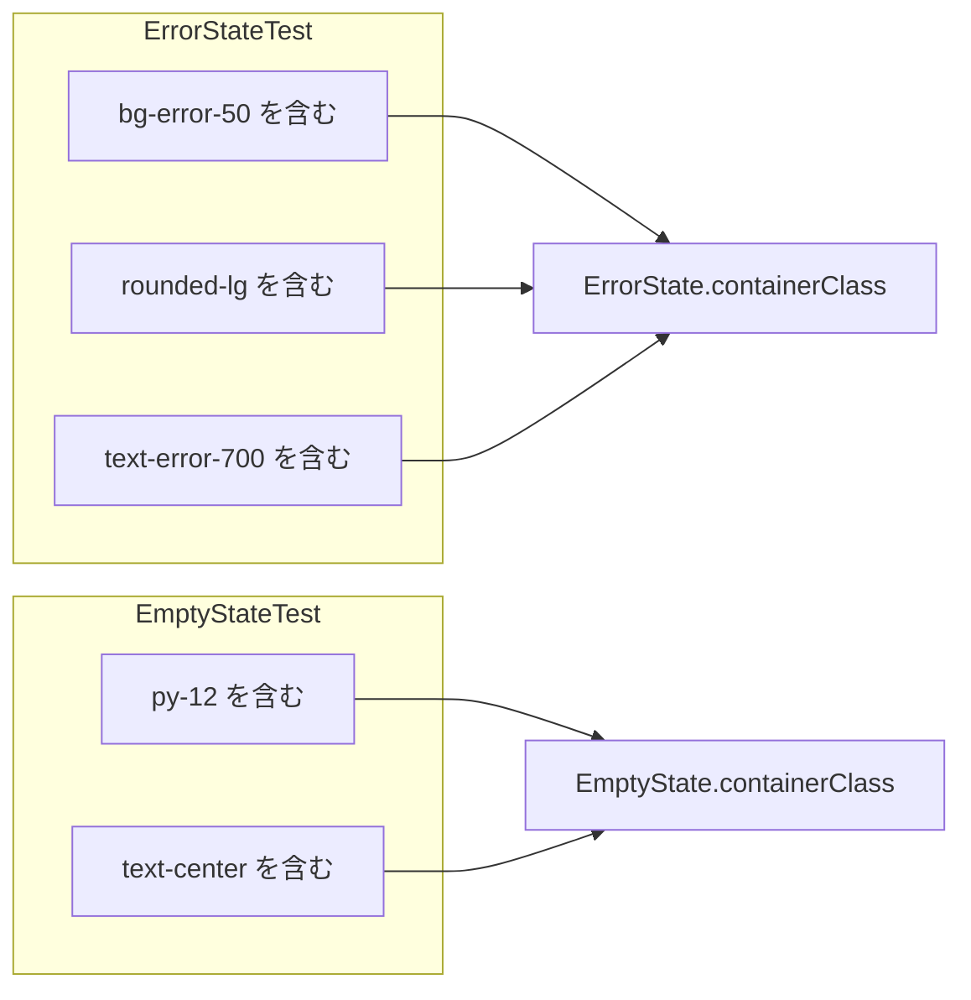

# 状態表示パターン共通化 - コード解説

対応 PR: #636
対応 Issue: #613

## 主要な型・関数

| 型/関数 | ファイル | 責務 |
|--------|---------|------|
| `ErrorState.view` | [`Component/ErrorState.elm:47`](../../../frontend/src/Component/ErrorState.elm) | リフレッシュボタン付きエラー表示 |
| `ErrorState.viewSimple` | [`Component/ErrorState.elm:72`](../../../frontend/src/Component/ErrorState.elm) | シンプルなエラー表示 |
| `ErrorState.containerClass` | [`Component/ErrorState.elm:37`](../../../frontend/src/Component/ErrorState.elm) | テスト用 CSS クラス定数 |
| `EmptyState.view` | [`Component/EmptyState.elm:55`](../../../frontend/src/Component/EmptyState.elm) | 空状態表示 |
| `EmptyState.containerClass` | [`Component/EmptyState.elm:45`](../../../frontend/src/Component/EmptyState.elm) | テスト用 CSS クラス定数 |

### 状態表示コンポーネントの関係



## コードフロー

コードをライフサイクル順に追う。RemoteData のパターンマッチから状態表示コンポーネントの呼び出しまでの流れ。



### 1. ページの viewContent（ページロード時）

各ページの `viewContent` 関数が RemoteData の状態に応じて表示を切り替える。変更前後で構造は変わらず、Failure/Empty 分岐の実装が共通コンポーネント呼び出しに置換された。



```elm
-- frontend/src/Page/User/List.elm:155-168
viewContent remoteUsers =
    case remoteUsers of
        NotAsked ->
            text ""

        Loading ->
            LoadingSpinner.view

        Failure err ->                                       -- ① ErrorState.view に置換
            ErrorState.view
                { message = ErrorMessage.toUserMessage { entityName = "ユーザー" } err
                , onRefresh = Refresh
                }

        Success users ->
            viewUserList users                               -- ② viewUserList 内で EmptyState を使用
```

注目ポイント:

- ① 8 行のインライン実装が 4 行の関数呼び出しに置換された
- ② Success 分岐内でデータが空の場合に EmptyState を使用（次のステップで解説）

### 2. ErrorState コンポーネント（Failure 状態の表示）

`view` と `viewSimple` の 2 関数で、リフレッシュボタンの有無を表現する。



```elm
-- frontend/src/Component/ErrorState.elm:47-65
view :
    { message : String
    , onRefresh : msg                                        -- ① msg 型パラメータ
    }
    -> Html msg
view config =
    div
        [ class containerClass
        , attribute "role" "alert"                           -- ② WCAG アクセシビリティ
        ]
        [ p [] [ text config.message ]
        , Button.view                                        -- ③ 既存 Button コンポーネントを再利用
            { variant = Button.Outline
            , disabled = False
            , onClick = config.onRefresh
            }
            [ text "再読み込み" ]
        ]
```

注目ポイント:

- ① `msg` 型パラメータにより、各ページの `Msg` 型に対応（`LoadingSpinner.view : Html msg` と同じパターン）
- ② `role="alert"` でスクリーンリーダーがエラー発生をアナウンスする（`LoadingSpinner` の `role="status"` と対をなす）
- ③ `Button.Outline` バリアントは既存の UI パターンを踏襲

```elm
-- frontend/src/Component/ErrorState.elm:72-78
viewSimple : String -> Html msg                              -- ① String 1 つの最小シグネチャ
viewSimple message =
    div
        [ class containerClass
        , attribute "role" "alert"
        ]
        [ text message ]
```

注目ポイント:

- ① `viewSimple` は `String -> Html msg` と最小限の型シグネチャ。リフレッシュ不可な文脈（フォームの補助データ取得失敗など）で使用する

### 3. EmptyState コンポーネント（Success+Empty 状態の表示）

オプショナルな description を `Maybe String` で表現する。



```elm
-- frontend/src/Component/EmptyState.elm:55-63
view :
    { message : String
    , description : Maybe String                             -- ① オプショナルな補助説明
    }
    -> Html msg
view config =
    div [ class containerClass ]
        [ p [ class "text-secondary-500" ] [ text config.message ]
        , viewDescription config.description                 -- ② ヘルパー関数で分岐
        ]
```

```elm
-- frontend/src/Component/EmptyState.elm:66-74
viewDescription : Maybe String -> Html msg                   -- ③ 内部関数（公開しない）
viewDescription maybeDescription =
    case maybeDescription of
        Just description ->
            p [ class "mt-2 text-sm text-secondary-400" ] [ text description ]

        Nothing ->
            text ""
```

注目ポイント:

- ① `Maybe String` は Elm のイディオムとして自然。3 箇所中 1 箇所のみ description を持つ
- ② `viewDescription` ヘルパーで `Maybe` の分岐を分離し、`view` 関数の見通しを確保
- ③ `viewDescription` は公開しない（内部実装の詳細）

### 4. ページでの使用パターン（Success 分岐内の空チェック）

`EmptyState` は `viewContent` の Success 分岐内で、データが空の場合に使用される。

```elm
-- frontend/src/Page/Task/List.elm:158-165
viewTaskList : Time.Zone -> List TaskItem -> Html Msg
viewTaskList zone tasks =
    if List.isEmpty tasks then
        EmptyState.view                                      -- ① 空リストの場合
            { message = "承認待ちのタスクはありません"
            , description = Just "新しいタスクが割り当てられるとここに表示されます"
            }
    else
        div [] ...                                           -- ② データがある場合
```

注目ポイント:

- ① `List.isEmpty` チェック後に `EmptyState.view` を呼び出すパターンは、3 箇所すべてで共通

## テスト

各テストが CSS クラス定数の正確性を検証する。



| テスト | 検証対象 | 検証内容 |
|-------|---------|---------|
| `ErrorStateTest.containerClass - bg-error-50 を含む` | ErrorState.containerClass | 背景色クラスの存在 |
| `ErrorStateTest.containerClass - rounded-lg を含む` | ErrorState.containerClass | 角丸クラスの存在 |
| `ErrorStateTest.containerClass - text-error-700 を含む` | ErrorState.containerClass | テキスト色クラスの存在 |
| `EmptyStateTest.containerClass - py-12 を含む` | EmptyState.containerClass | パディングクラスの存在 |
| `EmptyStateTest.containerClass - text-center を含む` | EmptyState.containerClass | テキスト配置クラスの存在 |

### 実行方法

```bash
cd frontend && pnpm run test -- --watch tests/Component/ErrorStateTest.elm
cd frontend && pnpm run test -- --watch tests/Component/EmptyStateTest.elm
```

## 設計解説

コード実装レベルの判断を記載する。機能・仕組みレベルの判断は[機能解説](./01_状態表示パターン共通化_機能解説.md#設計判断)を参照。

### 1. テストアプローチ: containerClass の公開

場所: `Component/ErrorState.elm:37`, `Component/EmptyState.elm:45`

```elm
containerClass : String
containerClass =
    "rounded-lg bg-error-50 p-4 text-error-700"
```

なぜこの実装か:
elm-html-test が未導入（[FormFieldTest.elm コメント参照](../../../frontend/tests/Component/FormFieldTest.elm)）のため、HTML 構造のテストができない。代わりに CSS クラス定数を公開し、`String.contains` で検証する。

代替案:

| 案 | メリット | デメリット | 判断 |
|----|---------|-----------|------|
| **containerClass を公開してテスト（採用）** | 既存パターン（FormFieldTest, ButtonTest）と一貫 | 公開 API が増える | 採用 |
| elm-html-test を導入 | HTML 構造を直接テスト可能 | 依存追加のスコープ外 | 見送り |
| テストなし | API 追加なし | 品質低下 | 見送り |

### 2. モジュール構造: LoadingSpinner に倣う

場所: `Component/ErrorState.elm:1`, `Component/EmptyState.elm:1`

```elm
module Component.ErrorState exposing (containerClass, view, viewSimple)

{-| エラー状態コンポーネント
...
-}
```

なぜこの実装か:
`LoadingSpinner.elm` のモジュール構造（module 宣言 + doc comment + view 関数 + ARIA 属性）を踏襲し、Component レイヤーの一貫性を確保する。

| 要素 | LoadingSpinner | ErrorState | EmptyState |
|------|---------------|------------|------------|
| module 宣言 | `exposing (view)` | `exposing (containerClass, view, viewSimple)` | `exposing (containerClass, view)` |
| doc comment | あり + 使用例 | あり + 使用例 | あり + 使用例 |
| ARIA | `role="status"` | `role="alert"` | なし |
| テスト定数 | なし | `containerClass` | `containerClass` |

### 3. Button import の保持判断

場所: 各ページファイルの import セクション

リファクタリングで `ErrorState.view` に置換した際、inline の `Button.view` が不要になったページがある。しかし、Button が ErrorState 以外の箇所（例: アクションボタン、リンクボタン）でも使用されているページでは import を保持する必要がある。

```elm
-- Page/Task/List.elm: Button import を削除（ErrorState 経由のみで使用していた）
-import Component.Button as Button
+import Component.ErrorState as ErrorState

-- Page/User/Detail.elm: Button import を保持（Button.link, Button.Error 等で別途使用）
 import Component.Button as Button
+import Component.ErrorState as ErrorState
```

`Page/Task/List.elm` は Button を ErrorState の中でしか使っていなかったため import を削除。他のページでは Button が別の用途でも使用されているため保持。

## 関連ドキュメント

- [機能解説](./01_状態表示パターン共通化_機能解説.md)
- [実装計画](../../../prompts/plans/613_state-display-patterns.md)
- [セッションログ](../../../prompts/runs/2026-02/2026-02-18_2127_状態表示パターンの共通化.md)
