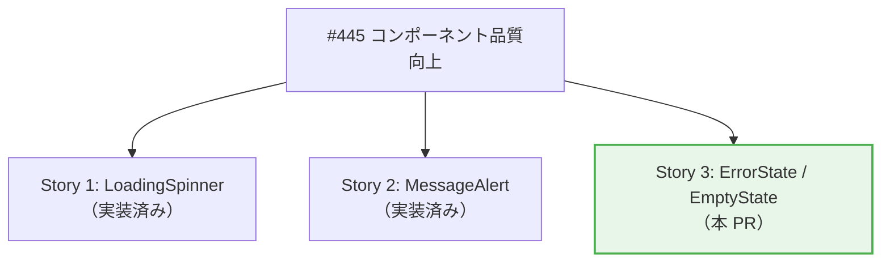
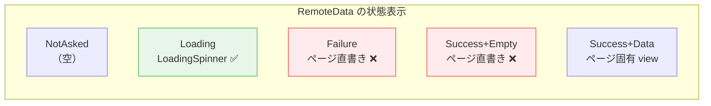
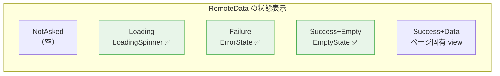
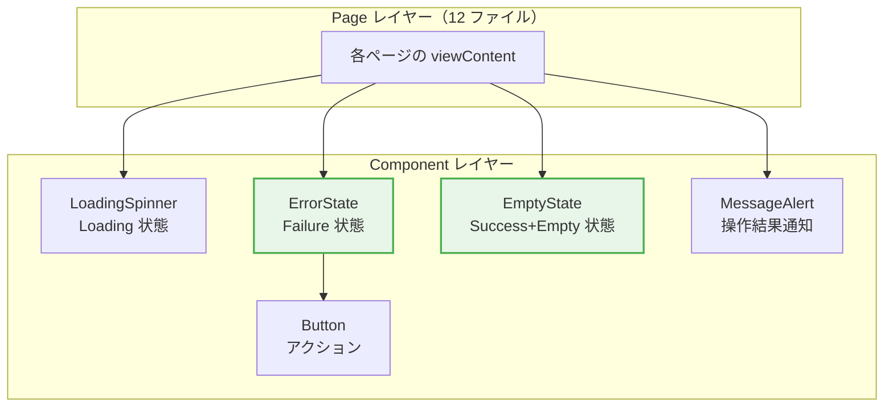

# 状態表示パターン共通化 - 機能解説

対応 PR: #636
対応 Issue: #613

## 概要

RemoteData の Failure 状態と Success+Empty 状態の表示を共通コンポーネント（`ErrorState`、`EmptyState`）に抽出した。これにより、`LoadingSpinner`（Loading 状態）と合わせて RemoteData の全 4 状態に対応する共通コンポーネントセットが完成した。

## 背景

### RemoteData パターンと状態表示

Elm フロントエンドでは、API データの状態管理に `RemoteData` 型を使用している。

```elm
type RemoteData e a
    = NotAsked
    | Loading
    | Failure e
    | Success a
```

各ページの `viewContent` 関数はこの 4 状態を `case` で分岐し、それぞれ異なる UI を表示する。

### 変更前の課題

`Loading` 状態は `LoadingSpinner.view` として共通化済みだったが、`Failure` と `Success+Empty` は各ページに直書きされていた。

- エラー表示（`rounded-lg bg-error-50 p-4 text-error-700`）が 13 箇所にコピーペースト
- 空状態（`py-12 text-center`）が各ページで独自実装、スタイルにばらつき
- リフレッシュボタンの実装パターンも各ページで重複

### Epic #445 の中での位置づけ

本 PR は Epic #445（コンポーネント品質向上）の Story 3 に該当する。



## 用語・概念

| 用語 | 説明 | 関連コード |
|------|------|-----------|
| RemoteData | API データの 4 状態を表す型（NotAsked/Loading/Failure/Success） | `RemoteData` パッケージ |
| ErrorState | Failure 状態の表示コンポーネント | `Component.ErrorState` |
| EmptyState | Success だがデータが空の状態の表示コンポーネント | `Component.EmptyState` |
| LoadingSpinner | Loading 状態の表示コンポーネント（既存） | `Component.LoadingSpinner` |
| MessageAlert | 操作結果の成功/エラーメッセージ表示（既存） | `Component.MessageAlert` |
| containerClass | テスト用に公開された CSS クラス定数 | 各コンポーネント |

## ビフォー・アフター

### Before（変更前）

各ページが RemoteData の Failure 状態と Empty 状態を個別に実装していた。



#### 課題

- 13 箇所のエラー表示が同一 CSS クラスの直書き
- スタイル変更時に全箇所を手動で修正する必要がある
- リフレッシュボタンの有無で 2 パターンあるが、どちらも同じ構造を繰り返し

### After（変更後）

全 4 状態に共通コンポーネントが対応する。



#### 改善点

- エラー表示の一元管理（スタイル変更は 1 ファイルのみ）
- リフレッシュボタンの有無を `view` / `viewSimple` の関数選択で表現
- 空状態の統一されたスタイル（`py-12 text-center`）
- WCAG アクセシビリティ（`role="alert"`）の追加

## アーキテクチャ



## 適用マップ

### ErrorState の適用（13 箇所）

| ページ | 関数 | エラーメッセージ |
|--------|------|---------------|
| `Page/User/List.elm` | `view` | `ErrorMessage.toUserMessage { entityName = "ユーザー" }` |
| `Page/User/Detail.elm` | `view` | `ErrorMessage.toUserMessage { entityName = "ユーザー" }` |
| `Page/Role/List.elm` | `view` | `ErrorMessage.toUserMessage { entityName = "ロール" }` |
| `Page/AuditLog/List.elm` | `view` | `ErrorMessage.toUserMessage { entityName = "監査ログ" }` |
| `Page/Task/List.elm` | `view` | "データの取得に失敗しました。" |
| `Page/Workflow/List.elm` | `view` | "データの取得に失敗しました。" |
| `Page/Workflow/Detail.elm` | `view` | "データの取得に失敗しました。" |
| `Page/Task/Detail.elm` | `view` | "データの取得に失敗しました。" |
| `Page/Home.elm` | `viewSimple` | "統計情報の取得に失敗しました" |
| `Page/User/New.elm` | `viewSimple` | "ロール情報の取得に失敗しました。" |
| `Page/User/Edit.elm` | `viewSimple` | `ErrorMessage.toUserMessage { entityName = "ユーザー" }` |
| `Page/User/Edit.elm` | `viewSimple` | "ロール情報の取得に失敗しました。" |
| `Page/Role/Edit.elm` | `viewSimple` | `ErrorMessage.toUserMessage { entityName = "ロール" }` |

### EmptyState の適用（3 箇所）

| ページ | description |
|--------|-------------|
| `Page/User/List.elm` | なし |
| `Page/AuditLog/List.elm` | なし |
| `Page/Task/List.elm` | "新しいタスクが割り当てられるとここに表示されます" |

### スコープ対象外

| 箇所 | 除外理由 |
|------|---------|
| `Workflow/New.elm`（3 箇所） | flex レイアウト + dismissible、p-8 + text-center、異なるカラー（`text-error-600`）等、ページ固有パターン |
| `Workflow/Detail.elm:1098` | p-3 + text-sm（セクション内のコンパクトエラー） |
| `Workflow/List.elm:268` | Empty state にアクションボタンあり（固有レイアウト） |
| `Role/List.elm:218` | セクションレベルの empty state（py-8、ページレベルではない） |

## 設計判断

機能・仕組みレベルの判断を記載する。コード実装レベルの判断は[コード解説](./01_状態表示パターン共通化_コード解説.md#設計解説)を参照。

### 1. ErrorState の API をどう設計するか

リフレッシュボタンの有無という 2 つのバリエーションをどう表現するか。

| 案 | call site の明確さ | 型安全性 | API の簡潔さ |
|----|-------------------|---------|-------------|
| **`view` + `viewSimple` の 2 関数（採用）** | 高い（関数名で意図が明確） | 高い（`viewSimple` は msg 型パラメータ不要） | 中（2 関数を公開） |
| `Maybe msg` で統一（`view { onRefresh = Just Refresh }` / `Nothing`） | 中（Nothing の意味が文脈依存） | 中（Nothing でも msg 型が必要） | 高（1 関数のみ） |

**採用理由**: `viewSimple` は `String -> Html msg` と最小限のシグネチャで呼べる。call site でリフレッシュ可否の意図が関数名から明確に読み取れる。

### 2. EmptyState の description をどう扱うか

3 箇所中 1 箇所のみが description を持つ。

| 案 | 型安全性 | call site の簡潔さ |
|----|---------|-------------------|
| **`Maybe String`（採用）** | 高い（型で表現） | 中（Nothing の指定が必要） |
| 引数 2 つの別関数 | 高い | 低い（2 関数管理） |
| 空文字列で省略 | 低い（空文字と未指定の区別なし） | 高い |

**採用理由**: `Maybe String` は Elm のイディオムとして自然であり、description の有無を型レベルで明示できる。

### 3. `role="alert"` を追加するか

既存のエラー表示には `role` 属性がなかった。

| 案 | アクセシビリティ | 既存コードとの乖離 |
|----|---------------|------------------|
| **追加（採用）** | WCAG ベストプラクティス準拠 | 新規追加（改善） |
| 追加しない | 既存と同等 | 変更なし |

**採用理由**: WCAG のベストプラクティスに従い、`role="alert"` を追加。`MessageAlert` コンポーネントとの一貫性も確保される。`LoadingSpinner` が `role="status"` を使用しているパターンとも整合する。

## 関連ドキュメント

- [コード解説](./01_状態表示パターン共通化_コード解説.md)
- [実装計画](../../../prompts/plans/613_state-display-patterns.md)
- [セッションログ](../../../prompts/runs/2026-02/2026-02-18_2127_状態表示パターンの共通化.md)
