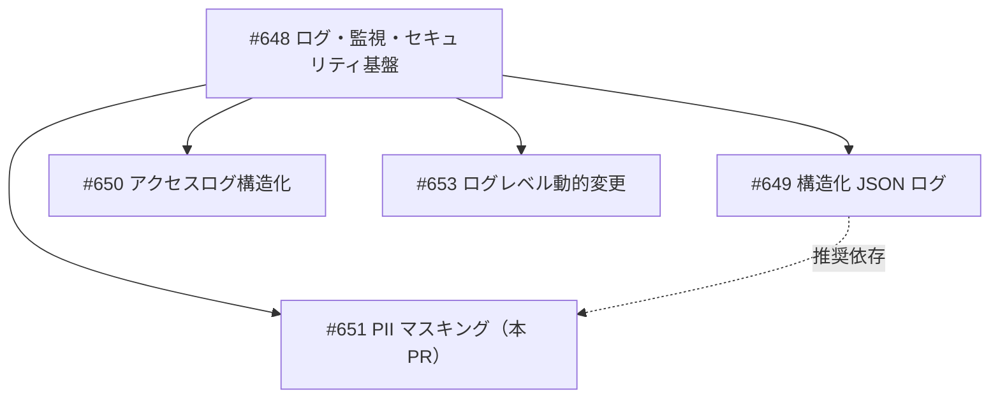
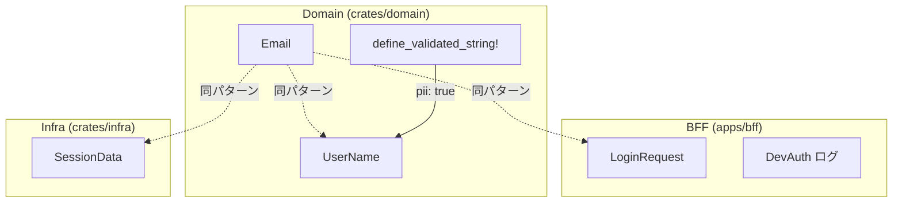

# PII マスキング基盤 - 機能解説

対応 PR: #668
対応 Issue: #651

## 概要

ログ出力に PII（個人識別情報）やシークレットが平文で含まれることを防ぐマスキング基盤。Rust の `Debug` トレイトのカスタム実装を活用し、型レベルで PII 漏洩を防止する。

## 背景

### 運用設計書の MUST NOT 要件

運用設計書のセクション 8.6 および 9.4 で以下が規定されている:

- ログには PII/シークレットを出力してはならない（MUST NOT）
- マスキング/サニタイズ方針を運用規程として固定する

| セクション | 要件 |
|-----------|------|
| 8.6 補足 | シークレットはログ・トレース・メトリクスへ出力してはならない（MUST NOT） |
| 9.4 補足 | ログには PII/シークレットを出力してはならず（MUST NOT）、マスキング/サニタイズ方針を固定する |

### 変更前の課題

PII を含む型が `derive(Debug)` と平文 `Display` を持っており、tracing ログに漏洩するリスクがあった。

- `Email` 型: `Debug` が平文出力、`Display` も平文出力
- `UserName` 型: `define_validated_string!` マクロにより `Debug` と `Display` が平文で自動生成
- `SessionData`: `email`, `name` フィールドが `derive(Debug)` で平文出力
- `LoginRequest`: `email`, `password` が `derive(Debug)` で平文出力
- DevAuth ログ: CSRF トークンが全文出力

### 既存パターン: PlainPassword

`PlainPassword` 型が既にカスタム `Debug` で `[REDACTED]` パターンを実装済みであった。

```rust
impl std::fmt::Debug for PlainPassword {
    fn fmt(&self, f: &mut std::fmt::Formatter<'_>) -> std::fmt::Result {
        f.debug_tuple("PlainPassword").field(&"[REDACTED]").finish()
    }
}
```

このパターンを PII 型全般に拡張する方針を採用した。

### Epic 全体の中での位置づけ



| Issue | 内容 | 状態 |
|-------|------|------|
| #649 | 構造化 JSON ログ | 完了 |
| #650 | アクセスログ構造化 | 未着手 |
| #651 | PII マスキング（本 PR） | 実装済み |
| #653 | ログレベル動的変更 | 未着手 |

## 用語・概念

| 用語 | 説明 | 関連コード |
|------|------|-----------|
| PII（Personally Identifiable Information） | 個人を識別可能な情報。メールアドレス、氏名等 | `Email`, `UserName` |
| Debug トレイト | Rust の `{:?}` フォーマットで使用される出力トレイト。`tracing` のログ出力で使われる | `std::fmt::Debug` |
| Display トレイト | Rust の `{}` フォーマットで使用される出力トレイト。`to_string()` メソッドを提供 | `std::fmt::Display` |
| `[REDACTED]` | マスク文字列。PII 型の Debug 出力に使用 | カスタム Debug impl |
| PII アーム | `define_validated_string!` マクロの `pii: true` 指定時のコード生成パス | `macros.rs` |

## ビフォー・アフター

### Before（変更前）

PII 型が `derive(Debug)` で平文出力していた。

```mermaid
flowchart LR
    Email["Email(\"user@example.com\")"]
    Debug["Debug 出力"]
    Log["tracing ログ"]

    Email -->|"derive(Debug)"| Debug
    Debug -->|"Email(\"user@example.com\")"| Log
```

制約・課題:
- `tracing::debug!("{:?}", user)` で `User` 構造体をログ出力すると、`Email` と `UserName` が平文で出力される
- `Display` トレイトにより `email.to_string()` で平文取得が可能

### After（変更後）

PII 型はカスタム `Debug` で `[REDACTED]` を出力し、`Display` は削除された。

```mermaid
flowchart LR
    Email["Email(\"user@example.com\")"]
    Debug["カスタム Debug"]
    Log["tracing ログ"]

    Email -->|"カスタム Debug"| Debug
    Debug -->|"Email(\"[REDACTED]\")"| Log
```

改善点:
- `Debug` 出力が自動的にマスクされる（`tracing` との統合が自然）
- `Display` 削除により `to_string()` がコンパイルエラーになる（コンパイル時防止）
- 親構造体（`User` 等）は `derive(Debug)` のまま。子型のカスタム Debug が自動伝播する
- `as_str()` は引き続き実際の値を返す（ビジネスロジックへの影響なし）

## アーキテクチャ

PII マスキングは各レイヤーの型定義に適用される。



## マスキング対象マップ

| 型 | レイヤー | PII フィールド | マスキング方式 |
|---|---------|--------------|--------------|
| `Email` | Domain | メールアドレス | カスタム Debug + Display 削除 |
| `UserName` | Domain（マクロ生成） | 氏名 | `pii: true` でカスタム Debug + Display 非生成 |
| `SessionData` | Infra | email, name | カスタム Debug（選択的マスク） |
| `LoginRequest` | BFF | email, password | カスタム Debug |
| DevAuth ログ | BFF (main.rs) | CSRF Token | ログ出力を先頭 8 文字に切り詰め |

### 対象外

| 型/フィールド | 理由 |
|-------------|------|
| `SessionData` の String → ドメイン型変更 | Redis シリアライゼーション互換の破壊 |
| カスタム tracing Layer | 型レベルマスキングで十分 |
| 監査ログの `actor_name` | DynamoDB 保存用、tracing ログに出力されない |
| `WorkflowName` | PII ではない |
| API レスポンス型の String フィールド | API 契約（クライアントに値を返す必要がある） |
| `PasswordHash` | ハッシュ値は PII ではない |

## 設計判断

機能・仕組みレベルの判断を記載する。コード実装レベルの判断は[コード解説](./01_PIIマスキング_コード解説.md#設計解説)を参照。

### 1. PII マスキングの実現方式をどうするか

PII がログに漏洩しない仕組みを選定する必要がある。

| 案 | 型安全性 | 新規依存 | 既存コードとの整合 |
|----|---------|---------|-----------------|
| **Newtype + カスタム Debug（採用）** | コンパイル時保証 | なし | PlainPassword パターンと一貫 |
| `secrecy` クレート | コンパイル時保証 | あり | zeroize が PII には過剰 |
| tracing Layer でフィルタ | 実行時のみ | なし | false positive リスク |
| Lint / レビュー規約 | なし | なし | 強制力が弱い |

**採用理由**: PlainPassword パターンが既に存在しテスト済みであり、ゼロコスト・ゼロ依存で tracing と自然に統合できる。

### 2. Display トレイトをどう扱うか

PII 型で `Display` があると `to_string()` で平文取得が可能になる。

| 案 | 安全性 | 利便性 |
|----|-------|--------|
| **Display 削除（採用）** | コンパイル時に平文取得を防止 | `as_str()` 経由で明示的に取得 |
| Display をマスク出力に | 実行時防止 | `to_string()` がマスク文字列を返す（混乱の元） |
| Display を維持 | なし | 既存コードを変更不要 |

**採用理由**: `Display` を削除すれば `to_string()` がコンパイルエラーになり、意図せぬ平文出力を根本的に防止できる。値が必要な箇所は `as_str()` で明示的に取得する。

### 3. SessionData の PII フィールドをどうマスクするか

`SessionData` は `email`, `name` を `String` で保持しているが、ドメイン型に変更すると Redis シリアライゼーション互換が壊れる。

| 案 | 互換性 | マスキング |
|----|--------|----------|
| **カスタム Debug で選択的マスク（採用）** | 維持 | email/name のみマスク |
| ドメイン型（Email, UserName）に変更 | 破壊 | 型レベルで自動マスク |
| 全フィールドマスク | 維持 | デバッグ困難 |

**採用理由**: `email` と `name` のみ `[REDACTED]` とし、`user_id`, `tenant_id`, `roles` 等の非 PII フィールドは通常表示を維持する。デバッグ容易性と PII 保護を両立。

## 関連ドキュメント

- [コード解説](./01_PIIマスキング_コード解説.md)
- [計画ファイル](../../../prompts/plans/651_pii-masking.md)
- [セッションログ](../../../prompts/runs/2026-02/2026-02-18_2204_PII-masking-implementation.md)
