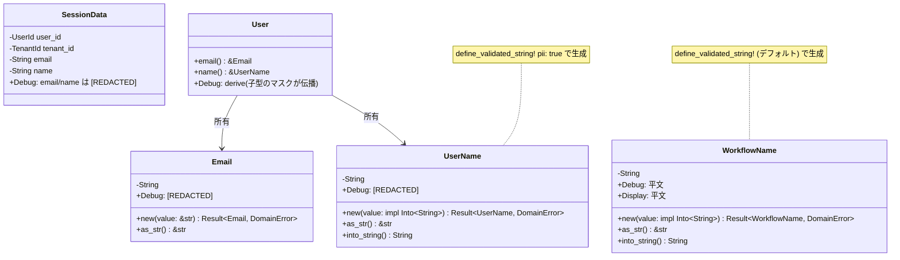
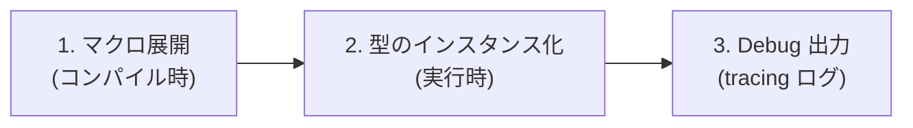
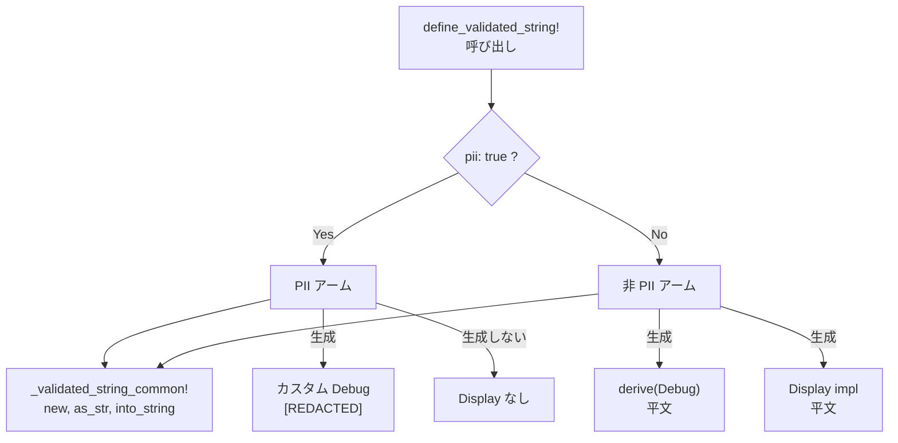
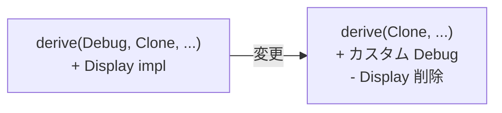
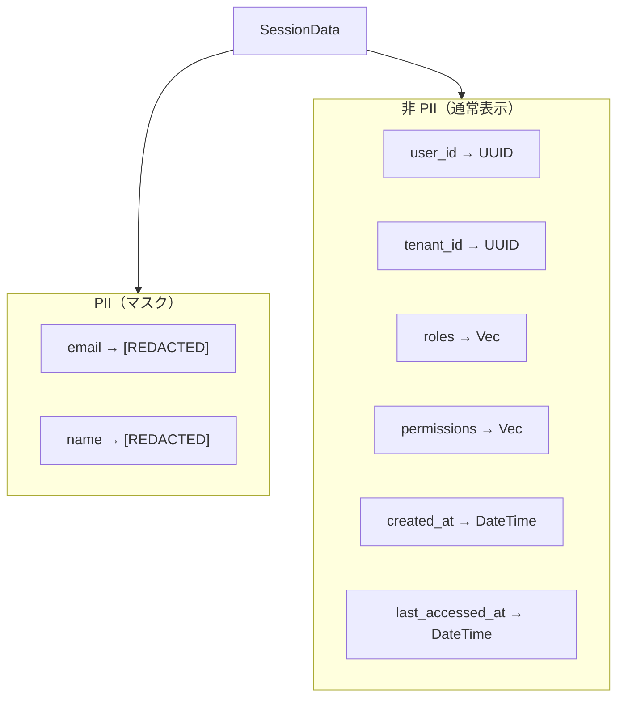
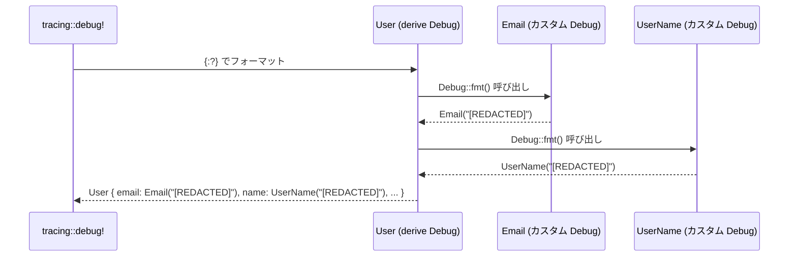

# PII マスキング基盤 - コード解説

対応 PR: #668
対応 Issue: #651

## 主要な型・関数

| 型/関数 | ファイル | 責務 |
|--------|---------|------|
| `Email` | [`domain/src/user.rs:66`](../../../backend/crates/domain/src/user.rs) | メールアドレス値オブジェクト。PII マスキング対象 |
| `UserName` | [`domain/src/value_objects.rs:333`](../../../backend/crates/domain/src/value_objects.rs) | ユーザー表示名。マクロ `pii: true` で生成 |
| `SessionData` | [`infra/src/session.rs:40`](../../../backend/crates/infra/src/session.rs) | Redis セッション情報。email/name を選択的マスク |
| `LoginRequest` | [`bff/src/handler/auth/mod.rs:38`](../../../backend/apps/bff/src/handler/auth/mod.rs) | ログインリクエスト。email/password をマスク |
| `define_validated_string!` | [`domain/src/macros.rs:138`](../../../backend/crates/domain/src/macros.rs) | PII/非 PII の 2 アームを持つ宣言型マクロ |
| `_validated_string_common!` | [`domain/src/macros.rs:65`](../../../backend/crates/domain/src/macros.rs) | 共通メソッド生成用の内部ヘルパーマクロ |

### 型の関係



## コードフロー

コードをライフサイクル順に追う。PII マスキングは型定義時に設定され、Debug 出力時に自動発動する。



### 1. マクロ展開（コンパイル時）

`define_validated_string!` マクロが `pii: true` パラメータの有無で異なるコードを生成する。



```rust
// domain/src/macros.rs:138-186
macro_rules! define_validated_string {
    // PII アーム: Debug をマスク、Display を生成しない
    (
        $(#[$meta:meta])*
        $vis:vis struct $Name:ident {
            label: $label:expr,
            max_length: $max_length:expr,
            pii: true $(,)?          // ① pii: true でパターンマッチ
        }
    ) => {
        $(#[$meta])*
        #[derive(
            Clone, PartialEq, Eq,    // ② Debug を derive しない
            serde::Serialize, serde::Deserialize,
        )]
        $vis struct $Name(String);

        impl std::fmt::Debug for $Name {
            fn fmt(&self, f: &mut std::fmt::Formatter<'_>) -> std::fmt::Result {
                f.debug_tuple(stringify!($Name))
                    .field(&"[REDACTED]")   // ③ 値の代わりに [REDACTED]
                    .finish()
            }
        }

        _validated_string_common!($Name, $label, $max_length); // ④ 共通メソッド
    };
    // 非 PII アーム: derive(Debug) + Display 生成（省略）
}
```

注目ポイント:

- ① Rust の宣言型マクロはパターンマッチで分岐する。`pii: true` リテラルの有無で 2 つのアームが選択される
- ② PII アームでは `Debug` を derive リストから除外し、カスタム実装に置き換える
- ③ `debug_tuple` は `TypeName("[REDACTED]")` 形式の出力を生成する
- ④ `new()`, `as_str()`, `into_string()` は PII/非 PII で同一なため、内部マクロに委譲

### 2. Email のカスタム Debug（手動実装パターン）

マクロ生成ではない `Email` 型は、手動でカスタム Debug を実装する。



```rust
// domain/src/user.rs:66-72
#[derive(Clone, PartialEq, Eq, Serialize, Deserialize)]  // ① Debug を除外
pub struct Email(String);

impl std::fmt::Debug for Email {
    fn fmt(&self, f: &mut std::fmt::Formatter<'_>) -> std::fmt::Result {
        f.debug_tuple("Email").field(&"[REDACTED]").finish()  // ② PlainPassword と同パターン
    }
}
```

注目ポイント:

- ① `derive` リストから `Debug` を除外。`Serialize`/`Deserialize` は `Debug` に依存しないため影響なし
- ② `PlainPassword` と同じ `debug_tuple` + `[REDACTED]` パターンを踏襲

### 3. SessionData の選択的マスク

`SessionData` は PII フィールドのみマスクし、非 PII フィールドは通常表示する。



```rust
// infra/src/session.rs:52-65
impl std::fmt::Debug for SessionData {
    fn fmt(&self, f: &mut std::fmt::Formatter<'_>) -> std::fmt::Result {
        f.debug_struct("SessionData")
            .field("user_id", &self.user_id)            // ① 非 PII: 通常表示
            .field("tenant_id", &self.tenant_id)
            .field("email", &"[REDACTED]")              // ② PII: マスク
            .field("name", &"[REDACTED]")               // ② PII: マスク
            .field("roles", &self.roles)                 // ① 非 PII: 通常表示
            .field("permissions", &self.permissions)
            .field("created_at", &self.created_at)
            .field("last_accessed_at", &self.last_accessed_at)
            .finish()
    }
}
```

注目ポイント:

- ① `debug_struct` は構造体形式の Debug 出力を生成。フィールドごとに値を制御できる
- ② `email` と `name` のみ `&"[REDACTED]"` を渡し、他フィールドは実際の値への参照を渡す

### 4. Debug 出力の自動伝播

親構造体が `derive(Debug)` のまま子型のマスクが自動伝播する仕組み。



`User` 構造体は `derive(Debug)` のまま変更不要。`derive(Debug)` は各フィールドの `Debug::fmt()` を呼び出すため、子型のカスタム実装が自動的に反映される。

### 5. Display 削除によるコンパイル時防止

`Display` を削除したことで、`to_string()` の呼び出しがコンパイルエラーになる。

```rust
// Before: コンパイル成功（平文出力）
let email_str = user.email().to_string(); // "user@example.com"

// After: コンパイルエラー（Display が存在しない）
let email_str = user.email().to_string(); // ❌ コンパイルエラー

// After: 明示的に値を取得（意図が明確）
let email_str = user.email().as_str().to_string(); // ✅ OK
```

`UserName` も同様で、`user.name().to_string()` → `user.name().as_str().to_string()` に変更が必要。

## テスト

各テストがマスキングの正しさを検証している。

| テスト | 検証対象のステップ | 検証内容 |
|-------|------------------|---------|
| `test_メールアドレスのdebug出力はマスクされる` | 2 | Email の Debug が `[REDACTED]` を含み、平文を含まない |
| `test_メールアドレスのas_strは実際の値を返す` | 2 | Email の `as_str()` が実際の値を返す（機能維持） |
| `test_ユーザーのdebug出力はメールアドレスを含まない` | 4 | User 経由で Email のマスクが伝播する |
| `test_ユーザーのdebug出力はユーザー名を含まない` | 4 | User 経由で UserName のマスクが伝播する |
| `test_ユーザー名のdebug出力はマスクされる` | 1 | マクロ生成の UserName が `[REDACTED]` を出力 |
| `test_ユーザー名のas_strは実際の値を返す` | 1 | UserName の `as_str()` が実際の値を返す |
| `test_ワークフロー名のdebug出力は実際の値を表示する` | 1 | 非 PII 型の既存動作が維持される |
| `test_ワークフロー名のdisplay出力は実際の値を表示する` | 1 | 非 PII 型の Display が維持される |
| `test_セッションデータのdebug出力はメールアドレスをマスクする` | 3 | SessionData の email/name がマスクされる |
| `test_セッションデータのdebug出力は非piiフィールドを通常表示する` | 3 | 非 PII フィールドは通常表示される |
| `test_ログインリクエストのdebug出力はメールアドレスとパスワードをマスクする` | - | LoginRequest の email/password がマスクされる |

### 実行方法

```bash
# PII マスキング関連のテスト
cd backend && cargo test pii
cd backend && cargo test redacted
cd backend && cargo test debug出力
```

## 設計解説

コード実装レベルの判断を記載する。機能・仕組みレベルの判断は[機能解説](./01_PIIマスキング_機能解説.md#設計判断)を参照。

### 1. マクロの共通コード抽出

場所: `domain/src/macros.rs:65-99`

```rust
// 内部ヘルパーマクロで共通メソッドを一括生成
macro_rules! _validated_string_common {
    ($Name:ident, $label:expr, $max_length:expr) => {
        impl $Name {
            pub fn new(value: impl Into<String>) -> Result<Self, $crate::DomainError> { ... }
            pub fn as_str(&self) -> &str { &self.0 }
            pub fn into_string(self) -> String { self.0 }
        }
    };
}
```

なぜこの実装か:
PII アームと非 PII アームで `new()`, `as_str()`, `into_string()` の実装が完全に同一。重複をヘルパーマクロに抽出することで DRY を実現した。

代替案:

| 案 | メリット | デメリット | 判断 |
|----|---------|-----------|------|
| **内部ヘルパーマクロ（採用）** | DRY、変更箇所が 1 箇所 | マクロが 2 つになる | 採用 |
| アーム内で直接記述 | マクロが 1 つで済む | `new()` 等の 20 行程度が重複 | 見送り |
| proc macro | 最大の柔軟性 | 新規クレートが必要、ビルド時間増加 | 見送り |

### 2. `debug_tuple` vs `debug_struct` の使い分け

場所: 各カスタム Debug 実装

```rust
// Newtype（1フィールド）→ debug_tuple
f.debug_tuple("Email").field(&"[REDACTED]").finish()
// → Email("[REDACTED]")

// 複数フィールド → debug_struct
f.debug_struct("SessionData")
    .field("email", &"[REDACTED]")
    .field("name", &"[REDACTED]")
    .finish()
// → SessionData { email: "[REDACTED]", name: "[REDACTED]", ... }
```

なぜこの実装か:
`debug_tuple` は Newtype パターン（1 フィールド）の標準的な出力形式。`debug_struct` は名前付きフィールドの選択的マスクに適している。`derive(Debug)` のデフォルト出力形式と一致させることで、マスク前後の出力フォーマットに違和感がない。

### 3. DevAuth の CSRF トークン切り詰め

場所: `bff/src/main.rs:161`

```rust
// Before
tracing::info!("  CSRF Token: {}", csrf_token);
// After
tracing::info!("  CSRF Token: {}...", &csrf_token[..8]);
```

なぜこの実装か:
DevAuth は `#[cfg(feature = "dev-auth")]` でコンパイル時ゲートされており、本番では存在しない。開発時のデバッグ利便性のため、トークンの先頭 8 文字を表示して識別可能にしつつ、全文の漏洩を防止する。

## 関連ドキュメント

- [機能解説](./01_PIIマスキング_機能解説.md)
- [計画ファイル](../../../prompts/plans/651_pii-masking.md)
- [セッションログ](../../../prompts/runs/2026-02/2026-02-18_2204_PII-masking-implementation.md)
