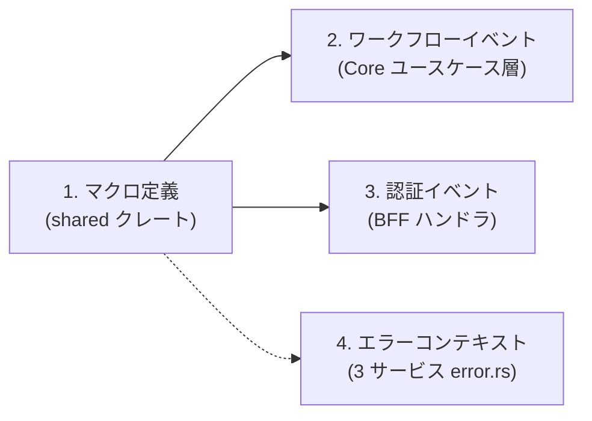
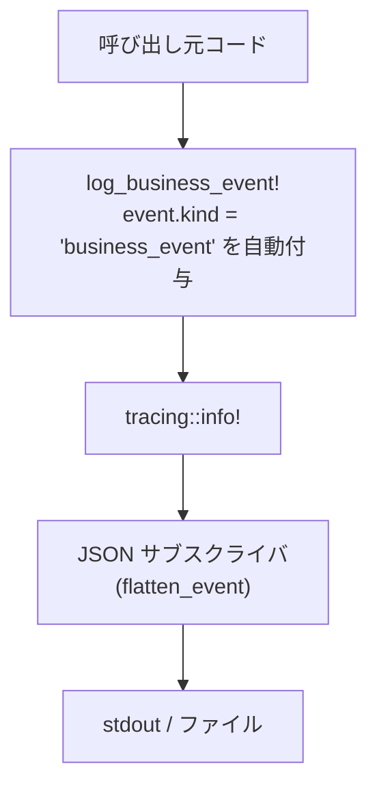
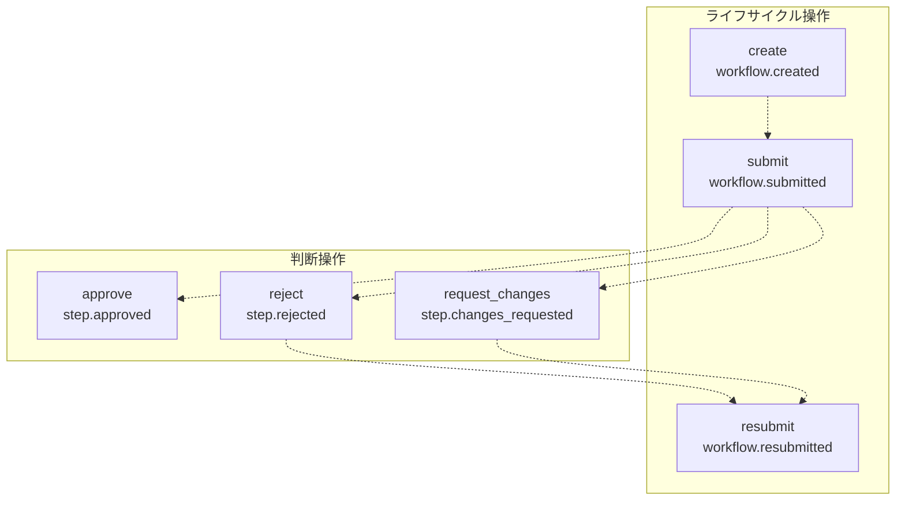
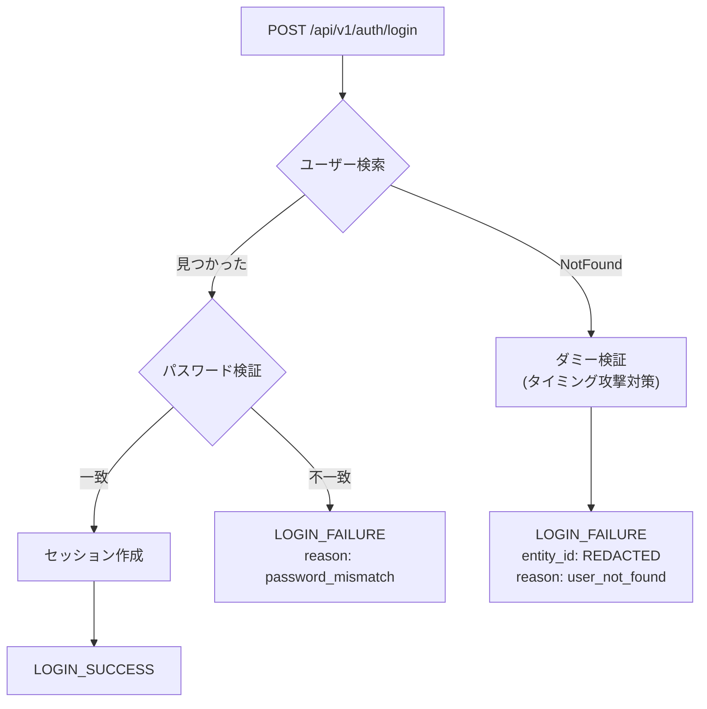
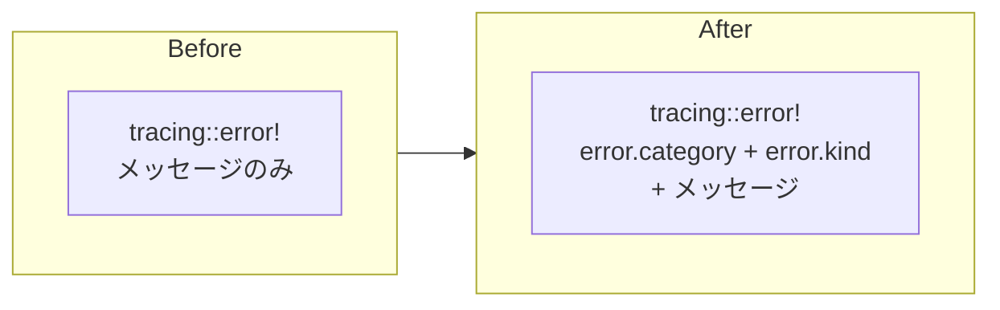

# ビジネスイベントログ - コード解説

対応 PR: #675
対応 Issue: #657

## 主要な型・関数

| 型/関数 | ファイル | 責務 |
|--------|---------|------|
| `log_business_event!` | [`shared/src/event_log.rs:41`](../../../backend/crates/shared/src/event_log.rs) | ビジネスイベント出力マクロ |
| `event::category` | [`shared/src/event_log.rs:53`](../../../backend/crates/shared/src/event_log.rs) | イベントカテゴリ定数 |
| `event::action` | [`shared/src/event_log.rs:59`](../../../backend/crates/shared/src/event_log.rs) | イベントアクション定数 |
| `event::entity_type` | [`shared/src/event_log.rs:75`](../../../backend/crates/shared/src/event_log.rs) | エンティティ種別定数 |
| `event::result` | [`shared/src/event_log.rs:83`](../../../backend/crates/shared/src/event_log.rs) | イベント結果定数 |
| `error::category` | [`shared/src/event_log.rs:92`](../../../backend/crates/shared/src/event_log.rs) | エラーカテゴリ定数 |
| `error::kind` | [`shared/src/event_log.rs:100`](../../../backend/crates/shared/src/event_log.rs) | エラー種別定数 |

## コードフロー

コードをライフサイクル順に追う。マクロ定義 → ワークフローイベント出力 → 認証イベント出力 → エラーコンテキスト付与の順で解説する。



### 1. マクロ定義と定数モジュール（shared クレート）

`log_business_event!` マクロは `tracing::info!` のラッパーで、`event.kind = "business_event"` マーカーを自動付与する。



```rust
// backend/crates/shared/src/event_log.rs:40-48
#[macro_export]
macro_rules! log_business_event {
    ($($args:tt)*) => {
        ::tracing::info!(                       // ① INFO レベルで出力
            event.kind = "business_event",       // ② マーカーを自動付与
            $($args)*                            // ③ 呼び出し元のフィールドをそのまま展開
        )
    };
}
```

注目ポイント:

- ① ビジネスイベントは正常な業務フローの記録のため INFO レベル。ERROR ではない
- ② `event.kind = "business_event"` により `jq 'select(.["event.kind"] == "business_event")'` で全イベントをフィルタ可能
- ③ `$($args:tt)*` はトークンツリーの可変長引数で、`tracing::info!` と同じ構文をそのまま受け取る

定数モジュールはネストしたモジュール構造で、タイポを防ぎ Grep で全使用箇所を検索可能にする:

```rust
// backend/crates/shared/src/event_log.rs:51-87
pub mod event {
    pub mod category {
        pub const WORKFLOW: &str = "workflow";
        pub const AUTH: &str = "auth";
    }
    pub mod action {
        pub const WORKFLOW_CREATED: &str = "workflow.created";
        pub const STEP_APPROVED: &str = "step.approved";
        // ...
    }
    // ...
}
```

feature gate により `observability` フィーチャーが有効な場合のみコンパイルされる:

```rust
// backend/crates/shared/src/lib.rs:14-15
#[cfg(feature = "observability")]
pub mod event_log;
```

### 2. ワークフロービジネスイベント（Core Service ユースケース層）

6 つのユースケースの成功パス（`Ok(...)` 返却直前）に `log_business_event!` を配置。



`approve.rs` の例（他の 5 ファイルも同じパターン）:

```rust
// backend/apps/core-service/src/usecase/workflow/command/decision/approve.rs:149-161
log_business_event!(
    event.category = event::category::WORKFLOW,           // ① 定数参照
    event.action = event::action::STEP_APPROVED,
    event.entity_type = event::entity_type::WORKFLOW_STEP,
    event.entity_id = %step_id,                           // ② Display トレイト で文字列化
    event.actor_id = %user_id,
    event.tenant_id = %tenant_id,
    event.result = event::result::SUCCESS,
    "承認ステップ完了"                                       // ③ 人間可読なメッセージ
);
```

注目ポイント:

- ① 定数を使うことでタイポを防止し、Grep で全使用箇所を追跡可能
- ② `%` プレフィックスは tracing の `Display` 値フォーマット。UUID が文字列として記録される
- ③ 構造化フィールドに加えて人間可読なメッセージも残す（ログ目視確認用）

### 3. 認証ビジネスイベント（BFF ハンドラ層）

認証は BFF の責務のため、ログも BFF の `login.rs` に配置。4 つのイベントポイントがある。



ユーザー不存在時の PII マスキング:

```rust
// backend/apps/bff/src/handler/auth/login.rs:219-228
log_business_event!(
    event.category = event::category::AUTH,
    event.action = event::action::LOGIN_FAILURE,
    event.entity_type = event::entity_type::USER,
    event.entity_id = ringiflow_domain::REDACTED,  // ① "[REDACTED]" で PII マスキング
    event.tenant_id = %tenant_id,
    event.result = event::result::FAILURE,
    event.reason = "user_not_found",                // ② 失敗理由を構造化フィールドで記録
    "ログイン失敗: ユーザー不存在"
);
```

注目ポイント:

- ① `REDACTED` 定数（`"[REDACTED]"`）を使用し、入力されたメールアドレスがログに漏洩するのを防ぐ。#651 の PII マスキング方針に準拠
- ② `event.reason` フィールドで `password_mismatch` と `user_not_found` を区別。jq で失敗理由別の集計が可能

### 4. エラーコンテキスト付与（3 サービスの error.rs）

既存の `tracing::error!` にフィールドを追加する形で、エラーの分類を構造化。



Core Service の `error.rs` の例:

```rust
// backend/apps/core-service/src/error.rs:57-63
CoreError::Database(e) => {
    tracing::error!(
        error.category = "infrastructure",  // ① 文字列リテラルで指定
        error.kind = "database",
        "データベースエラー: {}",
        e
    );
```

注目ポイント:

- ① error.rs では定数モジュール（`event_log::error`）ではなく文字列リテラルを使用。これは `error.rs` ファイル名のモジュール名 `error` が `event_log::error` インポートと衝突するため

## テスト

既存テストの通過を確認（ログ追加は副作用のみで、戻り値やエラーハンドリングに影響しない）。

| テスト | 検証内容 |
|-------|---------|
| `test_login_成功時にセッションcookieが設定される` | ログ追加後もログイン成功フローが正常動作 |
| `test_login_パスワード不一致で401` | 失敗イベントログ追加後も 401 レスポンス |
| `test_login_ユーザー不存在で401` | REDACTED ログ追加後も 401 レスポンス |
| `test_logout_セッションが削除されてcookieがクリアされる` | ログアウトイベントログ追加後も正常動作 |
| Core Service ユースケーステスト（80 件） | ログ追加後も全テスト通過 |
| Auth Service テスト（10 件） | エラーコンテキスト追加後も全テスト通過 |

### 実行方法

```bash
# 全テスト実行
just check-all

# BFF テストのみ
cd backend && cargo test -p ringiflow-bff --all-features

# Core Service テストのみ
cd backend && cargo test -p ringiflow-core-service --all-features
```

## 設計解説

コード実装レベルの判断を記載する。機能・仕組みレベルの判断は[機能解説](./01_ビジネスイベントログ_機能解説.md#設計判断)を参照。

### 1. `#[macro_export]` によるクレート間マクロ共有

場所: `shared/src/event_log.rs:40`

```rust
#[macro_export]
macro_rules! log_business_event { ... }
```

なぜこの実装か:
`#[macro_export]` はマクロをクレートルートにエクスポートする。これにより `use ringiflow_shared::log_business_event;` で他のクレートからインポート可能。`pub use` では宣言的マクロをエクスポートできない。

代替案:

| 案 | メリット | デメリット | 判断 |
|----|---------|-----------|------|
| `#[macro_export]` | 標準的、他クレートから `use` でインポート可能 | マクロがクレートルートに配置される | 採用 |
| proc macro クレート | より柔軟な変換が可能 | 別クレートが必要、過剰な複雑性 | 見送り |
| ヘルパー関数 | 通常の関数として呼べる | tracing のフィールド構文が使えない | 見送り |

### 2. error.rs での文字列リテラル使用

場所: `core-service/src/error.rs:59`, `auth-service/src/error.rs:56`, `bff/src/error.rs:80`

```rust
// error.rs 内
tracing::error!(
    error.category = "infrastructure",  // 文字列リテラル
    error.kind = "database",
    ...
);

// ユースケース内（比較）
log_business_event!(
    event.category = event::category::WORKFLOW,  // 定数参照
    ...
);
```

なぜこの実装か:
`error.rs` というファイル名のモジュールで `use ringiflow_shared::event_log::error;` をインポートすると、モジュール名 `error` が衝突する。エイリアス（`use ... as error_constants`）は可能だが、2 箇所のみの使用に対して冗長。文字列リテラルが最もシンプル。

代替案:

| 案 | メリット | デメリット | 判断 |
|----|---------|-----------|------|
| 文字列リテラル | シンプル、衝突なし | タイポのリスク | 採用（使用箇所が少数） |
| `use ... as error_ctx` | 定数参照で型安全 | エイリアスが非直感的 | 見送り |
| 定数をフラットにエクスポート | 衝突なし | モジュール構造が崩れる | 見送り |

### 3. `event.reason` フィールドの追加

場所: `bff/src/handler/auth/login.rs:193`, `login.rs:226`

```rust
// パスワード不一致
event.reason = "password_mismatch",
// ユーザー不存在
event.reason = "user_not_found",
```

なぜこの実装か:
ログイン失敗には複数の原因があるが、セキュリティ上 HTTP レスポンスは同一（401）にする必要がある。`event.reason` フィールドにより、ログ上でのみ失敗原因を区別できる。`jq 'select(.["event.reason"] == "user_not_found")' | jq -s 'length'` でユーザー不存在の頻度を集計可能。

## 関連ドキュメント

- [機能解説](./01_ビジネスイベントログ_機能解説.md)
- [ログスキーマ](../../06_ナレッジベース/backend/log-schema.md)
- [計画ファイル](../../../prompts/plans/657_business-event-log.md)
