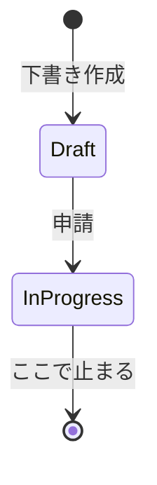
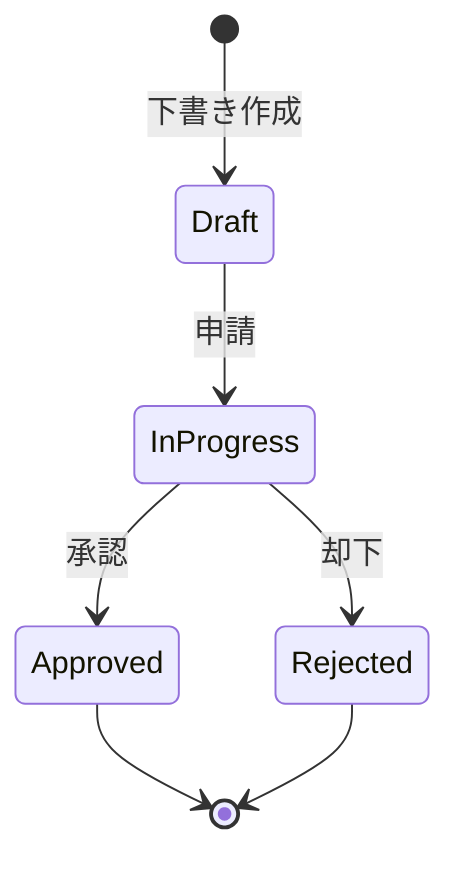
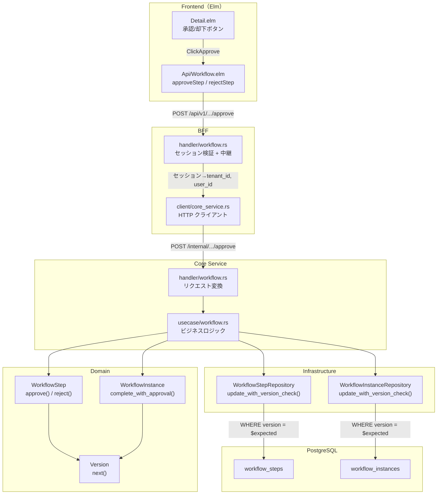
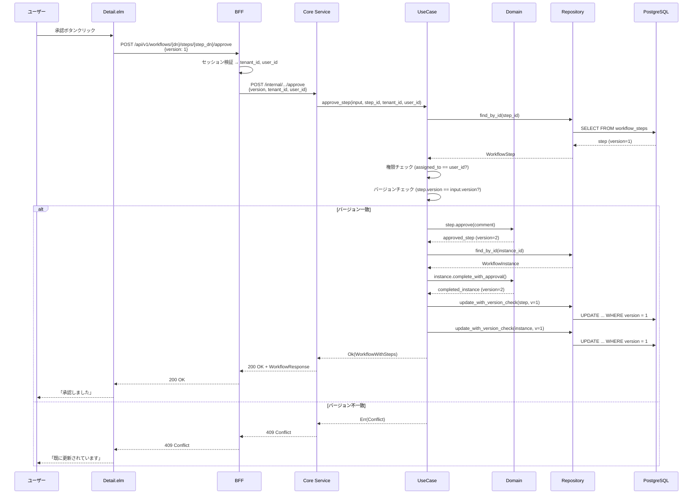
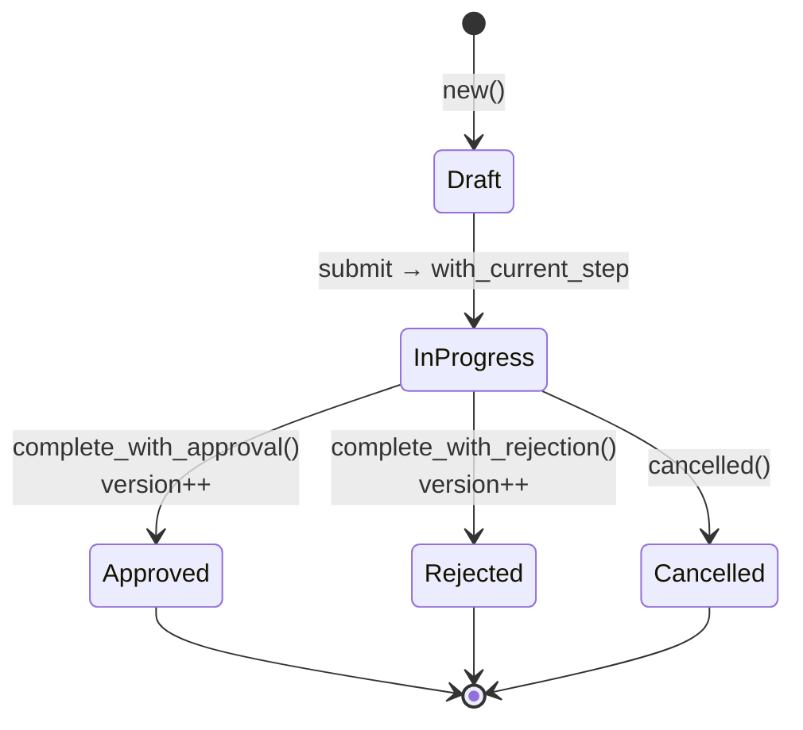
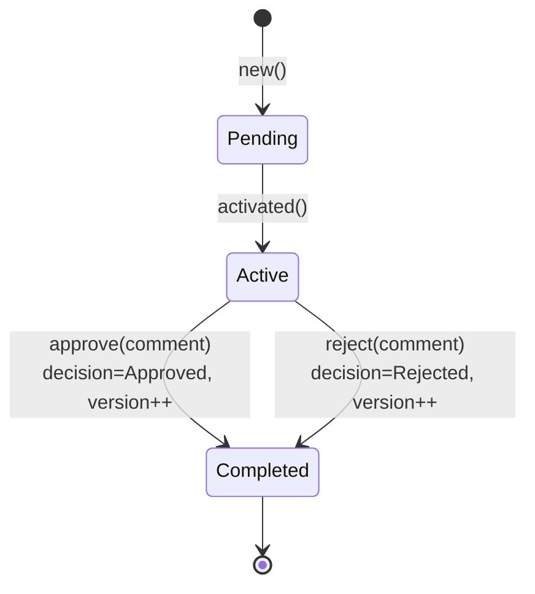
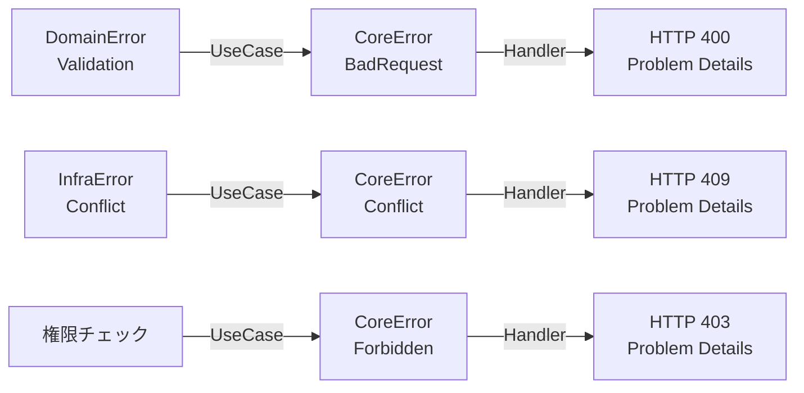

# ワークフロー承認却下機能 - 機能解説

対応 PR: #141
対応 Issue: #36

## 概要

ワークフローの承認者が、割り当てられたステップを承認または却下できる機能。楽観的ロックによる並行更新の競合検出を備え、フロントエンドからバックエンドまで全レイヤーを貫くフルスタック実装。

MVP では1段階承認（承認ステップが1つ）のため、ステップの承認/却下がワークフロー全体の承認/却下に直結する。

## 背景

### ワークフロー申請機能の前提

[ワークフロー申請機能](../PR114_ワークフロー申請機能/01_ワークフロー申請_機能解説.md)で、ユーザーがワークフローを下書き・申請する機能が実装済み。申請時に承認者を指定し、ステップが Active 状態で承認待ちとなる。

本機能は、その承認待ちステップに対する「承認する」「却下する」のアクションを実装する。

### 並行更新の課題

承認フローでは、複数のユーザーやタブからの同時操作が発生しうる。

| シナリオ | 問題 |
|---------|------|
| 同じステップを2つのタブで開き、それぞれ承認/却下する | 後から送信された操作が前の操作を上書きする |
| 承認者 A が承認中に、管理者がワークフローをキャンセルする | 承認結果がキャンセル済みワークフローに適用される |

これらの問題を防ぐために、楽観的ロックを導入する。

### 設計書との対応

| 項目 | 内容 |
|------|------|
| 詳細設計書 | [`docs/03_詳細設計書/11_ワークフロー承認却下機能設計.md`](../../03_詳細設計書/11_ワークフロー承認却下機能設計.md) |
| OpenAPI 仕様書 | [`openapi/openapi.yaml`](../../../openapi/openapi.yaml) |

## 用語・概念

| 用語 | 説明 | 関連コード |
|------|------|-----------|
| 楽観的ロック（Optimistic Locking） | データ読み取り時のバージョン番号を更新時に照合し、変更の競合を検出する方式 | `Version` |
| バージョン | エンティティの更新回数を表す値。初期値 1、更新のたびにインクリメント | `Version` |
| ステップ決定（StepDecision） | ステップの処理結果。Approved（承認）、Rejected（却下）、RequestChanges（差し戻し） | `StepDecision` |
| 早期フェイル（Early Fail） | DB に問い合わせる前にメモリ上でバージョンを比較し、不一致なら即座にエラーを返すパターン | `approve_step` L237 |
| TOCTOU | Time-of-check to Time-of-use。チェックと使用の間にデータが変わる競合問題 | DB レベルの `WHERE version = $expected` |

## フロー

### Before（変更前）

申請機能のみ実装済み。ワークフローのライフサイクルは以下の状態で終わる。



申請後は承認待ちのまま、承認者がアクションを取る手段がなかった。

### After（変更後）

承認/却下アクションが追加され、ワークフローのライフサイクルが完結する。



#### 改善点

- 承認者がステップを承認/却下できるようになった
- 楽観的ロックで並行更新の競合を検出できる
- フロントエンドで承認/却下ボタンと結果のフィードバックを提供

## アーキテクチャ

承認/却下リクエストが全レイヤーを通過するフロー:



## データフロー

### フロー 1: 承認



#### 処理ステップ

| # | レイヤー | ファイル | 処理内容 |
|---|---------|---------|---------|
| 1 | BFF | `bff/handler/workflow/command.rs:161` | セッションから tenant_id, user_id を抽出 |
| 2 | Core Handler | `core-service/handler/workflow/command.rs:122` | i32 → Version 変換、ユースケース呼び出し |
| 3 | UseCase | `core-service/usecase/workflow/command.rs:214` | ステップ取得 → 権限/バージョンチェック |
| 4 | Domain | `domain/src/workflow/step.rs:326` | `step.approve()` で Active → Completed |
| 5 | Domain | `domain/src/workflow/instance.rs:340` | `instance.complete_with_approval()` で InProgress → Approved |
| 6 | Infra | `infra/src/repository/workflow_step_repository.rs:125` | `WHERE version = $expected` で DB 更新 |

### フロー 2: 却下

承認フローと同一構造。以下のメソッドが異なる:

| 承認 | 却下 |
|------|------|
| `step.approve()` | `step.reject()` |
| `instance.complete_with_approval()` | `instance.complete_with_rejection()` |
| StepDecision::Approved | StepDecision::Rejected |
| Approved 状態 | Rejected 状態 |

## 状態遷移

### WorkflowInstance



### WorkflowStep



### version の流れ

```
DB (version=1)
  → Repository (SELECT)
    → Domain (メモリ上)
      → UseCase (検証: input.version == step.version?)
        → Domain (version.next() → version=2)
          → Repository (UPDATE WHERE version=1)
            → DB (version=2)
```

## エラーハンドリング

| エラー | 発生箇所 | HTTP Status | ユーザーへの表示 |
|--------|---------|-------------|-----------------|
| 担当者以外の操作 | UseCase: 権限チェック | 403 Forbidden | 「この操作を実行する権限がありません」 |
| バージョン不一致 | UseCase: 早期フェイル or Repository: DB チェック | 409 Conflict | 「既に更新されています。再読み込みしてください」 |
| Active 以外での承認/却下 | Domain: 状態チェック | 400 Bad Request | 「このステップは承認/却下できる状態ではありません」 |
| ステップ未発見 | UseCase: find_by_id | 404 Not Found | 「ワークフローステップが見つかりません」 |

エラー変換チェーン:



## 設計判断

機能・仕組みレベルの判断を記載する。コード実装レベルの判断は[コード解説](./02_ワークフロー承認却下_コード解説.md#設計解説)を参照。

### 1. 並行更新をどう制御するか

承認フローでは同じリソースへの同時操作を制御する必要がある。

| 案 | スループット | 実装複雑度 | デッドロック |
|----|------------|-----------|------------|
| **楽観的ロック（採用）** | 高（ロック不要） | 低（version カラム追加のみ） | なし |
| 悲観的ロック | 低（排他ロック） | 中（ロック管理が必要） | リスクあり |
| MVCC のみ（DB 依存） | 高 | 低 | なし |

採用理由: 承認フローは「読み取りが多く書き込みが少ない」パターン。楽観的ロックはロックの取得・解放が不要で、実装がシンプル。

### 2. バージョン検証をどこで行うか

楽観的ロックのバージョン一致チェックの責務配置。

| 案 | メリット | デメリット |
|----|---------|----------|
| **ユースケース層 + DB 層の二重チェック（採用）** | 早期フェイル + TOCTOU 対策 | チェックが2箇所 |
| DB 層のみ（WHERE version = N） | シンプル | DB I/O が無駄に発生 |
| ユースケース層のみ | DB I/O 節約 | TOCTOU に脆弱 |

採用理由: ユースケース層で早期フェイルし、DB 層で TOCTOU を防ぐ二段構え。「楽観的ロックはビジネスルール」という位置づけから、ユースケース層が主責任を持つ。

### 3. version をどこに所有させるか

version フィールドの所有権をどのレイヤーに置くか。

| 案 | 一貫性 | 責務の明確さ |
|----|-------|------------|
| **ドメインエンティティ（採用）** | 状態遷移と一体で管理 | エンティティの不変条件の一部 |
| リポジトリ層 | DB 層で自動管理 | ドメインから見えない |
| ユースケース層 | 柔軟 | 管理が分散 |

採用理由: version はエンティティの不変条件の一部。状態遷移メソッド（approve, reject）の中で `version.next()` を呼ぶことで、「状態変更 = バージョン更新」が常にセットで実行される。

### 4. ステップとインスタンスの保存にトランザクションを使うか

承認時、ステップとインスタンスの両方を更新する必要がある。

| 案 | 整合性 | 実装コスト |
|----|-------|----------|
| **トランザクションなし（MVP で採用）** | 部分更新のリスク | 低 |
| トランザクションで包む | 完全 | トランザクション管理の抽象化が必要 |

採用理由: MVP では単一テナント・単一ユーザーで競合リスクが低い。楽観的ロックで競合を検出できるため、部分更新が発生しても検知可能。トランザクション管理の抽象化は別 Issue で対応予定。

### 5. エラーレスポンスの形式

API エラーの表現方式。

| 案 | 標準化 | 拡張性 |
|----|-------|--------|
| **RFC 9457 Problem Details（採用）** | IETF 標準 | type フィールドでエラー種別を識別可能 |
| 独自形式 | なし | 自由度が高い |
| HTTP ステータスコードのみ | 最小 | 詳細情報なし |

採用理由: RFC 9457 は HTTP API エラーの標準形式。`type` フィールドでエラーの種別を機械的に判別でき、`detail` フィールドで人間向けの説明を提供できる。

## 関連ドキュメント

- [コード解説](./02_ワークフロー承認却下_コード解説.md)
- [ワークフロー申請機能 - 機能解説](../PR114_ワークフロー申請機能/01_ワークフロー申請_機能解説.md)
- [詳細設計書: ワークフロー承認却下機能設計](../../03_詳細設計書/11_ワークフロー承認却下機能設計.md)
