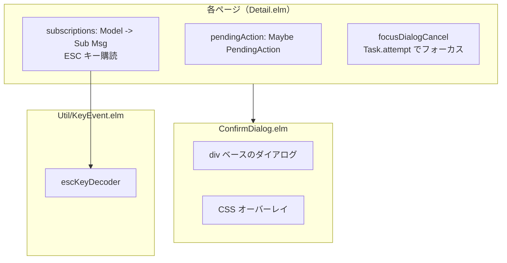
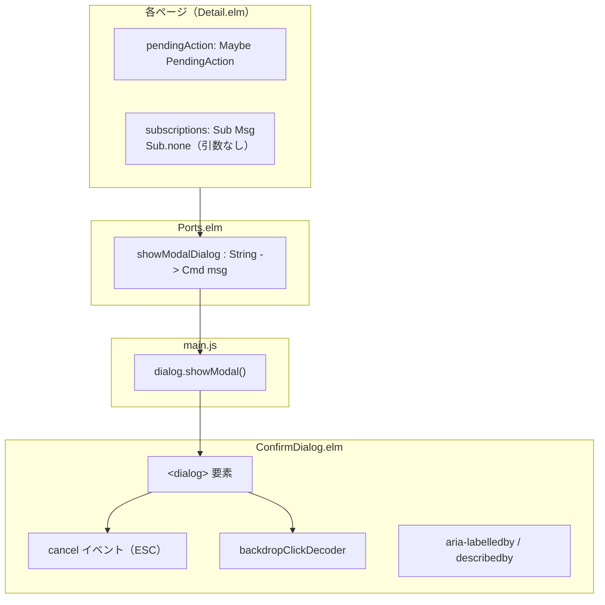
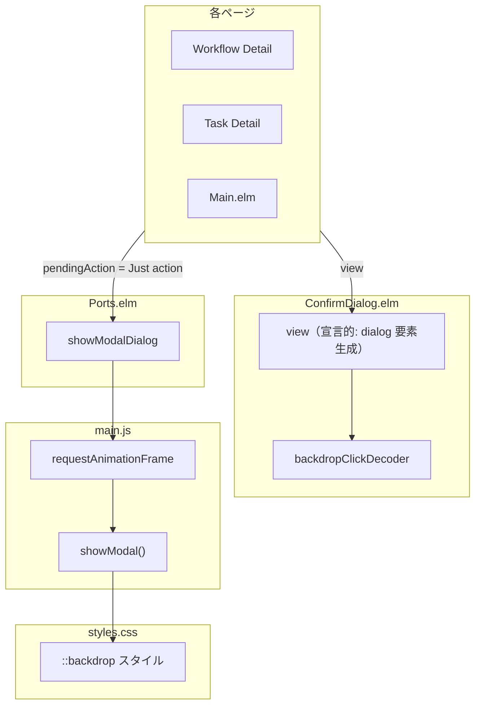
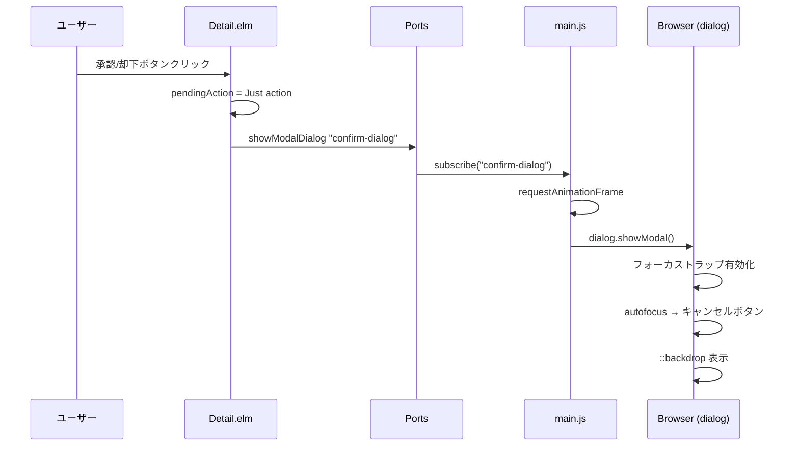
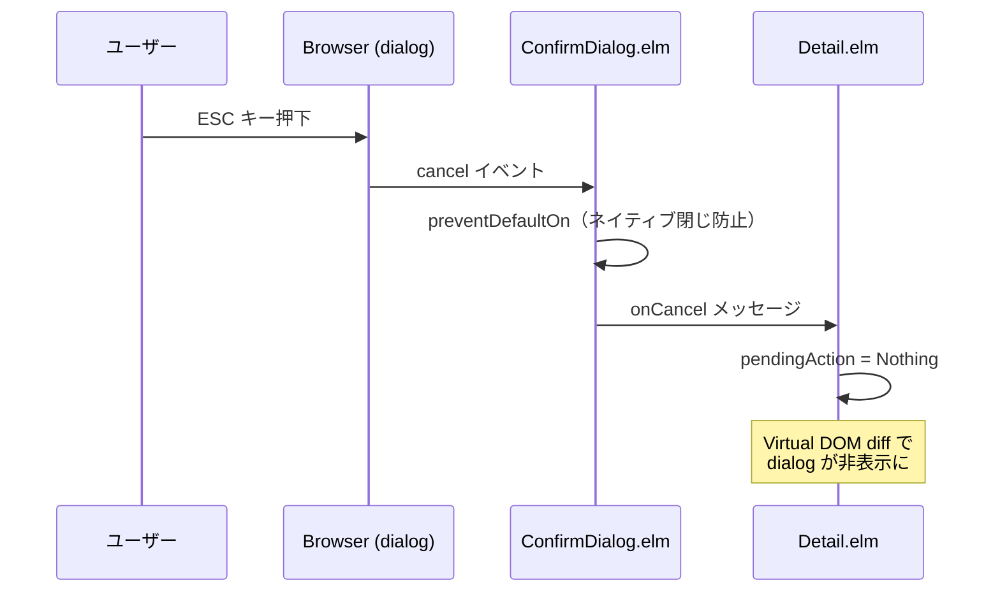

# ConfirmDialog アクセシビリティ改善 - 機能解説

対応 PR: #278
対応 Issue: #265

## 概要

ConfirmDialog コンポーネントを `div` ベースの自前実装から HTML `<dialog>` 要素 + `showModal()` に移行し、WAI-ARIA Dialog (Modal) パターンに準拠するアクセシビリティを実現した。これにより、フォーカストラップ、ESC キー処理、`::backdrop` 表示がブラウザネイティブで提供され、自前のキーイベント処理が不要になった。

## 背景

### 変更前の課題

ConfirmDialog は `div` ベースで実装されていた。アクセシビリティ上の問題があった:

- フォーカストラップがない（Tab キーでダイアログ外の要素にフォーカスが移動する）
- ESC キー処理を `Browser.Events.onKeyDown` で各ページに個別実装していた
- `aria-labelledby` / `aria-describedby` がない（スクリーンリーダー対応不足）
- バックドロップは CSS オーバーレイで、クリック検出が不完全

### `<dialog>` 要素の利点

HTML `<dialog>` 要素の `showModal()` メソッドは以下をブラウザネイティブで提供する:

| 機能 | `div` ベース（Before） | `<dialog>` + `showModal()`（After） |
|------|----------------------|-------------------------------------|
| フォーカストラップ | なし | `showModal()` が Tab/Shift+Tab を閉じ込め |
| ESC キー | 各ページで `subscriptions` 実装 | `cancel` イベントで一元処理 |
| ARIA | なし | `aria-labelledby` / `aria-describedby` |
| `::backdrop` | CSS オーバーレイ | ブラウザネイティブ疑似要素 |
| 初期フォーカス | `Task.attempt` で手動フォーカス | `autofocus` 属性で `showModal()` が自動設定 |

### 設計判断の記録

ADR-031: [ConfirmDialog の dialog 要素への移行](../../05_ADR/031_ConfirmDialogのdialog要素への移行.md)

## 用語・概念

| 用語 | 説明 | 関連コード |
|------|------|-----------:|
| `<dialog>` 要素 | HTML のネイティブダイアログ要素。`showModal()` でモーダル表示 | `ConfirmDialog.elm` |
| `showModal()` | `<dialog>` をモーダルとして表示する命令的 API。フォーカストラップと `::backdrop` を有効化 | `main.js` |
| `cancel` イベント | ESC キー押下時に `<dialog>` が発火するイベント | `ConfirmDialog.elm` |
| `::backdrop` | `showModal()` で表示されるネイティブの背景オーバーレイ疑似要素 | `styles.css` |
| `backdropClickDecoder` | `pointer-events` トリックを使ったバックドロップクリック検出 | `ConfirmDialog.elm` |
| PendingAction パターン | 確認待ちの操作を `Maybe` で保持し、ConfirmDialog で確認後に実行するパターン | 各 Detail.elm |
| WAI-ARIA Dialog パターン | W3C の ARIA Authoring Practices Guide のダイアログ仕様 | [APG](https://www.w3.org/WAI/ARIA/apg/patterns/dialog-modal/) |

## ビフォー・アフター

### Before（変更前）

- ESC キー処理を 3 箇所（Workflow Detail, Task Detail, Main）で個別実装
- `focusDialogCancel` で手動フォーカス移動
- `Util/KeyEvent.elm` モジュールが ESC デコーダを提供

### After（変更後）

#### 改善点

- フォーカストラップがブラウザネイティブで提供される
- ESC 処理が `<dialog>` の `cancel` イベントに統合され、各ページの `subscriptions` が簡素化
- ARIA 属性（`aria-labelledby`, `aria-describedby`）でスクリーンリーダー対応
- `autofocus` 属性でキャンセルボタンに自動フォーカス
- `Util/KeyEvent.elm` が不要になり削除

## アーキテクチャ

## データフロー

### フロー 1: ダイアログ表示（承認/却下ボタンクリック）

### フロー 2: ESC キーでキャンセル

#### 処理ステップ

| # | レイヤー | ファイル:関数 | 処理内容 |
|---|---------|-------------|---------:|
| 1 | ページ | `Detail.elm:update` | `pendingAction = Just action` + `Ports.showModalDialog` |
| 2 | ポート | `Ports.elm:showModalDialog` | String（dialogId）を JS に送信 |
| 3 | JS | `main.js:subscribe` | `requestAnimationFrame` → `dialog.showModal()` |
| 4 | ブラウザ | `<dialog>` | フォーカストラップ、`::backdrop`、`autofocus` |
| 5 | コンポーネント | `ConfirmDialog.elm:view` | ARIA 属性、`cancel` イベント、backdrop click |
| 6 | ページ | `Detail.elm:update` | 確認 → アクション実行 / キャンセル → `pendingAction = Nothing` |

## 設計判断

機能・仕組みレベルの判断を記載する。コード実装レベルの判断は[コード解説](./02_ConfirmDialogアクセシビリティ_コード解説.md#設計解説)を参照。

### 1. ダイアログ実装方式: `<dialog>` + `showModal()` vs `div` + 自前実装

確認ダイアログのアクセシビリティをどう実現するか。

| 案 | フォーカストラップ | ESC 処理 | ARIA | 実装コスト |
|----|-----------------|---------|------|-----------|
| **`<dialog>` + `showModal()`（採用）** | ブラウザネイティブ | `cancel` イベント | 標準準拠 | 低い（Port 1 つ） |
| `div` + 自前実装 | JavaScript で実装必要 | 各ページで個別 | 手動追加 | 高い |
| `div` + ライブラリ（elm-aria） | ライブラリ依存 | ライブラリ依存 | ライブラリ提供 | 中（依存追加） |

**採用理由**: `<dialog>` 要素は主要ブラウザでサポート済みで、`showModal()` がフォーカストラップ・ESC・`::backdrop` をネイティブ提供する。自前実装を大幅に削減でき、WAI-ARIA 準拠が容易。Elm の宣言的 Virtual DOM と命令的 `showModal()` の橋渡しは Port で解決。

### 2. Elm と命令的 API の橋渡し: Port vs Custom Element

`showModal()` をどう呼び出すか。

| 案 | 実装の自然さ | 複雑さ | 再利用性 |
|----|------------|--------|---------|
| **Port（採用）** | 高い（既存パターン） | 低い（subscribe 1 つ） | 他のダイアログにも使える |
| Custom Element | 中（attribute 変更で発火） | 高い（CE 定義が必要） | 高い |

**採用理由**: プロジェクトに既に Port パターンが確立されている。`showModalDialog : String -> Cmd msg` という汎用的な Port を 1 つ追加するだけで、将来他のダイアログにも再利用可能。

### 3. バックドロップクリック: `pointer-events` トリック vs `stopPropagation`

`::backdrop` 疑似要素は DOM イベントをバインドできない。クリック検出をどう行うか。

| 案 | コンポーネント API | 検出精度 |
|----|-----------------|---------|
| **`pointer-events` トリック（採用）** | シンプル（`onCancel` のみ） | 高い（`target.nodeName` で判定） |
| `stopPropagation` | 複雑（no-op Msg が必要） | 高い |

**採用理由**: `pointer-events-none` / `pointer-events-auto` の組み合わせにより、ダイアログボックス外のクリックが `<dialog>` 要素に到達する。`target.nodeName === "DIALOG"` で判定することで、コンポーネント API を `onCancel` のみに保てる。

## 関連ドキュメント

- [コード解説](./02_ConfirmDialogアクセシビリティ_コード解説.md)
- ADR-031: [ConfirmDialog の dialog 要素への移行](../../05_ADR/031_ConfirmDialogのdialog要素への移行.md)
- [WAI-ARIA Dialog (Modal) Pattern](https://www.w3.org/WAI/ARIA/apg/patterns/dialog-modal/)
- [ナレッジベース: Elm ポート](../../06_ナレッジベース/elm/Elmポート.md)
