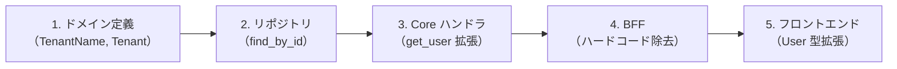
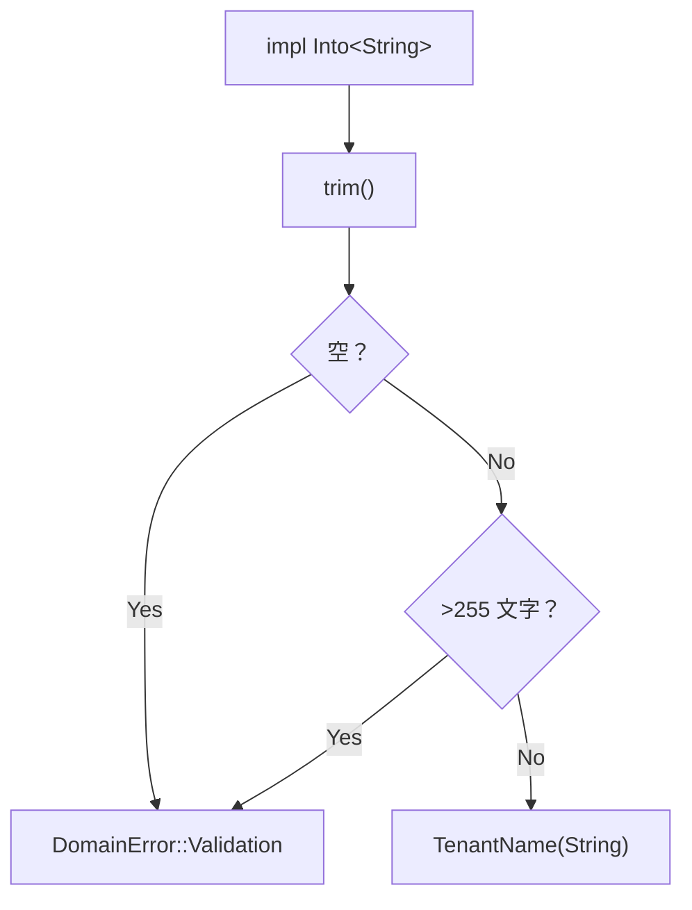
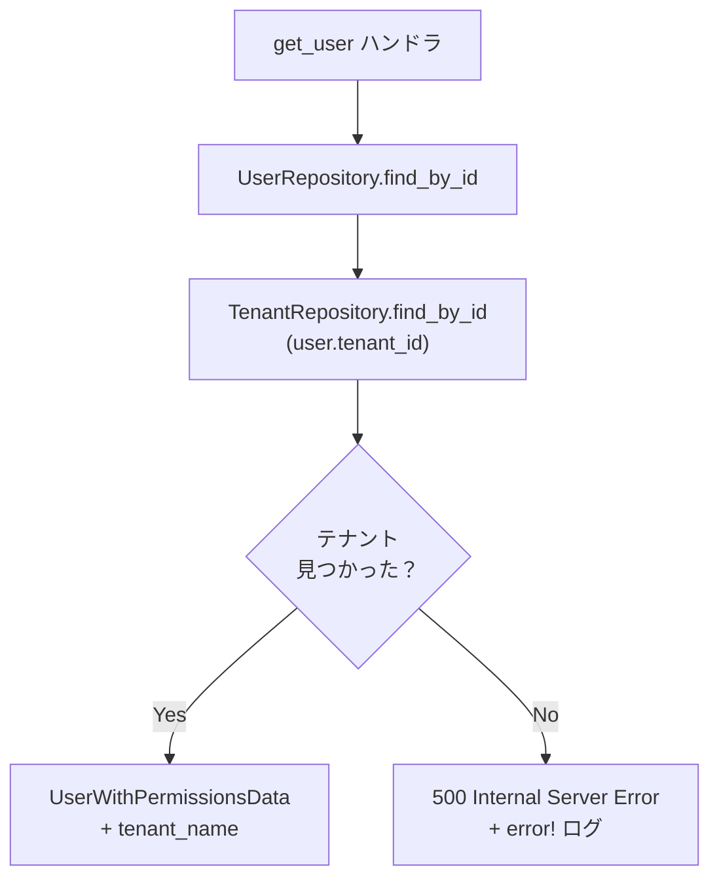
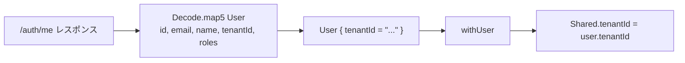

# テナント情報取得 - コード解説

対応 PR: #310
対応 Issue: #306

## 主要な型・関数

| 型/関数 | ファイル | 責務 |
|--------|---------|------|
| `TenantName` | [`tenant.rs`](../../../backend/crates/domain/src/tenant.rs) | テナント名の値オブジェクト（空文字禁止、255 文字以内） |
| `Tenant` | [`tenant.rs`](../../../backend/crates/domain/src/tenant.rs) | テナントエンティティ（id + name） |
| `TenantRepository` | [`tenant_repository.rs`](../../../backend/crates/infra/src/repository/tenant_repository.rs) | `find_by_id` でテナントを取得するトレイト |
| `PostgresTenantRepository` | [`tenant_repository.rs`](../../../backend/crates/infra/src/repository/tenant_repository.rs) | PostgreSQL 実装 |
| `UserState<R, T>` | [`handler/auth.rs`](../../../backend/apps/core-service/src/handler/auth/mod.rs) | UserRepository + TenantRepository を保持する axum 共有 State |
| `UserWithPermissionsData` | [`handler/auth.rs`](../../../backend/apps/core-service/src/handler/auth/mod.rs) | Core Service → BFF のレスポンス DTO（`tenant_name` 追加） |
| `MeResponseData` | [`handler/auth.rs`](../../../backend/apps/bff/src/handler/auth/mod.rs) | BFF → フロントエンドのレスポンス DTO |
| `User` | [`Shared.elm`](../../../frontend/src/Shared.elm) | Elm のユーザー型（`tenantId` フィールド追加） |
| `userDecoder` | [`Api/Auth.elm`](../../../frontend/src/Api/Auth.elm) | `map5` に拡張した JSON デコーダー |

### 型の関係

```mermaid
classDiagram
    class TenantName {
        -String value
        +new(value) Result~TenantName, DomainError~
        +as_str() &str
    }
    class Tenant {
        -TenantId id
        -TenantName name
        +from_db(id, name) Tenant
        +id() &TenantId
        +name() &TenantName
    }
    class TenantRepository {
        <<trait>>
        +find_by_id(id) Result~Option~Tenant~~
    }
    class UserState~R_T~ {
        +user_repository: R
        +tenant_repository: T
    }

    Tenant --> TenantName : "name フィールド"
    Tenant --> TenantId : "id フィールド"
    TenantRepository ..> Tenant : "返却"
    UserState --> TenantRepository : "T: TenantRepository"
```

## コードフロー

コードをライフサイクル順に追う。各ステップの構造を図で示した後、対応するコードを解説する。



### 1. ドメイン定義（TenantName 値オブジェクト + Tenant エンティティ）

`UserName` と同じ Newtype パターンでテナント名を定義する。



```rust
// backend/crates/domain/src/tenant.rs
pub struct TenantName(String);

impl TenantName {
    pub fn new(value: impl Into<String>) -> Result<Self, DomainError> {
        let value = value.into().trim().to_string();    // ① トリミング

        if value.is_empty() {                            // ② 空チェック
            return Err(DomainError::Validation("テナント名は必須です".to_string()));
        }

        if value.chars().count() > 255 {                 // ③ 長さチェック
            return Err(DomainError::Validation(
                "テナント名は 255 文字以内である必要があります".to_string(),
            ));
        }

        Ok(Self(value))
    }
}

pub struct Tenant {
    id:   TenantId,
    name: TenantName,
}

impl Tenant {
    pub fn from_db(id: TenantId, name: TenantName) -> Self {  // ④ DB 復元用
        Self { id, name }
    }
}
```

注目ポイント:

- ① `UserName` と同じパターン。入力値をトリミングしてから検証
- ② 空文字列は不正な状態として拒否
- ③ `chars().count()` でマルチバイト文字も正しくカウント
- ④ `from_db` はバリデーション済みの DB データを復元するためのコンストラクタ

### 2. リポジトリ（TenantRepository）

`UserRepository` と同じパターンでトレイト + PostgreSQL 実装を定義する。

```rust
// backend/crates/infra/src/repository/tenant_repository.rs
#[async_trait]
pub trait TenantRepository: Send + Sync {
    async fn find_by_id(&self, id: &TenantId) -> Result<Option<Tenant>, InfraError>;
}

#[async_trait]
impl TenantRepository for PostgresTenantRepository {
    async fn find_by_id(&self, id: &TenantId) -> Result<Option<Tenant>, InfraError> {
        let row = sqlx::query!(
            r#"SELECT id, name FROM tenants WHERE id = $1"#,  // ①
            id.as_uuid()
        )
        .fetch_optional(&self.pool)                             // ②
        .await?;

        let Some(row) = row else {
            return Ok(None);                                    // ③
        };

        let tenant = Tenant::from_db(
            TenantId::from_uuid(row.id),
            TenantName::new(&row.name)                          // ④
                .map_err(|e| InfraError::Unexpected(e.to_string()))?,
        );

        Ok(Some(tenant))
    }
}
```

注目ポイント:

- ① `SELECT id, name` のみ。必要最小限のカラムを取得
- ② `fetch_optional` で 0 or 1 行を取得。見つからなければ `None`
- ③ テナントが存在しない場合は `Ok(None)` を返す（呼び出し側で判断）
- ④ DB から取得した値で `TenantName::new` を呼び出し。バリデーションエラーは `InfraError::Unexpected` にマッピング

### 3. Core Service ハンドラ（get_user 拡張）

`get_user` ハンドラで TenantRepository からテナント名を取得し、レスポンスに含める。



```rust
// backend/apps/core-service/src/handler/auth.rs

pub struct UserState<R, T>                               // ①
where
    R: UserRepository,
    T: TenantRepository,
{
    pub user_repository:   R,
    pub tenant_repository: T,
}

// get_user ハンドラ内
let tenant_name = match state.tenant_repository
    .find_by_id(user.tenant_id()).await
{
    Ok(Some(tenant)) => tenant.name().to_string(),       // ② 正常系
    Ok(None) => {
        tracing::error!(                                  // ③ データ整合性エラー
            "テナントが見つかりません: user_id={}, tenant_id={}",
            user.id(), user.tenant_id()
        );
        return (
            StatusCode::INTERNAL_SERVER_ERROR,
            Json(ErrorResponse::internal_error()),
        ).into_response();
    }
    Err(e) => { /* InfraError → 500 */ }
};
```

注目ポイント:

- ① `UserState` がジェネリクス `<R, T>` で UserRepository と TenantRepository を保持。axum の State 共有パターンに従う
- ② テナントが見つかれば名前を取得
- ③ ユーザーは存在するがテナントが見つからない = データの整合性が壊れている状態。`error!` ログで検知可能にし、500 を返す

### 4. BFF（ハードコード除去）

Core Service から受け取った `tenant_name` を使用するよう変更。

```rust
// backend/apps/bff/src/handler/auth.rs

// Before（ハードコード）
MeResponseData {
    tenant_name: "Development Tenant".to_string(),  // ← 固定値
    // ...
}

// After（動的値）
MeResponseData {
    tenant_name: user_data.tenant_name,              // ← Core Service から取得
    // ...
}
```

### 5. フロントエンド（User 型拡張）

`User` 型に `tenantId` フィールドを追加し、デコーダーを更新する。



```elm
-- frontend/src/Shared.elm

type alias User =
    { id : String
    , email : String
    , name : String
    , tenantId : String          -- ① 新規追加
    , roles : List String
    }

withUser : User -> Shared -> Shared
withUser user shared =
    { shared
        | user = Just user
        , tenantId = user.tenantId  -- ② extractTenantId を置換
    }
```

```elm
-- frontend/src/Api/Auth.elm

userDecoder : Decoder User
userDecoder =
    Decode.field "data"
        (Decode.map5 User                   -- ③ map4 → map5 に拡張
            (Decode.field "id" Decode.string)
            (Decode.field "email" Decode.string)
            (Decode.field "name" Decode.string)
            (Decode.field "tenant_id" Decode.string)  -- ④ 新規フィールド
            (Decode.field "roles" (Decode.list Decode.string))
        )
```

注目ポイント:

- ① `User` 型に `tenantId` を追加。Elm の `type alias` はフィールド順にコンストラクタ引数が決まる
- ② ハードコードの `extractTenantId` 関数を削除し、`user.tenantId` で動的に設定
- ③ `Decode.map4` → `Decode.map5` にフィールド数を増加
- ④ JSON フィールド `tenant_id` を Elm の `tenantId` にデコード

## テスト

| テスト | 検証対象のステップ | 検証内容 |
|-------|------------------|---------:|
| `test_テナント名は正常な名前を受け入れる` | 1 | TenantName のバリデーション正常系 |
| `test_テナント名は空文字列を拒否する` | 1 | 空文字列バリデーション |
| `test_テナント名は空白のみの文字列を拒否する` | 1 | トリミング後の空チェック |
| `test_テナント名は前後の空白をトリミングする` | 1 | トリミング動作 |
| `test_テナント名は255文字を超えると拒否する` | 1 | 長さ上限バリデーション |
| `test_テナント名は255文字以内を受け入れる` | 1 | 境界値テスト |
| `test_from_dbでテナントを復元できる` | 1 | Tenant エンティティの復元 |
| `test_idでテナントを取得できる` | 2 | TenantRepository 正常系 |
| `test_存在しないidの場合noneを返す` | 2 | TenantRepository 異常系 |

### 実行方法

```bash
# ドメインテスト
cd backend && cargo test -p ringiflow-domain tenant

# リポジトリ統合テスト（DB 接続が必要）
just test-rust-integration
```

## 設計解説

コード実装レベルの判断を記載する。機能・仕組みレベルの判断は[機能解説](./01_テナント情報取得_機能解説.md#設計判断)を参照。

### 1. UserState へのジェネリクス型パラメータ追加

場所: `backend/apps/core-service/src/handler/auth.rs`

```rust
pub struct UserState<R, T>
where
    R: UserRepository,
    T: TenantRepository,
{
    pub user_repository:   R,
    pub tenant_repository: T,
}
```

なぜこの実装か:

axum の共有 State は Router 単位で設定される。`UserState` を使う全ハンドラ（`list_users`、`get_user_by_email`、`get_user`）に `T: TenantRepository` が波及するが、State が共有されるため避けられない。

代替案:

| 案 | メリット | デメリット | 判断 |
|----|---------|-----------|------|
| UserState にジェネリクス追加（採用） | 型安全、既存パターンと一貫 | 全ハンドラに型パラメータが波及 | 採用 |
| `get_user` だけ別の State | 影響範囲が狭い | ルーター構築が複雑化、パターン不一致 | 見送り |
| `Option<Box<dyn TenantRepository>>` | ジェネリクス不要 | 型安全性が低下、unwrap が必要 | 見送り |

### 2. テナント未発見時の 500 エラー

場所: `backend/apps/core-service/src/handler/auth.rs` の `get_user` ハンドラ

```rust
Ok(None) => {
    tracing::error!(
        "テナントが見つかりません: user_id={}, tenant_id={}",
        user.id(), user.tenant_id()
    );
    return (StatusCode::INTERNAL_SERVER_ERROR, ...).into_response();
}
```

なぜこの実装か:

ユーザーは存在するがテナントが見つからないのは、外部キー制約で防がれるべきデータ整合性の破綻。ユーザー起因のエラーではないため 400 系ではなく 500 を返す。`error!` ログでモニタリング可能にする。

代替案:

| 案 | メリット | デメリット | 判断 |
|----|---------|-----------|------|
| 500 + error! ログ（採用） | データ整合性の問題を正確に表現 | UX が悪い（500 表示） | 採用 |
| フォールバック文字列 | UX が良い | 問題を隠蔽 | 見送り |
| 404 Not Found | HTTP 標準的 | ユーザーは存在するので不正確 | 見送り |

### 3. `extractTenantId` 関数の削除

場所: `frontend/src/Shared.elm`

```elm
-- Before
withUser user shared =
    { shared | user = Just user, tenantId = extractTenantId }

-- After
withUser user shared =
    { shared | user = Just user, tenantId = user.tenantId }
```

なぜこの実装か:

`extractTenantId` は固定値を返すヘルパー関数で、`TODO(#306)` コメント付きだった。`User` 型に `tenantId` が追加されたため、関数自体が不要になり削除。`ReviewConfig.elm` の古い抑制（存在しない `Session.elm` への参照）も同時に削除。

### 4. Elm の `Decode.map5` への拡張

場所: `frontend/src/Api/Auth.elm`

```elm
-- Before: map4
(Decode.map4 User
    (Decode.field "id" Decode.string)
    (Decode.field "email" Decode.string)
    (Decode.field "name" Decode.string)
    (Decode.field "roles" (Decode.list Decode.string))
)

-- After: map5（tenantId を追加）
(Decode.map5 User
    (Decode.field "id" Decode.string)
    (Decode.field "email" Decode.string)
    (Decode.field "name" Decode.string)
    (Decode.field "tenant_id" Decode.string)       -- 追加
    (Decode.field "roles" (Decode.list Decode.string))
)
```

なぜこの実装か:

Elm の `type alias` のコンストラクタはフィールド定義順で引数が決まる。`User` 型に `tenantId` を `name` の次に定義したため、`map5` の引数順もこれに合わせる必要がある。`Decode.map5` は標準ライブラリで提供されており、5 フィールドまでは `Pipeline` パターン不要。

## 関連ドキュメント

- [機能解説](./01_テナント情報取得_機能解説.md)
- 設計書: [07_認証機能設計.md](../../03_詳細設計書/07_認証機能設計.md)
- 計画: [306_tenant-info-retrieval.md](../../../prompts/plans/306_tenant-info-retrieval.md)
