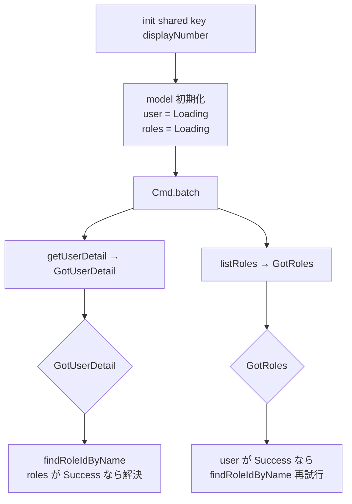
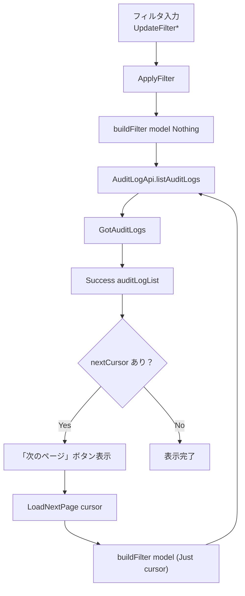

# フロントエンド管理画面 コード解説

対応 PR: #426
対応 Issue: #403 (Epic), #431 (Story)

## 主要な型・関数

### データ層

| 型/関数 | ファイル | 責務 |
|--------|---------|------|
| `AdminUserItem` | `frontend/src/Data/AdminUser.elm` | ユーザー一覧の項目型 |
| `UserDetail` | `frontend/src/Data/AdminUser.elm` | ユーザー詳細型（permissions 付き） |
| `RoleItem` | `frontend/src/Data/Role.elm` | ロール一覧の項目型 |
| `RoleDetail` | `frontend/src/Data/Role.elm` | ロール詳細型（created_at, updated_at 付き） |
| `AuditLogItem` | `frontend/src/Data/AuditLog.elm` | 監査ログの項目型 |
| `AuditLogList` | `frontend/src/Data/AuditLog.elm` | 監査ログページ（data + nextCursor） |

### API 層

| 型/関数 | ファイル | 責務 |
|--------|---------|------|
| `Api.AdminUser` | `frontend/src/Api/AdminUser.elm` | ユーザー API クライアント（5 関数） |
| `Api.Role` | `frontend/src/Api/Role.elm` | ロール API クライアント（5 関数） |
| `Api.AuditLog` | `frontend/src/Api/AuditLog.elm` | 監査ログ API クライアント |
| `Api.patch` | `frontend/src/Api.elm` | PATCH リクエストヘルパー |
| `Api.deleteNoContent` | `frontend/src/Api.elm` | 204 No Content を扱う DELETE |

### ページ層

| 型/関数 | ファイル | 責務 |
|--------|---------|------|
| `Page.User.Edit` | `frontend/src/Page/User/Edit.elm` | ユーザー編集（並行取得 + dirty tracking） |
| `Page.Role.New` | `frontend/src/Page/Role/New.elm` | ロール作成（PermissionMatrix 使用） |
| `Page.Role.Edit` | `frontend/src/Page/Role/Edit.elm` | ロール編集・詳細（システムロール読み取り専用） |
| `Page.AuditLog.List` | `frontend/src/Page/AuditLog/List.elm` | 監査ログ一覧（カーソルページネーション） |

### コンポーネント層

| 型/関数 | ファイル | 責務 |
|--------|---------|------|
| `PermissionMatrix.view` | `frontend/src/Component/PermissionMatrix.elm` | 権限マトリクスコンポーネント |
| `PermissionMatrix.Config` | `frontend/src/Component/PermissionMatrix.elm:30` | コンポーネント設定レコード |

## コードフロー

### ユーザー編集画面の初期化



### 監査ログのフィルタ → 検索 → ページネーション



## コード解説

### PermissionMatrix コンポーネント

```elm
-- frontend/src/Component/PermissionMatrix.elm:30-35

type alias Config msg =
    { selectedPermissions : Set String
    , onToggle : String -> msg
    , onToggleAll : String -> msg
    , disabled : Bool
    }
```

注目ポイント:

1. `Config msg` — 型パラメータ `msg` により、親ページの Msg 型を受け取る。Elm のコンポーネントパターンの標準手法
2. `selectedPermissions : Set String` — 権限を `Set` で管理。含有チェック（`Set.member`）が O(log n)
3. `disabled : Bool` — システムロールの読み取り専用表示に対応。UI 全体を無効化

リソースとアクションの定義:

```elm
-- frontend/src/Component/PermissionMatrix.elm:40-55

resources : List ( String, String )
resources =
    [ ( "workflow", "ワークフロー" )
    , ( "task", "タスク" )
    ]

actions : List ( String, String )
actions =
    [ ( "read", "閲覧" )
    , ( "create", "作成" )
    , ( "update", "更新" )
    , ( "delete", "削除" )
    ]
```

「すべて選択」の判定:

```elm
-- frontend/src/Component/PermissionMatrix.elm:89-93

let
    allPermissions =
        List.map (\( actionKey, _ ) -> resourceKey ++ ":" ++ actionKey) actions

    allSelected =
        List.all (\p -> Set.member p config.selectedPermissions) allPermissions
```

リソース行のすべてのアクション権限が `selectedPermissions` に含まれているかを確認。`List.all` で宣言的に判定。

### 並行 API 取得のレース条件処理

```elm
-- frontend/src/Page/User/Edit.elm:103-148

GotUserDetail result ->
    case result of
        Ok userDetail ->
            let
                firstRoleId =
                    List.head userDetail.roles
                        |> Maybe.andThen (\roleName ->
                            findRoleIdByName roleName model.roles)
                        |> Maybe.withDefault ""
            in
            ( { model
                | user = Success userDetail
                , name = userDetail.name
                , selectedRoleId = firstRoleId
              }
            , Cmd.none
            )

GotRoles result ->
    case result of
        Ok roles ->
            let
                newModel = { model | roles = Success roles }
            in
            -- ユーザー詳細が先に読み込まれていた場合、ロール ID を解決する
            case model.user of
                Success userDetail ->
                    let
                        firstRoleId =
                            List.head userDetail.roles
                                |> Maybe.andThen (\roleName ->
                                    findRoleIdByName roleName (Success roles))
                                |> Maybe.withDefault ""
                    in
                    ( { newModel | selectedRoleId = firstRoleId }, Cmd.none )

                _ ->
                    ( newModel, Cmd.none )
```

注目ポイント:

1. `GotUserDetail` — ユーザー詳細到着時にロール名 → ID 解決を試行。`model.roles` がまだ `Loading` なら `""` にフォールバック
2. `GotRoles` — ロール一覧到着時に `model.user` が `Success` なら再解決。これにより、どちらが先に到着しても最終的にロール ID が設定される
3. 各ブランチは独立して安全。Elm の純粋関数的な update は副作用がないため、状態の不整合が起きない

### dirty tracking パターン

```elm
-- frontend/src/Page/User/Edit.elm:229-237

markDirty : Model -> ( Model, Cmd Msg )
markDirty model =
    if model.isDirty_ then
        ( model, Cmd.none )
    else
        ( { model | isDirty_ = True }
        , Ports.setBeforeUnloadEnabled True
        )
```

```elm
-- 保存成功時のクリア
GotUpdateResult result ->
    case result of
        Ok _ ->
            ( { model | submitting = False, isDirty_ = False }
            , Cmd.batch
                [ Ports.setBeforeUnloadEnabled False
                , Nav.pushUrl model.key
                    (Route.toString (Route.UserDetail model.displayNumber))
                ]
            )
```

注目ポイント:

1. `markDirty` は冪等。2回目以降の呼び出しでは Port を発火しない
2. `setBeforeUnloadEnabled True` → JavaScript の `window.beforeunload` イベントリスナーを有効化。ブラウザのタブ閉じ/リロード時に「変更が失われます」警告を表示
3. 保存成功時に `isDirty_ = False` にリセットし、Port も無効化してからページ遷移

### 監査ログのアコーディオン展開

```elm
-- frontend/src/Page/AuditLog/List.elm:346-375

viewAuditLogRow : Model -> AuditLogItem -> List (Html Msg)
viewAuditLogRow model logItem =
    let
        isExpanded = model.expandedId == Just logItem.id
    in
    tr [ class "...", onClick (ToggleExpand logItem.id) ]
        [ -- 通常の行内容
        ]
        :: (if isExpanded then
                [ viewExpandedDetail logItem ]
            else
                []
           )
```

注目ポイント:

1. `List (Html Msg)` を返す。展開時は `tr` が2つ（データ行 + 詳細行）、非展開時は1つ。`List.concatMap` で親の `tbody` に平坦化
2. `expandedId : Maybe String` で排他的展開。同時に1行のみ展開可能
3. `ToggleExpand` はトグル動作。同じ行をクリックすると閉じる

### カーソルページネーション

```elm
-- frontend/src/Page/AuditLog/List.elm:408-422

viewPagination : Maybe String -> Html Msg
viewPagination nextCursor =
    case nextCursor of
        Just cursor ->
            div [ class "mt-4 flex justify-center" ]
                [ Button.view
                    { variant = Button.Outline
                    , disabled = False
                    , onClick = LoadNextPage cursor
                    }
                    [ text "次のページ" ]
                ]

        Nothing ->
            text ""
```

`nextCursor` が `Nothing` なら最終ページ。ボタン自体をレンダリングしない。

## テスト

| テストファイル | 検証内容 |
|-------------|---------|
| `frontend/tests/Data/AdminUserTest.elm` | ユーザー関連デコーダーのテスト |
| `frontend/tests/Data/RoleTest.elm` | ロール関連デコーダーのテスト |
| `frontend/tests/Data/AuditLogTest.elm` | 監査ログデコーダーのテスト |
| `frontend/tests/RouteTest.elm` | 8 つの新ルートの URL パース・生成テスト |
| `frontend/tests/SharedTest.elm` | `isAdmin` のテスト |

合計 274 テストケース。デコーダーテストでは JSON → Elm 型の変換を検証し、バックエンド API との契約を保証する。

## 設計解説

### なぜ RemoteData を使うか

| 案 | メリット | デメリット | 判断 |
|----|---------|-----------|------|
| RemoteData（採用） | 4 状態が型で表現、パターンマッチで網羅性保証 | ネストが深くなりがち |  |
| `Maybe + Bool` | シンプル | 状態の組み合わせ爆発（Loading + データあり等） |  |

Elm の型システムの強みを最大限活用。`case model.user of` で 4 状態すべてを処理し、漏れがあればコンパイルエラー。

### なぜ findRoleIdByName を両方のハンドラで試行するか

並行 API 呼び出しでは到着順が保証されない。「どちらが先でも正しく動く」設計とすることで、タイミングに依存しないコードになる。

代替案として「両方揃ってから処理」もあるが、片方が先に到着した時点で表示可能なデータは表示する（プログレッシブレンダリング）方がユーザー体験が良い。

### なぜコンポーネントは Config レコードパターンか

Elm にはクラスやインターフェースがない。代わりに Config レコード型でコンポーネントの入出力を定義する:

```elm
type alias Config msg =
    { selectedPermissions : Set String
    , onToggle : String -> msg
    , onToggleAll : String -> msg
    , disabled : Bool
    }
```

このパターンにより:

1. コンポーネントは自身の状態を持たない（ステートレス）。状態は親が管理
2. `msg` 型パラメータにより、親のメッセージ型に依存しない
3. 親はコンポーネントの内部実装を知る必要がない（情報隠蔽）

## 関連ドキュメント

- [PermissionMatrix](../../../frontend/src/Component/PermissionMatrix.elm)
- [Page/User/Edit](../../../frontend/src/Page/User/Edit.elm)
- [Page/AuditLog/List](../../../frontend/src/Page/AuditLog/List.elm)
- [Route.elm](../../../frontend/src/Route.elm)
