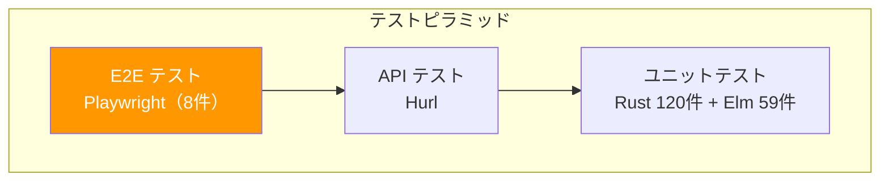
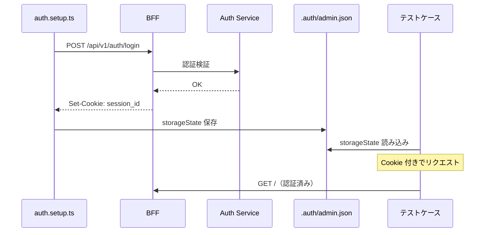
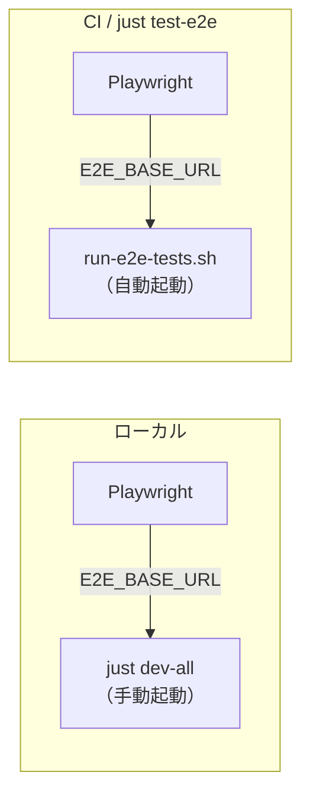
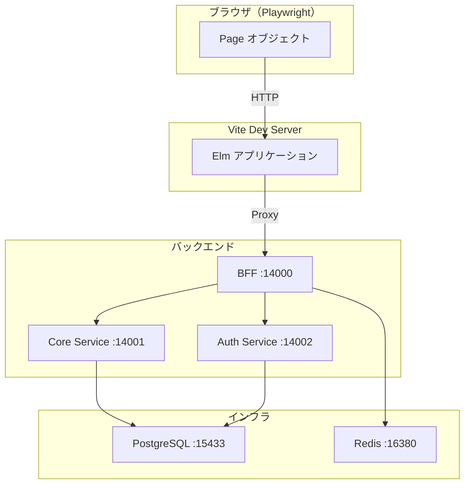
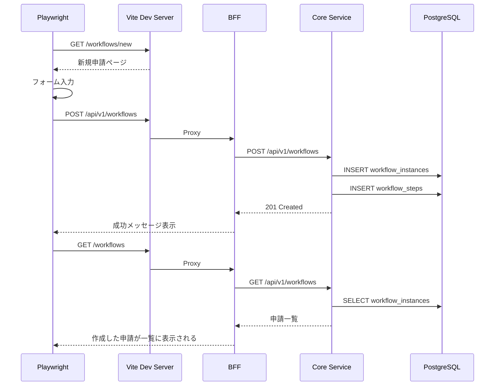
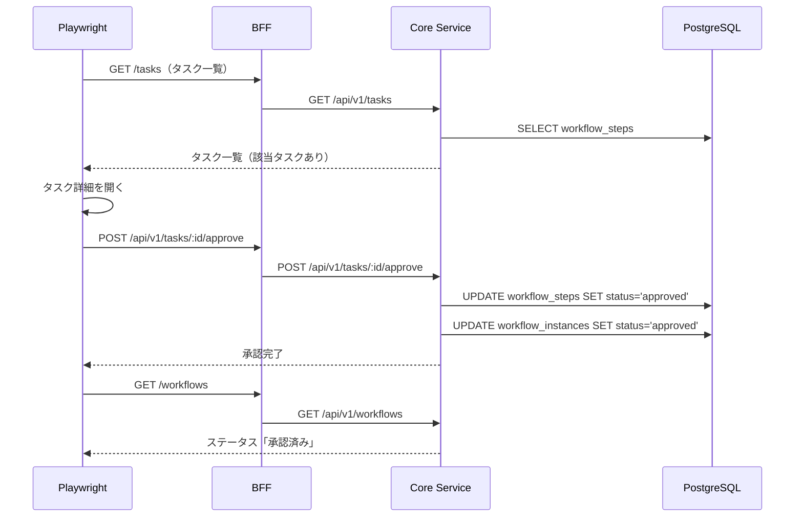

# Playwright E2E テスト - 機能解説

対応 PR: #434
対応 Issue: #128

## 概要

Playwright によるブラウザベースの E2E テストを導入した。ダッシュボード表示、申請フロー、承認フローの 3 カテゴリ 8 テストで、フロントエンド（Elm）とバックエンド（Rust）の統合を検証する。

## 背景

### テストピラミッドにおける位置づけ

プロジェクトのテスト戦略は以下の 3 層で構成される。E2E テストは最上位のレイヤーとして、ユーザー操作を通じた統合検証を担う。

### 導入の動機

既存のテスト基盤（ユニットテスト + API テスト）では、以下が検証できなかった:

- ブラウザでの画面描画と操作
- フロントエンド → BFF → Core Service → DB の端到端のデータフロー
- ユーザーから見た操作の完結性（申請 → 承認の一連のフロー）

### 技術選定

Playwright の選定は ADR-127（elm-program-test 見送り）を経て Issue #128 で決定。elm-program-test はメンテナンス状況（最終更新 2024-05、Open Issues 46件）に懸念があり見送られた。

## 用語・概念

| 用語 | 説明 | 関連コード |
|------|------|-----------|
| storageState | Playwright の認証状態永続化機構。Cookie やローカルストレージをファイルに保存し、テスト間で共有する | `tests/.auth/admin.json` |
| setup プロジェクト | テスト実行前に一度だけ実行される認証用プロジェクト。API ログインで Cookie を取得する | `auth.setup.ts` |
| E2E_BASE_URL | テスト対象の Vite dev server の URL を指定する環境変数。ローカルと CI で異なるポートを使い分ける | `playwright.config.ts` |

## フロー

### 認証フロー

ログインページが未実装のため、API 経由で認証し Cookie を storageState に保存する。各テストはこの保存済み状態を読み込んで認証済みで実行される。

### テスト実行環境

ローカルと CI で異なる環境を使い分ける。

| 環境 | バックエンド | フロントエンド | E2E_BASE_URL |
|------|------------|--------------|--------------|
| ローカル（dev-all） | ポート 13000-13002 | ポート 15173 | `http://localhost:15173` |
| ローカル（worktree） | worktree ごとのポート | worktree ごとのポート | 手動指定 |
| CI / test-e2e | ポート 14000-14002 | ポート 15173 | `http://localhost:15173` |

## アーキテクチャ

E2E テストが通過するデータフローを示す。

## データフロー

### フロー 1: 申請作成 → 一覧反映

### フロー 2: 承認操作 → ステータス更新

## 設計判断

機能・仕組みレベルの判断を記載する。コード実装レベルの判断は[コード解説](./01_Playwright_E2Eテスト_コード解説.md#設計解説)を参照。

### 1. 認証方式をどうするか

ログインページが未実装のため、UI 経由の認証は不可。テスト開始前にセッション Cookie を取得する方式を選定する必要があった。

| 案 | 速度 | 安定性 | メンテナンス |
|----|------|--------|------------|
| **API ログイン + storageState（採用）** | 高速（HTTP 1回） | 高い | Playwright 推奨パターン |
| globalSetup でブラウザログイン | 低速（ブラウザ起動） | UI 依存 | ログイン UI 変更に追従が必要 |
| テスト固定 Cookie 注入 | 最速 | 低い（Cookie 失効リスク） | Cookie 形式変更時に破綻 |

**採用理由**: Playwright 公式推奨パターンであり、ログインページ実装後もこのまま使い続けられる。

### 2. テスト対象ブラウザをどうするか

MVP として最小限のブラウザカバレッジで開始し、必要に応じて拡張する方針。

| 案 | CI 時間 | カバレッジ | 複雑さ |
|----|---------|-----------|--------|
| **Chromium のみ（採用）** | 短い | 基本的 | 低い |
| Chromium + Firefox | 中程度 | 広い | 中程度 |
| Chromium + Firefox + WebKit | 長い | 最大 | 高い |

**採用理由**: MVP として必要十分。マルチブラウザテストは Issue として別途検討。

### 3. CI でのテスト環境をどうするか

既存の API テスト環境（DB、Redis、バックエンドサービス）を再利用するか、E2E 専用環境を構築するかの選択。

| 案 | セットアップコスト | メンテナンス | リソース |
|----|------------------|------------|---------|
| **API テスト環境を再利用（採用）** | 低い | 既存インフラを共有 | DB/Redis 共有 |
| E2E 専用環境を構築 | 高い | 独立したメンテナンス | DB/Redis 追加 |

**採用理由**: 同じシードデータと DB スキーマを使うため、API テスト環境をそのまま活用できる。Vite dev server の追加のみで E2E テスト環境が構築できる。

### 4. ディレクトリ配置をどうするか

| 案 | プロジェクト規約 | Playwright デフォルト |
|----|---------------|---------------------|
| **`tests/e2e/`（採用）** | `tests/api/` パターンと整合 | — |
| `e2e/`（ルートレベル） | 不整合 | デフォルト配置 |
| `frontend/tests/e2e/` | フロントエンド固有ではない | — |

**採用理由**: 既存の `tests/api/` パターンと統一感がある。E2E テストはフロントエンド固有ではなく統合テストのため、`frontend/` 外に配置する。

## 関連ドキュメント

- [コード解説](./01_Playwright_E2Eテスト_コード解説.md)
- [ADR-127: elm-program-test 見送り](../../05_ADR/README.md)
- [Issue #128: Playwright E2E テスト導入](https://github.com/ka2kama/ringiflow/issues/128)
- [計画ファイル](../../../prompts/plans/128_playwright-e2e.md)
