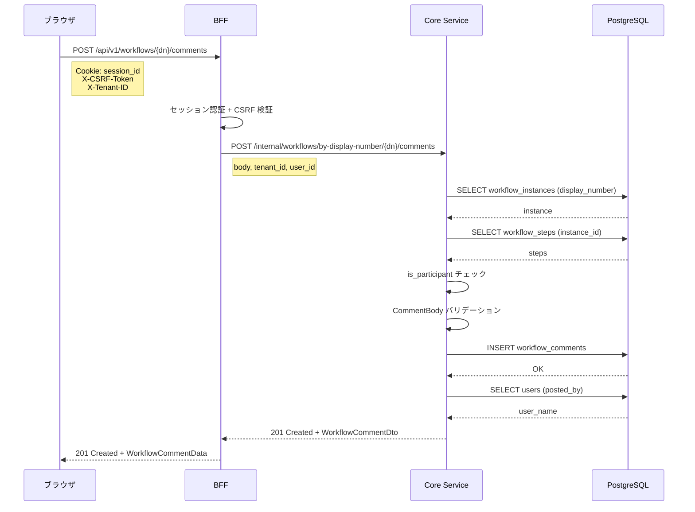
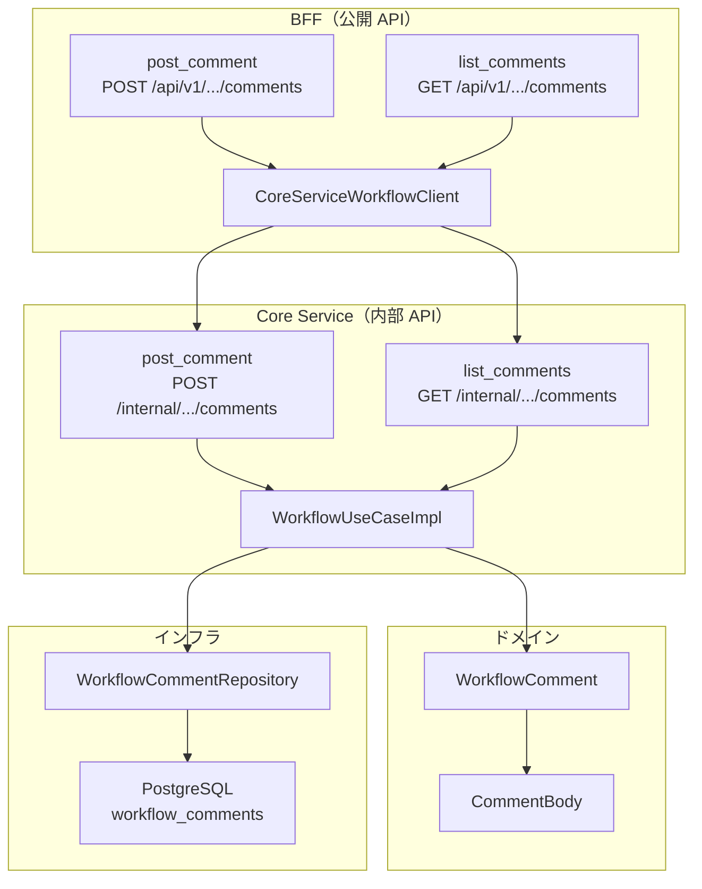

# ワークフローコメント - 機能解説

対応 PR: #487
対応 Issue: #477

## 概要

ワークフローインスタンスに対するコメントスレッド機能を実装した。承認プロセス中に申請者と承認者がコメントでやり取りできるようになる。コメント投稿（POST）とコメント一覧取得（GET）の 2 つの API エンドポイントを、DB からフロントエンド API まで全レイヤーで実装した。

## 背景

### 承認プロセスにおけるコミュニケーション

ワークフロー管理では、申請者が提出した申請に対して承認者が判断を行う。その過程で「この経費の内訳は？」「交通手段は何ですか？」といった確認のやり取りが発生する。

既存の `workflow_steps.comment` はステップの判定コメント（承認/却下時に入力する一方向のコメント）であり、双方向のやり取りには対応していない。

### 機能仕様との対応

| 仕様 | 箇所 |
|------|------|
| シナリオ | 機能仕様書 シナリオ 7: コメントでのやり取り |
| UI セクション | 機能仕様書 4.7: コメント機能 |
| 権限定義 | 機能仕様書 6: 権限マトリクス |
| 要件 ID | TASK-005 |

### Epic 全体の中での位置づけ

本 PR は Epic #404（Phase 2-3 基盤機能）の一部。多段階承認（#475）と並行して、コメント機能（#477）を実装した。

| Issue | 内容 | 状態 |
|-------|------|------|
| #475 | 多段階承認バックエンド | 完了 |
| #477 | コメント機能（本 PR） | 完了 |

## 用語・概念

| 用語 | 説明 | 関連コード |
|------|------|-----------|
| ワークフローコメント | ワークフローインスタンスに対する自由形式のコメント | `WorkflowComment` |
| 判定コメント | 承認/却下時にステップに付与するコメント（既存） | `WorkflowStep.comment` |
| コメント本文 | 1〜2,000 文字のバリデーション付き値オブジェクト | `CommentBody` |
| 関与者 | 申請者またはいずれかのステップの承認者 | `is_participant()` |

## フロー

### コメント投稿フロー



### コメント一覧取得フロー

```mermaid
sequenceDiagram
    participant Browser as ブラウザ
    participant BFF as BFF
    participant Core as Core Service
    participant DB as PostgreSQL

    Browser->>BFF: GET /api/v1/workflows/{dn}/comments
    Note right of Browser: Cookie: session_id<br/>X-Tenant-ID
    BFF->>BFF: セッション認証
    BFF->>Core: GET /internal/workflows/by-display-number/{dn}/comments
    Note right of BFF: tenant_id (query)
    Core->>DB: SELECT workflow_instances (display_number)
    DB-->>Core: instance
    Core->>DB: SELECT workflow_comments (instance_id, ORDER BY created_at ASC)
    DB-->>Core: comments[]
    Core->>DB: SELECT users (posted_by の一括解決)
    DB-->>Core: user_names
    Core-->>BFF: 200 OK + Vec&lt;WorkflowCommentDto&gt;
    BFF-->>Browser: 200 OK + Vec&lt;WorkflowCommentData&gt;
```

## アーキテクチャ



## データフロー

### フロー 1: コメント投稿

| # | レイヤー | ファイル:関数 | 処理内容 |
|---|---------|-------------|---------|
| 1 | BFF Handler | `bff/handler/workflow/command.rs:post_comment` | セッション認証、CSRF 検証、`PostCommentCoreRequest` 組立 |
| 2 | BFF Client | `bff/client/core_service/workflow_client.rs:post_comment` | Core Service へ HTTP POST |
| 3 | Core Handler | `core-service/handler/workflow/command.rs:post_comment` | リクエスト分解、ユースケース呼び出し |
| 4 | UseCase | `core-service/usecase/workflow/command.rs:post_comment` | インスタンス取得 → 権限チェック → バリデーション → 保存 |
| 5 | Domain | `domain/workflow/comment.rs:WorkflowComment::new` | エンティティ生成 |
| 6 | Infra | `infra/repository/workflow_comment_repository.rs:insert` | SQL INSERT |
| 7 | Core Handler | `core-service/handler/workflow/command.rs:post_comment` | ユーザー名解決 → `WorkflowCommentDto` 生成 |
| 8 | BFF Handler | `bff/handler/workflow/command.rs:post_comment` | `WorkflowCommentData` 変換 → 201 応答 |

### フロー 2: コメント一覧取得

| # | レイヤー | ファイル:関数 | 処理内容 |
|---|---------|-------------|---------|
| 1 | BFF Handler | `bff/handler/workflow/query.rs:list_comments` | セッション認証、Core Service 呼び出し |
| 2 | BFF Client | `bff/client/core_service/workflow_client.rs:list_comments` | Core Service へ HTTP GET |
| 3 | Core Handler | `core-service/handler/workflow/query.rs:list_comments` | リクエスト分解、ユースケース呼び出し |
| 4 | UseCase | `core-service/usecase/workflow/query.rs:list_comments` | display_number でインスタンス解決 → コメント一覧取得 |
| 5 | Infra | `infra/repository/workflow_comment_repository.rs:find_by_instance` | SQL SELECT (ORDER BY created_at ASC) |
| 6 | Core Handler | `core-service/handler/workflow/query.rs:list_comments` | ユーザー名一括解決（HashSet 重複排除） → DTO 変換 |
| 7 | BFF Handler | `bff/handler/workflow/query.rs:list_comments` | `WorkflowCommentData` 変換 → 200 応答 |

## データ変換

### リクエストの変換（コメント投稿）

```
ブラウザ                    BFF                         Core Service               UseCase
PostCommentRequest    →  PostCommentCoreRequest    →  PostCommentRequest      →  PostCommentInput
{ body }                 { body, tenant_id,           { body, tenant_id,         { body }
                           user_id }                    user_id }
```

### レスポンスの変換（コメント投稿・一覧共通）

```
UseCase                     Core Service               BFF                        ブラウザ
WorkflowComment         →  WorkflowCommentDto     →  WorkflowCommentDto     →  WorkflowCommentData
(domain entity)             { id, posted_by:            { id, posted_by:           { id, posted_by:
                              UserRefDto,                 UserRefDto,                UserRefData,
                              body, created_at }          body, created_at }         body, created_at }
```

型名が Core Service とBFF で重複（`WorkflowCommentDto`）しているが、所属するクレートが異なる:
- Core Service: `core-service/handler/workflow.rs` — ドメインエンティティから変換
- BFF: `bff/client/core_service/types.rs` — Core Service のレスポンスをデシリアライズ

## エラーハンドリング

| エラー | 発生箇所 | HTTP Status | ユーザーへの表示 |
|-------|---------|-------------|-----------------|
| ワークフロー未存在 | UseCase（`find_by_display_number` が None） | 404 | ワークフローインスタンスが見つかりません |
| 権限なし | UseCase（`is_participant` が false） | 403 | このワークフローにコメントする権限がありません |
| バリデーションエラー（空文字） | Domain（`CommentBody::new`） | 400 | コメント本文は必須です |
| バリデーションエラー（2001 文字超過） | Domain（`CommentBody::new`） | 400 | コメント本文は2000文字以内で入力してください |
| CSRF トークン不正 | BFF ミドルウェア | 403 | CSRF validation failed |

## 設計判断

機能・仕組みレベルの判断を記載する。コード実装レベルの判断は[コード解説](./01_ワークフローコメント_コード解説.md#設計解説)を参照。

### 1. コメントスレッドをどのエンティティに紐づけるか

コメントの単位をワークフローインスタンス単位にするか、ステップ単位にするかの選択。

| 案 | スコープ | UI の複雑さ | 要件との整合 |
|----|---------|-----------|------------|
| **インスタンス単位（採用）** | 1 つのスレッド | シンプル | シナリオ 7 と一致 |
| ステップ単位 | ステップごとにスレッド | 複雑 | 過剰（差し戻しコメントは既存） |

**採用理由**: 機能仕様書のシナリオ 7 が「ワークフロー単位のやり取り」を想定しており、ステップ単位の粒度は不要。ステップの判定コメント（承認/却下時）は既存の `workflow_steps.comment` で対応済み。

### 2. 投稿権限をどのレベルでチェックするか

コメント投稿者の権限チェックをどこで行うかの選択。

| 案 | 実装場所 | 拡張性 | 依存の重さ |
|----|---------|--------|----------|
| **UseCase 内メソッド（採用）** | `is_participant` プライベートメソッド | 十分 | 軽い |
| 独立 UseCase | `CheckParticipantUseCase` | 高い | リポジトリ依存が重複 |
| ドメインサービス | `ParticipantChecker` | 高い | DB アクセスが必要で不適切 |

**採用理由**: 現時点で `is_participant` を使うのはコメント投稿のみ。独立 UseCase にすると `instance_repo` と `step_repo` の依存が重複するため、プライベートメソッドとして配置した。

### 3. 一覧取得 API に権限チェックは必要か

コメント一覧取得にも `is_participant` チェックを行うかの選択。

| 案 | セキュリティ | 実装コスト | ユーザー体験 |
|----|------------|----------|------------|
| **チェックなし（採用）** | テナント分離で十分 | 低い | 閲覧は自由 |
| チェックあり | より厳密 | 追加クエリ必要 | 閲覧も制限 |

**採用理由**: RLS によるテナント分離が保証されており、同一テナント内のコメント閲覧を制限する要件はない。投稿のみ関与者に限定する。

## 関連ドキュメント

- [コード解説](./01_ワークフローコメント_コード解説.md)
- [機能仕様書: ワークフロー管理 4.7](../../01_要件定義書/機能仕様書/01_ワークフロー管理.md)
- [計画ファイル](../../../prompts/plans/477_workflow-comments.md)
- [セッションログ](../../../prompts/runs/2026-02/2026-02-12_2100_ワークフローコメント機能実装.md)
