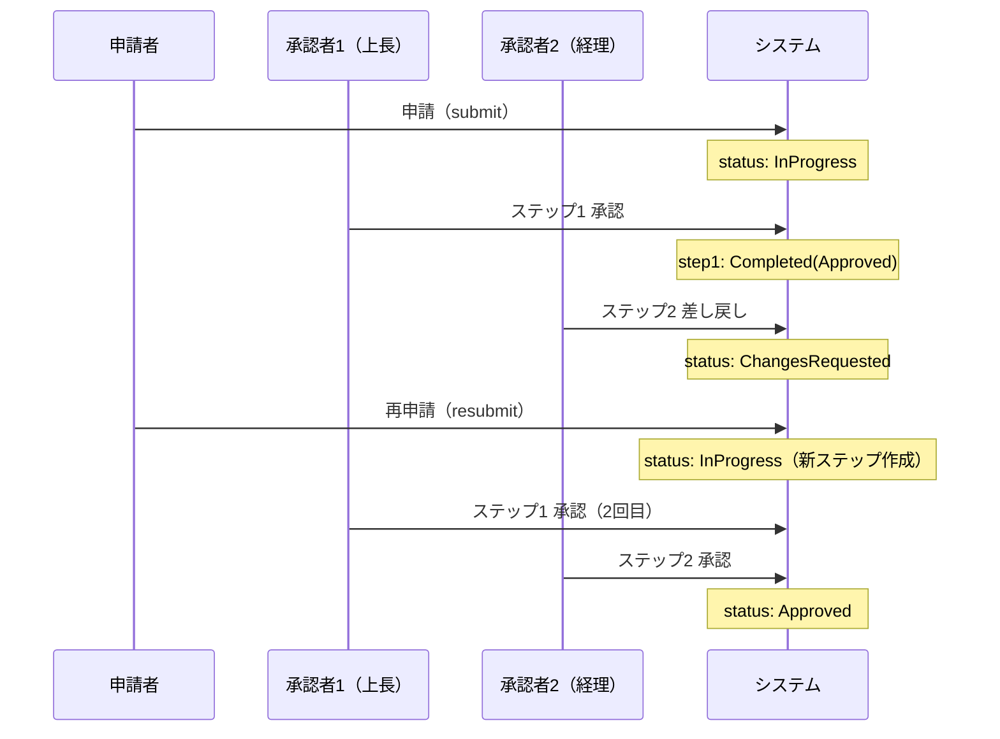
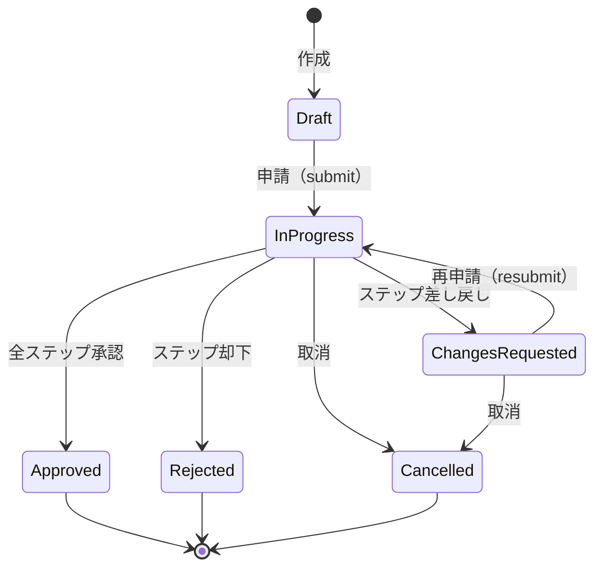
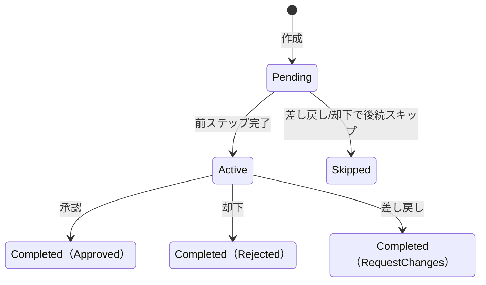
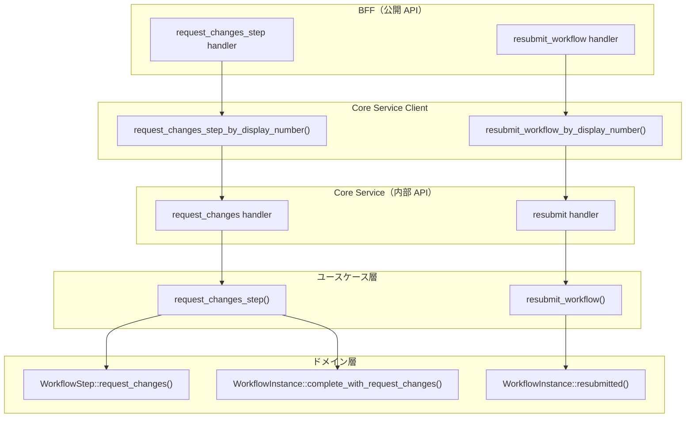
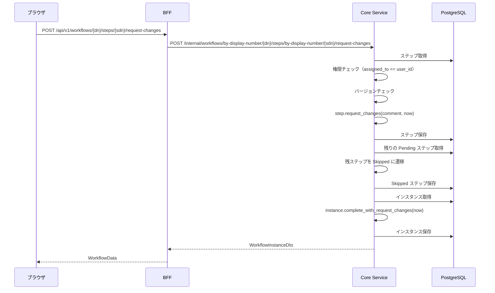
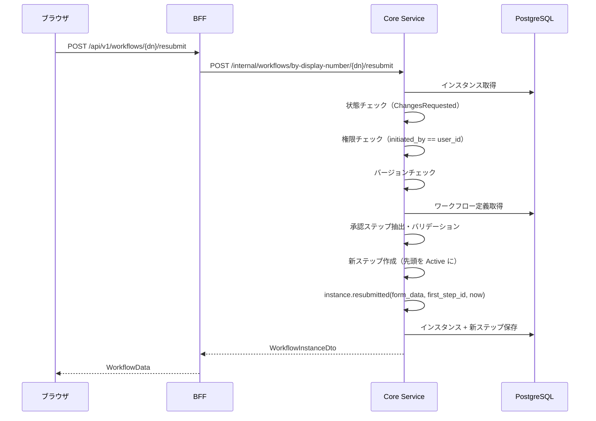

# 差し戻し・再申請機能 - 機能解説

対応 PR: [#488](https://github.com/ka2kama/ringiflow/pull/488)
対応 Issue: [#476](https://github.com/ka2kama/ringiflow/issues/476)

## 概要

承認者がワークフローを差し戻し（request-changes）し、申請者が修正して再申請（resubmit）できるバックエンド機能。Phase 1 では却下→新規再申請のみだったが、本機能により同一ワークフローインスタンス上で「修正依頼→修正→再承認」のサイクルを回せるようになった。

## 背景

### 承認フローにおける差し戻しの必要性

Phase 1 の承認・却下機能では、承認者の判断は「承認」か「却下」の二択だった。却下された申請は終了状態となり、申請者は新規にワークフローを作り直す必要があった。

実際の業務では「内容に不備はあるが、修正すれば承認できる」というケースが多い。差し戻しにより、同一ワークフロー上で修正と再承認を繰り返せるようになる。

### 機能仕様書での位置づけ

[機能仕様書 セクション4.6](../../01_要件定義書/機能仕様書/01_ワークフロー管理.md) および シナリオ6 で定義されている。実装ロードマップでは Phase 2-3（複数ステップ承認 + 差し戻し + コメント）に位置づけられている。

### #475 との関係

| Issue | 内容 | 状態 |
|-------|------|------|
| [#475](https://github.com/ka2kama/ringiflow/issues/475) | 多段階承認バックエンド | 完了 |
| [#476](https://github.com/ka2kama/ringiflow/issues/476) | 差し戻し・再申請（本 PR） | 完了 |

#475 で多段階承認の基盤を構築し、#476 で差し戻し・再申請を追加した。

## 用語・概念

| 用語 | 説明 | 関連コード |
|------|------|-----------|
| 差し戻し（request-changes） | 承認者が申請内容の修正を求める操作 | `WorkflowStep::request_changes()` |
| 再申請（resubmit） | 申請者が修正したフォームデータで再度承認を求める操作 | `WorkflowInstance::resubmitted()` |
| ChangesRequested | 差し戻し後のワークフロー状態。中間状態であり終了状態ではない | `WorkflowInstanceStatus::ChangesRequested` |
| RequestChanges | ステップの判定結果。Approved / Rejected と並ぶ第3の判定 | `StepDecision::RequestChanges` |
| 楽観的ロック | version フィールドによる同時更新の検出 | `version` フィールド |

## フロー

### 差し戻し → 再申請 → 承認の全体フロー

2段階承認を例にした、差し戻しから最終承認までのフロー。

## 状態遷移

### ワークフローインスタンス

`ChangesRequested` は中間状態であり、`Approved` / `Rejected` / `Cancelled` のような終了状態ではない。再申請により `InProgress` に戻ることができる。

### 承認ステップ

## アーキテクチャ

## データフロー

### フロー 1: 差し戻し（request-changes）

#### 処理ステップ

| # | レイヤー | ファイル:関数 | 処理内容 |
|---|---------|-------------|---------|
| 1 | BFF | `handler/workflow/command.rs:request_changes_step` | セッション・テナント抽出、Core Service 呼び出し |
| 2 | Core Service | `handler/workflow/command.rs:request_changes_step_by_display_number` | display_number 解決、ユースケース委譲 |
| 3 | ユースケース | `usecase/workflow/command.rs:request_changes_step` | 権限・バージョン検証、状態遷移、DB 保存 |
| 4 | ドメイン | `step.rs:request_changes` | Active → Completed(RequestChanges)、version++ |
| 5 | ドメイン | `instance.rs:complete_with_request_changes` | InProgress → ChangesRequested、version++ |

### フロー 2: 再申請（resubmit）

#### 処理ステップ

| # | レイヤー | ファイル:関数 | 処理内容 |
|---|---------|-------------|---------|
| 1 | BFF | `handler/workflow/command.rs:resubmit_workflow` | セッション・テナント抽出、Core Service 呼び出し |
| 2 | Core Service | `handler/workflow/command.rs:resubmit_workflow_by_display_number` | display_number 解決、ユースケース委譲 |
| 3 | ユースケース | `usecase/workflow/command.rs:resubmit_workflow` | 状態・権限・バージョン検証、新ステップ生成、DB 保存 |
| 4 | ドメイン | `instance.rs:resubmitted` | ChangesRequested → InProgress、form_data 更新、version++ |

## エラーハンドリング

| エラー | 発生箇所 | HTTP Status | 条件 |
|-------|---------|-------------|------|
| ステップ未割当 | request_changes_step | 403 | assigned_to != user_id |
| 申請者以外の再申請 | resubmit_workflow | 403 | initiated_by != user_id |
| 状態不正（ステップ） | request_changes_step | 400 | ステップが Active でない |
| 状態不正（インスタンス） | resubmit_workflow | 400 | ステータスが ChangesRequested でない |
| バージョン不一致 | 両方 | 409 | 楽観的ロック衝突 |
| 承認者不一致 | resubmit_workflow | 400 | 定義のステップと approvers が一致しない |
| リソース未存在 | 両方 | 404 | ワークフローまたはステップが見つからない |

## 設計判断

機能・仕組みレベルの判断を記載する。コード実装レベルの判断は[コード解説](./01_差し戻し再申請_コード解説.md#設計解説)を参照。

### 1. ChangesRequested を中間状態とするか終了状態とするか

差し戻しは「修正してやり直す」ことを前提とした操作であり、`Rejected`（却下）とは本質的に異なる。

| 案 | completed_at | 再申請可能 | 意味的な整合性 |
|----|-------------|-----------|--------------|
| **中間状態（採用）** | 設定しない | あり | 「まだ終わっていない」を正確に表現 |
| 終了状態 | 設定する | 特殊処理が必要 | 終了後に再開する矛盾が生じる |

**採用理由**: ChangesRequested は「修正待ち」であり、申請はまだ完了していない。`completed_at` を設定しないことで、`Approved` / `Rejected` / `Cancelled` という終了状態群と明確に区別できる。

### 2. 再申請時にステップを再利用するか新規作成するか

差し戻し後の再申請で、以前の承認ステップをどう扱うか。

| 案 | 履歴保持 | 実装の明確さ | 前回承認者への影響 |
|----|---------|------------|------------------|
| **新規作成（採用）** | 前回ステップは独立して残る | 状態が clean | 承認者変更可能 |
| ステータスリセット | 同一ステップを再利用 | リセット対象の管理が複雑 | 変更不可 |

**採用理由**: 新規ステップ作成により、各承認ラウンドが独立した記録として残る。また、再申請時に承認者を変更できる柔軟性を確保した。

### 3. 再申請の権限を誰に付与するか

`submit`（初回申請）には申請者本人チェックがないが、`resubmit` には必要か。

| 案 | 操作の性質 | セキュリティ |
|----|-----------|------------|
| **申請者本人のみ（採用）** | 「自分の申請を修正する」操作 | initiated_by == user_id |
| 権限チェックなし | submit と統一 | 他人の申請を修正できてしまう |

**採用理由**: 再申請は「自分の申請を修正して再度承認を求める」操作であり、申請者本人以外が行うべきではない。`submit` は「新規に申請する」操作で性質が異なる。

### 4. 差し戻し時の残りステップの扱い

2段階承認でステップ2が差し戻した場合、ステップ1の状態はどうなるか。

実際にはステップ1は既に `Completed(Approved)` であり変更されない。差し戻し操作で影響を受けるのは、差し戻しステップ以降の `Pending` 状態のステップのみ（`Skipped` に遷移）。これは `reject_step` と同じパターンを踏襲している。

## 関連ドキュメント

- [コード解説](./01_差し戻し再申請_コード解説.md)
- [機能仕様書: ワークフロー管理](../../01_要件定義書/機能仕様書/01_ワークフロー管理.md)
- [実装解説: 承認却下機能](../PR141_ワークフロー承認却下機能/)
- [実装解説: 多段階承認](../PR479_多段階承認/)
- [計画ファイル](../../../prompts/plans/476_request-changes-resubmit.md)
