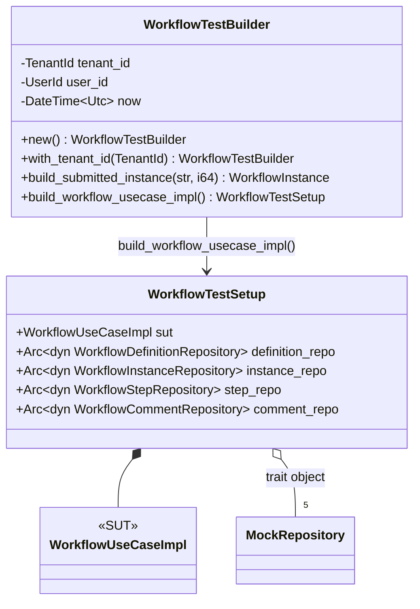
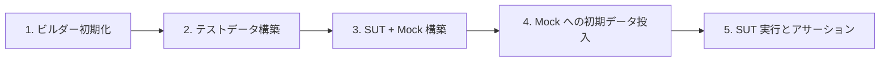
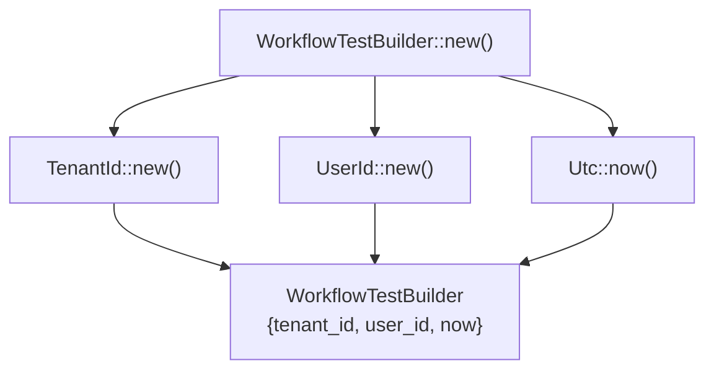
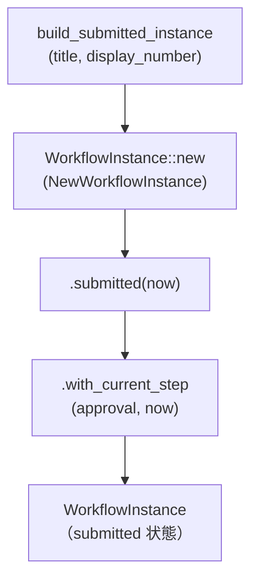
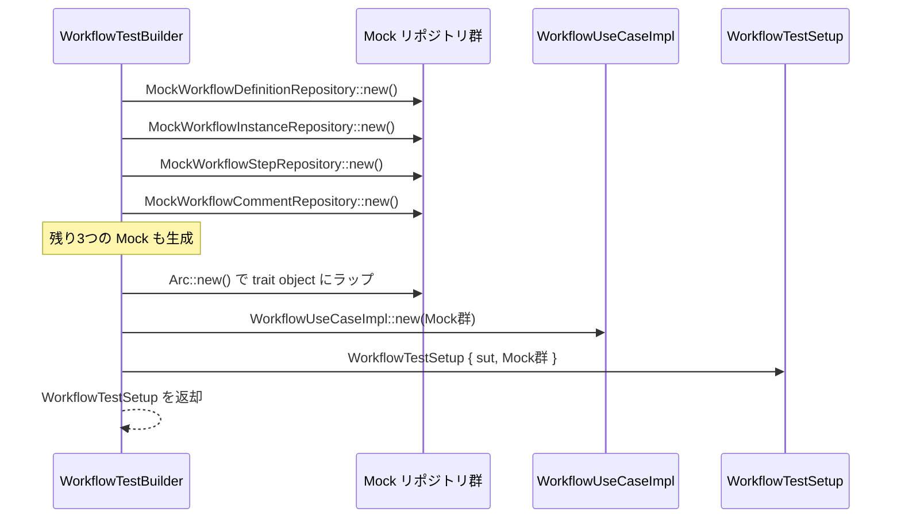
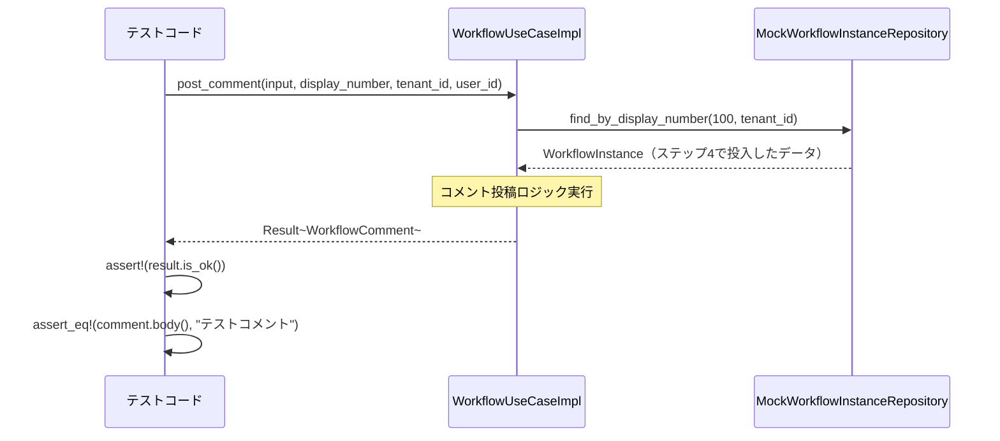
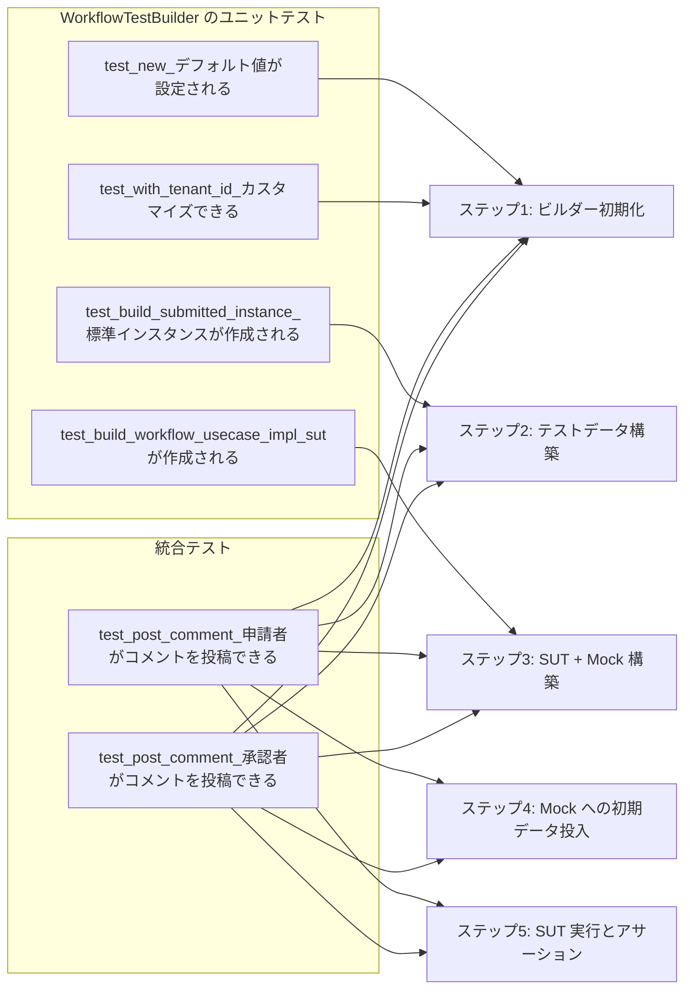

# WorkflowTestBuilder - コード解説

対応 PR: #536
対応 Issue: #525（Phase 1）

## 主要な型・関数

| 型/関数 | ファイル | 責務 |
|--------|---------|------|
| `WorkflowTestBuilder` | [`src/test_utils/workflow_test_builder.rs:68`](../../../backend/apps/core-service/src/test_utils/workflow_test_builder.rs#L68) | テストビルダー本体。テストデータと Mock 群を構築 |
| `WorkflowTestSetup` | [`src/test_utils/workflow_test_builder.rs:38`](../../../backend/apps/core-service/src/test_utils/workflow_test_builder.rs#L38) | SUT と Mock リポジトリ群のコンテナ |
| `build_submitted_instance()` | [`src/test_utils/workflow_test_builder.rs:126`](../../../backend/apps/core-service/src/test_utils/workflow_test_builder.rs#L126) | submitted 状態の WorkflowInstance を生成 |
| `build_workflow_usecase_impl()` | [`src/test_utils/workflow_test_builder.rs:148`](../../../backend/apps/core-service/src/test_utils/workflow_test_builder.rs#L148) | SUT と Mock 群を構築し WorkflowTestSetup を返却 |

### 型の関係



**関係のポイント**:
- WorkflowTestBuilder が WorkflowTestSetup を構築する（ファクトリパターン）
- WorkflowTestSetup は SUT と Mock 群を集約する（コンポジション）
- Mock リポジトリは trait object (`Arc<dyn Trait>`) で保持される

## コードフロー

コードをライフサイクル順に追う。WorkflowTestBuilder を使ったテストの実行フローを、セットアップから検証まで段階的に解説する。



### 1. ビルダー初期化（テスト開始時）

テストの最初に `WorkflowTestBuilder::new()` を呼び出し、デフォルト値を設定する。



```rust
// src/test_utils/workflow_test_builder.rs:74-81
pub fn new() -> Self {
    Self {
        tenant_id: TenantId::new(),      // ① ランダムなテナント ID を生成
        user_id:   UserId::new(),        // ② ランダムなユーザー ID を生成
        now:       Utc::now(),           // ③ 現在時刻を設定
    }
}
```

注目ポイント:
- ① ② 各テストで一意な ID を生成し、テスト間の干渉を防ぐ
- ③ テスト実行時刻を固定することで、時刻依存の挙動を再現可能にする

**カスタマイズ（オプション）**:

テスト固有の値が必要な場合は、fluent API でカスタマイズできる。

```rust
// tests/comment_integration_test.rs:48
let builder = WorkflowTestBuilder::new()
    .with_tenant_id(custom_tenant_id)  // テナント ID をカスタマイズ
    .with_user_id(custom_user_id);     // ユーザー ID をカスタマイズ
```

### 2. テストデータ構築（ワークフローインスタンスの生成）

`build_submitted_instance()` を呼び出し、submitted 状態の WorkflowInstance を生成する。



```rust
// src/test_utils/workflow_test_builder.rs:126-140
pub fn build_submitted_instance(&self, title: &str, display_number: i64) -> WorkflowInstance {
    WorkflowInstance::new(NewWorkflowInstance {
        id: WorkflowInstanceId::new(),                    // ① 新規 ID を生成
        tenant_id: self.tenant_id.clone(),                // ② ビルダーの tenant_id を使用
        definition_id: WorkflowDefinitionId::new(),
        definition_version: Version::initial(),
        display_number: DisplayNumber::new(display_number).unwrap(),
        title: title.to_string(),
        form_data: serde_json::json!({}),
        initiated_by: self.user_id.clone(),               // ③ ビルダーの user_id を使用
        now: self.now,                                    // ④ ビルダーの now を使用
    })
    .submitted(self.now)                                  // ⑤ submitted 状態に遷移
    .unwrap()
    .with_current_step("approval".to_string(), self.now) // ⑥ approval ステップを設定
}
```

注目ポイント:
- ① 各インスタンスで一意な ID を生成
- ② ③ ④ ビルダーで統一された値（tenant_id, user_id, now）を使用
- ⑤ submitted 状態に遷移（draft → submitted）
- ⑥ current_step を "approval" に設定（承認待ち状態）

**ここで登録したインスタンスは、ステップ 4 で Mock リポジトリに投入される。**

### 3. SUT + Mock 構築（テスト環境のセットアップ）

`build_workflow_usecase_impl()` を呼び出し、SUT（WorkflowUseCaseImpl）と Mock リポジトリ群を構築する。



```rust
// src/test_utils/workflow_test_builder.rs:148-172
pub fn build_workflow_usecase_impl(&self) -> WorkflowTestSetup {
    // ① 各 Mock リポジトリを生成し、trait object にラップ
    let definition_repo: Arc<dyn WorkflowDefinitionRepository> =
        Arc::new(MockWorkflowDefinitionRepository::new());
    let instance_repo: Arc<dyn WorkflowInstanceRepository> =
        Arc::new(MockWorkflowInstanceRepository::new());
    let step_repo: Arc<dyn WorkflowStepRepository> =
        Arc::new(MockWorkflowStepRepository::new());
    let comment_repo: Arc<dyn WorkflowCommentRepository> =
        Arc::new(MockWorkflowCommentRepository::new());

    // ② SUT に Mock 群を注入
    let sut = WorkflowUseCaseImpl::new(
        definition_repo.clone(),    // ③ clone で参照カウントをインクリメント
        instance_repo.clone(),
        step_repo.clone(),
        comment_repo.clone(),
        Arc::new(MockUserRepository),
        Arc::new(MockDisplayIdCounterRepository::new()),
        Arc::new(FixedClock::new(self.now)),
    );

    // ④ SUT と Mock 群を WorkflowTestSetup に集約
    WorkflowTestSetup {
        sut,
        definition_repo,
        instance_repo,
        step_repo,
        comment_repo,
    }
}
```

注目ポイント:
- ① `Arc<dyn Trait>` で trait object にラップすることで、具体的な Mock 型を隠蔽
- ② WorkflowUseCaseImpl に Mock 群を注入（依存性の注入）
- ③ `Arc::clone()` で参照カウントをインクリメント（SUT と WorkflowTestSetup の両方が参照を保持）
- ④ SUT と Mock 群を WorkflowTestSetup に集約し、テストから両方にアクセス可能にする

### 4. Mock への初期データ投入（テスト前提条件の設定）

ステップ 2 で生成したワークフローインスタンスを Mock リポジトリに投入する。


```rust
// tests/comment_integration_test.rs:20
setup.instance_repo.insert(&instance).await.unwrap();  // ① Mock リポジトリに初期データを投入
```

注目ポイント:
- ① WorkflowTestSetup が Mock リポジトリへの参照を公開しているため、テストから直接アクセス可能
- ここで投入したデータは、ステップ 5 の SUT 実行時に `instance_repo.find_by_display_number()` などで取得される

**必要に応じて複数のデータを投入**:

```rust
// 承認者のステップも追加する場合
let step = WorkflowStep::new(NewWorkflowStep { /* ... */ });
setup.step_repo.insert(&step, builder.tenant_id()).await.unwrap();
```

### 5. SUT 実行とアサーション（テスト本体）

SUT のメソッドを実行し、結果を検証する。



```rust
// tests/comment_integration_test.rs:22-36
let input = PostCommentInput {
    body: "テストコメント".to_string(),
};

// ① SUT のメソッドを実行
let result = setup
    .sut
    .post_comment(
        input,
        DisplayNumber::new(100).unwrap(),
        builder.tenant_id().clone(),
        builder.user_id().clone(),
    )
    .await;

// ② 結果を検証
assert!(result.is_ok());                                    // ③ 正常終了を確認
let comment = result.unwrap();
assert_eq!(comment.body().as_str(), "テストコメント");      // ④ コメント本文を検証
```

注目ポイント:
- ① WorkflowTestSetup の `sut` フィールドから SUT にアクセス
- ② SUT 内部で Mock リポジトリが呼ばれ、ステップ 4 で投入したデータが取得される
- ③ ④ Result の成功と、戻り値のフィールドを検証

## テスト

各テストがライフサイクルのどのステップを検証しているかを示す。



| テスト | 検証対象のステップ | 検証内容 |
|-------|------------------|---------|
| `test_new_デフォルト値が設定される` | 1 | デフォルト値で初期化されることを確認 |
| `test_with_tenant_id_カスタマイズできる` | 1 | fluent API でカスタマイズできることを確認 |
| `test_with_user_id_カスタマイズできる` | 1 | fluent API でカスタマイズできることを確認 |
| `test_with_now_カスタマイズできる` | 1 | fluent API でカスタマイズできることを確認 |
| `test_build_submitted_instance_標準インスタンスが作成される` | 2 | submitted 状態のインスタンスが生成されることを確認 |
| `test_build_workflow_usecase_impl_sutが作成される` | 3 | SUT と Mock 群が構築されることを確認 |
| `test_post_comment_申請者がコメントを投稿できる` | 1-5 | 申請者がコメント投稿できることをエンドツーエンドで検証 |
| `test_post_comment_承認者がコメントを投稿できる` | 1-5 | 承認者がコメント投稿できることをエンドツーエンドで検証 |

### 実行方法

```bash
# ユニットテスト（WorkflowTestBuilder 自体のテスト）
cd backend && cargo test --package ringiflow-core-service --lib test_utils::workflow_test_builder

# 統合テスト（WorkflowTestBuilder を使ったテスト）
cd backend && cargo test --package ringiflow-core-service --features test-utils --test comment_integration_test

# すべてのテスト
cd backend && cargo test --features test-utils
```

## 依存関係

新規追加したクレート・feature はない。既存の `ringiflow-domain/test-support` と `ringiflow-infra/test-utils` feature を活用している。

### feature gate の構成

```toml
# backend/apps/core-service/Cargo.toml:35-39
[features]
test-utils = [
    "ringiflow-domain/test-support",
    "ringiflow-infra/test-utils",
]
```

**依存関係**:
- `ringiflow-domain/test-support`: FixedClock（テスト用の固定時計）を提供
- `ringiflow-infra/test-utils`: Mock リポジトリ群を提供

## 設計解説

コード実装レベルの判断を記載する。機能・仕組みレベルの判断は[機能解説](./01_WorkflowTestBuilder_機能解説.md#設計判断)を参照。

### 1. Arc<dyn Trait> による trait object パターン

場所: `src/test_utils/workflow_test_builder.rs:149-154`

```rust
let definition_repo: Arc<dyn WorkflowDefinitionRepository> =
    Arc::new(MockWorkflowDefinitionRepository::new());
let instance_repo: Arc<dyn WorkflowInstanceRepository> =
    Arc::new(MockWorkflowInstanceRepository::new());
```

なぜこの実装か:

WorkflowTestSetup が Mock リポジトリを保持する際、具体型（`MockWorkflowInstanceRepository`）ではなく trait object (`Arc<dyn WorkflowInstanceRepository>`) を使用している。

**理由**:
- WorkflowUseCaseImpl の依存性が trait object で定義されている
- テストコードが Mock の具体型に依存しなくなる（疎結合）
- 将来的に Mock 実装を変更しても、WorkflowTestSetup のインターフェースは変わらない

代替案:

| 案 | 型安全性 | コード量 | 柔軟性 | 判断 |
|----|---------|---------|--------|------|
| **Arc<dyn Trait>（採用）** | 中 | 少 | 高 | 採用 |
| 具体型（MockWorkflowInstanceRepository） | 高 | 少 | 低 | 見送り（テストが Mock に強く依存） |
| ジェネリクス（`<T: WorkflowInstanceRepository>`） | 高 | 多 | 中 | 見送り（型パラメータが複雑になる） |

### 2. WorkflowTestSetup による SUT と Mock 群の集約

場所: `src/test_utils/workflow_test_builder.rs:38-44`

```rust
pub struct WorkflowTestSetup {
    pub sut: WorkflowUseCaseImpl,
    pub definition_repo: Arc<dyn WorkflowDefinitionRepository>,
    pub instance_repo: Arc<dyn WorkflowInstanceRepository>,
    pub step_repo: Arc<dyn WorkflowStepRepository>,
    pub comment_repo: Arc<dyn WorkflowCommentRepository>,
}
```

なぜこの実装か:

SUT だけでなく Mock リポジトリも公開することで、テストから Mock への直接アクセスを可能にしている。

**理由**:
- テストでデータ投入や検証のため Mock リポジトリへのアクセスが必要
- `Arc::clone()` により SUT と WorkflowTestSetup の両方が同じ Mock インスタンスを参照
- テストコードが `setup.instance_repo.insert()` のように直接 Mock を操作できる

代替案:

| 案 | Mock アクセス | API のシンプルさ | 判断 |
|----|-------------|----------------|------|
| **WorkflowTestSetup で SUT + Mock を公開（採用）** | 可 | やや複雑 | 採用 |
| SUT のみを返す | 不可 | シンプル | 見送り（Mock アクセスが必要） |
| Mock のみを返し、テストで SUT を構築 | 可 | 複雑 | 見送り（テストコードが増える） |

### 3. fluent API によるカスタマイズ

場所: `src/test_utils/workflow_test_builder.rs:83-99`

```rust
pub fn with_tenant_id(mut self, tenant_id: TenantId) -> Self {
    self.tenant_id = tenant_id;
    self
}

pub fn with_user_id(mut self, user_id: UserId) -> Self {
    self.user_id = user_id;
    self
}
```

なぜこの実装か:

ビルダーメソッドが `self` を消費し、変更後の `Self` を返す（所有権の移動）。

**理由**:
- メソッドチェーンで複数のカスタマイズを連結できる（fluent API）
- `mut self` により不変性を保ちつつカスタマイズ可能
- `builder.with_tenant_id(id).with_user_id(uid)` のように自然に書ける

代替案:

| 案 | メソッドチェーン | 不変性 | 判断 |
|----|---------------|--------|------|
| **`mut self` を消費（採用）** | 可 | 保たれる | 採用 |
| `&mut self` を返す | 可 | 保たれない | 見送り（可変参照の管理が複雑） |
| setter メソッド（返り値なし） | 不可 | 保たれない | 見送り（fluent API にならない） |

### 4. feature gate による公開制御

場所: `src/lib.rs:10-12`

```rust
#[cfg(any(test, feature = "test-utils"))]
#[doc(hidden)]
pub mod test_utils;
```

なぜこの実装か:

`cfg(test)` だけでなく `feature = "test-utils"` も条件に含めている。

**理由**:
- `cfg(test)` は同一クレート内のテストでのみ有効
- 統合テスト（`tests/` ディレクトリ）は独立したクレートとしてコンパイルされるため `cfg(test)` が適用されない
- `--features test-utils` で明示的に公開することで、統合テストからアクセス可能にする

代替案:

| 案 | 統合テストからのアクセス | 通常ビルドでの公開 | 判断 |
|----|----------------------|-----------------|------|
| **`cfg(any(test, feature = "test-utils"))`（採用）** | 可 | なし | 採用 |
| `cfg(test)` のみ | 不可 | なし | 見送り（統合テストで使えない） |
| feature gate なし（常に公開） | 可 | あり（不要な公開） | 見送り（内部実装を公開すべきでない） |

## 関連ドキュメント

- [機能解説](./01_WorkflowTestBuilder_機能解説.md)
- [計画ファイル](../../../prompts/plans/525_phase1-workflow-test-builder.md)
- [セッションログ](../../../prompts/runs/2026-02/2026-02-15_1137_Phase1-WorkflowTestBuilder実装.md)
- [`WorkflowTestBuilder` ソースコード](../../../backend/apps/core-service/src/test_utils/workflow_test_builder.rs)
- [統合テスト](../../../backend/apps/core-service/tests/comment_integration_test.rs)
