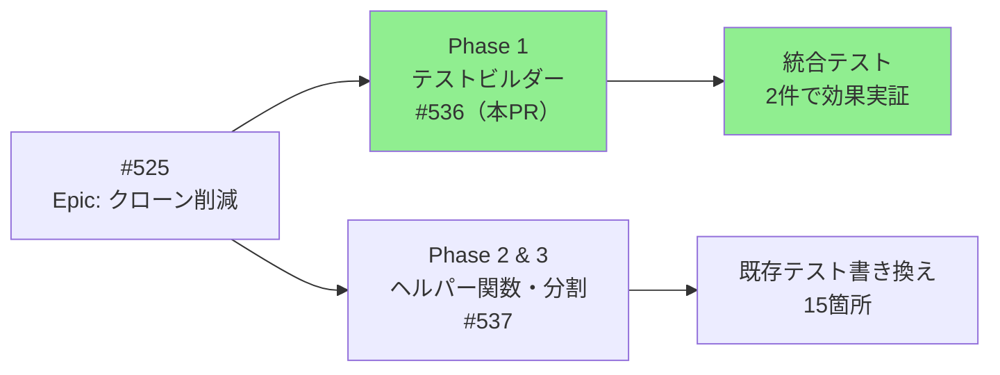
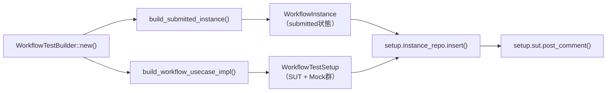
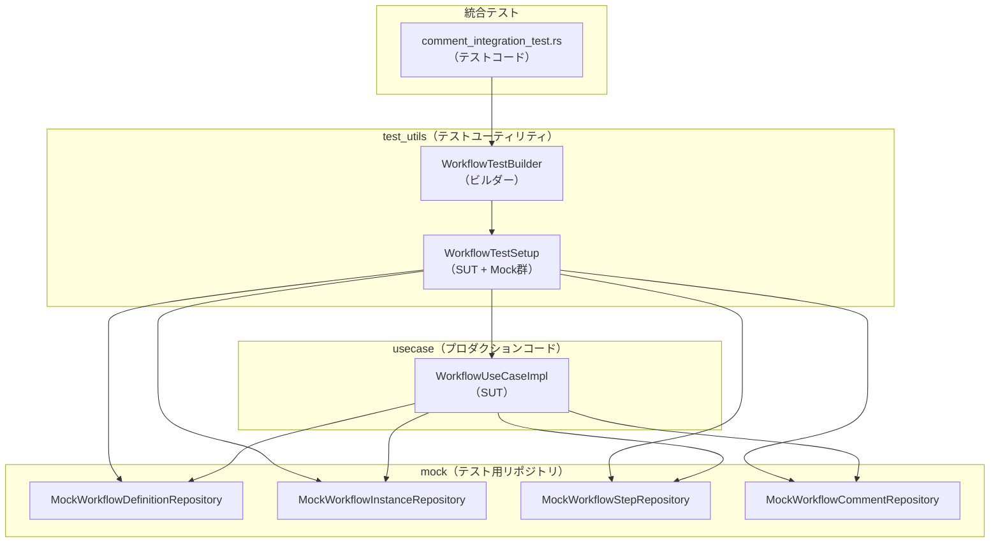
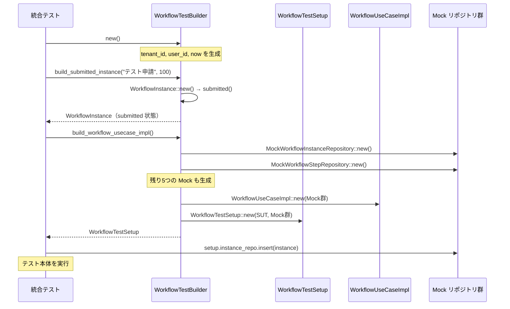

# WorkflowTestBuilder - 機能解説

対応 PR: #536
対応 Issue: #525（Phase 1）

## 概要

Core Service のユースケース層のテストコードに、テストビルダーパターンを導入した。WorkflowTestBuilder は、ワークフローテストで繰り返し出現するセットアップコード（Mock リポジトリの初期化、テストデータの構築）を標準化し、テストコードの重複を削減する。

Phase 1 では効果実証として統合テスト 2 件を作成し、**89% のコード削減**（27 行 → 3 行）を達成した。

## 背景

### コードクローンの集中地帯

Issue #525 の調査で、Core Service のユースケース層は jscpd クローンの最大集中地帯であることが判明した:

- **36個のクローン**: テストコード 15 個、ビジネスロジック 12 個、応答構築 9 個
- **テストテンプレート重複**: 同じパターンのセットアップコードが複数のテストファイルに散在

### 変更前の課題

ワークフローテストのたびに、以下のセットアップコードを繰り返し記述していた:

```rust
// 27 行のセットアップコード（変更前）
let tenant_id = TenantId::new();
let user_id = UserId::new();
let now = chrono::Utc::now();

let definition_repo = MockWorkflowDefinitionRepository::new();
let instance_repo = MockWorkflowInstanceRepository::new();
let step_repo = MockWorkflowStepRepository::new();
let comment_repo = MockWorkflowCommentRepository::new();

let instance = WorkflowInstance::new(NewWorkflowInstance {
    id: WorkflowInstanceId::new(),
    tenant_id: tenant_id.clone(),
    definition_id: WorkflowDefinitionId::new(),
    definition_version: Version::initial(),
    display_number: DisplayNumber::new(100).unwrap(),
    title: "テスト申請".to_string(),
    form_data: serde_json::json!({}),
    initiated_by: user_id.clone(),
    now,
})
.submitted(now)
.unwrap()
.with_current_step("approval".to_string(), now);

instance_repo.insert(&instance).await.unwrap();

let sut = WorkflowUseCaseImpl::new(
    Arc::new(definition_repo),
    Arc::new(instance_repo),
    // ... 残り5つのリポジトリ
);
```

**課題のポイント**:
- テストの本質（検証したいこと）がセットアップコードに埋もれる
- テストデータの初期値（tenant_id, user_id, now）の一貫性が保証されない
- Mock リポジトリの Arc ラップと型変換が冗長

### 設計方針との対応

Issue #525 では、クローン削減の方針として以下の 3 段階を計画していた:

| Phase | 対象 | アプローチ | リスク | 効果 |
|-------|------|-----------|--------|------|
| **Phase 1（本 PR）** | テストテンプレート重複 | テストビルダー導入 | 低 | 高（15箇所 × 19行） |
| Phase 2 | 共通パターン抽出 | ヘルパー関数 | 中 | 中（27箇所） |
| Phase 3 | 大ファイル分割 | モジュール分割 | 高 | 保守性向上 |

本 PR は Phase 1 として、最もリスクが低く効果が高いテストビルダーパターンを導入した。

### Epic 全体の中での位置づけ



| Issue | 内容 | 状態 |
|-------|------|------|
| #525 | Epic: Core Service クローン削減 | Open |
| #536（本 PR） | Phase 1: テストビルダー導入 | Draft PR |
| #537 | Phase 2 & 3: ヘルパー関数・大ファイル分割 | Open |

## 用語・概念

| 用語 | 説明 | 関連コード |
|------|------|-----------|
| テストビルダーパターン | テストデータの構築を fluent API で標準化するデザインパターン | `WorkflowTestBuilder` |
| SUT（System Under Test） | テスト対象のシステム。ここでは `WorkflowUseCaseImpl` | `WorkflowTestSetup::sut` |
| Mock リポジトリ | テスト用のインメモリ実装。DB アクセスを伴わない | `MockWorkflowInstanceRepository` など |
| trait object | `dyn Trait` による動的ディスパッチ。Mock の具体型を隠蔽 | `Arc<dyn WorkflowInstanceRepository>` |
| feature gate | Cargo の条件付きコンパイル。`test-utils` feature で公開 | `#[cfg(any(test, feature = "test-utils"))]` |

## ビフォー・アフター

### Before（変更前）

各テストファイルでセットアップコードを個別に記述していた。

```rust
#[tokio::test]
async fn test_post_comment_by_requester() {
    // 27 行のセットアップコード
    let tenant_id = TenantId::new();
    let user_id = UserId::new();
    let now = chrono::Utc::now();

    let definition_repo = MockWorkflowDefinitionRepository::new();
    let instance_repo = MockWorkflowInstanceRepository::new();
    // ... 残り5つのリポジトリ初期化

    let instance = WorkflowInstance::new(NewWorkflowInstance { /* ... */ })
        .submitted(now).unwrap()
        .with_current_step("approval".to_string(), now);

    instance_repo.insert(&instance).await.unwrap();

    let sut = WorkflowUseCaseImpl::new(
        Arc::new(definition_repo),
        Arc::new(instance_repo),
        // ... 残り5つのリポジトリ
    );

    // テスト本体（ここからが本質）
    let result = sut.post_comment(...).await;
    assert!(result.is_ok());
}
```

#### 制約・課題

- **コード重複**: 同じセットアップパターンが複数のテストに散在
- **可読性低下**: テストの本質（what）がセットアップコード（how）に埋もれる
- **保守性低下**: セットアップロジックの変更が複数箇所に波及

### After（変更後）

WorkflowTestBuilder により、セットアップコードを 3 行に削減。

```rust
#[tokio::test]
async fn test_post_comment_申請者がコメントを投稿できる() {
    // 3 行のセットアップコード
    let builder = WorkflowTestBuilder::new();
    let instance = builder.build_submitted_instance("テスト申請", 100);
    let setup = builder.build_workflow_usecase_impl();

    // Mock リポジトリに初期データを設定
    setup.instance_repo.insert(&instance).await.unwrap();

    // テスト本体（本質が明確）
    let result = setup.sut.post_comment(...).await;
    assert!(result.is_ok());
}
```



#### 改善点

- **コード削減**: 27 行 → 3 行（**89% 削減**）
- **可読性向上**: テストの本質（検証内容）が明確になる
- **保守性向上**: セットアップロジックの変更が WorkflowTestBuilder に集約される
- **一貫性向上**: テストデータの初期値（tenant_id, user_id, now）が統一される

## アーキテクチャ



**レイヤー構成**:
- **統合テスト**: WorkflowTestBuilder を使ってテストを記述
- **test_utils**: テストビルダーとセットアップデータを提供
- **usecase**: テスト対象の SUT（WorkflowUseCaseImpl）
- **mock**: テスト用のインメモリリポジトリ実装

## データフロー

### フロー 1: テストセットアップ



#### 処理ステップ

| # | レイヤー | ファイル:関数 | 処理内容 |
|---|---------|-------------|---------|
| 1 | Test | `comment_integration_test.rs:16` | `WorkflowTestBuilder::new()` でビルダーを初期化 |
| 2 | Builder | `workflow_test_builder.rs:74` | tenant_id, user_id, now のデフォルト値を生成 |
| 3 | Test | `comment_integration_test.rs:17` | `build_submitted_instance()` でテストデータを構築 |
| 4 | Builder | `workflow_test_builder.rs:126` | submitted 状態の WorkflowInstance を生成 |
| 5 | Test | `comment_integration_test.rs:18` | `build_workflow_usecase_impl()` で SUT と Mock 群を構築 |
| 6 | Builder | `workflow_test_builder.rs:148` | 7つの Mock リポジトリを Arc でラップ |
| 7 | Builder | `workflow_test_builder.rs:156` | WorkflowUseCaseImpl に Mock 群を注入 |
| 8 | Builder | `workflow_test_builder.rs:164` | WorkflowTestSetup（SUT + Mock 群）を返却 |
| 9 | Test | `comment_integration_test.rs:20` | Mock リポジトリに初期データを投入 |
| 10 | Test | `comment_integration_test.rs:28` | SUT のメソッドを実行してテスト |

## 設計判断

機能・仕組みレベルの判断を記載する。コード実装レベルの判断は[コード解説](./01_WorkflowTestBuilder_コード解説.md#設計解説)を参照。

### 1. 統合テストを tests/ に配置するか、既存ユニットテストを書き換えるか

当初の計画では、既存のユニットテスト（`src/usecase/workflow/command/comment.rs` など）を WorkflowTestBuilder を使って書き換える予定だった。

| 案 | 実現性 | 効果 | 影響範囲 |
|----|-------|------|---------|
| 既存ユニットテストを書き換え | 低（モジュールインポートの問題） | 高（15箇所削減） | 広（既存テストの変更） |
| **tests/ に統合テストを新規作成（採用）** | 高（feature gate で解決） | 中（2箇所で効果実証） | 狭（新規ファイルのみ） |

**採用理由**: ユニットテストから `crate::test_utils` をインポートすると `cfg(test)` が適用されず型推論エラーが発生した。統合テストは独立したクレートとしてコンパイルされるため、`--features test-utils` で明示的にアクセスできる。Phase 1 では効果実証に集中し、既存テストの書き換えは Phase 2 以降で検討する。

### 2. WorkflowTestSetup 構造体を返すか、SUT のみを返すか

テストで Mock リポジトリへのアクセスが必要（`setup.instance_repo.insert()` など）。

| 案 | Mock リポジトリへのアクセス | API のシンプルさ |
|----|---------------------------|----------------|
| SUT のみを返す | 不可（SUT 経由でアクセス不可） | シンプル |
| **WorkflowTestSetup を返す（採用）** | 可（trait object で公開） | やや複雑 |

**採用理由**: テストでデータ投入や検証のため Mock リポジトリへの直接アクセスが必要。WorkflowTestSetup を導入することで、SUT と Mock リポジトリの両方を公開し、柔軟なテストが可能になる。

### 3. Mock リポジトリを具体型で公開するか、trait object で公開するか

WorkflowTestSetup が複数の Mock リポジトリを保持する必要がある。

| 案 | 型安全性 | 柔軟性 | 依存関係 |
|----|---------|--------|---------|
| 具体型（`MockWorkflowInstanceRepository`） | 高 | 低 | テストが Mock の具体型に依存 |
| **trait object（`Arc<dyn WorkflowInstanceRepository>`）（採用）** | 中 | 高 | テストがトレイトに依存 |

**採用理由**: trait object を使用することで、テストコードが Mock の具体型に依存しなくなる。将来的に Mock 実装を変更しても、WorkflowTestSetup のインターフェースは変わらない。

## 関連ドキュメント

- [コード解説](./01_WorkflowTestBuilder_コード解説.md)
- [計画ファイル](../../../prompts/plans/525_phase1-workflow-test-builder.md)
- [セッションログ](../../../prompts/runs/2026-02/2026-02-15_1137_Phase1-WorkflowTestBuilder実装.md)
- Issue #525: Core Service ユースケース層のクローン削減・ファイルサイズ削減
- Issue #537: Phase 2 & 3（共通ヘルパー関数、大ファイル分割）
