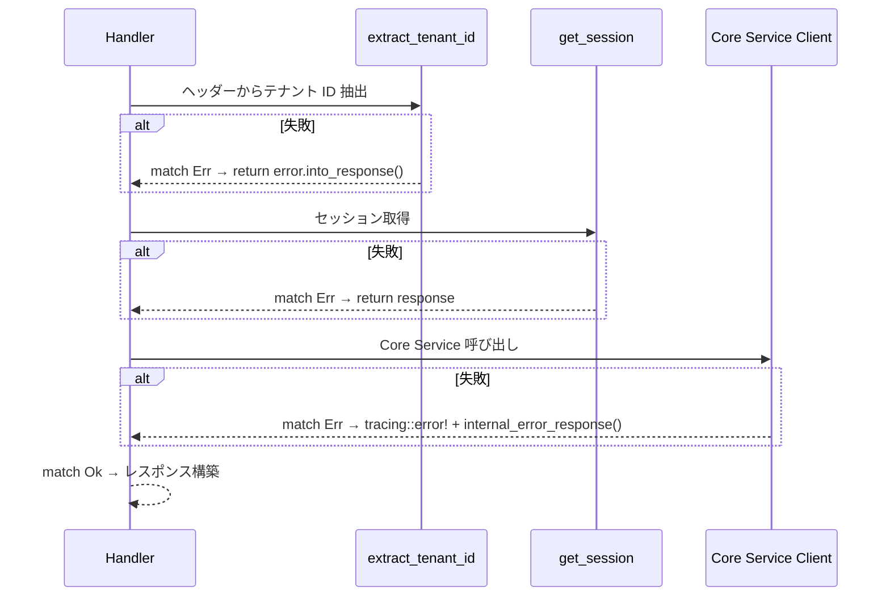
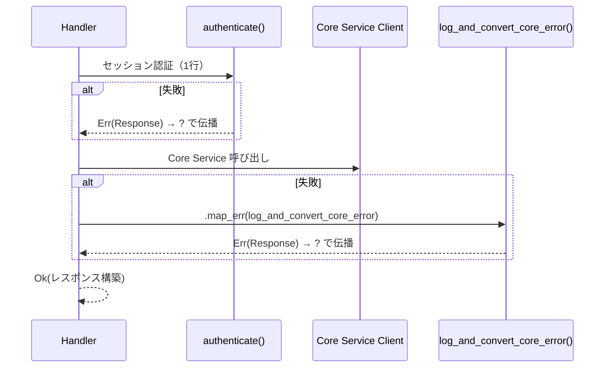
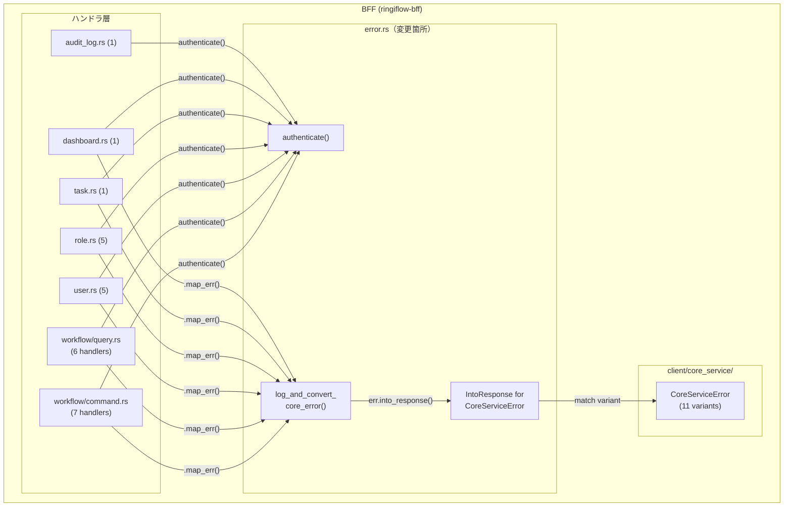

# BFF ハンドラクローン削減 - 機能解説

対応 PR: #573
対応 Issue: #526

## 概要

BFF ハンドラ層（7ファイル、27ハンドラ）で繰り返されていた3種類のボイラープレートを共通ヘルパーに集約し、各ハンドラのコード量を削減した。API の外部仕様（レスポンス構造、ステータスコード、OpenAPI 仕様）は変更なし。

## 背景

### BFF ハンドラのボイラープレート

BFF の各ハンドラは Core Service との間で以下のパターンを繰り返していた:

1. セッション認証（テナント ID 抽出 + セッション取得）: 10行 × 27ハンドラ
2. `CoreServiceError` のエラーマッピング: 4-20行 × 20箇所以上
3. import ブロックの重複

### 変更前の課題

- 同一ロジックが27箇所に散在し、エラーマッピングの追加・変更時に全箇所を修正する必要があった
- セッション認証の `match` 式がハンドラ本体のビジネスロジックを埋もれさせていた
- 新しいハンドラ追加時に10行のボイラープレートを毎回コピーする必要があった

### 設計方針との対応

| 項目 | 内容 |
|------|------|
| 設計原則 | DRY（3回以上の重複は共通化）、KISS |
| 制約 | API 外部仕様の不変、OpenAPI スナップショットテストの通過 |
| 参考パターン | core-service の `IntoResponse for CoreError`（`core-service/src/error.rs`） |

## 用語・概念

| 用語 | 説明 | 関連コード |
|------|------|-----------|
| カテゴリ A ハンドラ | 監査ログ記録なしの読み取り系ハンドラ | `workflow/query.rs`, `task.rs` 等 |
| カテゴリ B ハンドラ | 成功時に監査ログを記録する更新系ハンドラ | `user.rs` の `create_user` 等 |
| `CoreServiceError` | BFF → Core Service 間の HTTP 通信で発生するエラー型（11バリアント） | `client/core_service/error.rs` |

## ビフォー・アフター

### Before（変更前）

各ハンドラが個別にセッション認証とエラーマッピングの `match` を記述していた。

#### 制約・課題

- 戻り値が `impl IntoResponse` のため `?` 演算子が使えず、すべて `match` で分岐していた
- エラーマッピングが各ハンドラに散在し、バリアント追加時の修正漏れリスクがあった

### After（変更後）

3つのヘルパーで共通処理を集約し、ハンドラは `?` でエラーを伝播する。

#### 改善点

- セッション認証が10行 → 1行に
- エラーマッピングが `IntoResponse` に集約され、一箇所で管理
- `Result<Response, Response>` + `?` でハンドラのビジネスロジックが明確に

## アーキテクチャ

## 設計判断

機能・仕組みレベルの判断を記載する。コード実装レベルの判断は[コード解説](./01_BFFハンドラクローン削減_コード解説.md#設計解説)を参照。

### 1. ハンドラ戻り値をどうするか

`?` 演算子を使うために、ハンドラの戻り値型を変更する必要があった。

| 案 | `?` の利用 | 追加の型定義 | 既存コードへの影響 |
|----|----------|------------|-----------------|
| **`Result<Response, Response>`（採用）** | 可能 | 不要 | 戻り値の型注釈のみ変更 |
| カスタムエラー型 `BffError` | 可能 | 必要 | エラー型 + `IntoResponse` impl が必要 |
| `impl IntoResponse` のまま | 不可 | 不要 | なし |

**採用理由**: axum は `Result<T, E>` で `T: IntoResponse, E: IntoResponse` のとき `IntoResponse` を実装する。`Response` 自体が `IntoResponse` なので、カスタム型を作らずに `?` が使える。

### 2. `IntoResponse for CoreServiceError` をどこに配置するか

| 案 | 凝集度 | レイヤー責務 |
|----|--------|------------|
| **`error.rs`（採用）** | 高（レスポンスヘルパー群と同一ファイル） | BFF レスポンス層 |
| `client/core_service/error.rs` | 低 | HTTP レスポンスの知識を持つべきでない |

**採用理由**: `client/core_service/error.rs` はドメインエラーの定義層であり、HTTP ステータスコードの知識を持つのは責務違反。`error.rs` には既にレスポンスヘルパー群があり凝集度が高い。

### 3. 監査ログ付きハンドラ（カテゴリ B）をどう扱うか

Ok パスで監査ログ記録が必要なハンドラは、単純に `?` 化できない。

| 案 | Ok パスの柔軟性 | コード削減量 |
|----|---------------|------------|
| **Ok は match 維持、Err のみ簡略化（採用）** | 高（監査ログ等の処理を自由に書ける） | 中（Err パス + セッション認証） |
| 高階関数で抽象化 | 低（監査ログのパラメータが多様） | 高 |

**採用理由**: 監査ログのパラメータ（リソース種別、リソース ID、詳細 JSON）がハンドラごとに異なるため、高階関数での抽象化は過度な複雑さを招く。

## 関連ドキュメント

- [コード解説](./01_BFFハンドラクローン削減_コード解説.md)
- [BFF レスポンスハンドリング共通化 - 機能解説](../17_BFFレスポンスハンドリング共通化/)（前回のリファクタリング）
