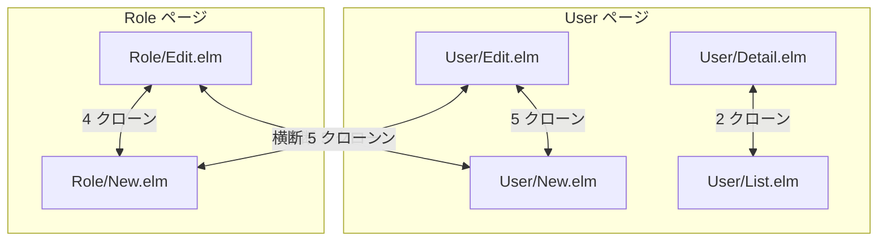
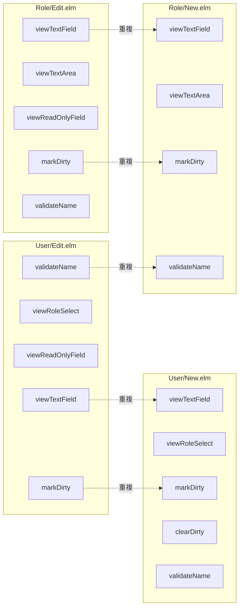
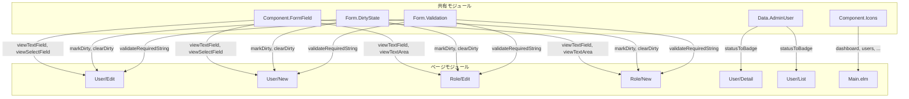
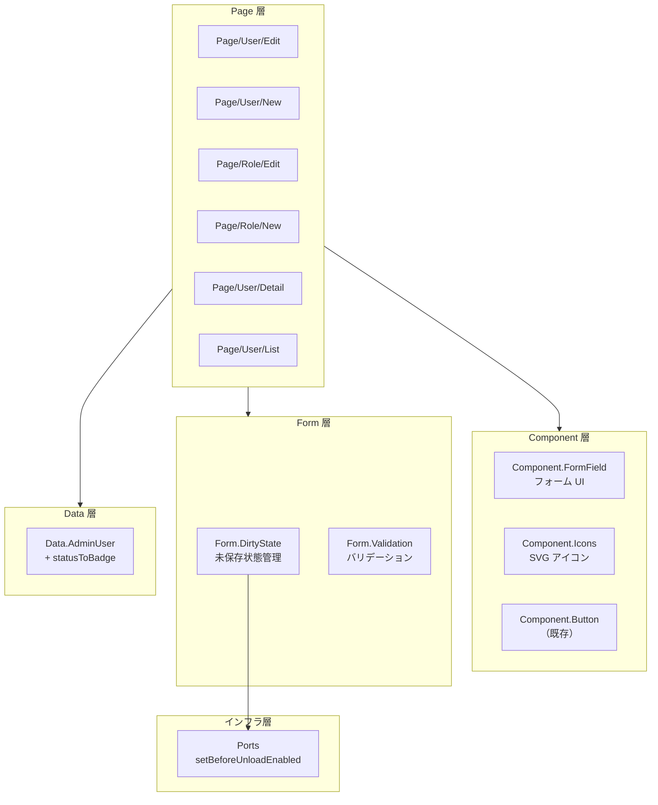

# Elm クローン削減 - 機能解説

対応 PR: #574
対応 Issue: #533

## 概要

Elm フロントエンドの jscpd コードクローンを 16 件から 9 件に削減（重複率 5.25% → 3.62%）し、Main.elm のファイルサイズを 1140 行から 1013 行に削減した。

User/Role の Edit/New ページに散在していたフォーム UI・バリデーション・Dirty フラグ管理の重複を共有モジュールに集約し、Main.elm の SVG アイコン定義を専用モジュールに抽出した。

## 背景

### Epic #467「`just check` / `check-all` の警告をゼロにする」

本 PR は Epic #467 の Story 9 に相当する。Epic #467 は jscpd コードクローンとファイルサイズ超過の警告をゼロにすることを目標としている。

Elm フロントエンドには以下の課題があった:

- jscpd クローン 16 件（重複率 5.25%）: 主に Role/User ページ間のフォーム関連コードの重複
- ファイルサイズ超過 4 件: Main.elm（1140行）、Workflow/Detail.elm（1367行）、Workflow/New.elm（1046行）、Task/Detail.elm（609行）

### クローンの分布

クローンの内訳:

| カテゴリ | 件数 | 内容 |
|---------|------|------|
| User Edit ↔ New フォーム重複 | 5 | viewTextField, viewRoleSelect, markDirty, validateName 等 |
| Role Edit ↔ New フォーム重複 | 4 | viewTextField, viewTextArea, markDirty, validateName 等 |
| Role ↔ User 横断重複 | 5 | markDirty, validateName, フォームボタン群 |
| User Detail ↔ List 共通パターン | 2 | statusToBadge |

### スコープの判断

| 対象 | 判断 | 理由 |
|------|------|------|
| クローン 16 件 | 対象 | 共有モジュール抽出で解消可能 |
| Main.elm アイコン | 対象 | 純粋な移動でファイルサイズ削減 |
| Workflow/Detail.elm | 対象外 | TEA サブモジュール分割が必要。クローンなし |
| Workflow/New.elm | 対象外 | 単一ページ内で責務が完結。クローンなし |
| Task/Detail.elm | 対象外 | 超過が 109 行のみ。効果が限定的 |

## 用語・概念

| 用語 | 説明 | 関連コード |
|------|------|-----------|
| jscpd | コードクローン検出ツール。トークン類似度で重複を判定 | `pnpm exec jscpd` |
| Dirty フラグ | フォームに未保存の変更があることを示すフラグ | `Form.DirtyState` |
| extensible record | Elm の型機能。特定フィールドを持つ任意のレコードを表現 | `{ a \| isDirty_ : Bool }` |
| Dict パイプライン | バリデーション関数を `\|>` で連鎖するパターン | `Form.Validation` |
| beforeunload | ブラウザの「ページ離脱時の確認ダイアログ」イベント | `Ports.setBeforeUnloadEnabled` |

## ビフォー・アフター

### Before（変更前）

各ページが同一のフォーム関連コードをローカルに持っていた。

#### 課題

- 同じ CSS クラス・HTML 構造が 4 ページに散在（viewTextField が 4 コピー）
- Dirty フラグ管理（markDirty/clearDirty）が 4 ページで重複
- バリデーション関数（validateName）が 4 ページで重複（エラーメッセージのみ異なる）
- statusToBadge が User Detail と List で重複

### After（変更後）

共有モジュールに集約し、各ページはエンティティ固有のロジックのみ保持する。

#### 改善点

- フォーム UI が 1 箇所で定義され、スタイル変更が全ページに反映される
- Dirty フラグ管理が型安全に統一（extensible record による制約）
- バリデーションが `fieldLabel` パラメータで動的メッセージ生成
- Main.elm が 127 行削減され、SVG インポートも除去

## アーキテクチャ

新設モジュールの配置は既存のレイヤー構造に従う:

| レイヤー | 既存モジュール | 新設モジュール | 責務 |
|---------|-------------|-------------|------|
| Component | Button, Badge, ConfirmDialog | FormField, Icons | 再利用可能な UI 部品 |
| Form | Validation | DirtyState | フォーム共通ロジック |
| Data | AdminUser, Role | — (AdminUser に追加) | ドメインデータ変換 |

## 設計判断

機能・仕組みレベルの判断を記載する。コード実装レベルの判断は[コード解説](./01_Elmクローン削減_コード解説.md#設計解説)を参照。

### 1. フォームフィールドの集約方法をどうするか

4 ページに散在するフォームフィールド view 関数（viewTextField, viewTextArea, viewSelectField, viewReadOnlyField）を共有化する方法。

| 案 | 認知負荷 | 共通ロジック共有 | 変更時の影響 |
|----|---------|---------------|------------|
| **A: `Component.FormField` に全種別集約（採用）** | 低（1 モジュール） | 容易（inputClass 共有） | 1 ファイル変更 |
| B: 種別ごとに個別モジュール | 高（4 モジュール） | 困難（CSS クラス分散） | 4 ファイル変更 |

**採用理由**: フォームフィールドは共通の設計意図（ラベル + 入力 + エラー表示）を持ち、エラー表示の CSS クラスが全種別で同一。既存の `Component.PermissionMatrix` も複数関数を 1 ファイルに集約するパターン。

### 2. Dirty フラグ管理の共有方法をどうするか

4 ページで重複する markDirty/clearDirty を共有化する方法。

| 案 | 呼び出し側の変更量 | 型安全性 | モデル構造への影響 |
|----|------------------|---------|-----------------|
| **A: extensible record（採用）** | 最小（関数名のみ変更） | 高（フィールド存在を保証） | なし |
| B: 値のみ返す関数 | 中（boilerplate 増加） | 低 | なし |
| C: 別の型に切り出す | 大（全モデル構造変更） | 高 | 大 |

**採用理由**: Elm の extensible record `{ a | isDirty_ : Bool }` により、呼び出し側の変更が最小限（`markDirty model` → `DirtyState.markDirty model`）で型安全性も確保できる。

### 3. バリデーション関数の共有方法をどうするか

4 ページの validateName 関数を共有化する方法。エラーメッセージが「名前」「ロール名」で異なる点が課題。

| 案 | メッセージの柔軟性 | モジュール構成 | 追加コード量 |
|----|------------------|-------------|------------|
| **A: 既存 `Form.Validation` にパラメータ化関数を追加（採用）** | 高（fieldLabel で動的生成） | 既存モジュール活用 | 少 |
| B: 別モジュール `Form.Validation.Common` 作成 | 高 | 新モジュール追加 | 中 |
| C: 各ページのバリデータをそのまま残す | — | 変更なし | なし |

**採用理由**: `Form.Validation` は既にバリデーションの責務を持ち、追加する関数は 1 つ。`fieldLabel` パラメータで「名前を入力してください」「ロール名を入力してください」のメッセージを動的に生成する。

### 4. statusToBadge の配置先をどうするか

User Detail と List で重複する statusToBadge の移動先。

| 案 | ドメイン整合性 | アクセスの自然さ |
|----|-------------|---------------|
| **`Data.AdminUser`（採用）** | 高（ユーザーステータスのドメイン知識） | 高（既存 import に追加） |
| `Component.Badge` | 低（Badge は表示部品） | 中 |
| `Page.User.Common` | 中 | 低（新モジュール必要） |

**採用理由**: `statusToBadge` はユーザーのステータス値をドメイン知識に基づいて変換するロジック。`Data.AdminUser` が既にユーザーデータ型を定義しており、配置先として最適。

## 指標

| 指標 | Before | After | 変化 |
|------|--------|-------|------|
| Elm クローン数 | 16 | 9 | -7 (44%減) |
| Elm 重複率 | 5.25% | 3.62% | -1.63pt |
| Main.elm 行数 | 1140 | 1013 | -127 行 |
| テスト数 | 303 | 321 | +18 |

残り 9 件のクローンはエンティティ固有部分（フォーム submit パターン、RemoteData パターン等）が多く、抽象化の効果が限定的と判断して対象外とした。

## 関連ドキュメント

- [コード解説](./01_Elmクローン削減_コード解説.md)
- [フォーム dirty-state 機能解説](../PR264_フォームdirty-state/01_フォームdirty-state_機能解説.md)（Dirty フラグの初期実装）
- [セッションログ](../../../prompts/runs/2026-02/2026-02-16_2125_Elmクローン削減.md)
- [計画ファイル](../../../prompts/plans/533_elm-clone-reduction.md)
