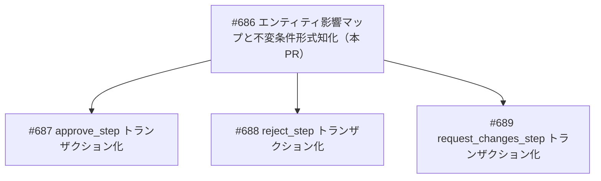
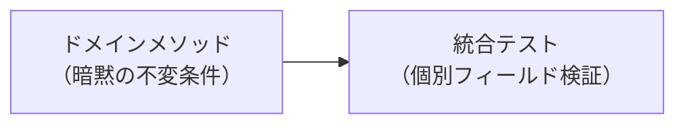
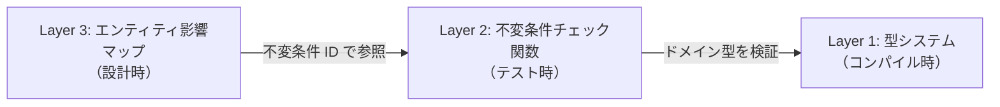
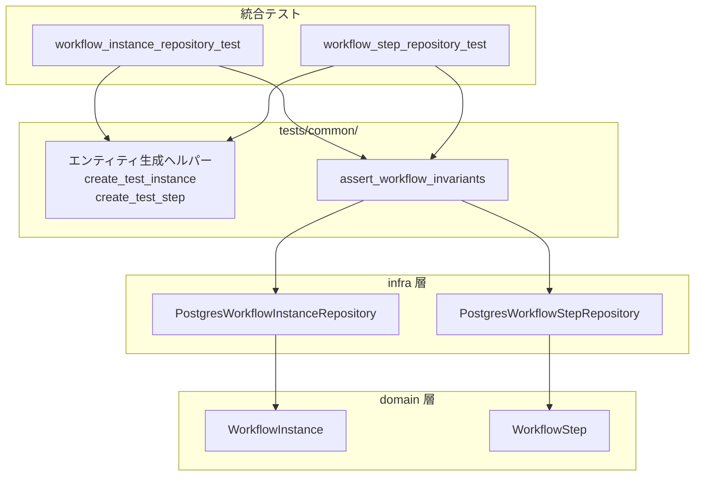

# 不変条件チェック関数 - 機能解説

対応 PR: #691
対応 Issue: #686

## 概要

ワークフロー関連エンティティ（WorkflowInstance, WorkflowStep）の不変条件を形式知化し、統合テストで自動検証する仕組みを導入した。エンティティ影響マップ（ドキュメント）で不変条件を定義し、`assert_workflow_invariants` 関数（テストコード）で自動検証する2層構成。

## 背景

### トランザクション整合性確保の前提知識

ワークフローの判断操作（approve/reject/request_changes）では、WorkflowStep と WorkflowInstance の両方を更新する必要がある。これらの更新が同一トランザクション内で実行されないと、部分的な状態遷移が残る可能性がある。

Epic #685（ワークフローユースケースのトランザクション整合性確保）で段階的に対応する計画であり、本 PR はその前提知識の形式知化を担う。

### 変更前の課題

- 各ユースケースがどのエンティティのどのフィールドを更新するか、体系的に整理されていなかった
- 不変条件（「承認済みインスタンスは completed_at を持つ」など）が暗黙知だった
- テストでは個別のフィールド値を検証していたが、エンティティ間の整合性は検証していなかった

### Epic #685 全体の中での位置づけ

| Issue | 内容 | 状態 |
|-------|------|------|
| #686 | エンティティ影響マップと不変条件の形式知化 | 本 PR |
| #687 | approve_step のトランザクション化 | 未着手 |
| #688 | reject_step のトランザクション化 | 未着手 |
| #689 | request_changes_step のトランザクション化 | 未着手 |

## 用語・概念

| 用語 | 説明 | 関連コード |
|------|------|-----------|
| エンティティ影響マップ | ユースケースごとの更新パス・競合リスク・不変条件を整理したドキュメント | `docs/03_詳細設計書/エンティティ影響マップ/` |
| 不変条件（Invariant） | エンティティの状態が常に満たすべき条件。INV-I*, INV-S*, INV-X* の命名体系で管理 | `assert_workflow_invariants` |
| 楽観的ロック | `version` カラムによる同時更新の検出。更新時に version 不一致なら 409 Conflict | `update_with_version_check` |
| スイスチーズモデル | 多層防御の考え方。単一の防御層に穴があっても、複数層の組み合わせで防ぐ | 下記の防御層参照 |

## ビフォー・アフター

### Before（変更前）

不変条件は各ドメインメソッドの実装に暗黙的に埋め込まれていた。テストは個別フィールドの値を検証するのみ。

#### 制約・課題

- 不変条件の全体像が把握できない
- 新しいユースケース追加時に、既存の不変条件との整合性を見落とすリスク
- クロスエンティティの不変条件が検証されていない

### After（変更後）

3層の防御構造で不変条件を保護する。

| 層 | 防御対象 | タイミング | 本 PR での対応 |
|----|---------|-----------|--------------|
| Layer 1 | 型の誤用 | コンパイル時 | 既存（enum による状態表現） |
| Layer 2 | 状態遷移の整合性違反 | テスト実行時 | `assert_workflow_invariants` |
| Layer 3 | 設計レベルの見落とし | 設計・レビュー時 | エンティティ影響マップ |

#### 改善点

- 不変条件が ID 付きで形式知化された（INV-I1〜I4, INV-S1〜S4, INV-X1〜X3）
- テストに1行追加するだけで全不変条件を自動検証できる
- 不変条件を追加した場合、関数1箇所の修正で全テストに反映される

## アーキテクチャ

## 不変条件一覧

### WorkflowInstance の不変条件

| ID | 条件 | 対応するドメインメソッド |
|----|------|----------------------|
| INV-I1 | status=Approved ⇒ completed_at IS NOT NULL | `complete_with_approval()` |
| INV-I2 | status=Rejected ⇒ completed_at IS NOT NULL | `complete_with_rejection()` |
| INV-I3 | status=InProgress ⇒ current_step_id IS NOT NULL | `with_current_step()`, `advance_to_next_step()` |
| INV-I4 | status=Draft ⇒ submitted_at IS NULL | `new()` |

### WorkflowStep の不変条件

| ID | 条件 | 対応するドメインメソッド |
|----|------|----------------------|
| INV-S1 | 同一 Instance 内で Active なステップは最大1つ | `activated()` |
| INV-S2 | status=Completed ⇒ decision IS NOT NULL | `approve()`, `reject()`, `request_changes()` |
| INV-S3 | status=Completed ⇒ completed_at IS NOT NULL | `approve()`, `reject()`, `request_changes()` |
| INV-S4 | status=Active ⇒ started_at IS NOT NULL | `activated()` |

### クロスエンティティ不変条件

| ID | 条件 | 関連ユースケース |
|----|------|----------------|
| INV-X1 | Instance.status=Approved ⇒ 最終 Completed ステップの decision=Approved | approve_step（最終ステップ） |
| INV-X2 | Instance.status=Rejected ⇒ いずれかのステップの decision=Rejected、かつ後続ステップは全て Skipped | reject_step |
| INV-X3 | Instance.status=InProgress ⇒ Steps が1つ以上存在 | submit_workflow, resubmit_workflow |

## 設計判断

機能・仕組みレベルの判断を記載する。コード実装レベルの判断は[コード解説](./01_不変条件チェック関数_コード解説.md#設計解説)を参照。

### 1. 不変条件の防御をどの層で実現するか

ドキュメント（設計時チェック）のみの予定だったが、テストコード（自動チェック）も実装することで防御層を厚くした。

| 案 | 自動性 | 網羅性 | 実装コスト |
|----|--------|--------|-----------|
| ドキュメントのみ | 手動レビュー依存 | レビュー漏れのリスク | 低 |
| **ドキュメント + テスト関数（採用）** | テスト実行時に自動検証 | 1行追加で全不変条件を検証 | 中 |
| ドメイン層のバリデーション | 常時自動 | 完全 | 高（全メソッドに追加） |

採用理由: スイスチーズモデルの考え方に基づき、コストと効果のバランスが良い中間案を採用。ドメイン層バリデーションはパフォーマンスへの影響と、テスト以外の場面での assertion panic のリスクがある。

### 2. 不変条件の配置場所をどうするか

不変条件の定義をドキュメント体系のどこに配置するかの判断。

| 案 | 参照の容易さ | メンテナンス性 | 整合性リスク |
|----|------------|--------------|-------------|
| **各エンティティ影響マップ内（採用）** | 更新パスと一緒に参照できる | 更新パスと同じファイルで管理 | 低 |
| `.claude/rules/` に独立ファイル | ルールとして強制力が高い | 影響マップとの二重管理 | 高 |
| 影響マップ + rules の両方 | 両方から参照可能 | 二重管理の負担 | 非常に高 |

採用理由: 不変条件はエンティティの状態遷移と密結合であり、影響マップの更新パスと一緒に参照されることが多い。クロスエンティティ不変条件は両方の影響マップに記載し、双方向リンクで参照できるようにした。

### 3. 不変条件の命名体系をどうするか

後続 Issue（#687〜#689）でトランザクション化する際に不変条件を参照しやすくするための命名。

| 案 | 一意性 | 分類のしやすさ | 例 |
|----|--------|--------------|-----|
| **プレフィックス + 連番（採用）** | 高い | エンティティごとに分類 | INV-I1, INV-S2, INV-X3 |
| 自然言語のみ | なし | 分類しにくい | 「承認済みなら completed_at を持つ」 |
| コメントのみ | なし | コードとドキュメントの対応が曖昧 | `// 承認済みチェック` |

採用理由: ID があることで、影響マップ・テストコード・Issue コメントの間で明確に参照できる。プレフィックス（I=Instance, S=Step, X=Cross-entity）で分類も容易。

## 関連ドキュメント

- [コード解説](./01_不変条件チェック関数_コード解説.md)
- [エンティティ影響マップ: WorkflowInstance](../../03_詳細設計書/エンティティ影響マップ/WorkflowInstance.md)
- [エンティティ影響マップ: WorkflowStep](../../03_詳細設計書/エンティティ影響マップ/WorkflowStep.md)
