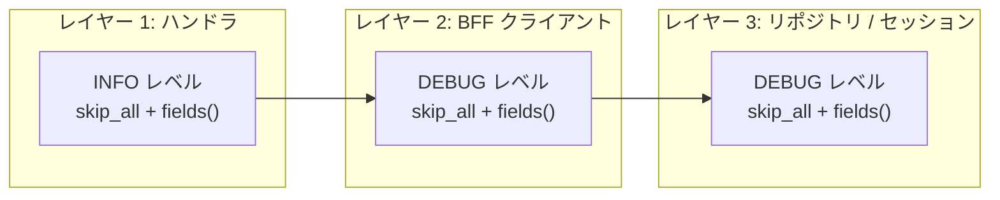
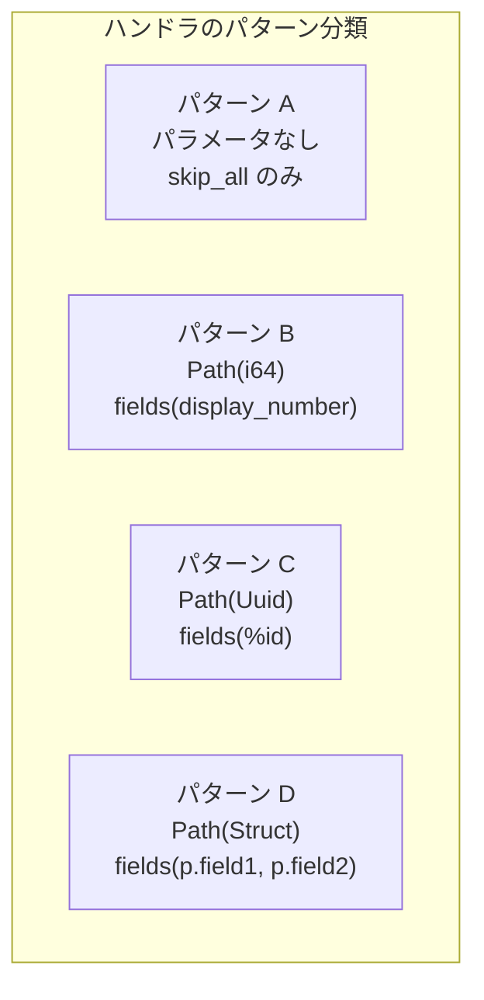
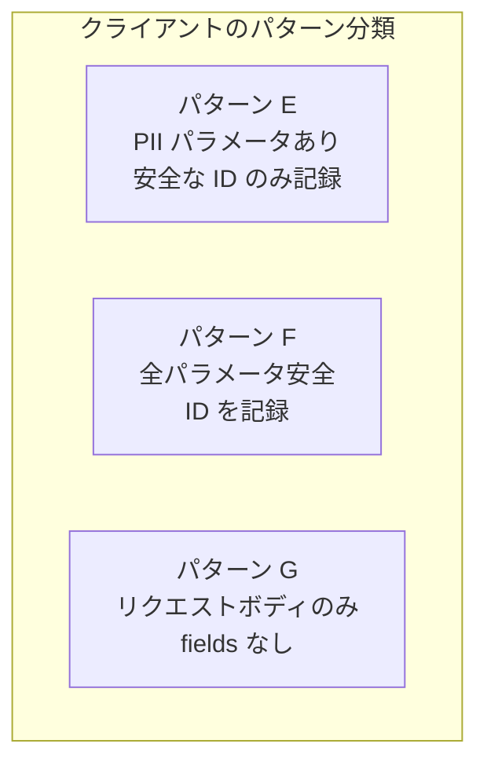
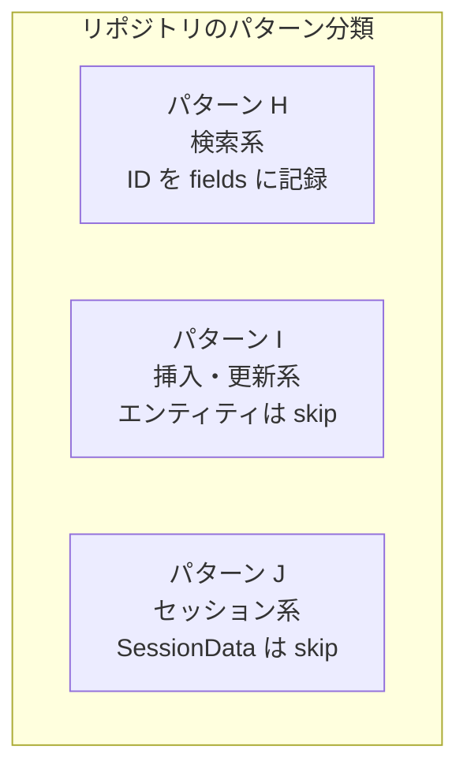

# アプリケーション計装（tracing::instrument） - コード解説

対応 PR: #692
対応 Issue: #654（Epic #648 Observability 基盤 / Story 4）

## 主要な型・関数

本 PR は新しい型や関数を追加せず、既存関数に `#[tracing::instrument]` 属性マクロを付与する。

| 属性 | 使用箇所 | 目的 |
|------|---------|------|
| `#[tracing::instrument]` | 全対象関数 | 関数の入口と出口にスパンを自動挿入 |
| `skip_all` | 全対象関数 | 全パラメータのスパン記録を抑制 |
| `fields()` | ID パラメータを持つ関数 | 安全なフィールドのみ明示的に記録 |
| `level = "debug"` | クライアント・リポジトリ | スパンレベルを DEBUG に設定 |

## コードフロー

本 PR はライフサイクル変更ではなく、既存の関数に属性を追加する横断的な変更。コードフローは「属性のパターン分類」で構成する。



### 1. ハンドラ層の計装（INFO レベル）

リクエスト処理の入口。本番環境でも有効なスパンを生成する。



#### パターン A: パラメータなし

```rust
// backend/apps/bff/src/handler/auth/login.rs
#[utoipa::path(...)]
#[tracing::instrument(skip_all)]  // ①
pub async fn login(
    State(state): State<Arc<AuthState>>,
    headers: HeaderMap,        // ② skip_all で除外
    jar: CookieJar,            // ② skip_all で除外
    Json(req): Json<LoginRequest>,  // ② PII を含むため除外
) -> impl IntoResponse { ... }
```

注目ポイント:

- ① `#[utoipa::path]` の後、`pub async fn` の前に配置。属性の順序は「外側から内側へ」
- ② `State`, `HeaderMap`, `CookieJar`, `Json(req)` はすべて `skip_all` で除外。Debug 出力しても有用な情報がないか、PII を含む

#### パターン B: Path(i64) — display_number

```rust
// backend/apps/bff/src/handler/workflow/query.rs
#[utoipa::path(...)]
#[tracing::instrument(skip_all, fields(display_number))]  // ①
pub async fn get_workflow(
    State(state): State<Arc<WorkflowState>>,
    headers: HeaderMap,
    Path(display_number): Path<i64>,  // ② パラメータ名と fields 名が一致
    Extension(session): Extension<SessionData>,
) -> Result<impl IntoResponse, BffError> { ... }
```

注目ポイント:

- ① `fields(display_number)` — `%` プレフィックスなし。i64 は `Debug` と `Display` が同じ出力なのでどちらでもよい
- ② `Path(display_number)` の変数名と `fields(display_number)` が同名。`tracing` がパラメータ値を自動で取得する

#### パターン C: Path(Uuid) — newtype ID

```rust
// backend/apps/bff/src/handler/workflow/query.rs
#[utoipa::path(...)]
#[tracing::instrument(skip_all, fields(%definition_id))]  // ①
pub async fn get_workflow_definition(
    State(state): State<Arc<WorkflowState>>,
    headers: HeaderMap,
    Path(definition_id): Path<Uuid>,  // ②
    Extension(session): Extension<SessionData>,
) -> Result<impl IntoResponse, BffError> { ... }
```

注目ポイント:

- ① `%definition_id` — `%` プレフィックスで `Display` トレイトを使用。UUID がハイフン区切りの読みやすい形式で記録される
- ② `Path(definition_id)` のパラメータ名と一致

#### パターン D: Path(Struct) — 構造体フィールドへのアクセス

```rust
// backend/apps/bff/src/handler/workflow/command.rs
#[utoipa::path(...)]
#[tracing::instrument(skip_all, fields(
    display_number = params.display_number,       // ①
    step_display_number = params.step_display_number,
))]
pub async fn approve_step(
    State(state): State<Arc<WorkflowState>>,
    headers: HeaderMap,
    Path(params): Path<StepPathParams>,  // ②
    Extension(session): Extension<SessionData>,
    Json(req): Json<StepActionRequest>,
) -> Result<impl IntoResponse, BffError> { ... }
```

注目ポイント:

- ① `params.display_number` — 構造体のフィールドに `=` で明示的にアクセス。`fields(params)` だと構造体全体の Debug 出力になってしまう
- ② `Path(params)` — `StepPathParams` は `display_number: i64` と `step_display_number: i64` を持つ構造体

### 2. BFF クライアント層の計装（DEBUG レベル）

BFF → Core Service / Auth Service の HTTP 通信。`#[async_trait]` の impl ブロック内でメソッドに付与する。



#### パターン E: PII パラメータの除外

```rust
// backend/apps/bff/src/client/auth_service.rs
#[async_trait]
impl AuthServiceClient for AuthServiceClientImpl {
    #[tracing::instrument(skip_all, level = "debug", fields(%tenant_id, %user_id))]  // ①
    async fn verify_password(
        &self,
        tenant_id: Uuid,
        user_id: Uuid,
        password: &str,    // ② PII — skip_all で除外
    ) -> Result<(), AuthServiceError> { ... }
}
```

注目ポイント:

- ① `tenant_id` と `user_id` は安全な ID なので `fields()` で記録。`password` は PII なので `skip_all` で除外
- ② PII の判定は「個人を特定できる情報か」で一律判断。password, email, credential_data が該当

#### パターン F: 全パラメータが安全

```rust
// backend/apps/bff/src/client/core_service/workflow_client.rs
#[tracing::instrument(skip_all, level = "debug", fields(%workflow_id, %step_id))]
async fn approve_step(
    &self,
    workflow_id: Uuid,
    step_id: Uuid,
    req: StepActionRequest,  // リクエストボディは除外（大きい + skip_all で安全側に倒す）
) -> Result<ApiResponse<WorkflowInstanceResponse>, CoreServiceError> { ... }
```

#### パターン G: fields なし（リクエストボディのみ）

```rust
// backend/apps/bff/src/client/core_service/user_client.rs
#[tracing::instrument(skip_all, level = "debug")]  // ①
async fn create_user(
    &self,
    req: CreateUserRequest,  // ② PII（name, email）を含むため fields なし
) -> Result<ApiResponse<UserResponse>, CoreServiceError> { ... }
```

注目ポイント:

- ① `fields()` なし。リクエストボディに PII が含まれる場合、安全な ID を取り出すことも可能だが、`skip_all` でシンプルに除外する方針
- ② `CreateUserRequest` は `name`, `email` 等の PII を含む

### 3. リポジトリ / セッション層の計装（DEBUG レベル）

DB / Redis アクセスの詳細。トラブルシュート時に有用。



#### パターン H: 検索系 — ID を記録

```rust
// backend/crates/infra/src/repository/user_repository.rs
#[tracing::instrument(skip_all, level = "debug", fields(%tenant_id))]  // ①
async fn find_by_email(
    &self,
    tenant_id: &TenantId,  // ② newtype ID — Display で記録
    email: &Email,         // ③ PII — skip_all で除外
) -> Result<Option<User>, InfraError> { ... }
```

注目ポイント:

- ① `%tenant_id` — `TenantId` は `Display` トレイトを実装した newtype。内部の UUID がハイフン区切りで記録される
- ② `&TenantId` は参照型でも `fields(%tenant_id)` で正しく動作する。`tracing` が自動で解決する
- ③ `Email` は PII。Story #651 でカスタム Debug 実装済みだが、`skip_all` で二重に保護

#### パターン I: 挿入・更新系 — エンティティは skip

```rust
// backend/crates/infra/src/repository/user_repository.rs
#[tracing::instrument(skip_all, level = "debug")]  // ①
async fn insert(&self, user: &User) -> Result<(), InfraError> { ... }
```

注目ポイント:

- ① `User` エンティティは大きなオブジェクトで、PII を含む可能性がある。`fields()` なしでスパン名のみ記録

#### パターン J: セッション系 — SessionData は skip

```rust
// backend/crates/infra/src/session.rs
#[tracing::instrument(skip_all, level = "debug")]  // ①
async fn create(&self, data: &SessionData) -> Result<String, InfraError> { ... }

#[tracing::instrument(skip_all, level = "debug", fields(%tenant_id))]  // ②
async fn get(
    &self,
    tenant_id: &TenantId,
    session_id: &str,
) -> Result<Option<SessionData>, InfraError> { ... }
```

注目ポイント:

- ① `SessionData` は email, name 等の PII を含む。`create` は `fields()` なし
- ② `get` は `tenant_id` のみ記録。`session_id` は文字列だが、セッション ID 自体はセキュリティ上の懸念がないため `skip_all` + `tenant_id` のみで十分

## テスト

`#[tracing::instrument]` は関数のシグネチャも戻り値も変えない属性マクロのため、新規テストは不要。

| 検証方法 | 検証内容 |
|---------|---------|
| `cargo check` | 属性の正当性（skip 対象の存在、型の Debug/Display 実装） |
| 既存ユニットテスト（421 件） | 振る舞いが変わっていないこと |
| 既存統合テスト（158 件） | DB/Redis アクセスの振る舞いが変わっていないこと |
| `just check-all` | lint + test + API test 全通過 |

PII 非漏洩は Story #651 のテスト（`test_ログインリクエストのdebug出力はメールアドレスとパスワードをマスクする` 等）で担保済み。

### 実行方法

```bash
just check-all  # 全テスト実行
```

## 設計解説

コード実装レベルの判断を記載する。機能・仕組みレベルの判断は[機能解説](./01_tracing-instrument_機能解説.md#設計判断)を参照。

### 1. `%` プレフィックスの使い分け

場所: 全対象ファイル

```rust
// Uuid / newtype ID → % あり（Display）
fields(%tenant_id, %user_id)

// i64 → % なし（Debug）
fields(display_number)
```

なぜこの実装か:

`%` は `Display` トレイトで記録し、なしは `Debug` トレイトで記録する。UUID は `Display` だとハイフン区切り（`550e8400-e29b-41d4-a716-446655440000`）で読みやすい。i64 は `Debug` も `Display` も同じ出力のため、プレフィックス不要。

### 2. 属性の配置順序

場所: BFF ハンドラ（`#[utoipa::path]` がある関数）

```rust
#[utoipa::path(...)]                    // ① OpenAPI 仕様
#[tracing::instrument(skip_all, ...)]   // ② トレーシング
pub async fn handler(...) -> ... { }    // ③ 関数定義
```

なぜこの実装か:

Rust の属性マクロは外側から順に適用される。`utoipa::path` が先に関数のメタデータを読み取り、`instrument` がスパン生成コードを挿入する。順序を逆にすると `utoipa` が `instrument` の生成コードを解析することになり、意図しない動作になる可能性がある。

### 3. `#[async_trait]` との併用

場所: クライアント・リポジトリの trait impl ブロック

```rust
#[async_trait]
impl UserRepository for PostgresUserRepository {
    #[tracing::instrument(skip_all, level = "debug", fields(%tenant_id))]  // ①
    async fn find_by_email(&self, ...) -> ... { ... }
}
```

なぜこの実装か:

`#[async_trait]` はトレイトレベルの属性、`#[instrument]` はメソッドレベルの属性。`async_trait` が `async fn` を `Pin<Box<dyn Future>>` に変換した後、`instrument` がスパン生成コードを挿入する。この組み合わせは `tracing` のドキュメントでも推奨されている。

### 4. 構造体フィールドへのアクセス

場所: `Path(params)` パターンのハンドラ

```rust
// 採用: 構造体フィールドに直接アクセス
fields(display_number = params.display_number, step_display_number = params.step_display_number)

// 代替案: params 全体を Debug で記録
fields(?params)
```

| 案 | メリット | デメリット | 判断 |
|----|---------|-----------|------|
| フィールド個別アクセス | 必要な情報のみ記録、型安全 | fields が長くなる | 採用 |
| 構造体全体の Debug | 簡潔 | 不要なフィールドも記録される | 見送り |

## 関連ドキュメント

- [機能解説](./01_tracing-instrument_機能解説.md)
- [Epic #648: Observability 基盤の設計と段階的実装](https://github.com/ka2kama/ringiflow/issues/648)
- [セッションログ](../../../prompts/runs/2026-02/2026-02-19_2217_tracing-instrument計装.md)
- [計画ファイル](../../../prompts/plans/654_tracing-instrument.md)
