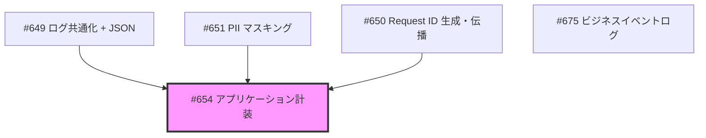
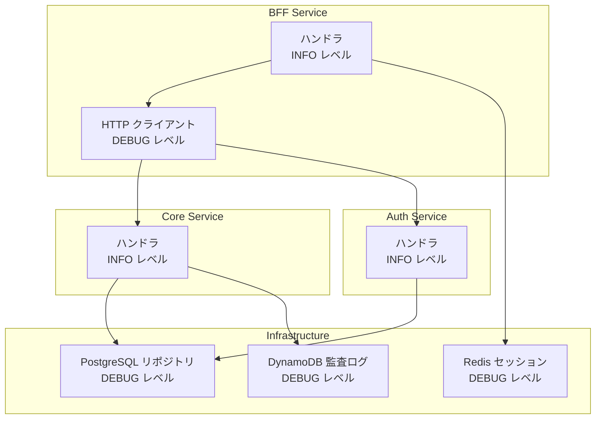
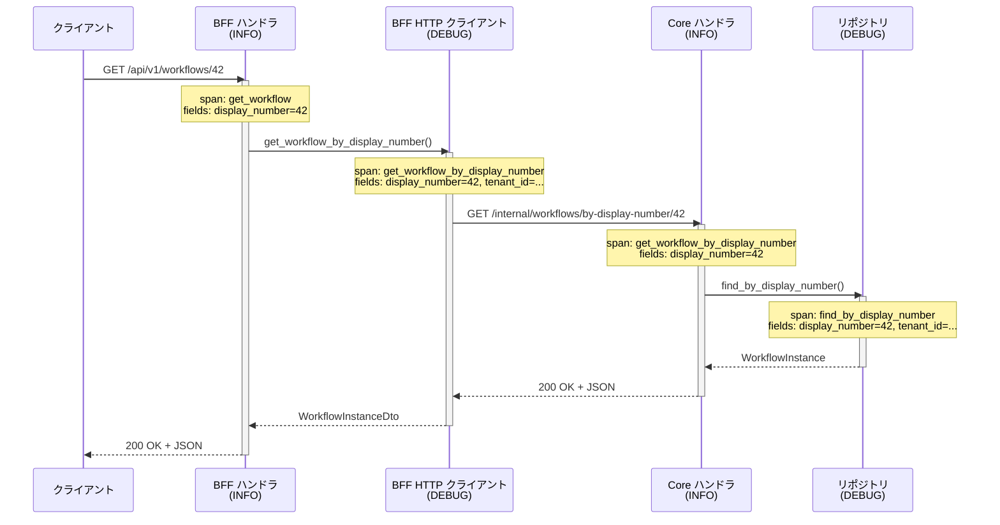

# アプリケーション計装（tracing::instrument） - 機能解説

対応 PR: #692
対応 Issue: #654（Epic #648 Observability 基盤 / Story 4）

## 概要

`tracing::instrument` 属性マクロを全アプリケーションスタック（ハンドラ、BFF HTTP クライアント、リポジトリ、セッションマネージャ）に導入し、関数レベルのスパン構造を確立した。これにより、1 リクエストの処理フローをハンドラ → クライアント → リポジトリの各層で追跡可能になる。

## 背景

### Observability 基盤の段階的実装

Epic #648 では Observability（可観測性）基盤を段階的に実装している。運用設計書で定義された監視・ログ管理の要件と実装のギャップを埋めることが目的。

本 PR は Story 4 に対応し、先行 Story の成果を前提としている。

### 変更前の課題

- `tracing::instrument` の使用箇所が 0。関数内部の処理時間やネスト構造が可視化されていない
- `TraceLayer::new_for_http()` による HTTP リクエスト/レスポンスレベルのトレースは存在するが、関数レベルのスパンがない
- 障害調査時に「どの関数で時間がかかっているか」を特定する手段がない

### Epic 全体の中での位置づけ

| Issue | 内容 | 状態 |
|-------|------|------|
| #649 | ログ共通化 + JSON フォーマット | 完了 |
| #650 | Request ID 生成・伝播 | 完了 |
| #651 | PII マスキング基盤 | 完了 |
| **#654** | **アプリケーション計装** | **本 PR** |
| #675 | ビジネスイベントログ | 完了 |

## 用語・概念

| 用語 | 説明 | 関連コード |
|------|------|-----------|
| スパン（Span） | 処理の開始から終了までを表す構造化された時間区間。親子関係を持つ | `tracing::instrument` が自動生成 |
| `skip_all` | 全パラメータのスパンへの記録を抑制するオプション | `#[tracing::instrument(skip_all)]` |
| `fields()` | スパンに明示的にフィールドを追加するオプション | `fields(%tenant_id, display_number)` |
| `%` プレフィックス | フィールドを `Display` トレイトで記録する指定 | `fields(%tenant_id)` — UUID 形式で読みやすい |
| PII | 個人を特定できる情報（メール、パスワード、氏名等） | Story #651 でカスタム Debug 実装済み |

## アーキテクチャ

計装の対象範囲を、アプリケーションのレイヤー構成の中に位置づける。

### 対象と対象外

| 対象 | 対象外（理由） |
|------|--------------|
| 全サービスの HTTP ハンドラ | `health_check`（LB の高頻度呼び出しでノイズ） |
| BFF → Core/Auth の HTTP クライアント | ユースケース層（入口と出口で十分） |
| PostgreSQL リポジトリ | ミドルウェア（Tower TraceLayer で別途カバー） |
| Redis セッションマネージャ | テスト用スタブ/モック |
| DynamoDB 監査ログリポジトリ | `dev_auth.rs`、deletion モジュール |

## データフロー

### スパンのネスト構造

1 リクエストが生成するスパンの親子関係を示す。

### ログフィルタとの連携

`RUST_LOG` 環境変数でスパンの記録レベルを制御する。

| フィルタ設定 | 記録されるスパン |
|------------|----------------|
| `info` | ハンドラのみ |
| `info,ringiflow=debug` | ハンドラ + クライアント + リポジトリ（推奨） |
| `debug` | 全モジュールの DEBUG スパン |

## 設計判断

機能・仕組みレベルの判断を記載する。コード実装レベルの判断は[コード解説](./01_tracing-instrument_コード解説.md#設計解説)を参照。

### 1. パラメータの記録方式をどうするか

全関数のパラメータを自動でスパンに記録するか、安全なものだけを明示的に選択するか。

| 案 | PII 漏洩リスク | 新パラメータ追加時 | 実装負荷 |
|----|--------------|-------------------|---------|
| **`skip_all` + `fields()`（採用）** | ゼロ（ホワイトリスト方式） | 安全（デフォルトで記録されない） | fields の明示が必要 |
| デフォルト（全パラメータ記録） | 高い（PII が漏洩する） | 危険（skip 漏れのリスク） | 低い |
| 個別 `skip` | 中程度（skip 漏れのリスク） | 危険（新パラメータの skip を忘れる） | skip の管理が必要 |

**採用理由**: PII 漏洩リスクをゼロにするため。Story #651 の PII マスキング方針（型レベルで防止）と一貫したアプローチ。

### 2. スパンレベルをどう設計するか

全関数を同一レベルにするか、レイヤーごとに使い分けるか。

| 案 | 本番時のノイズ | トラブルシュート時の情報量 | 柔軟性 |
|----|-------------|----------------------|--------|
| **レイヤー別（INFO / DEBUG）（採用）** | 少ない（ハンドラのみ） | 十分（DEBUG に切替で全層表示） | 高い |
| 全て INFO | 多い | 最大 | 低い |
| 全て DEBUG | 少ない（デフォルトで非表示） | 最大（ただし常に DEBUG が必要） | 中程度 |

**採用理由**: 本番ではハンドラレベルのスパンで概要を把握し、障害調査時に `RUST_LOG=debug` に切り替えて詳細を取得する運用を想定。

### 3. 計装する層をどこまで広げるか

ユースケース層を含めるか、ハンドラとリポジトリだけにするか。

| 案 | スパン数 | 追跡精度 | 保守コスト |
|----|---------|---------|----------|
| **ハンドラ + クライアント + リポジトリ（採用）** | ~137 | 入口と出口で十分 | 低い |
| 全レイヤー（ユースケース含む） | ~200+ | 最大 | 高い（ユースケース変更時にメンテ） |
| ハンドラのみ | ~50 | 低い（内部の処理時間が見えない） | 最低 |

**採用理由**: ハンドラ（入口）とリポジトリ（出口）のスパンがあれば、処理時間のボトルネックは特定できる。ユースケース層は将来必要になったら追加可能。

## 関連ドキュメント

- [コード解説](./01_tracing-instrument_コード解説.md)
- [Epic #648: Observability 基盤の設計と段階的実装](https://github.com/ka2kama/ringiflow/issues/648)
- [セッションログ](../../../prompts/runs/2026-02/2026-02-19_2217_tracing-instrument計装.md)
- [計画ファイル](../../../prompts/plans/654_tracing-instrument.md)
