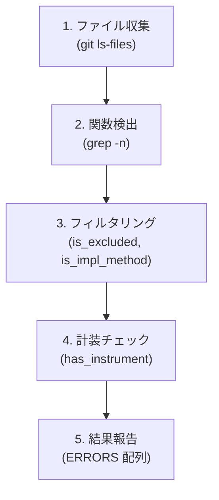
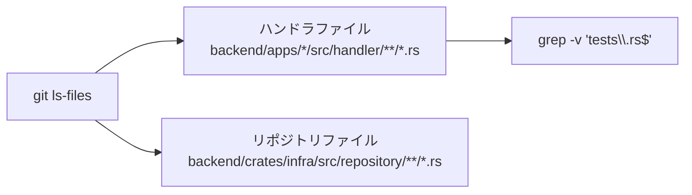
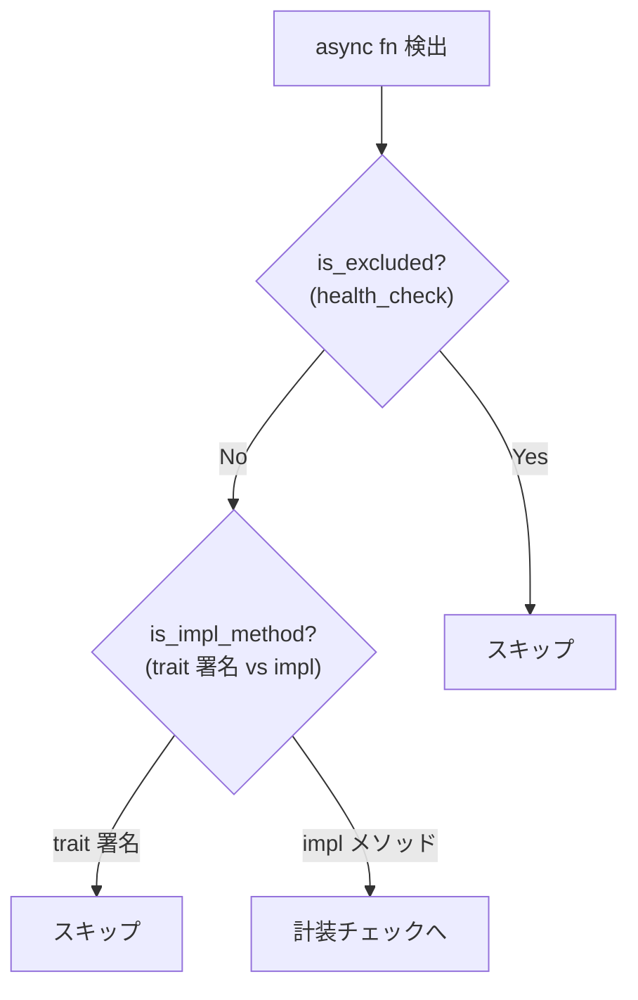
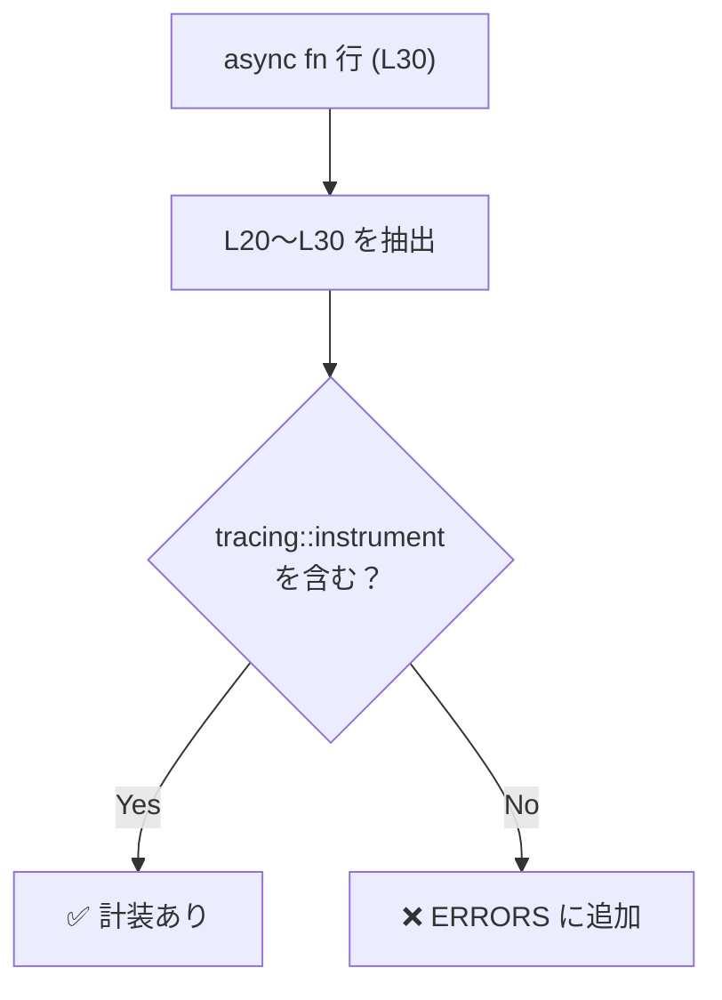

# Observability 構造的担保 - コード解説

対応 PR: #697
対応 Issue: #696

> 注: 本ドキュメントは PR #697 で導入された Shell スクリプト（`instrumentation.sh`）の実装を解説している。PR #842 で `syn` クレートによる AST 解析を用いた rust-script（`instrumentation.rs`）に置き換えられた。以下のコード解説は、テキストベースの lookback 方式による元の設計を記録した歴史的ドキュメントである。

## 主要な型・関数

現在の実装（rust-script）:

| 型/関数 | ファイル | 責務 |
|--------|---------|------|
| `is_excluded()` | [`scripts/check/instrumentation.rs:71`](../../../scripts/check/instrumentation.rs) | 関数名が除外リストに含まれるか判定 |
| `has_instrument_attr()` | [`scripts/check/instrumentation.rs:51`](../../../scripts/check/instrumentation.rs) | `syn::Attribute` から `tracing::instrument` を検出 |
| `check_handler_file()` | [`scripts/check/instrumentation.rs:76`](../../../scripts/check/instrumentation.rs) | ハンドラの計装チェック（`Item::Fn` を走査） |
| `check_repository_file()` | [`scripts/check/instrumentation.rs:112`](../../../scripts/check/instrumentation.rs) | リポジトリ impl の計装チェック（`Item::Impl` を走査） |

元の Shell 実装では `is_impl_method()` で trait 署名と impl メソッドを前方スキャン（`{` vs `;`）で判別していたが、`syn` の AST 解析（`Item::Trait` vs `Item::Impl`）により構造的に判別されるため不要になった。

以下のコードフローは元の Shell 実装（`instrumentation.sh`）の解説:

## コードフロー

コードをライフサイクル順に追う。各ステップの構造を図で示した後、対応するコードを解説する。



### 1. ファイル収集（スクリプト実行時）

`git ls-files` で Git 管理下のファイルのみを対象にする。`find` ではなく `git ls-files` を使うことで、`.gitignore` 対象のファイルを自動的に除外する。



```bash
# scripts/check/instrumentation.sh:72-76
files=$(git ls-files 'backend/apps/*/src/handler/**/*.rs' | grep -v 'tests\.rs$' || true)  # ①
if [[ -z "$files" ]]; then
    return  # ②
fi
```

注目ポイント:

- ① `tests.rs` をファイル名ベースで除外。ハンドラディレクトリ内のテストファイルが誤検知されることを防ぐ
- ② ファイルが見つからない場合は空振りで正常終了（`|| true` でパイプラインエラーを抑制）

### 2. 関数検出（ファイルごと）

ファイル内の `pub async fn`（ハンドラ）または `async fn`（リポジトリ）を `grep -n` で行番号付きで検出する。

```bash
# scripts/check/instrumentation.sh:80-81
while IFS=: read -r line_num _; do
    # ...
done < <(grep -n 'pub async fn ' "$file" || true)  # ①
```

注目ポイント:

- ① プロセス置換（`< <(...)`）で `grep` の結果を while ループに渡す。パイプ（`|`）と異なり、ループ内の変数変更が親シェルに反映される

### 3. フィルタリング（関数ごと）

検出された関数に対して 2 種類のフィルタを適用する。



#### trait 署名 vs impl メソッドの判別

リポジトリファイルには trait 定義と impl ブロックの両方が含まれる。trait 署名は計装対象外のため、前方スキャンで判別する。

```bash
# scripts/check/instrumentation.sh:31-55
is_impl_method() {
    local file="$1"
    local start_line="$2"
    # ...
    for (( i = start_line; i <= max_line; i++ )); do  # ①
        local line
        line=$(sed -n "${i}p" "$file")
        if [[ "$line" =~ \{[[:space:]]*$ ]]; then     # ②
            return 0  # impl メソッド
        fi
        if [[ "$line" =~ \;[[:space:]]*$ ]]; then     # ③
            return 1  # trait 署名
        fi
    done
    return 1
}
```

注目ポイント:

- ① `async fn` の行から最大 20 行を前方スキャン。複数行にわたる関数シグネチャに対応
- ② 行末が `{` なら impl メソッドの本体開始と判定
- ③ 行末が `;` なら trait 署名の終了と判定

判別の根拠:

```rust
// trait 署名: ; で終了
async fn find_by_id(
    &self,
    tenant_id: &TenantId,
    id: &WorkflowInstanceId,
) -> AppResult<Option<WorkflowInstance>>;

// impl メソッド: { で終了
async fn find_by_id(
    &self,
    tenant_id: &TenantId,
    id: &WorkflowInstanceId,
) -> AppResult<Option<WorkflowInstance>> {
    // ...
}
```

### 4. 計装チェック（lookback スキャン）

関数定義行の上方 10 行以内に `tracing::instrument` 文字列があるかをチェックする。



```bash
# scripts/check/instrumentation.sh:58-68
has_instrument() {
    local file="$1"
    local line_num="$2"
    local lookback=10  # ①
    local start=$((line_num - lookback))
    if (( start < 1 )); then
        start=1
    fi

    sed -n "${start},${line_num}p" "$file" | grep -q 'tracing::instrument'  # ②
}
```

注目ポイント:

- ① lookback 距離を 10 行に設定。`#[utoipa::path(...)]` 等の他の属性マクロが `#[tracing::instrument]` と `pub async fn` の間に入るケースを想定
- ② `grep -q` で存在チェックのみ実行（出力なし、exit code で判定）

### 5. 結果報告

全チェック完了後、`ERRORS` 配列の件数で成否を判定する。

```bash
# scripts/check/instrumentation.sh:128-136
if [ ${#ERRORS[@]} -gt 0 ]; then
    echo "❌ 計装漏れが見つかりました (${#ERRORS[@]} 件):"
    for error in "${ERRORS[@]}"; do
        echo "  - $error"  # ①
    done
    exit 1  # ②
fi

echo "✅ すべてのハンドラ・リポジトリに計装が設定されています"
```

注目ポイント:

- ① エラーメッセージに `ファイル:行番号: 関数名` を含め、修正箇所を特定しやすくする
- ② `exit 1` で CI をブロック（`impl-docs.sh` と同じパターン）

## テスト

CI チェックスクリプトのため自動テストはなく、手動検証で確認した。

| 検証項目 | 確認内容 | 結果 |
|---------|---------|------|
| 正常系 | 既存コードで exit 0 | ✅ |
| `health_check` 除外 | 3 サービスの `health_check` が検出されない | ✅ |
| trait 署名除外 | リポジトリの trait 署名が検出されない | ✅ |
| ShellCheck | `just lint-shell` が通過 | ✅ |
| CI 統合 | `just check-instrumentation` が動作 | ✅ |
| actionlint | `just lint-ci` が通過 | ✅ |
| 全体チェック | `just check-all` が通過 | ✅ |

### 実行方法

```bash
just check-instrumentation
# または直接実行
rust-script ./scripts/check/instrumentation.rs
```

## 設計解説

コード実装レベルの判断を記載する。機能・仕組みレベルの判断は[機能解説](./01_Observability構造的担保_機能解説.md#設計判断)を参照。

### 1. `git ls-files` vs `find` によるファイル収集

場所: `scripts/check/instrumentation.sh:72-73`

```bash
files=$(git ls-files 'backend/apps/*/src/handler/**/*.rs' | grep -v 'tests\.rs$' || true)
```

なぜこの実装か:
Git 管理下のファイルのみを対象にするため。ビルド成果物や一時ファイルが混入しない。既存の `impl-docs.sh` でも同じパターンを採用している。

代替案:

| 案 | メリット | デメリット | 判断 |
|----|---------|-----------|------|
| **`git ls-files`（採用）** | `.gitignore` 自動除外、CI で確実 | glob パターンが Git 依存 | 採用 |
| `find` | 標準的 | ビルド成果物が混入する可能性 | 見送り |

### 2. lookback 方式 vs AST 解析

場所: `scripts/check/instrumentation.sh:58-68`

```bash
sed -n "${start},${line_num}p" "$file" | grep -q 'tracing::instrument'
```

なぜこの実装か:
bash スクリプトで Rust の AST 解析は現実的でないため、テキストベースの lookback で十分な精度を確保する。10 行の lookback 距離は、属性マクロの配置パターンを考慮した経験的な値。

代替案:

| 案 | 精度 | 実装コスト | 判断 |
|----|------|-----------|------|
| **テキスト lookback（採用）** | 十分（偽陽性/偽陰性なし） | 低 | 採用 |
| `syn` クレートで AST 解析 | 完璧 | 高（Rust プログラム作成が必要） | 見送り |
| `tree-sitter` で構文解析 | 高 | 中（ツール依存追加） | 見送り |

### 3. 既存パターン（ERRORS 配列）の踏襲

場所: `scripts/check/instrumentation.sh:13`

```bash
ERRORS=()
```

なぜこの実装か:
`impl-docs.sh` が確立した ERRORS 配列パターンを踏襲。エラーを即座に出力するのではなく配列に蓄積し、最後にまとめて報告する。これにより全件の概要を把握しやすくなる。

## 関連ドキュメント

- [機能解説](./01_Observability構造的担保_機能解説.md)
- [Observability 設計書](../../03_詳細設計書/14_Observability設計.md)
- [既存パターン参照: impl-docs.rs](../../../scripts/check/impl-docs.rs)
- [ルールファイル: observability.md](../../../.claude/rules/observability.md)
