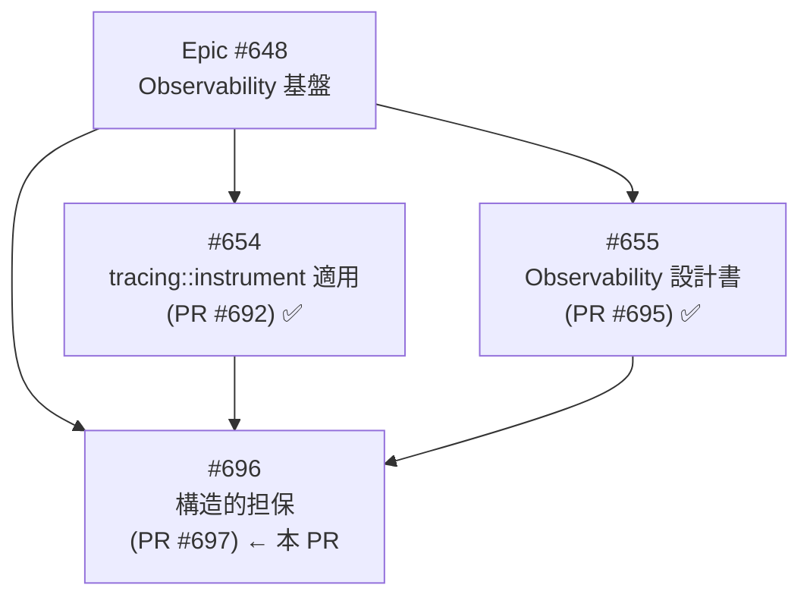
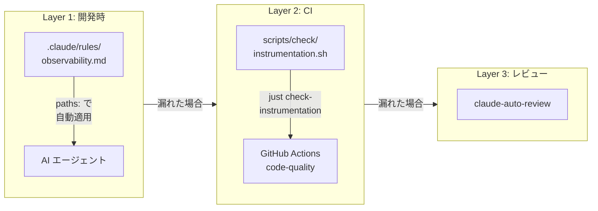
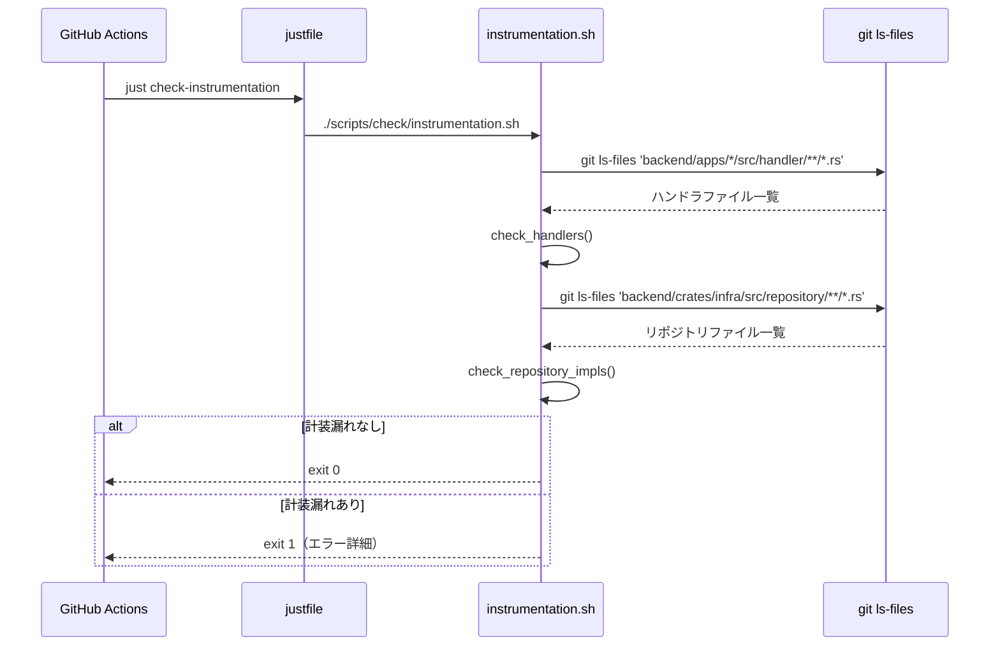
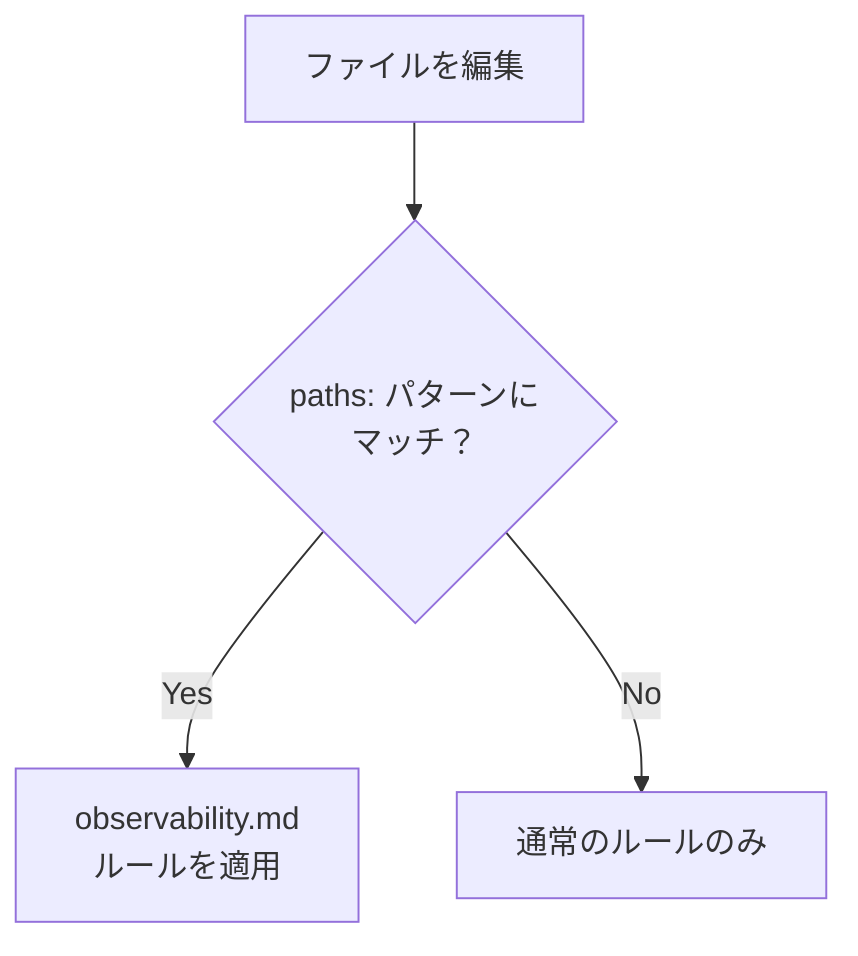

# Observability 構造的担保 - 機能解説

対応 PR: #697
対応 Issue: #696

## 概要

新規コードが Observability パターン（`#[tracing::instrument]`）に従うことを構造的に担保する仕組みを導入した。AI エージェント用ルールファイル、CI チェックスクリプト、CI ワークフロー統合の 3 層で構成される。

## 背景

### Epic #648 での Observability 基盤

Epic #648 で `#[tracing::instrument]` を全ハンドラ・リポジトリ・クライアントに適用し（PR #692）、Observability 設計書を作成した（PR #695）。計装パターンは確立されているが、新規コードがそのパターンに従う保証はなかった。

### 変更前の課題

- ハンドラやリポジトリメソッドを追加しても、`#[tracing::instrument]` を付け忘れた場合に検知する仕組みがない
- AI エージェント（Claude Code）が新規コードを生成する際、計装パターンを知らなければ無計装のコードが生成される
- CLAUDE.md の「割れ窓理論」基準に該当: 「この判断を放置すると、後続の実装で同じパターンが使われるか？」→ Yes

### Epic 全体の中での位置づけ

| Issue | 内容 | 状態 |
|-------|------|------|
| #654 | `tracing::instrument` をアプリケーション全体に適用 | ✅ 完了（PR #692） |
| #655 | Observability 設計書の作成 | ✅ 完了（PR #695） |
| #696 | 構造的担保（CI チェック + ルールファイル） | 本 PR |

## 用語・概念

| 用語 | 説明 | 関連コード |
|------|------|-----------|
| 計装（instrumentation） | 関数にトレーシングスパンを付与すること | `#[tracing::instrument]` |
| `skip_all` | スパンに関数引数を記録しない設定。PII 保護のデフォルト | `#[tracing::instrument(skip_all)]` |
| trait 署名 | trait 定義内のメソッド宣言（本体なし、`;` で終了） | `async fn find(...) -> ...;` |
| impl メソッド | trait の実装メソッド（本体あり、`{` で開始） | `async fn find(...) -> ... {` |

## アーキテクチャ

3 層の防御で「割れ窓」を防ぐ。

| 層 | 仕組み | タイミング | 強制力 |
|----|--------|-----------|--------|
| Layer 1 | `.claude/rules/observability.md` | AI がコード生成時 | ルールファイルで自動適用 |
| Layer 2 | `scripts/check/instrumentation.sh` | CI 実行時 | exit 1 でブロック |
| Layer 3 | `claude-auto-review.yaml` | PR レビュー時 | コメントで指摘（既存） |

## データフロー

### フロー 1: CI チェックの実行

| # | 処理 | 詳細 |
|---|------|------|
| 1 | ファイル収集 | `git ls-files` でハンドラ・リポジトリのファイルを取得 |
| 2 | ハンドラチェック | `pub async fn` を検出し、上方 10 行に `tracing::instrument` があるか確認 |
| 3 | リポジトリチェック | `async fn` を検出し、trait 署名を除外してから同様に確認 |
| 4 | 結果報告 | エラーがあれば件数とファイル:行番号を報告して exit 1 |

### フロー 2: ルールファイルの適用

AI エージェントがファイルを編集する際、`.claude/rules/observability.md` の `paths:` frontmatter にマッチするファイルパターンに対して自動的にルールが適用される。

## 設計判断

機能・仕組みレベルの判断を記載する。コード実装レベルの判断は[コード解説](./01_Observability構造的担保_コード解説.md#設計解説)を参照。

### 1. BFF HTTP クライアントを CI チェック対象に含めるか

ルールファイルの `paths:` には BFF クライアントを含めるが、CI スクリプトの対象にするかを判断する必要があった。

| 案 | チェック精度 | 実装コスト | 偽陽性リスク |
|----|------------|-----------|-------------|
| **対象外（採用）** | ルールファイルでカバー | 低 | なし |
| 対象に含める | CI で完全検知 | 高（trait/impl 判別が複雑） | 中 |

**採用理由**: Issue #696 のスコープがハンドラ + リポジトリであり、BFF クライアントは既に全て計装済み。ルールファイルの `paths:` で AI ガードとして十分。

### 2. CI チェックの強制力をどうするか

計装漏れ検出時の CI の振る舞いを判断する必要があった。

| 案 | 強制力 | 運用負荷 |
|----|--------|---------|
| **exit 1 でブロック（採用）** | 高（マージ不可） | 低（漏れは即修正） |
| 警告のみ（exit 0） | 低（無視可能） | 高（漏れが蓄積） |

**採用理由**: 計装は設計方針で必須と定めており、既存の `impl-docs.sh` と同様にブロッキングチェックとする。

## 関連ドキュメント

- [コード解説](./01_Observability構造的担保_コード解説.md)
- [Observability 設計書](../../03_詳細設計書/14_Observability設計.md)
- [アプリケーション計装 - 機能解説](../PR692_アプリケーション計装/01_tracing-instrument_機能解説.md)
- [ルールファイル: observability.md](../../../.claude/rules/observability.md)
