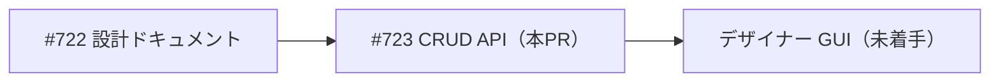
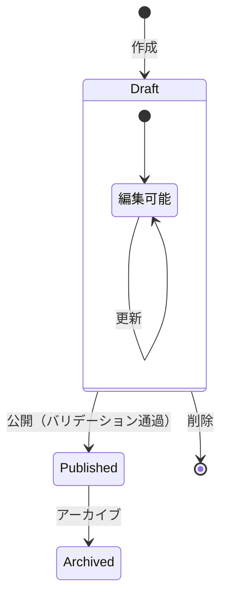
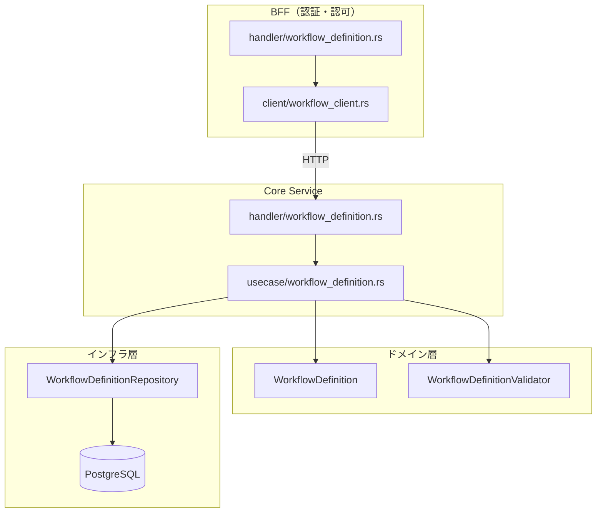
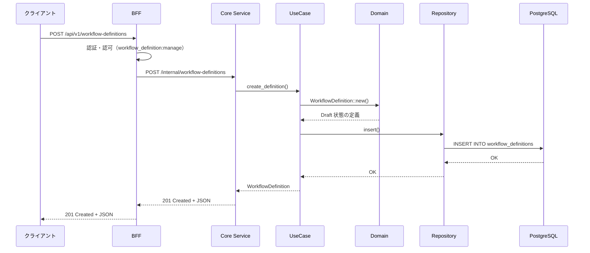
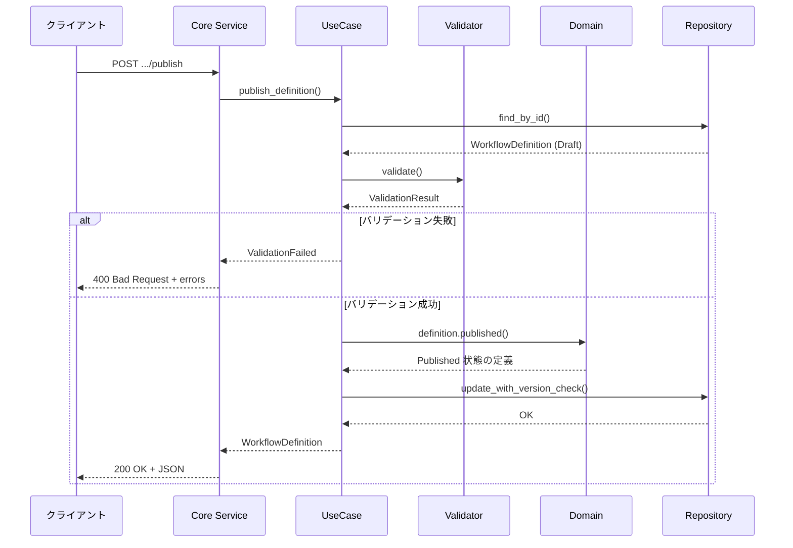
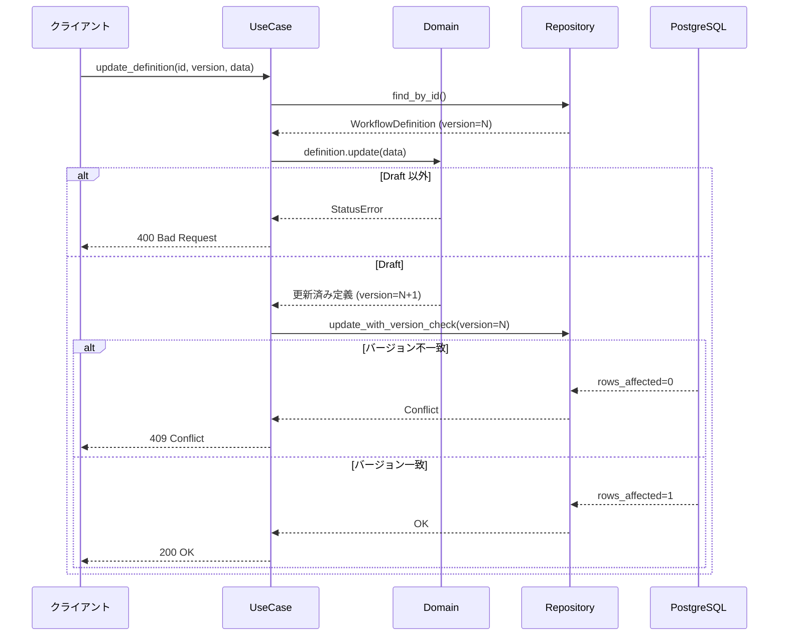

# ワークフロー定義 CRUD - 機能解説

対応 PR: #730
対応 Issue: #723

## 概要

ワークフロー定義のライフサイクル管理 API を実装した。定義の作成・更新・公開・アーカイブ・削除の 5 操作を、Domain → UseCase → Core Service → BFF の 4 レイヤーで提供する。公開時には 10 のバリデーションルールで定義の整合性を検証する。

## 背景

### ワークフロー定義の管理方式

従来、ワークフロー定義は DB シードで管理されており、API は一覧・取得（読み取り専用）のみ提供していた。ワークフローデザイナー GUI（#722）の前提として、定義を API 経由で CRUD 操作できるようにする必要がある。

### Epic 全体の中での位置づけ

本 PR は Epic #405（ワークフローデザイナー）の一部。

| Issue | 内容 | 状態 |
|-------|------|------|
| #722 | 機能仕様書・詳細設計 | 完了 |
| #723 | CRUD API 実装（本 PR） | 完了 |
| — | デザイナー GUI | 未着手 |

## 用語・概念

| 用語 | 説明 | 関連コード |
|------|------|-----------|
| ワークフロー定義 | 承認フローの構造（ステップ、遷移、フォーム）を記述する JSON データ | `WorkflowDefinition` |
| ステータス | 定義のライフサイクル状態（Draft / Published / Archived） | `WorkflowDefinitionStatus` |
| 楽観的ロック | version カラムによる並行更新の競合検出 | `update_with_version_check()` |
| バリデーション | 定義 JSON の構造的整合性を検証する 10 のルール | `WorkflowDefinitionValidator` |

## エンドポイント

### BFF（公開 API）

| メソッド | パス | 説明 | 権限 |
|---------|------|------|------|
| POST | `/api/v1/workflow-definitions` | 定義作成（Draft） | `workflow_definition:manage` |
| PUT | `/api/v1/workflow-definitions/{id}` | 定義更新 | `workflow_definition:manage` |
| DELETE | `/api/v1/workflow-definitions/{id}` | 定義削除（Draft のみ） | `workflow_definition:manage` |
| POST | `/api/v1/workflow-definitions/{id}/publish` | 公開 | `workflow_definition:manage` |
| POST | `/api/v1/workflow-definitions/{id}/archive` | アーカイブ | `workflow_definition:manage` |
| POST | `/api/v1/workflow-definitions/validate` | バリデーションのみ | `workflow_definition:manage` |

### Core Service（内部 API）

BFF の各エンドポイントに対応する内部 API を `/internal/workflow-definitions` 配下に提供。加えて、既存の一覧・取得 API も拡張。

## 状態遷移

| 操作 | 許可される状態 | 結果の状態 | 備考 |
|------|--------------|-----------|------|
| 作成 | — | Draft | 常に Draft で作成 |
| 更新 | Draft | Draft | バージョンインクリメント |
| 公開 | Draft | Published | バリデーション必須 |
| アーカイブ | Published | Archived | — |
| 削除 | Draft | — | Published/Archived は削除不可 |

## アーキテクチャ

## データフロー

### フロー 1: 定義の作成

### フロー 2: 定義の公開（バリデーション付き）

### フロー 3: 更新（楽観的ロック）

## バリデーションルール

公開時に実行される 10 のルール。全ルールを検証し、エラーを集約して返却する。

| # | ルール | エラーコード | 説明 |
|---|--------|------------|------|
| 1 | start ステップが正確に 1 つ | `INVALID_START_STEP` | 0 個または複数は不可 |
| 2 | end ステップが 1 つ以上 | `MISSING_END_STEP` | 終了ステップが必要 |
| 3 | approval ステップが 1 つ以上 | `MISSING_APPROVAL_STEP` | 承認ステップが必要 |
| 4 | ステップ ID が一意 | `DUPLICATE_STEP_ID` | 重複 ID は不可 |
| 5 | 遷移が有効なステップを参照 | `INVALID_TRANSITION_REF` | 存在しない ID への遷移は不可 |
| 6 | 孤立ステップなし | `ORPHANED_STEP` | start から到達不能なステップは不可 |
| 7 | 循環（サイクル）なし | `CYCLE_DETECTED` | DAG であること（3 色 DFS で検証） |
| 8 | approval ステップの遷移完備 | `INCOMPLETE_APPROVAL` | approve/reject 両方の遷移が必要 |
| 9 | フォームフィールド ID が一意 | `DUPLICATE_FIELD_ID` | フォーム内の重複 ID は不可 |
| 10 | フォームフィールドの整合性 | `INVALID_FIELD` | type、label、select options の検証 |

## エラーハンドリング

| エラー | 発生箇所 | HTTP Status | 説明 |
|-------|---------|-------------|------|
| NotFound | UseCase（find_by_id が None） | 404 | 指定 ID の定義が存在しない |
| StatusError | Domain（状態遷移制約） | 400 | 許可されない操作（Published の更新等） |
| ValidationFailed | UseCase（公開時バリデーション） | 400 | バリデーションルール違反 |
| VersionConflict | Repository（楽観的ロック） | 409 | 並行更新の競合 |
| Unauthorized | BFF（認証） | 401 | 未認証 |
| Forbidden | BFF（認可） | 403 | `workflow_definition:manage` 権限なし |

## 設計判断

機能・仕組みレベルの判断を記載する。コード実装レベルの判断は[コード解説](./01_ワークフロー定義CRUD_コード解説.md#設計解説)を参照。

### 1. 楽観的ロックの方式をどうするか

並行更新の競合を検出する仕組みが必要。

| 案 | 精度 | 実装コスト | 運用性 |
|----|------|-----------|--------|
| **version カラム（採用）** | 確実（インクリメンタル） | 低 | シンプル |
| updated_at タイムスタンプ | タイムスタンプ精度に依存 | 低 | 精度問題のリスク |
| ETag ヘッダー | 確実 | 中（HTTP レイヤーの対応） | REST 標準的 |

採用理由: version カラムはタイムスタンプの精度問題を回避でき、実装もシンプル。ETag は HTTP レイヤーの追加対応が必要で、現時点ではオーバー。

### 2. バリデーションの実行タイミングをどうするか

定義 JSON のバリデーションをいつ実行するか。

| 案 | UX | 安全性 | 実装コスト |
|----|------|--------|-----------|
| 更新時のみ | 即座にフィードバック | Draft でも不整合を防止 | 低 |
| **公開時のみ（採用）** | 編集中は自由に保存可能 | 公開前に全ルール検証 | 低 |
| 更新時 + 公開時 | 最良 | 最高 | 中 |

採用理由: Draft は作業中の状態であり、途中段階で不整合があるのは自然。公開時にゲートを設けることで、UX（自由な編集）と安全性（公開品質の保証）を両立する。別途 validate エンドポイントも提供し、任意タイミングでの検証も可能。

### 3. 権限モデルをどうするか

`workflow:*` のワイルドカードマッチを拡張するか、独立した権限を追加するか。

| 案 | 既存への影響 | 粒度 | 実装コスト |
|----|------------|------|-----------|
| `workflow:*` を拡張 | 既存の権限チェックに影響する可能性 | 粗い | 中（マッチロジック変更） |
| **`workflow_definition:manage` を独立追加（採用）** | なし | 細かい | 低（マイグレーションのみ） |

採用理由: 既存の `workflow:*` は `starts_with("workflow:")` でマッチするため、`workflow_definition:manage` は自動的にマッチしない。独立した権限として追加することで、既存の権限体系に影響を与えずに拡張できる。

### 4. エラー集約パターンをどうするか

バリデーションエラーの報告方式。

| 案 | UX | 実装コスト |
|----|------|-----------|
| 最初のエラーで中断 | 1 つずつ修正が必要 | 低 |
| **全エラーを集約して返却（採用）** | 一度に全問題を把握可能 | 中 |

採用理由: ユーザーが一度のリクエストで全ての問題を把握でき、修正サイクルが短縮される。バリデーションルール間に依存関係がなく、独立して検証可能なため実装も自然。

## 関連ドキュメント

- [コード解説](./01_ワークフロー定義CRUD_コード解説.md)
- [機能仕様書: ワークフローデザイナー](../../01_要件定義書/機能仕様書/04_ワークフローデザイナー.md)
- [詳細設計: ワークフローデザイナー](../../03_詳細設計書/15_ワークフローデザイナー設計.md)
