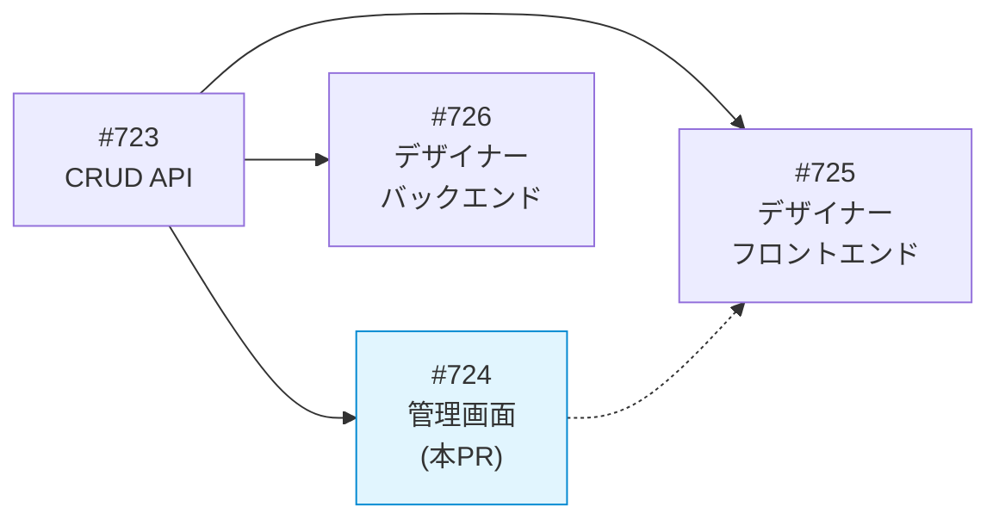
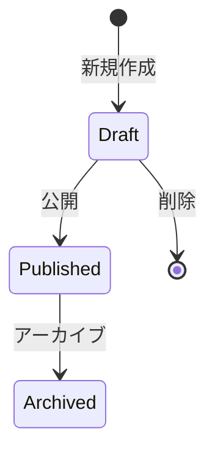
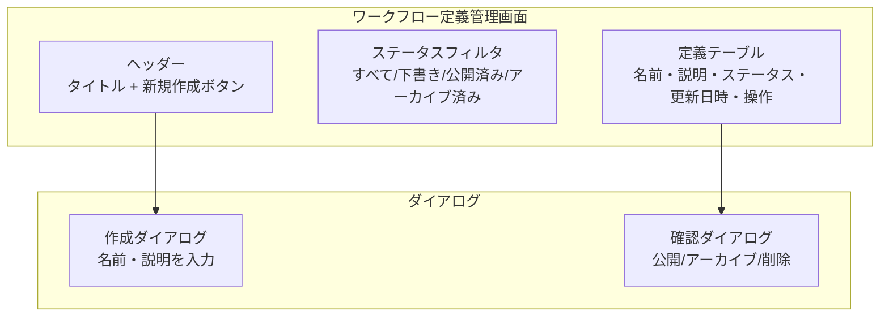
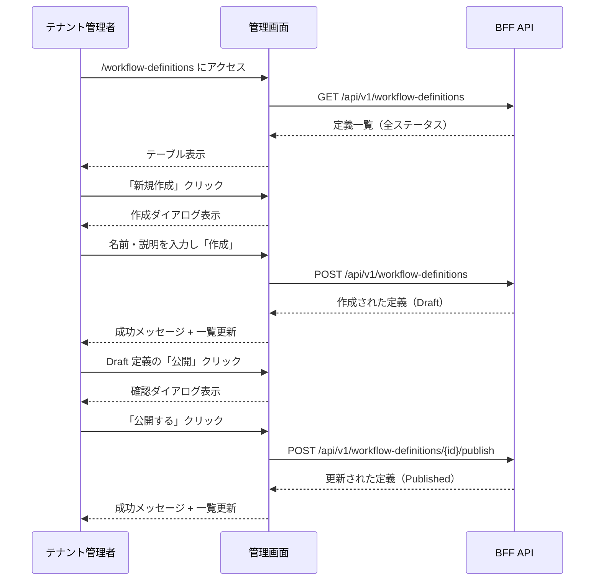
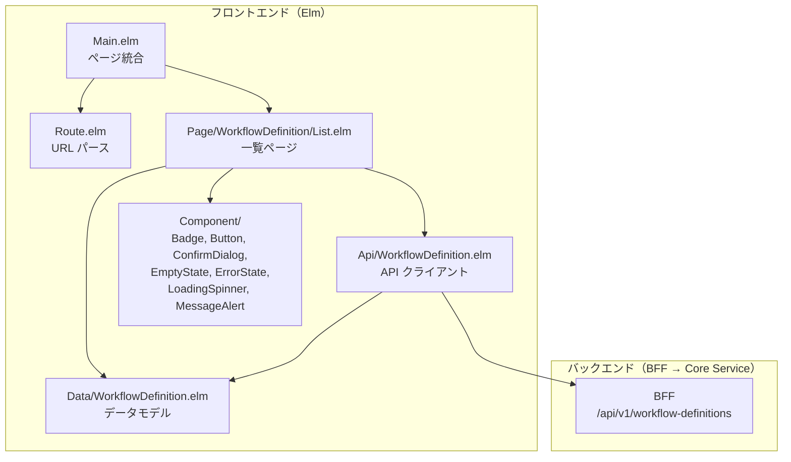

# ワークフロー定義管理画面 - 機能解説

対応 PR: #734
対応 Issue: #724

## 概要

テナント管理者がワークフロー定義を GUI で管理するための画面。一覧表示・新規作成・公開・アーカイブ・削除の全 CRUD 操作に対応する。バックエンドの CRUD API（PR #730）が提供する 8 エンドポイントのうち、管理画面に必要な 5 操作（一覧・作成・公開・アーカイブ・削除）をフロントエンドから利用する。

## 背景

### Epic #405（ワークフローデザイナー）の中での位置づけ

本 PR は Epic #405 の一部であり、定義の「管理」を担う。デザイナー（定義の視覚的編集）は #725/#726 で別途実装する。

管理画面は定義のライフサイクル管理（作成・公開・アーカイブ）に責務を持ち、定義の中身の編集はデザイナーの責務。

### ワークフロー定義のライフサイクル

ワークフロー定義は 3 つの状態を持ち、一方向に遷移する。

| 状態 | 意味 | 申請での使用 | 管理画面での操作 |
|------|------|-------------|---------------|
| Draft（下書き） | 作成直後、編集中 | 不可 | 公開、削除 |
| Published（公開済み） | ユーザーが申請に使用可能 | 可 | アーカイブ |
| Archived（アーカイブ済み） | 運用終了 | 不可 | なし |

## 用語・概念

| 用語 | 説明 | 関連コード |
|------|------|-----------|
| ワークフロー定義 | 承認フローの雛形。名前、説明、定義 JSON、ステータスを持つ | `WorkflowDefinition` 型 |
| 定義 JSON（definition） | 承認ステップやフォームフィールドを記述する JSON 構造 | `WorkflowDefinition.definition` フィールド |
| 楽観的ロック | 公開・アーカイブ時に `version` を送信し、競合を検出する仕組み | `encodeVersionRequest` |
| PendingAction | 確認ダイアログで保留中の操作を型で表現する仕組み | `PendingAction` 型 |

## フロー

### 画面構成

### ユーザー操作フロー

## アーキテクチャ

## 設計判断

機能・仕組みレベルの判断を記載する。コード実装レベルの判断は[コード解説](./01_ワークフロー定義管理_コード解説.md#設計解説)を参照。

### 1. 作成 UI をダイアログにするか、別ページにするか

作成時の入力項目は名前と説明の 2 つだけ。定義 JSON の編集はデザイナー（#725/#726）の責務。

| 案 | 入力量との適合 | 遷移の複雑さ | 実装量 |
|----|-------------|-------------|--------|
| **ダイアログ（採用）** | 2 フィールドに適合 | ページ遷移なし | 少 |
| 別ページ | 過剰 | ルート追加が必要 | 多 |

採用理由: 入力が最小限であり、一覧ページのコンテキストを離れる必要がない。

### 2. ステータスフィルタを URL パラメータに対応させるか

URL クエリパラメータ（`?status=draft`）に対応するとブックマーク可能になるが、Elm の URL パーサーに変更が必要。

| 案 | ブックマーク性 | 実装の複雑さ | 現時点での必要性 |
|----|-------------|-------------|---------------|
| **クライアントサイド（採用）** | 不可 | 低 | 十分 |
| URL パラメータ | 可 | 高（Route 型の拡張） | 過剰 |

採用理由: 管理画面の利用頻度からブックマーク性は不要。YAGNI。

### 3. デザイナーへの遷移をどうするか

Issue には「Draft 作成 → デザイナーへ遷移」とあるが、デザイナー（#725/#726）は未実装。

| 案 | Story 独立性 | ユーザー体験 |
|----|------------|-------------|
| **作成後は一覧更新のみ（採用）** | 高（依存なし） | 一覧で Draft を確認可能 |
| プレースホルダーリンク | 低（リンク切れ） | 混乱を招く |

採用理由: Story 独立性を優先。デザイナーへの遷移リンクは #725 で追加する。

## 関連ドキュメント

- [コード解説](./01_ワークフロー定義管理_コード解説.md)
- [ワークフローデザイナー詳細設計](../../03_詳細設計書/15_ワークフローデザイナー設計.md)
- [CRUD API 実装解説](../PR730_ワークフロー定義CRUD/)
