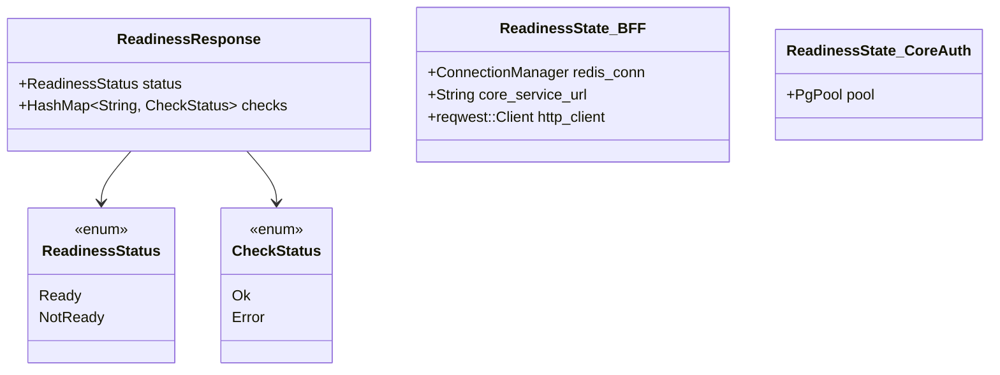
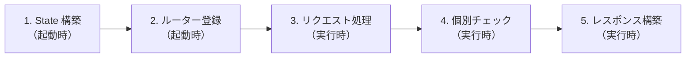
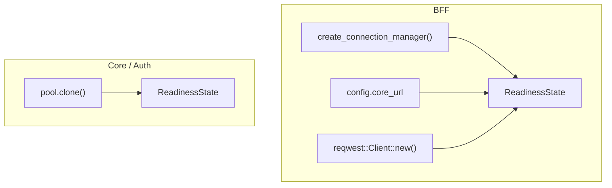
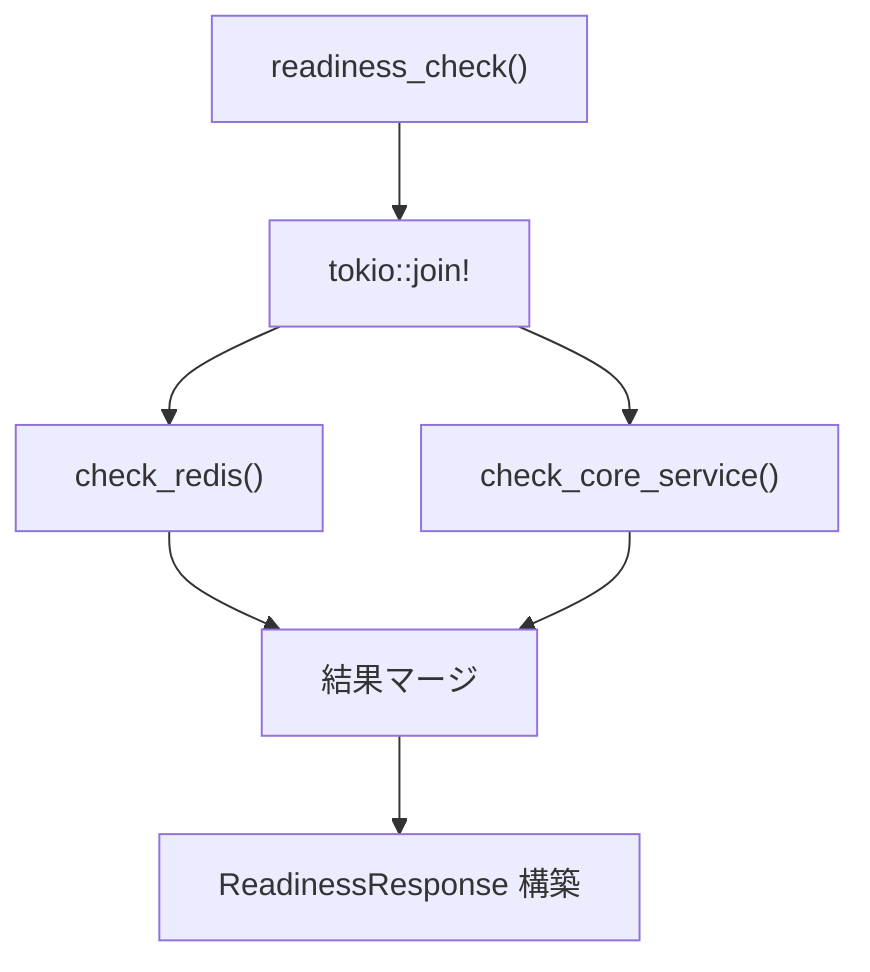

# Readiness Check エンドポイント - コード解説

対応 PR: #737
対応 Issue: #736

## 主要な型・関数

| 型/関数 | ファイル | 責務 |
|--------|---------|------|
| `CheckStatus` | [`shared/src/health.rs:39`](../../../backend/crates/shared/src/health.rs) | 個別チェックの結果（Ok / Error） |
| `ReadinessStatus` | [`shared/src/health.rs:50`](../../../backend/crates/shared/src/health.rs) | 全体のステータス（Ready / NotReady） |
| `ReadinessResponse` | [`shared/src/health.rs:79`](../../../backend/crates/shared/src/health.rs) | Readiness Check のレスポンス型 |
| `ReadinessState`（BFF） | [`bff/src/handler/health.rs:33`](../../../backend/apps/bff/src/handler/health.rs) | Redis + Core Service 接続情報 |
| `ReadinessState`（Core/Auth） | [`core-service/src/handler/health.rs:25`](../../../backend/apps/core-service/src/handler/health.rs) | PgPool を保持 |
| `readiness_check`（BFF） | [`bff/src/handler/health.rs:52`](../../../backend/apps/bff/src/handler/health.rs) | BFF のハンドラ |
| `readiness_check`（Core） | [`core-service/src/handler/health.rs:33`](../../../backend/apps/core-service/src/handler/health.rs) | Core のハンドラ |

### 型の関係



## コードフロー

コードをライフサイクル順に追う。起動時の State 構築からリクエスト処理までの流れを解説する。



### 1. State 構築（起動時）

各サービスの `main.rs` で `ReadinessState` を構築する。依存リソースへの接続情報を保持する。



#### BFF（`bff/src/main.rs`）

```rust
// bff/src/main.rs
// SessionManager とは別の Redis 接続を作成                // ①
let readiness_redis_conn = redis::create_connection_manager(&config.redis_url)
    .await
    .expect("Redis への接続に失敗しました（readiness check 用）");

let readiness_state = Arc::new(ReadinessState {
    redis_conn:       readiness_redis_conn,
    core_service_url: config.core_url.clone(),              // ②
    http_client:      reqwest::Client::new(),               // ③
});
```

注目ポイント:

- ① `SessionManager` は `ConnectionManager` を内部に持つが公開していないため、専用の接続を作成
- ② Core Service の URL を保持し、`/health/ready` を呼ぶ際に使用
- ③ HTTP クライアントは State で共有（リクエストごとの生成を避ける）

#### Core Service（`core-service/src/main.rs`）

```rust
// core-service/src/main.rs
let readiness_state = Arc::new(ReadinessState { pool: pool.clone() });
```

Auth Service も同一パターンだが、`pool` が後続の `PostgresCredentialsRepository::new(pool)` で move されるため、`pool.clone()` をその前に実行する。

### 2. ルーター登録（起動時）

`/health/ready` を `.merge()` + `.with_state()` で既存ルーターに追加する。

```rust
// 各サービス共通パターン
let app = Router::new()
    .route("/health", get(health_check))
    .merge(                                                 // ①
        Router::new()
            .route("/health/ready", get(readiness_check))
            .with_state(readiness_state),                   // ②
    )
    // ... 既存ルート
```

注目ポイント:

- ① `.merge()` で既存ルーターと結合。`/health` は State なし、`/health/ready` は `ReadinessState` が必要なため分離
- ② `.with_state()` で `ReadinessState` を注入。`Arc<ReadinessState>` が axum の `State` 抽出子で自動的に取り出される

### 3. リクエスト処理（実行時 — BFF）

BFF の `readiness_check` は Redis と Core Service を並行チェックする。



```rust
// bff/src/handler/health.rs:52-77
pub async fn readiness_check(State(state): State<Arc<ReadinessState>>) -> impl IntoResponse {
    let (redis_result, core_result) = tokio::join!(     // ①
        check_redis(state.redis_conn.clone()),
        check_core_service(&state.http_client, &state.core_service_url),
    );

    let mut checks = HashMap::new();
    checks.insert("redis".to_string(), redis_result);
    checks.insert("core_api".to_string(), core_result.core_api);    // ②
    checks.insert("database".to_string(), core_result.database);    // ③

    let all_ok = checks.values().all(|s| matches!(s, CheckStatus::Ok));
    // ... status / http_status 決定 → レスポンス返却
}
```

注目ポイント:

- ① `tokio::join!` で並行実行。Redis チェックと Core Service チェックは互いに独立
- ② Core Service の API 到達性を `core_api` キーで記録
- ③ Core Service のレスポンスから `database` キーをマッピング（BFF 自身は DB に直接接続しない）

### 4. 個別チェック（実行時）

#### Redis チェック

```rust
// bff/src/handler/health.rs:80-90
async fn check_redis(mut conn: ConnectionManager) -> CheckStatus {
    match tokio::time::timeout(                             // ①
        Duration::from_secs(5),
        redis::cmd("PING").query_async::<String>(&mut conn),
    )
    .await
    {
        Ok(Ok(_)) => CheckStatus::Ok,
        _ => CheckStatus::Error,                            // ②
    }
}
```

注目ポイント:

- ① 5 秒のタイムアウト。Redis がハングした場合でもレスポンスを返せる
- ② タイムアウト（`Err(Elapsed)`）と Redis エラー（`Ok(Err(_))`）を同じ `Error` として扱う

#### Core Service チェック

```rust
// bff/src/handler/health.rs:102-127
async fn check_core_service(client: &reqwest::Client, base_url: &str) -> CoreCheckResult {
    let url = format!("{base_url}/health/ready");
    match tokio::time::timeout(Duration::from_secs(5), client.get(&url).send()).await {
        Ok(Ok(response)) => {
            match response.json::<ReadinessResponse>().await {  // ①
                Ok(body) => CoreCheckResult {
                    core_api: CheckStatus::Ok,
                    database: body.checks.get("database")       // ②
                        .cloned()
                        .unwrap_or(CheckStatus::Error),
                },
                Err(_) => CoreCheckResult { core_api: CheckStatus::Error, database: CheckStatus::Error },
            }
        }
        _ => CoreCheckResult { core_api: CheckStatus::Error, database: CheckStatus::Error },
    }
}
```

注目ポイント:

- ① `response.json()` は HTTP ステータスに関係なくボディをパースする。Core が 503 を返しても `ReadinessResponse` を取得できる
- ② Core のレスポンスから `database` キーを取得。キーがなければ `Error` にフォールバック

#### DB チェック（Core / Auth 共通パターン）

```rust
// core-service/src/handler/health.rs:55-65（auth-service も同一）
async fn check_database(pool: &PgPool) -> CheckStatus {
    match tokio::time::timeout(
        Duration::from_secs(5),
        sqlx::query("SELECT 1").execute(pool),              // ①
    )
    .await
    {
        Ok(Ok(_)) => CheckStatus::Ok,
        _ => CheckStatus::Error,
    }
}
```

注目ポイント:

- ① `sqlx::query("SELECT 1")` は動的クエリ。`sqlx::query!()` マクロと異なり `.sqlx/` キャッシュ不要。接続プールの取得 → クエリ実行 → 結果取得の全パスを検証する

### 5. レスポンス構築（実行時）

全チェック結果を集約し、HTTP ステータスとレスポンスボディを決定する。

```rust
// 各サービス共通パターン
let all_ok = checks.values().all(|s| matches!(s, CheckStatus::Ok));
let status = if all_ok { ReadinessStatus::Ready } else { ReadinessStatus::NotReady };
let http_status = if all_ok { StatusCode::OK } else { StatusCode::SERVICE_UNAVAILABLE };

(http_status, Json(ReadinessResponse { status, checks }))   // ①
```

注目ポイント:

- ① axum の `(StatusCode, Json<T>)` タプルが `IntoResponse` を実装。HTTP ステータスとボディを同時に返せる

## テスト

各テストがライフサイクルのどのステップを検証しているかを示す。

| テスト | 検証対象 | 検証内容 |
|-------|---------|---------|
| `test_check_status_okのserialize結果` | 型の Serialize | `CheckStatus::Ok` → `"ok"` |
| `test_check_status_errorのserialize結果` | 型の Serialize | `CheckStatus::Error` → `"error"` |
| `test_readiness_status_readyのserialize結果` | 型の Serialize | `ReadinessStatus::Ready` → `"ready"` |
| `test_readiness_status_not_readyのserialize結果` | 型の Serialize | `ReadinessStatus::NotReady` → `"not_ready"` |
| `test_readiness_response_readyのserialize結果` | レスポンス構築 | Ready + database: Ok のレスポンス形状 |
| `test_readiness_response_not_readyのserialize結果` | レスポンス構築 | NotReady + database: Error のレスポンス形状 |
| `test_readiness_responseにtoschemaが実装されている` | OpenAPI | ToSchema derive の検証 |
| `test_全パスが含まれている` | ルーター登録 | `/health/ready` が OpenAPI に含まれる |
| `test_全タグが含まれている` | ルーター登録 | `health` タグが OpenAPI に含まれる |
| `health_ready.hurl` (API テスト) | E2E | 200 + `status == "ready"` + 各 checks |

### 実行方法

```bash
# ユニットテスト
cd backend && cargo test --all-features -p ringiflow-shared

# OpenAPI テスト
cd backend && cargo test --all-features -p ringiflow-bff --test openapi_spec

# API テスト（サーバー起動が必要）
just test-api
```

## 依存関係

| クレート/パッケージ | 追加先 | 追加理由 |
|-------------------|--------|---------|
| `sqlx` | core-service, auth-service の `Cargo.toml` | `sqlx::query("SELECT 1")` による DB チェック |
| `redis` | bff の `Cargo.toml` | `redis::cmd("PING")` による Redis チェック |

いずれも workspace の既存依存に含まれており、新規クレートの追加ではない。`Cargo.toml` の `[dependencies]` セクションに明示的に追加した。

## 設計解説

コード実装レベルの判断を記載する。機能・仕組みレベルの判断は[機能解説](./01_ReadinessCheck_機能解説.md#設計判断)を参照。

### 1. `.merge()` + `.with_state()` による State 分離

場所: 各サービスの `main.rs`

```rust
let app = Router::new()
    .route("/health", get(health_check))                    // State なし
    .merge(
        Router::new()
            .route("/health/ready", get(readiness_check))
            .with_state(readiness_state),                   // ReadinessState
    )
```

なぜこの実装か: `/health` は State 不要だが `/health/ready` は `ReadinessState` が必要。axum の `.with_state()` はルーター全体に適用されるため、`.merge()` で分離して異なる State を注入する。

代替案:

| 案 | メリット | デメリット | 判断 |
|----|---------|-----------|------|
| `.merge()` で分離（採用） | State の範囲が明確 | ネストが深くなる | 採用 |
| `AppState` に `Option` で持たせる | ルーター構造がフラット | 不要な State が全ハンドラに伝播 | 見送り |

### 2. `ConnectionManager` の値渡し（clone）

場所: `bff/src/handler/health.rs:55`

```rust
check_redis(state.redis_conn.clone())
```

なぜこの実装か: `ConnectionManager` は内部で `Arc` を使用しており、`clone()` は軽量（ポインタのコピー）。`tokio::join!` のブランチに所有権を渡す必要があるため値渡しが自然。

### 3. `sqlx::query()` vs `sqlx::query!()`

場所: `core-service/src/handler/health.rs:58`

```rust
sqlx::query("SELECT 1").execute(pool)
```

なぜこの実装か: `sqlx::query!()` マクロはコンパイル時に DB 接続して型チェックする。`SELECT 1` のような単純なクエリでは型チェックの恩恵がなく、`.sqlx/` キャッシュファイルの管理コストが増える。動的クエリ `sqlx::query()` を使用した。

## 関連ドキュメント

- [機能解説](./01_ReadinessCheck_機能解説.md)
- [計画ファイル](../../../prompts/plans/736_readiness-check.md)
