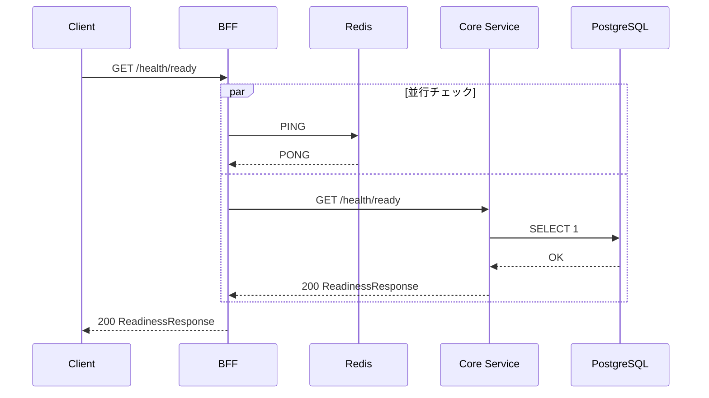
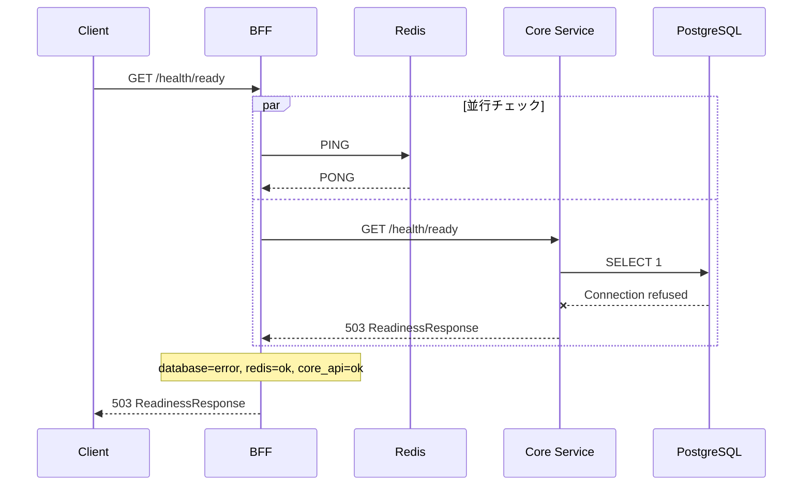
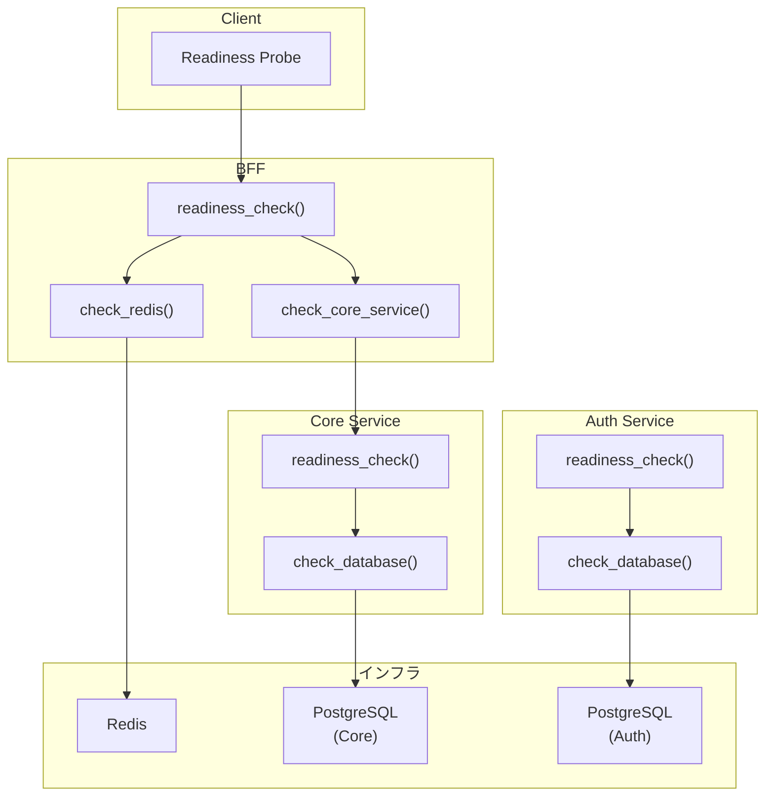

# Readiness Check エンドポイント - 機能解説

対応 PR: #737
対応 Issue: #736

## 概要

各サービスの依存サービスへの接続状態を確認する Readiness Check エンドポイント (`/health/ready`) を BFF、Core Service、Auth Service に実装した。Kubernetes の readiness probe や ロードバランサーのヘルスチェックで活用される。

## 背景

### Liveness と Readiness の違い

既存の `/health` エンドポイントは Liveness Check であり、プロセスが起動しているかのみを確認する。依存サービス（DB、Redis、外部 API）の障害は検知できない。

| チェック種別 | 確認対象 | 用途 |
|------------|---------|------|
| Liveness (`/health`) | プロセスの生存 | プロセス再起動の判断 |
| Readiness (`/health/ready`) | 依存サービスの接続 | トラフィック投入の判断 |

### 外部 API 連携の拡大に備えて

今後の機能拡張で外部 API 連携が増加する見込みがあるため、依存サービスの健全性を体系的に確認する仕組みを整備した。

## 用語・概念

| 用語 | 説明 | 関連コード |
|------|------|-----------|
| Liveness Check | プロセスが稼働しているか | `health_check()` |
| Readiness Check | 依存サービスに接続できるか | `readiness_check()` |
| CheckStatus | 個別チェックの結果（Ok / Error） | `CheckStatus` enum |
| ReadinessStatus | 全体のステータス（Ready / NotReady） | `ReadinessStatus` enum |

## フロー

### Readiness Check のリクエストフロー



### 部分的失敗時のフロー



## アーキテクチャ



Auth Service の `/health/ready` は Core Service と同一パターンだが、BFF からのチェック対象には含まれていない（API テストが期待するキーに含まれないため）。

## レスポンス形式

### 正常時（200）

```json
{
  "status": "ready",
  "checks": {
    "redis": "ok",
    "core_api": "ok",
    "database": "ok"
  }
}
```

### 部分的失敗時（503）

```json
{
  "status": "not_ready",
  "checks": {
    "redis": "ok",
    "core_api": "ok",
    "database": "error"
  }
}
```

### checks キーの設計

| サービス | checks keys | チェック対象 |
|----------|------------|------------|
| BFF | `redis`, `core_api`, `database` | Redis PING, Core GET /health/ready, Core の DB 結果をマッピング |
| Core | `database` | PostgreSQL `SELECT 1` |
| Auth | `database` | PostgreSQL `SELECT 1` |

## 設計判断

機能・仕組みレベルの判断を記載する。コード実装レベルの判断は[コード解説](./01_ReadinessCheck_コード解説.md#設計解説)を参照。

### 1. レスポンス型を `HealthResponse` と別にするか

`HealthResponse` は `status` + `version` の構造だが、Readiness Check は `status` + `checks` の構造であり、`version` は不要で `checks` が必要。

| 案 | 構造の一致 | 型安全性 | 既存への影響 |
|----|----------|---------|------------|
| **`ReadinessResponse` 新設（採用）** | 完全に一致 | 高い | なし |
| `HealthResponse` を拡張 | `checks` が `Option` に | 低い | 既存コード変更が必要 |

採用理由: 異なるレスポンス構造には異なる型を使うことで、型安全性を保ち既存コードへの影響をゼロにした。

### 2. 部分的失敗時の HTTP ステータスをどうするか

依存サービスの一部が失敗している場合に返す HTTP ステータスの選択。

| 案 | ロードバランサー互換性 | 詳細情報 | 標準性 |
|----|---------------------|---------|--------|
| **200 / 503 + ボディ（採用）** | 高い | ボディに詳細あり | Kubernetes 標準 |
| 200 固定 + ボディで判定 | 低い | ボディに詳細あり | 非標準 |
| 503 固定（ボディなし） | 高い | なし | 情報不足 |

採用理由: 503 をロードバランサーがトラフィックを外す判断に使え、ボディに `ReadinessResponse` を含めることで運用者がどのチェックが失敗したか特定できる。

### 3. BFF から Auth Service をチェックするか

| 案 | 網羅性 | 複雑さ | API テストとの整合 |
|----|--------|-------|-----------------|
| チェックする | 高い | 高い | 不整合（テストが期待しない） |
| **チェックしない（採用）** | 十分 | 低い | 整合する |

採用理由: Auth Service は認証フロー専用であり、既存 API テスト (`health_ready.hurl`) が期待するキーに含まれない。BFF → Core → DB の経路で DB の健全性は間接的に確認できる。

### 4. DynamoDB をチェックするか

| 案 | 網羅性 | 可用性への影響 |
|----|--------|-------------|
| チェックする | 高い | DynamoDB 一時障害で全体が not_ready に |
| **チェックしない（採用）** | 十分 | 主要機能に影響しない |

採用理由: 監査ログ（DynamoDB）は主要機能ではなく、一時障害で全体を not_ready にすべきでない。

## 関連ドキュメント

- [コード解説](./01_ReadinessCheck_コード解説.md)
- [計画ファイル](../../../prompts/plans/736_readiness-check.md)
