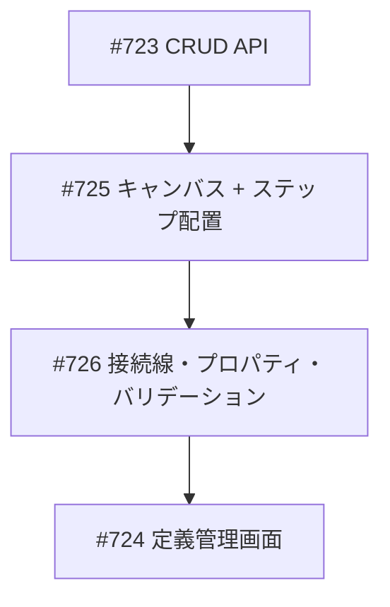
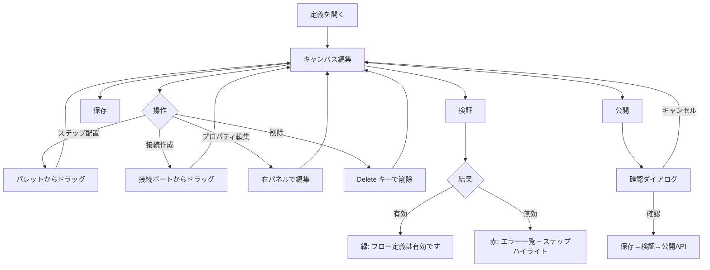
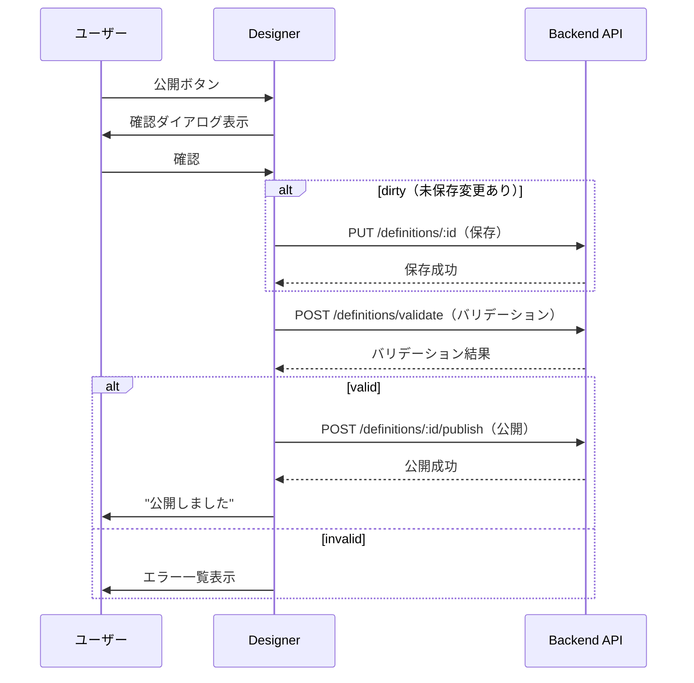
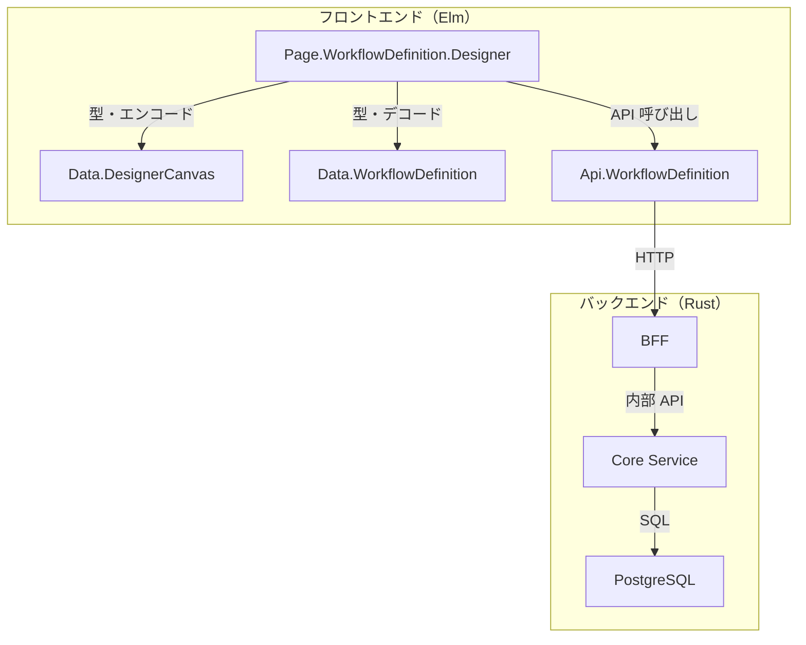
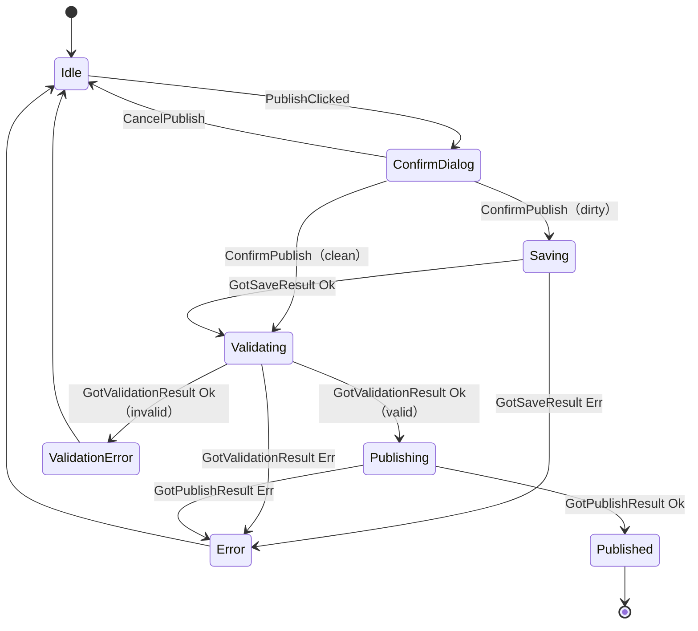

# ワークフローデザイナー接続線・バリデーション - 機能解説

対応 PR: #740
対応 Issue: #726

## 概要

ワークフローデザイナーに接続線描画、プロパティパネル、API 統合、バリデーション・公開機能を実装した。ステップ間の遷移を視覚的に接続し、各ステップのプロパティを編集し、定義の整合性を検証して公開できるようにした。

## 背景

### Epic #405 における位置づけ

ワークフローデザイナーは Epic #405（ワークフロー定義管理）の中核機能で、3つの Story に分割して段階的に実装している。

| Issue | 内容 | 状態 |
|-------|------|------|
| #723 | ワークフロー定義 CRUD API | 完了 |
| #725 | デザイナーキャンバスとステップ配置 | 完了 |
| #726 | 接続線・プロパティ・バリデーション（本 PR） | 完了 |
| #724 | ワークフロー定義管理画面 | 完了 |

### 変更前の状態

PR #733 で実装済みの基盤:
- SVG キャンバス上にステップ（開始・承認・終了）をドラッグ＆ドロップで配置
- ステップの選択・移動・削除
- パレットからの新規ステップ追加

課題:
- ステップ間の接続（遷移）が定義できない
- ステップのプロパティ（名前、承認者、終了ステータス）が編集できない
- 定義の保存・読み込み・公開ができない
- フロー定義の整合性検証ができない

## 用語・概念

| 用語 | 説明 | 関連コード |
|------|------|-----------|
| StepNode | キャンバス上のステップ。位置、種別、名前を持つ | `Data.DesignerCanvas.StepNode` |
| Transition | 2つのステップ間の遷移（接続線） | `Data.DesignerCanvas.Transition` |
| DraggingState | ドラッグ操作の 3 種類の状態（ステップ移動、新規配置、接続作成） | `Data.DesignerCanvas.DraggingState` |
| ValidationResult | バリデーション API の結果。valid フラグとエラーリスト | `Data.WorkflowDefinition.ValidationResult` |
| pendingPublish | 公開チェーン中を示すフラグ。保存→バリデーション→公開の非同期チェーンを制御 | `Designer.Model.pendingPublish` |
| DirtyState | フォームの未保存変更状態を管理する仕組み | `Form.DirtyState` |

## フロー

### デザイナーの操作フロー

### 公開チェーンフロー

公開操作は複数の非同期ステップをチェーンする:

## アーキテクチャ

## 状態遷移

### 公開チェーンの状態

## 設計判断

機能・仕組みレベルの判断を記載する。コード実装レベルの判断は[コード解説](./01_デザイナー接続線・バリデーション_コード解説.md#設計解説)を参照。

### 1. 公開フローの非同期チェーンをどう管理するか

公開操作は保存→バリデーション→公開の最大 3 段階の非同期処理。TEA の Cmd/Msg モデルで複数段階の非同期チェーンを表現する必要がある。

| 案 | 実装の複雑さ | TEA との親和性 | テスタビリティ |
|----|------------|--------------|-------------|
| **pendingPublish フラグ（採用）** | 低（Bool 1 つ） | 高（各 update ハンドラが独立） | 高（各 Msg を個別テスト可能） |
| 専用の PublishState 型 | 中（状態型 + パターンマッチ） | 中（状態型の管理が追加） | 中（状態遷移テストも必要） |
| Task.andThen チェーン | 高（Elm の制約で困難） | 低（Cmd の合成が非標準） | 低（統合テストが必要） |

**採用理由**: 各 update ハンドラ（GotSaveResult, GotValidationResult, GotPublishResult）が `pendingPublish` フラグを見て次の処理を分岐するだけで済み、既存の TEA パターンに自然に組み込める。

### 2. バリデーションエラーのステップ特定をどう伝えるか

バリデーションエラーには `stepId` が含まれる場合がある。エラーと対応ステップの視覚的関連をどう示すか。

| 案 | 発見性 | 実装の複雑さ | 既存パターンへの影響 |
|----|-------|------------|-------------------|
| **エラー一覧クリック + 赤枠ハイライト（採用）** | 高（2 チャネル） | 低 | viewStepNode の引数追加のみ |
| エラー一覧のみ（ハイライトなし） | 低 | 最低 | なし |
| キャンバス上にエラーアイコン表示 | 高 | 高 | SVG 構造の変更が必要 |

**採用理由**: エラー一覧のクリックで対応ステップを選択し、赤い枠線でハイライトする 2 チャネルアプローチ。最小限のコード変更（`viewStepNode` の引数に `errorStepIds` を追加）で視覚的フィードバックを実現。

### 3. 接続線の描画方法をどうするか

ステップ間の遷移を視覚的に表現する SVG 要素の選択。

| 案 | 視覚的な品質 | 実装の複雑さ | 操作性 |
|----|------------|------------|-------|
| **直線（line 要素）（採用）** | シンプル | 低 | クリック選択が容易 |
| ベジェ曲線（path 要素） | 美しい曲線 | 高 | ヒットエリアの計算が複雑 |
| 折れ線（polyline 要素） | 直角的 | 中 | 折れ点の管理が必要 |

**採用理由**: Phase 1 としてはシンプルな直線で十分。将来的にベジェ曲線への拡張は可能だが、現時点では接続のセマンティクスを表現することが優先。

## 関連ドキュメント

- [コード解説](./01_デザイナー接続線・バリデーション_コード解説.md)
- [ワークフローデザイナー詳細設計](../../03_詳細設計書/15_ワークフローデザイナー設計.md)
- [PR #733 キャンバス実装解説](../PR733_ワークフローデザイナーキャンバス/)
- [PR #730 CRUD API 実装解説](../PR730_ワークフロー定義CRUD/)
