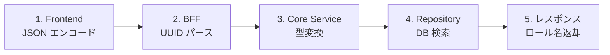

# ユーザー API role_id 化 - コード解説

対応 PR: #771
対応 Issue: #769

## 主要な型・関数

| 型/関数 | ファイル | 責務 |
|--------|---------|------|
| `RoleId` | `backend/crates/domain/src/role.rs:49` | ロール UUID ラッパー型 |
| `find_role_by_id` | `backend/crates/infra/src/repository/user_repository.rs:569` | ID でロールを検索 |
| `CreateUserInput` | `backend/apps/core-service/src/usecase/user.rs:18` | ユーザー作成の入力 |
| `UpdateUserInput` | `backend/apps/core-service/src/usecase/user.rs:24` | ユーザー更新の入力 |
| `CreateUserRequest`（Core） | `backend/apps/core-service/src/handler/auth/mod.rs:144` | Core Service のリクエスト型 |
| `CreateUserRequest`（BFF） | `backend/apps/bff/src/handler/user.rs:58` | BFF のリクエスト型 |
| `resolveRoleId` | `frontend/src/Page/User/Edit.elm:226` | ロール名 → ID 変換 |

## コードフロー

コードをリクエストの流れに沿って追う。



### 1. フロントエンド: JSON エンコード（リクエスト送信時）

select の `value` にロール ID を使い、JSON フィールド名を `role_id` に変更。

```elm
-- frontend/src/Page/User/New.elm:127-131
body =
    Encode.object
        [ ( "email", Encode.string model.email )
        , ( "name", Encode.string model.name )
        , ( "role_id", Encode.string model.selectedRoleId )  -- ① role_name → role_id
        ]
```

```elm
-- frontend/src/Page/User/New.elm:332
options = List.map (\role -> { value = role.id, label = role.name }) roles  -- ② value を role.id に
```

注目ポイント:

- ① JSON フィールド名を `role_name` → `role_id` に変更
- ② select の `value` を `role.name` → `role.id` に変更。`label` は引き続き `role.name`

### 2. BFF: UUID パースとバリデーション（リクエスト受信時）

BFF では `role_id` を `String` で受け取り、UUID にパースする。

```rust
// backend/apps/bff/src/handler/user.rs:58-63
pub struct CreateUserRequest {
    pub email:   String,
    pub name:    String,
    #[schema(format = "uuid")]  // ① utoipa で OpenAPI に format: uuid を反映
    pub role_id: String,        // ② String で受け取る（BFF は外部 API 境界）
}
```

```rust
// backend/apps/bff/src/handler/user.rs:234-242
let role_id = uuid::Uuid::parse_str(&req.role_id).map_err(|_| {  // ③ UUID パース
    (
        StatusCode::BAD_REQUEST,
        Json(ErrorResponse::validation_error("role_id の形式が不正です")),
    )
        .into_response()
})?;
```

注目ポイント:

- ① `#[schema(format = "uuid")]` で utoipa が OpenAPI 仕様に `format: uuid` を出力
- ② BFF は外部 API 境界のため `String` で受け取り、パースはハンドラ内で行う
- ③ `uuid::Uuid::parse_str` で検証し、失敗時は 400 Bad Request

### 3. Core Service: 型変換とユースケース呼び出し（ビジネスロジック実行前）

Core Service ハンドラでは `Uuid` → `RoleId` の型変換を行い、ユースケースに渡す。

```rust
// backend/apps/core-service/src/handler/auth/mod.rs:405-411
let input = CreateUserInput {
    tenant_id: TenantId::from_uuid(req.tenant_id),
    email,
    name,
    role_id: RoleId::from_uuid(req.role_id),  // ① Uuid → RoleId
};

let (user, role) = state.usecase.create_user(input).await?;  // ② (User, Role) で受け取る
```

```rust
// backend/apps/core-service/src/handler/auth/mod.rs:417
role: role.name().to_string(),  // ③ レスポンスにロール名を含める
```

注目ポイント:

- ① `RoleId::from_uuid` で汎用の `Uuid` をドメイン固有の `RoleId` に変換
- ② 戻り値が `(User, Role)` タプルに変更され、ロール情報も取得可能に
- ③ `req.role_name`（リクエストの文字列）ではなく `role.name()`（DB から取得した値）を使用

### 4. リポジトリ: DB 検索（永続化層）

`find_role_by_id` は `find_role_by_name` と同じパターンで、WHERE 句が `name = $1` → `id = $1` に変わるだけ。

```rust
// backend/crates/infra/src/repository/user_repository.rs:569-599
#[tracing::instrument(skip_all, level = "debug", fields(%id))]
async fn find_role_by_id(&self, id: &RoleId) -> Result<Option<Role>, InfraError> {
    let row = sqlx::query!(
        r#"
        SELECT
            id, tenant_id, name, description, permissions,
            is_system, created_at, updated_at
        FROM roles
        WHERE id = $1  -- ① 主キー検索
        "#,
        id.as_uuid()   // ② RoleId → &Uuid への変換
    )
    .fetch_optional(&self.pool)
    .await?;
    // ... Role::from_db で組み立て
}
```

注目ポイント:

- ① 主キー（`id`）での検索のため、`find_role_by_name` より効率的
- ② `RoleId` の `as_uuid()` で内部の `&Uuid` を取得し、sqlx パラメータに渡す

### 5. フロントエンド Edit: ロール ID の解決（画面初期化時）

Edit 画面では、ユーザー詳細 API（ロール名配列）とロール一覧 API（ID + 名前）の両方を初期化時にリクエストする。到着順に依存しない解決ロジック。

```elm
-- frontend/src/Page/User/Edit.elm:226-237
resolveRoleId : List String -> List RoleItem -> String
resolveRoleId roleNames roles =
    case roleNames of
        firstName :: _ ->          -- ① 最初のロール名を取得
            roles
                |> List.filter (\role -> role.name == firstName)  -- ② 名前でマッチ
                |> List.head
                |> Maybe.map .id   -- ③ マッチしたロールの ID を返す
                |> Maybe.withDefault ""

        [] ->
            ""
```

注目ポイント:

- ① ユーザー詳細の `roles` 配列の最初の要素（ロール名）を使用
- ② ロール一覧と名前でマッチして対応する `RoleItem` を特定
- ③ `RoleItem.id` を返すことで、select の初期値として UUID を設定

## テスト

| テスト | 検証対象のステップ | 検証内容 |
|-------|------------------|---------|
| `test_find_role_by_idでシステムロールを検索できる` | 4 | 存在する ID で検索し、正しいロール情報が返る |
| `test_find_role_by_id存在しないロールidはnoneを返す` | 4 | 存在しない ID で None が返る |

### 実行方法

```bash
# リポジトリ統合テストのみ
cd backend && cargo test --test user_repository_test find_role_by_id

# 全テスト
just check-all
```

## 設計解説

コード実装レベルの判断を記載する。機能・仕組みレベルの判断は[機能解説](./01_role_id化_機能解説.md#設計判断)を参照。

### 1. BFF で role_id を String で受け取る理由

場所: `backend/apps/bff/src/handler/user.rs:61`

```rust
pub struct CreateUserRequest {
    pub role_id: String,  // Uuid ではなく String
}
```

なぜこの実装か:
BFF は外部 API 境界であり、不正な入力に対して適切なエラーメッセージを返す責務がある。`Uuid` 型で直接デシリアライズすると、axum の自動デシリアライズエラーになり、ユーザーフレンドリーなエラーメッセージを返せない。

| 案 | エラーメッセージ制御 | コード量 | 判断 |
|----|-------------------|---------|------|
| **String で受け取り手動パース（採用）** | カスタムメッセージ可能 | やや多い | 採用 |
| Uuid で直接デシリアライズ | axum デフォルトのエラー | 少ない | 見送り |

### 2. update_user の Optional UUID パースパターン

場所: `backend/apps/bff/src/handler/user.rs:384-393`

```rust
let role_id = req.role_id
    .map(|id| uuid::Uuid::parse_str(&id))  // Option<String> → Option<Result<Uuid, _>>
    .transpose()                             // → Result<Option<Uuid>, _>
    .map_err(|_| { ... })?;
```

なぜこの実装か:
`Option<String>` を `Option<Uuid>` に変換する際、`.map().transpose()` は Rust の慣用的なパターン。`None` の場合は何もせず `None` を通し、`Some` の場合のみパースを試みる。

## 関連ドキュメント

- [機能解説](./01_role_id化_機能解説.md)
- [計画ファイル](../../../prompts/plans/769_user-api-role-id-based.md)
