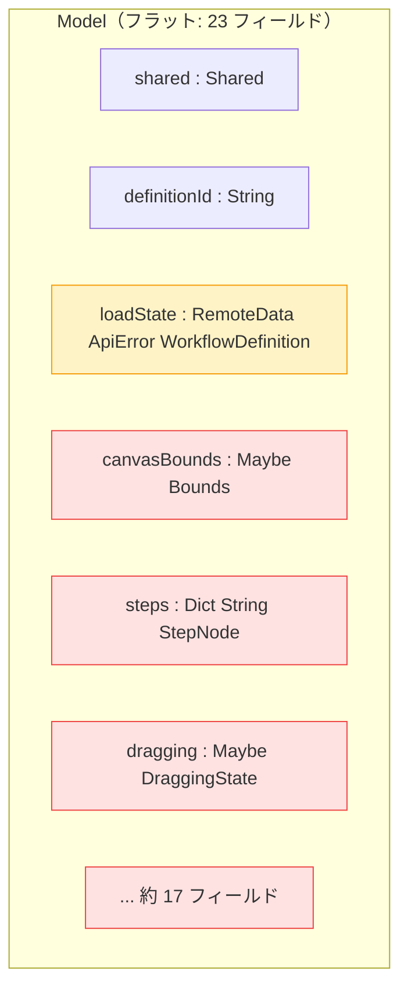
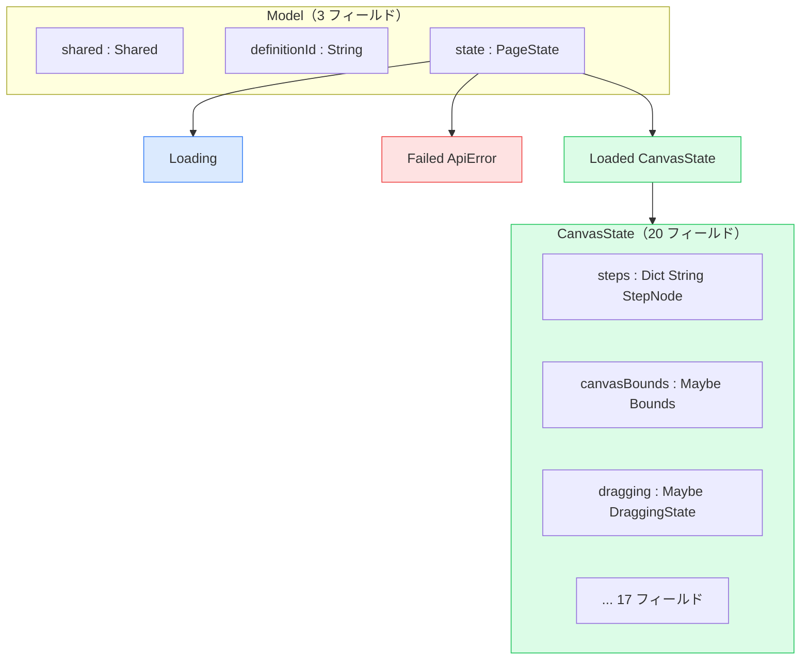
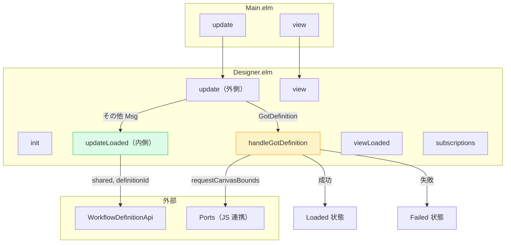
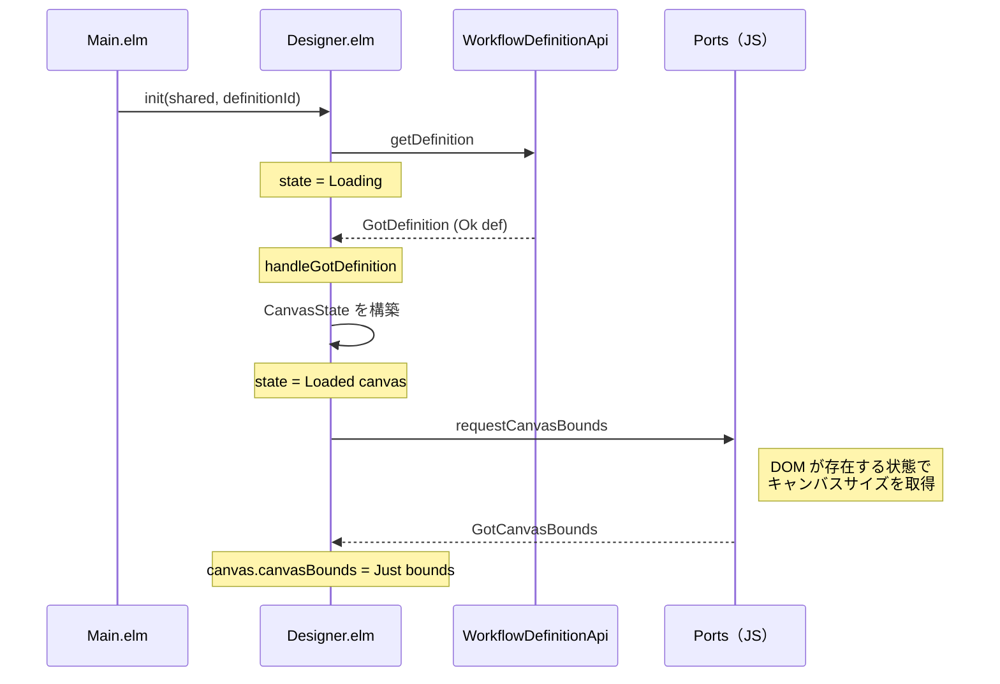
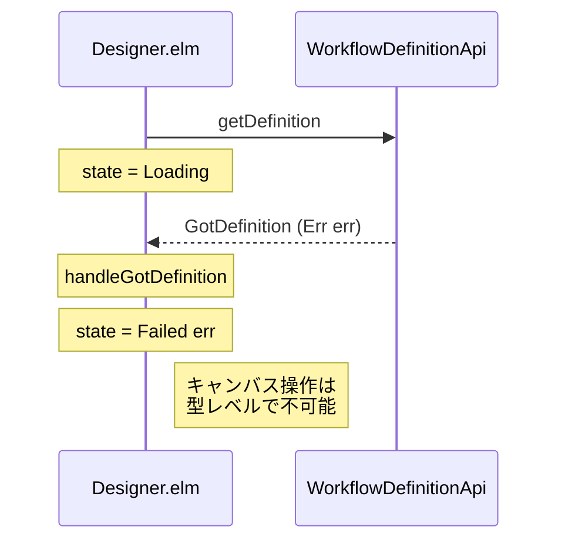
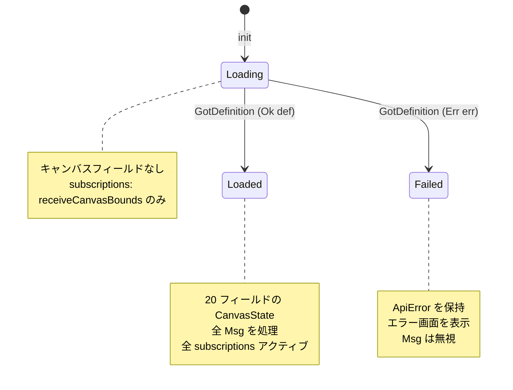

# Designer 型安全ステートマシン - 機能解説

対応 PR: #802
対応 Issue: #796

## 概要

ワークフローデザイナー画面（Designer.elm）の Model を、フラットなレコード + `RemoteData` から型安全ステートマシンにリファクタリングした。Loading 中にキャンバス関連フィールドが型レベルで存在しない構造にし、不正な状態を表現不可能にしている。

ADR-054 で標準化した型安全ステートマシンパターンの初適用事例。

## 背景

### #793 で発見されたバグ

ワークフローデザイナー画面の初期ロード時、ノードがドラッグできないバグが #793 で報告された。原因は Loading 状態で `requestCanvasBounds`（DOM 要素のサイズを取得する Port コマンド）が発行され、キャンバス要素がまだ描画されていないため失敗すること。

### フラット Model の構造的問題

変更前の Model はすべてのフィールドを同一レベルに持つフラット構造だった。`loadState : RemoteData ApiError WorkflowDefinition` と約 20 個のキャンバス関連フィールドが共存し、Loading 中でもキャンバスフィールドにアクセス可能だった。

特に `canvasBounds : Maybe Bounds` は「非同期取得中（まだ来ていない）」と「状態として存在しない（Loading 中）」の 2 つの意味を混同していた。

### ADR-054: 型安全ステートマシンの標準化

このバグを契機に ADR-054 で型安全ステートマシンパターンが標準化された。プロジェクトの設計原則「型で表現できるものは型で表現する。不正な状態を表現不可能にする」の状態遷移への適用。

関連 Issue:
- #793: バグ（初期ノードドラッグ不可）
- #795: ギャップ発見の観点追加（状態依存フィールド）
- #796: 本リファクタリング

## 用語・概念

| 用語 | 説明 | 関連コード |
|------|------|-----------|
| ADT | 代数的データ型（Algebraic Data Type）。Elm の Custom Type。状態を型として表現する | `PageState` |
| ステートマシン | 明確に定義された状態と遷移を持つモデル | `Loading → Loaded`, `Loading → Failed` |
| CanvasState | キャンバスが描画され操作可能な状態のデータ。20 フィールド | `CanvasState` type alias |
| Port | Elm と JavaScript の境界をまたぐ通信チャネル | `Ports.requestCanvasBounds` |
| DirtyState | フォームの変更状態を追跡する仕組み。extensible record で実装 | `Form.DirtyState` |

## ビフォー・アフター

### Before（変更前）

#### 制約・課題

- Loading 中でもキャンバス関連フィールド（赤）にアクセス可能
- `Maybe Bounds` の意味が二重: 「Loading 中で存在しない」「非同期取得中」
- `requestCanvasBounds` が Loading 中に発行可能 → DOM 未存在で失敗

### After（変更後）

#### 改善点

- Loading 中はキャンバスフィールドが型レベルで存在しない
- `Maybe Bounds` の意味が単一: 「非同期取得中」のみ
- `requestCanvasBounds` は `handleGotDefinition` 成功時にのみ発行（Loaded 遷移と同時）
- 各状態の view/update が明確に分離

## アーキテクチャ

## データフロー

### フロー 1: 初期ロード（Loading → Loaded）

#### 処理ステップ

| # | レイヤー | ファイル:関数 | 処理内容 |
|---|---------|-------------|---------|
| 1 | Page | `Designer.elm:init` | `state = Loading` で初期化、API リクエスト発行 |
| 2 | API | `WorkflowDefinitionApi.getDefinition` | ワークフロー定義を取得 |
| 3 | Page | `Designer.elm:handleGotDefinition` | 定義から `CanvasState` を構築し `Loaded` に遷移 |
| 4 | Port | `Ports.requestCanvasBounds` | DOM 要素のサイズを JS に問い合わせ |
| 5 | Page | `Designer.elm:updateLoaded` | `GotCanvasBounds` で `canvasBounds` を設定 |

### フロー 2: 初期ロード失敗（Loading → Failed）

## 状態遷移

### PageState

## 設計判断

機能・仕組みレベルの判断を記載する。コード実装レベルの判断は[コード解説](./01_Designer-型安全ステートマシン_コード解説.md#設計解説)を参照。

### 1. 共通フィールドをどこに配置するか

`shared` と `definitionId` は全状態で必要。各状態の型に持たせるか、外側 Model に持たせるかの判断。

| 案 | 重複 | 更新容易性 | パターンマッチ深度 |
|----|------|-----------|------------------|
| **外側 Model に配置（採用）** | なし | `updateShared` が単純 | 浅い |
| 各状態型に配置 | 3 箇所で重複 | 全状態を更新 | 深い |

**採用理由**: ADR-054 のパターン A（外側に共通フィールド）に準拠。`updateShared` が `{ model | shared = shared }` で完結する。

### 2. API 接続情報を CanvasState に持たせるか

API 呼び出しに必要な `shared` / `definitionId` を CanvasState のフィールドにするか、パラメータとして渡すかの判断。

| 案 | 責務分離 | シグネチャ |
|----|---------|-----------|
| **パラメータとして渡す（採用）** | 明確（CanvasState はキャンバス状態のみ） | `updateLoaded msg shared definitionId canvas` |
| CanvasState に持たせる | 混在（キャンバス + API 接続情報） | `updateLoaded msg canvas` |

**採用理由**: CanvasState がキャンバス状態のみを表現する純粋な型になる。API 接続情報はキャンバスの関心事ではない。

### 3. subscriptions の状態別制御

Port サブスクリプション（`receiveCanvasBounds`）と DOM イベント（`onKeyDown`, `onMouseMove`）を全状態で購読するか、状態別に制御するかの判断。

| サブスクリプション | 購読範囲 | 理由 |
|-----------------|---------|------|
| `receiveCanvasBounds` | 全状態 | `GotDefinition` 成功時に `requestCanvasBounds` を発行し、レスポンスは Loaded 遷移後に到着するが、購読は遷移前から必要 |
| `onKeyDown` | Loaded のみ | Loading/Failed でキーイベントは不要 |
| `onMouseMove`, `onMouseUp` | Loaded + dragging 中のみ | ドラッグ操作は Loaded 時のみ |

### 4. WorkflowDefinition を CanvasState に格納するか

`GotDefinition` で受け取った `WorkflowDefinition` を CanvasState に保持するか、必要なフィールドのみ抽出するかの判断。

| 案 | メモリ効率 | アクセスパターン |
|----|----------|---------------|
| **必要なフィールドのみ抽出（採用）** | 冗長なし | `canvas.name`, `canvas.version` |
| WorkflowDefinition を保持 | 冗長あり | `canvas.definition.name` |

**採用理由**: `GotDefinition` ハンドラで `def` から `steps`, `transitions`, `name`, `description`, `version` を抽出後、`def` 自体は参照されない。冗長なフィールドを持たせない。

## 関連ドキュメント

- [コード解説](./01_Designer-型安全ステートマシン_コード解説.md)
- [ADR-054: 型安全ステートマシンパターンの標準化](../../05_ADR/054_型安全ステートマシンパターンの標準化.md)
- [計画ファイル](../../../prompts/plans/796_designer-adt-state-machine.md)
- [セッションログ](../../../prompts/runs/2026-02/2026-02-23_2120_Designer-ADT-state-machine.md)
