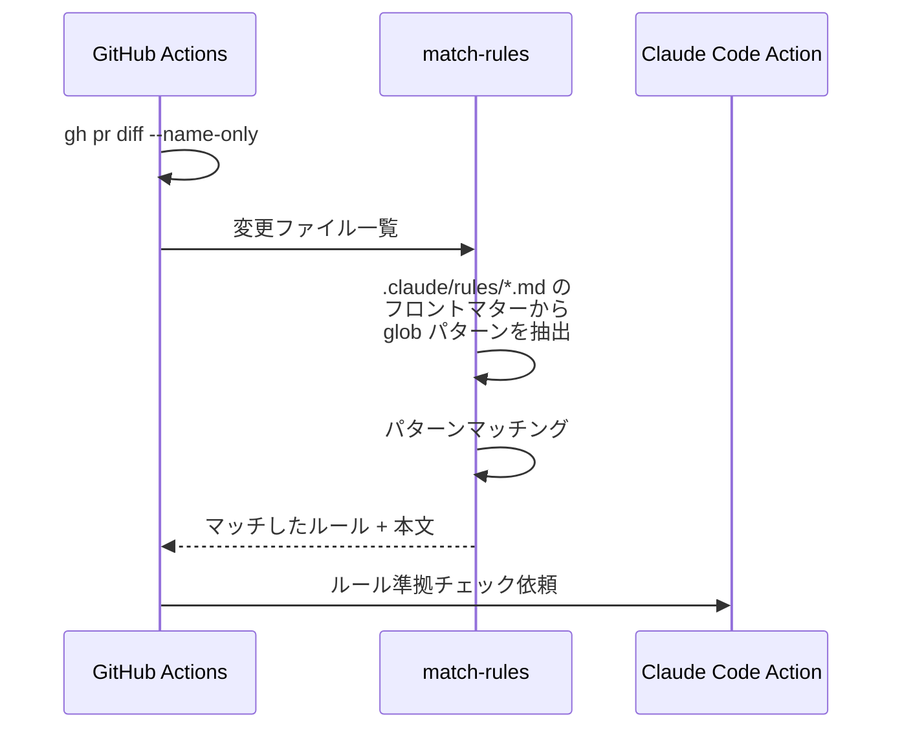
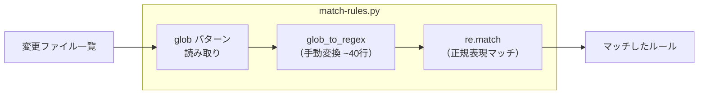

# match-rules Rust 移行 - 機能解説

対応 PR: #825
対応 Issue: #815

## 概要

CI ワークフロー（Claude Rules Check）で使用する `match-rules` スクリプトを Python から Rust（rust-script）に移行した。ADR-015 の移行基準（複雑なロジック → Rust への移行）に該当するため実施。

## 背景

### CI ルールチェックの仕組み

Claude Rules Check ワークフローは、PR の変更ファイルに応じて `.claude/rules/` 内のルールファイルを選択し、Claude に準拠チェックを依頼する。`match-rules` スクリプトがこの「変更ファイル → ルール」のマッチングを担う。

### 移行の動機

#813 で `match-rules.py`（Python 177行）を導入。このスクリプトは glob パターンの正規表現変換（`glob_to_regex` 関数、~40行）を含み、ADR-015 が定めた移行基準に該当した。

| ADR-015 の移行基準 | match-rules.py の状況 |
|-------------------|---------------------|
| 正規表現パース | `glob_to_regex` で glob → regex 変換（~40行） |
| 条件分岐が多い | `**`, `*`, `?`, `[...]` 等のパターン別処理 |

プロジェクトの技術スタックは Rust + Elm であり、Python は技術スタック外の言語。

### 選択肢の比較

| 観点 | Shell 統一 | Python 許容 | rust-script（採用） | ワークスペースクレート |
|------|----------|-----------|-------------------|--------------------|
| 技術スタック一致 | - | × | ◎ | ◎ |
| ADR-015 整合 | × | × | ◎ | ○ |
| KISS | × | ◎ | ◎ | △ |
| 保守性 | 低 | 中 | 高 | 高 |

詳細: [ADR-056](../../05_ADR/056_CIスクリプトの言語選定方針.md)

## 用語・概念

| 用語 | 説明 | 関連コード |
|------|------|-----------|
| rust-script | 単一ファイル Rust スクリプト実行ツール | `.github/scripts/match-rules.rs` |
| globset | ripgrep エコシステムの glob マッチングクレート | `GlobBuilder`, `GlobMatcher` |
| フロントマター | YAML 形式のメタデータブロック（`---` で囲む） | `parse_frontmatter_paths()` |
| literal_separator | `*` がパス区切り `/` を超えないオプション | `GlobBuilder::literal_separator(true)` |

## ビフォー・アフター

### Before（Python 版）

課題:
- `glob_to_regex` は `**`, `*`, `?`, `[...]` を正規表現に手動変換。パターン追加時にバグリスクあり
- プロジェクトの技術スタック外（Python）

### After（Rust 版）

改善点:
- `globset` のネイティブ glob マッチングにより、手動正規表現変換を廃止（~40行削減）
- バグリスクのある手動変換を、実績のあるクレート（ripgrep エコシステム）に委譲
- プロジェクトの技術スタック（Rust）と一致

## 設計判断

機能・仕組みレベルの判断を記載する。コード実装レベルの判断は[コード解説](./01_match-rules-Rust移行_コード解説.md#設計解説)を参照。

### 1. 実装形式をどうするか

~80行（テスト除く）のスクリプトを Rust で実装する形式を選択する必要があった。

| 案 | 構造の複雑さ | 追加依存 | ADR-015 整合 |
|----|------------|---------|-------------|
| **rust-script（採用）** | 単一ファイル | rust-script | ◎（明示的に記載） |
| ワークスペースクレート | Cargo.toml + src/ | なし | ○ |

**採用理由**: ADR-015 が移行先として rust-script を明示。~80行のスクリプトにワークスペースクレート構造は過剰（KISS）。

### 2. glob マッチングをどう実装するか

Python 版の手動 glob-to-regex 変換を代替する方法を選択する必要があった。

| 案 | 実装量 | 正確性 | 保守性 |
|----|-------|--------|--------|
| **globset クレート（採用）** | ~5行 | 高（ripgrep で実証済み） | 高 |
| 手動 regex 変換の Rust 移植 | ~40行 | 中（手動変換のリスク） | 低 |
| regex クレートで独自実装 | ~30行 | 中 | 低 |

**採用理由**: `globset` は ripgrep で使用されており、信頼性が高い。コードが大幅に簡潔になる。

### 3. CI のセットアップコストをどう軽減するか

rust-script の初回 `cargo install` は時間がかかる（~1-2分）。

| 案 | 初回 | 2回目以降 | 複雑さ |
|----|------|----------|--------|
| **sccache + Cargo キャッシュ（採用）** | ~1-2分 | 数秒 | 中 |
| バイナリを pre-build してキャッシュ | 数秒 | 数秒 | 高 |
| セットアップなし | ~1-2分 | ~1-2分 | 低 |

**採用理由**: 既存の CI ワークフロー（`ci.yaml`）と同じパターン（sccache + Cargo キャッシュ）を踏襲。

## 関連ドキュメント

- [コード解説](./01_match-rules-Rust移行_コード解説.md)
- [ADR-056: CI スクリプトの言語選定方針](../../05_ADR/056_CIスクリプトの言語選定方針.md)
- [ADR-015: 開発スクリプトの品質担保方針](../../05_ADR/015_開発スクリプトの品質担保方針.md)
- [ナレッジベース: rust-script](../../06_ナレッジベース/devtools/rust-script.md)
