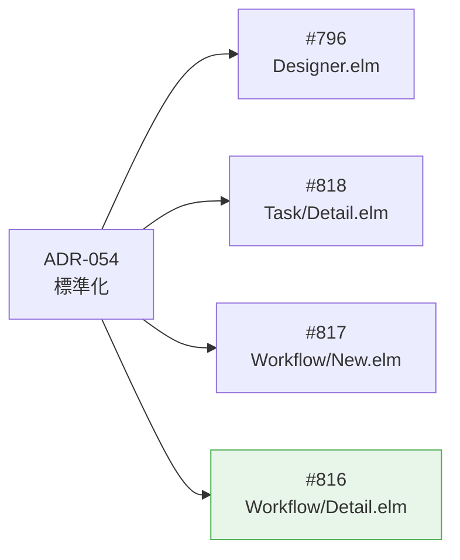
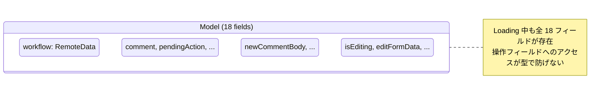
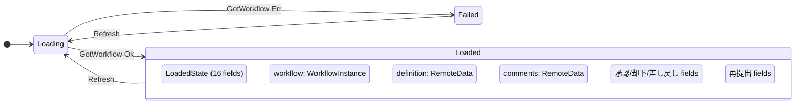
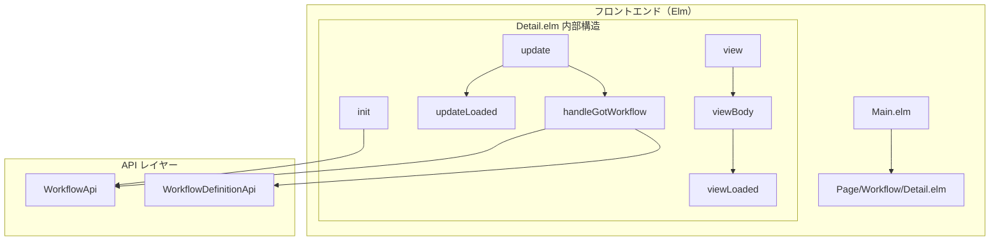
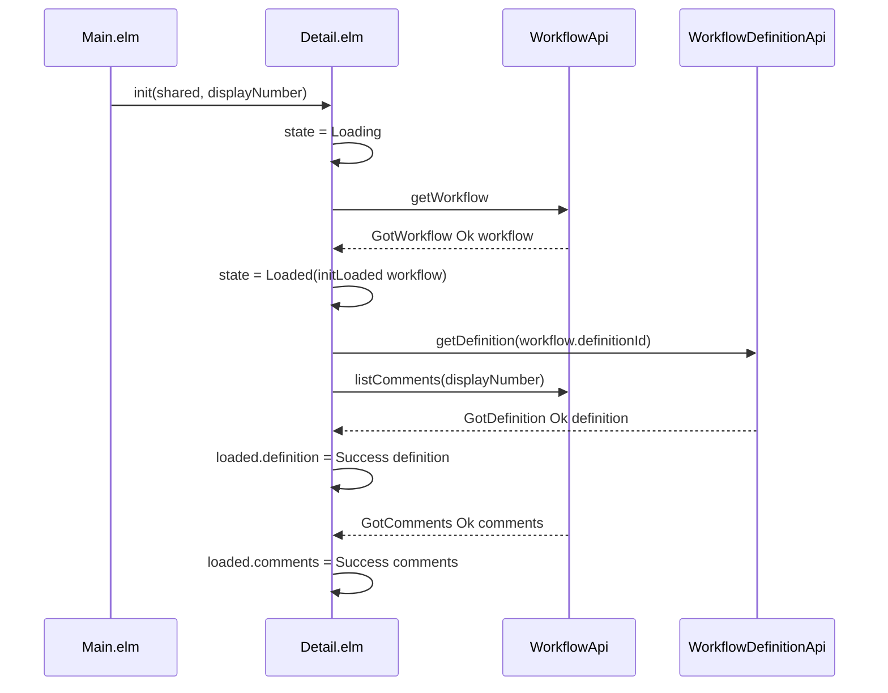
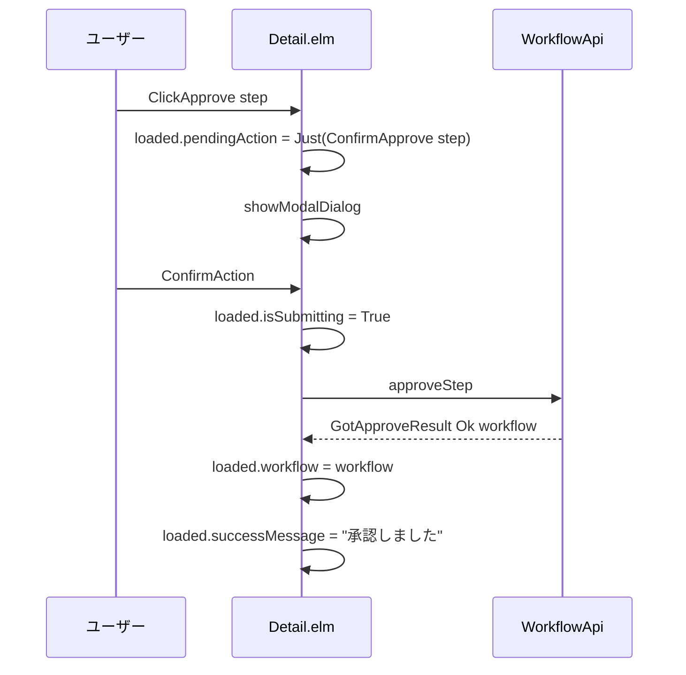
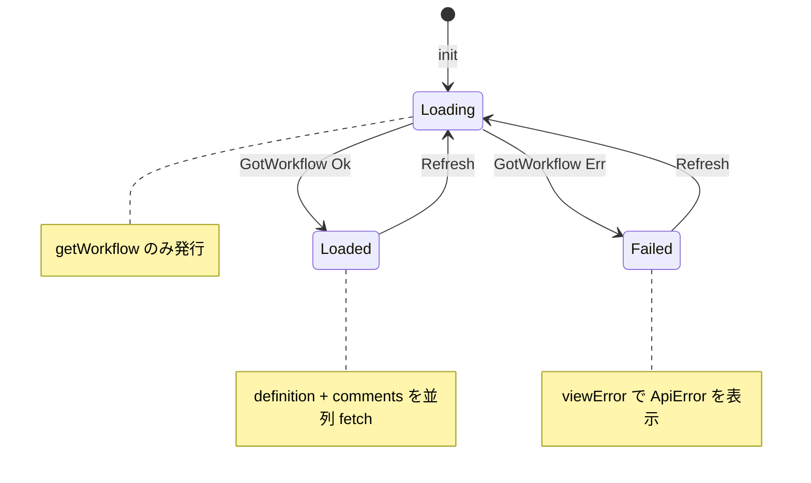
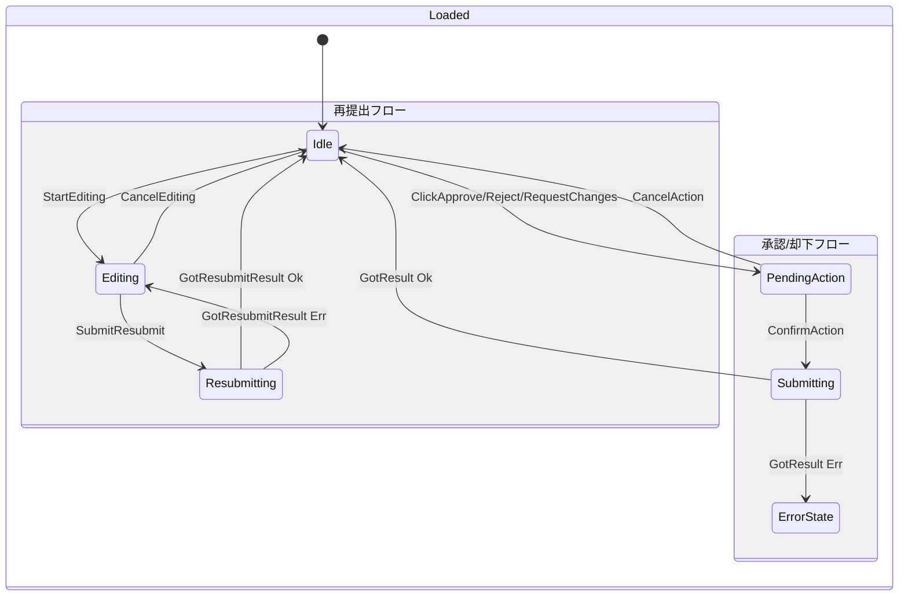

# Workflow/Detail.elm ADT ステートマシン - 機能解説

対応 PR: #839
対応 Issue: #816
Epic: #822（ADT ベースステートマシンの既存コード適用）

## 概要

`Page/Workflow/Detail.elm`（申請詳細ページ）の Model を、18 フィールドのフラット構造から ADT（Algebraic Data Type）ベースステートマシンにリファクタリングした。Loading 中に承認・コメント・再提出の操作フィールドが型レベルで存在しないようにすることで、不正な状態をコンパイル時に排除する。

## 背景

### ADT ベースステートマシンパターン（ADR-054）

[ADR-054](../../05_ADR/054_ADTベースステートマシンパターンの標準化.md) は、状態によって有効なフィールドが異なる場合に ADT で状態を分離するパターンを標準化した。Richard Feldman の "Making Impossible States Impossible"（2016）を Elm コミュニティの確立パターンとして明文化したもの。

このプロジェクトでは「型で表現できるものは型で表現する。不正な状態を表現不可能にする」を設計原則としており、ADR-054 はその状態遷移への適用である。

### 変更前の課題

申請詳細ページの Model は 18 フィールドのフラット構造で、3 つの操作モードのフィールドが混在していた:

- 承認/却下フロー: `comment`, `pendingAction`, `isSubmitting`
- コメントスレッド: `newCommentBody`, `isPostingComment`
- 再提出編集: `isEditing`, `editFormData`, `editApprovers`, `isResubmitting`

Loading/Failure 状態でこれらのフィールドが存在し、操作が型レベルで許可されていた。

### Epic #822 の中での位置づけ

| Issue | 内容 | 状態 |
|-------|------|------|
| #796 | Designer.elm のリファクタリング（最初の適用） | 完了 |
| #818 | Task/Detail.elm のリファクタリング | 完了 |
| #817 | Workflow/New.elm のリファクタリング | 完了 |
| #816 | Workflow/Detail.elm のリファクタリング（本 PR） | 完了 |

## 用語・概念

| 用語 | 説明 | 関連コード |
|------|------|-----------|
| ADT ベースステートマシン | 状態ごとに異なる型を定義し、有効なフィールドだけを持たせるパターン | `PageState` |
| パターン A | ADR-054 の推奨パターン。外側の型に共通フィールド、内側に状態固有フィールド | `Model` + `LoadedState` |
| LoadedState | Loaded 時のみ存在する 16 フィールドを集約した型 | `LoadedState` |
| RemoteData | 非同期データの 4 状態（NotAsked/Loading/Failure/Success）を表す型 | `RemoteData ApiError a` |

## ビフォー・アフター

### Before（変更前）

フラットな Model 構造:

| フィールド群 | フィールド数 | Loading 中の状態 |
|-------------|------------|-----------------|
| 共通 | 2（shared, workflowDisplayNumber） | 有効 |
| API データ | 2（workflow, definition） | `Loading` / `NotAsked` |
| 承認/却下 | 5（comment, isSubmitting, ...） | 空文字 / False / Nothing |
| コメント | 3（comments, newCommentBody, ...） | `Loading` / 空文字 / False |
| 再提出 | 6（isEditing, editFormData, ...） | False / empty / NotAsked |

#### 制約・課題

- Loading 中に操作フィールドが型レベルで存在し、誤ったアクセスをコンパイラが検出できない
- `init` で `getWorkflow` と `listComments` を並列発行するが、`GotComments` が先に届いた場合のハンドリングが曖昧

### After（変更後）

ADT 分離後の型構造:

| 型 | フィールド | 存在条件 |
|----|----------|---------|
| `Model` | shared, workflowDisplayNumber, state | 常に存在 |
| `PageState` | Loading / Failed ApiError / Loaded LoadedState | — |
| `LoadedState` | workflow, definition, comment, ... (16 fields) | Loaded 時のみ |

#### 改善点

- Loading/Failed 状態で操作フィールドにアクセスするとコンパイルエラーになる
- `workflow` が `RemoteData` から直値（`WorkflowInstance`）に変わり、Loaded 内での不要な case 分岐が解消
- コメント取得タイミングを `handleGotWorkflow` に移動し、Loading 中の格納先問題を構造的に解決

## アーキテクチャ

## データフロー

### フロー 1: ページ初期ロード

#### 処理ステップ

| # | レイヤー | ファイル:関数 | 処理内容 |
|---|---------|-------------|---------|
| 1 | Page | `Detail.elm:init` | Model を `Loading` 状態で初期化、`getWorkflow` を発行 |
| 2 | Page | `Detail.elm:handleGotWorkflow` | `initLoaded` で `LoadedState` を構築、`getDefinition` + `listComments` を並列発行 |
| 3 | Page | `Detail.elm:updateLoaded` | `GotDefinition`/`GotComments` を `LoadedState` に反映 |

### フロー 2: 承認操作

## 状態遷移

### PageState

### Loaded 内の操作状態

## 設計判断

機能・仕組みレベルの判断を記載する。コード実装レベルの判断は[コード解説](./01_ADTステートマシン_コード解説.md#設計解説)を参照。

### 1. コメント取得タイミングをどうするか

ADT 分離により、Loading 状態に `LoadedState` が存在しなくなった。`init` で `listComments` を並列発行すると、`GotComments` が Loading 中に届いた場合の格納先がない。

| 案 | UX 影響 | コード複雑度 | Task/Detail との一貫性 |
|----|---------|------------|---------------------|
| handleGotWorkflow で並列発行（採用） | コメント表示がわずかに遅延 | 低 | 一致 |
| init で並列発行 + Loading 中のバッファリング | なし | 高（バッファ機構が必要） | 不一致 |
| init で逐次発行（getWorkflow → getComments） | コメント表示が遅延 | 低 | 不一致 |

**採用理由**: コメントはページ下部の付随データであり UX 影響は最小。Task/Detail.elm と同一パターンで一貫性を確保できる。

### 2. Loaded 時の GotWorkflow をどう処理するか

承認/却下操作後にサーバーから最新の `WorkflowInstance` が返る。この応答も `GotWorkflow` Msg を通るため、Loaded 状態での `GotWorkflow` のハンドリングが必要。

| 案 | 操作フィールドの保持 | 副作用の再発行 |
|----|-------|--------|
| Loaded 時は workflow フィールドのみ更新（採用） | 保持される | なし |
| initLoaded で完全再構築 | リセットされる | definition + comments を再 fetch |

**採用理由**: 承認後はフォーム状態やコメントを維持すべき。部分更新により不要な再 fetch を避ける。

## 関連ドキュメント

- [コード解説](./01_ADTステートマシン_コード解説.md)
- [ADR-054: ADT ベースステートマシンパターンの標準化](../../05_ADR/054_ADTベースステートマシンパターンの標準化.md)
- [Issue #816](https://github.com/ka2kama/ringiflow/issues/816)
- [申請フォーム UI 設計](../../03_詳細設計書/10_ワークフロー申請フォームUI設計.md)
