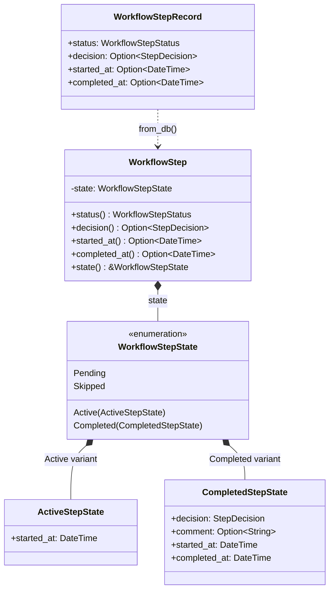
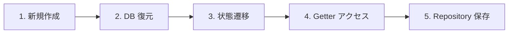
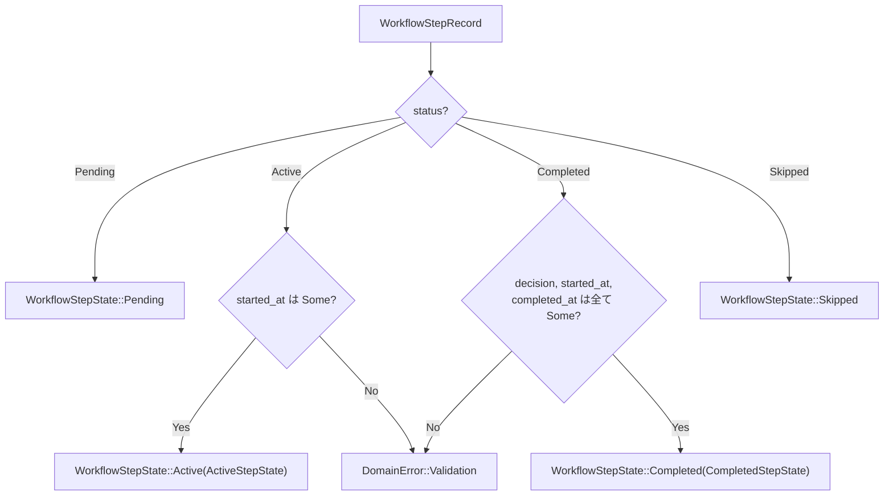
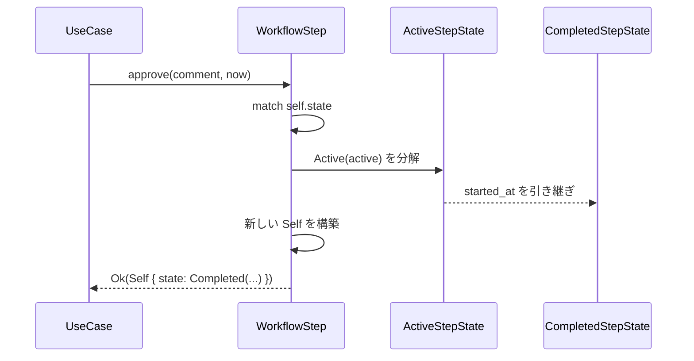
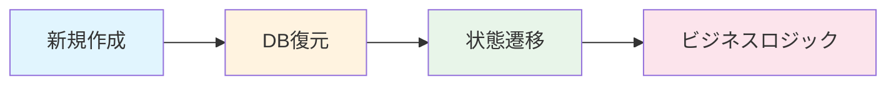

# WorkflowStep ADT ステートマシン - コード解説

対応 PR: #840
対応 Issue: #820

## 主要な型・関数

| 型/関数 | ファイル | 責務 |
|--------|---------|------|
| `WorkflowStepState` | [`step.rs:93`](../../../backend/crates/domain/src/workflow/step.rs) | 4 状態を表す ADT enum |
| `ActiveStepState` | [`step.rs:106`](../../../backend/crates/domain/src/workflow/step.rs) | Active 固有フィールド（`started_at`） |
| `CompletedStepState` | [`step.rs:112`](../../../backend/crates/domain/src/workflow/step.rs) | Completed 固有フィールド（`decision`, `comment`, `started_at`, `completed_at`） |
| `WorkflowStep` | [`step.rs:131`](../../../backend/crates/domain/src/workflow/step.rs) | ステップエンティティ（共通 + state） |
| `WorkflowStepRecord` | [`step.rs:161`](../../../backend/crates/domain/src/workflow/step.rs) | DB フラット構造のパラメータ |
| `WorkflowStep::from_db()` | [`step.rs:206`](../../../backend/crates/domain/src/workflow/step.rs) | DB → ADT 変換 + 不変条件検証 |
| `TryFrom<WorkflowStepRow>` | [`workflow_step_repository.rs:113`](../../../backend/crates/infra/src/repository/workflow_step_repository.rs) | DB Row → ドメインオブジェクト変換 |

### 型の関係



## コードフロー

コードをライフサイクル順に追う。新規作成 → DB 復元 → 状態遷移 → getter アクセスの流れで解説する。



### 1. 新規作成（`new()`）

新規ステップは常に `Pending` 状態で作成される。

```rust
// step.rs:182-197
pub fn new(params: NewWorkflowStep) -> Self {
    Self {
        id: params.id,
        // ... 共通フィールド ...
        state: WorkflowStepState::Pending,  // ① 初期状態は Pending
    }
}
```

注目ポイント:

- ① 状態固有フィールドは不要。`Pending` はデータを持たないバリアント

### 2. DB 復元（`from_db()`）

DB のフラット構造（`WorkflowStepRecord`）から ADT に変換する。不変条件を検証し、違反があれば `DomainError` を返す。



```rust
// step.rs:206-255
pub fn from_db(record: WorkflowStepRecord) -> Result<Self, DomainError> {
    let state = match record.status {
        WorkflowStepStatus::Pending => WorkflowStepState::Pending,
        WorkflowStepStatus::Active => {
            let started_at = record.started_at.ok_or_else(|| {  // ① INV-S4 検証
                DomainError::Validation("Active ステップには started_at が必要です".to_string())
            })?;
            WorkflowStepState::Active(ActiveStepState { started_at })
        }
        WorkflowStepStatus::Completed => {
            let decision = record.decision.ok_or_else(|| { ... })?;     // ② INV-S2 検証
            let started_at = record.started_at.ok_or_else(|| { ... })?; // ③ started_at 検証
            let completed_at = record.completed_at.ok_or_else(|| { ... })?; // ④ INV-S3 検証
            WorkflowStepState::Completed(CompletedStepState {
                decision, comment: record.comment, started_at, completed_at,
            })
        }
        WorkflowStepStatus::Skipped => WorkflowStepState::Skipped,
    };
    Ok(Self { /* 共通フィールド + state */ })
}
```

注目ポイント:

- ① `Option::ok_or_else()` + `?` で、`None` を即座に `DomainError` に変換。これにより ADT の構築時に不変条件が自動検証される
- ②③④ Completed は 3 つの必須フィールドを全て検証。いずれかが `None` なら DB データの不整合

### 3. 状態遷移（`approve()` / `reject()` / `request_changes()`）

パターンマッチで現在の状態を分解し、新しい状態を構築する。`active.started_at` を `CompletedStepState` に引き継ぐことで、データの連続性を保証する。



```rust
// step.rs:411-428
pub fn approve(self, comment: Option<String>, now: DateTime<Utc>) -> Result<Self, DomainError> {
    match self.state {
        WorkflowStepState::Active(active) => Ok(Self {
            state: WorkflowStepState::Completed(CompletedStepState {
                decision: StepDecision::Approved,
                comment,
                started_at: active.started_at,  // ① Active から引き継ぎ
                completed_at: now,
            }),
            version: self.version.next(),        // ② 楽観的ロック
            updated_at: now,
            ..self                                // ③ 共通フィールドはそのまま
        }),
        _ => Err(DomainError::Validation(...)),  // ④ Active 以外はエラー
    }
}
```

注目ポイント:

- ① `active.started_at` をムーブで引き継ぐ。Active 状態を分解（destructure）しているため、データの喪失が起きない
- ② 承認・却下・差戻しは version をインクリメント（楽観的ロック用）
- ③ `..self` 構造体更新構文で、共通フィールドを一括コピー
- ④ パターンマッチの網羅性により、Active 以外の状態では必ずエラーパスに入る

### 4. Getter アクセス（後方互換レイヤー）

既存の呼び出し元（UseCase / Handler / BFF）は `Option` を返す getter を使用している。ADT の内部構造を隠蔽し、後方互換を維持する。

```rust
// step.rs:283-331
pub fn status(&self) -> WorkflowStepStatus {
    match &self.state {
        WorkflowStepState::Pending => WorkflowStepStatus::Pending,
        WorkflowStepState::Active(_) => WorkflowStepStatus::Active,
        WorkflowStepState::Completed(_) => WorkflowStepStatus::Completed,
        WorkflowStepState::Skipped => WorkflowStepStatus::Skipped,
    }
}

pub fn decision(&self) -> Option<StepDecision> {     // ① Completed のみ Some
    match &self.state {
        WorkflowStepState::Completed(c) => Some(c.decision),
        _ => None,
    }
}

pub fn started_at(&self) -> Option<DateTime<Utc>> {  // ② Active と Completed で Some
    match &self.state {
        WorkflowStepState::Active(a) => Some(a.started_at),
        WorkflowStepState::Completed(c) => Some(c.started_at),
        _ => None,
    }
}
```

注目ポイント:

- ① `decision()` は Completed 以外で呼ばれても安全に `None` を返す。呼び出し元は変更不要
- ② `started_at()` は Active と Completed の両方で `Some` を返す。`CompletedStepState` が `started_at` を保持しているため可能

### 5. Repository 保存（`TryFrom` のエラー変換）

Repository は `from_db()` の `Result` をレイヤー境界でエラー変換する。

```rust
// workflow_step_repository.rs:113-142
fn try_from(row: WorkflowStepRow) -> Result<Self, Self::Error> {
    WorkflowStep::from_db(WorkflowStepRecord { /* フィールドマッピング */ })
        .map_err(|e| InfraError::Unexpected(e.to_string()))  // ① DomainError → InfraError
}
```

注目ポイント:

- ① `DomainError` を `InfraError::Unexpected` に変換。DB データの不変条件違反は「予期しないインフラエラー」として扱う

## テスト

各テストがライフサイクルのどのステップを検証しているかを示す。



| テスト | 検証対象 | 検証内容 |
|-------|---------|---------|
| `test_新規作成の初期状態` | 新規作成 | Pending 状態で作成される |
| `test_アクティブ化後の状態` | 状態遷移 | Pending → Active、started_at 設定 |
| `test_承認後の状態` | 状態遷移 | Active → Completed(Approved) |
| `test_コメント付き承認後の状態` | 状態遷移 | コメントが保持される |
| `test_却下後の状態` | 状態遷移 | Active → Completed(Rejected) |
| `test_差し戻しステップの状態` | 状態遷移 | Active → Completed(RequestChanges) |
| `test_差戻し後の状態` | 状態遷移 | completed() メソッド経由 |
| `test_コメント付き差し戻しステップの状態` | 状態遷移 | コメント付き差し戻し |
| `test_スキップ_待機中から成功` | 状態遷移 | Pending → Skipped |
| `test_スキップ_待機中以外ではエラー` | 状態遷移 | Active → Skipped はエラー |
| `test_アクティブ以外で承認するとエラー` | 状態遷移 | Pending → approve はエラー |
| `test_アクティブ以外で却下するとエラー` | 状態遷移 | Pending → reject はエラー |
| `test_アクティブ以外で差し戻しするとエラー` | 状態遷移 | Pending → request_changes はエラー |
| `test_is_overdue_期限切れの場合trueを返す` | ビジネスロジック | 期限超過判定 |
| `test_is_overdue_期限内の場合falseを返す` | ビジネスロジック | 期限内判定 |
| `test_from_db_completedでdecision欠損はエラー` | DB 復元 | INV-S2 検証 |
| `test_from_db_completedでcompleted_at欠損はエラー` | DB 復元 | INV-S3 検証 |
| `test_from_db_activeでstarted_at欠損はエラー` | DB 復元 | INV-S4 検証 |
| `test_from_db_completedでstarted_at欠損はエラー` | DB 復元 | Completed の started_at 検証 |

### 実行方法

```bash
cargo test -p ringiflow-domain -- workflow::step
```

## 設計解説

コード実装レベルの判断を記載する。機能・仕組みレベルの判断は[機能解説](./01_WorkflowStep-ADTステートマシン_機能解説.md#設計判断)を参照。

### 1. `self` 消費 + `..self` 構造体更新構文による遷移

場所: `step.rs:411-428`

```rust
pub fn approve(self, comment: Option<String>, now: DateTime<Utc>) -> Result<Self, DomainError> {
    match self.state {
        WorkflowStepState::Active(active) => Ok(Self {
            state: WorkflowStepState::Completed(CompletedStepState { ... }),
            version: self.version.next(),
            updated_at: now,
            ..self
        }),
        _ => Err(...),
    }
}
```

なぜこの実装か:
`self` を消費（ムーブ）することで、遷移前のオブジェクトが使い回されることを防ぐ。`..self` 構造体更新構文により、変更しない共通フィールド（`id`, `instance_id` 等）を一括コピーできる。

代替案:

| 案 | メリット | デメリット | 判断 |
|----|---------|-----------|------|
| **`self` 消費 + `..self`（採用）** | ムーブセマンティクスで安全、コード簡潔 | なし | 採用 |
| `&mut self` で in-place 変更 | メモリ効率 | `state` のフィールドが分散しており部分更新が煩雑 | 見送り |

### 2. `WorkflowStepStatus` enum の維持

場所: `step.rs:26-40`

`WorkflowStepState` が状態を表現するが、`WorkflowStepStatus` は削除せず維持した。

なぜこの実装か:
`WorkflowStepStatus` は DB カラムの文字列パース（`FromStr`）、シリアライズ（`Serialize`/`Deserialize`）、表示（`Display`）で広く使われている。`WorkflowStepState` はこれらの derive を持たず、ドメインロジック専用。役割が異なるため両方を残す。

### 3. `status()` getter の導出パターン

場所: `step.rs:283-290`

```rust
pub fn status(&self) -> WorkflowStepStatus {
    match &self.state {
        WorkflowStepState::Pending => WorkflowStepStatus::Pending,
        WorkflowStepState::Active(_) => WorkflowStepStatus::Active,
        // ...
    }
}
```

なぜこの実装か:
`status` フィールドを保持せず `state` から導出する。Single Source of Truth の原則により、状態の二重管理を防ぐ。

## 関連ドキュメント

- [機能解説](./01_WorkflowStep-ADTステートマシン_機能解説.md)
- [ADR-054: ADT ベースステートマシンパターンの標準化](../../05_ADR/054_ADTベースステートマシンパターンの標準化.md)
- [エンティティ影響マップ](../../03_詳細設計書/08_エンティティ影響マップ.md)
