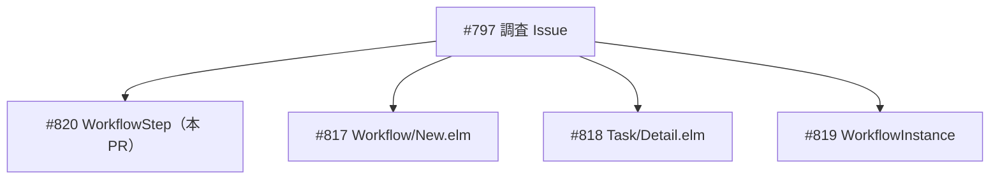
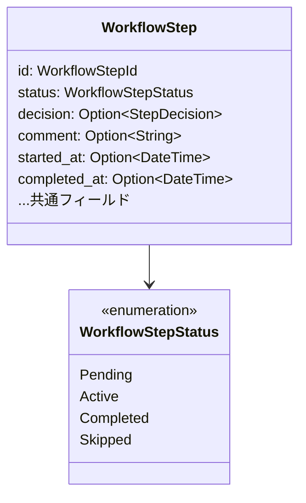
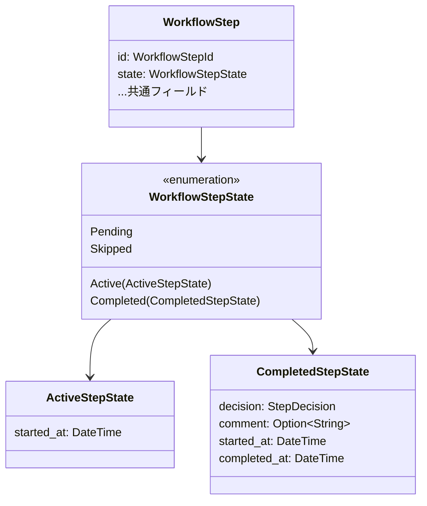
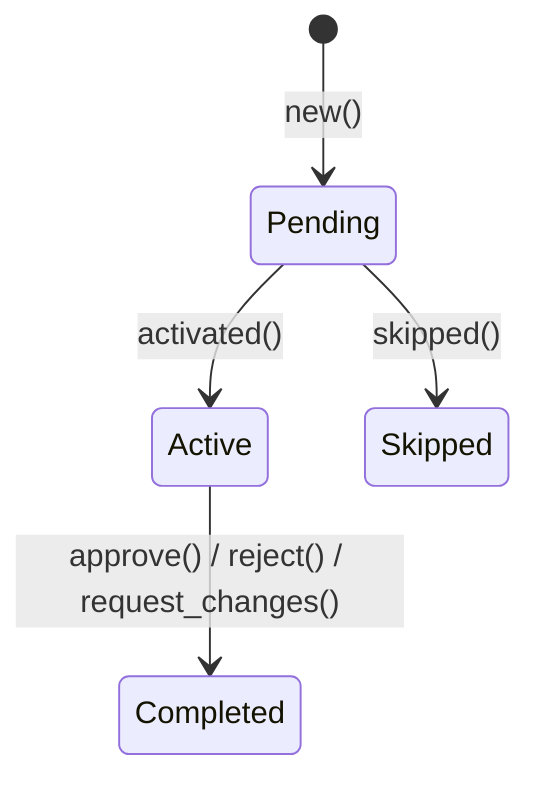

# WorkflowStep 型安全ステートマシン - 機能解説

対応 PR: #840
対応 Issue: #820

## 概要

`WorkflowStep` のドメインモデルを ADT（代数的データ型）ベースのステートマシンにリファクタリングした。フラットな `Option` フィールドで状態依存の値を表現していた構造を、状態ごとに異なる型に分離し、エンティティ不変条件（INV-S2〜S4）を型レベルで強制する構造に変換した。

## 背景

### 型安全ステートマシンパターンの標準化

ADR-054 で 型安全ステートマシンパターンが標準化され、Epic #822 で既存コードへの段階的適用が計画された。`WorkflowStep` は 4 状態（Pending / Active / Completed / Skipped）を持つエンティティであり、状態依存フィールドがフラットに混在していた。

### 変更前の課題

変更前の `WorkflowStep` には以下の課題があった:

- `decision: Option<StepDecision>` は Completed でのみ有効だが、Pending でも `Some` を許容
- `started_at: Option<DateTime<Utc>>` は Active/Completed でのみ有効だが、Pending でも `Some` を許容
- `completed_at: Option<DateTime<Utc>>` は Completed でのみ有効だが、Active でも `Some` を許容
- 不変条件（INV-S2〜S4）は実行時チェックでのみ担保されていた

### Epic #822 全体の中での位置づけ

| Issue | 内容 | 状態 |
|-------|------|------|
| #797 | 型安全ステートマシン適用箇所調査 | 完了 |
| #820 | WorkflowStep（本 PR） | 実装完了 |
| #817 | Workflow/New.elm | 完了（#826） |
| #818 | Task/Detail.elm | 完了（#823） |
| #819 | WorkflowInstance | 未着手 |

## 用語・概念

| 用語 | 説明 | 関連コード |
|------|------|-----------|
| 型安全ステートマシン | 状態ごとに異なる型を定義し、不正な状態を表現不可能にするパターン | `WorkflowStepState` enum |
| Pattern A | ADR-054 で定義。共通フィールドを外側の struct に、状態固有フィールドを内側の enum に配置 | `WorkflowStep` + `WorkflowStepState` |
| エンティティ不変条件 | エンティティ影響マップで定義された、各状態で必ず成立すべき条件 | INV-S2〜S4 |
| INV-S2 | Completed ⇒ decision IS NOT NULL | `CompletedStepState.decision` |
| INV-S3 | Completed ⇒ completed_at IS NOT NULL | `CompletedStepState.completed_at` |
| INV-S4 | Active ⇒ started_at IS NOT NULL | `ActiveStepState.started_at` |

## ビフォー・アフター

### Before（変更前）

`WorkflowStep` は全フィールドをフラットに保持し、`status` フィールドで状態を判別していた。

#### 制約・課題

- `Option` フィールドの「None / Some」が「この状態では存在しない / する」の意味を含んでおり、型情報から読み取れない
- `status = Pending` なのに `decision = Some(Approved)` という組み合わせが型レベルで許容される
- 不変条件は `assert_step_invariants()` テストヘルパーや実行時 `if` チェックでのみ担保

### After（変更後）

状態固有フィールドを `WorkflowStepState` enum に分離し、各バリアントが必要なフィールドのみを保持する。

#### 改善点

- Pending 状態で `decision` や `completed_at` が存在する組み合わせが型レベルで表現不可能
- `from_db()` が `Result` を返し、DB データの不整合を検出可能
- パターンマッチで状態遷移時にフィールドを確実に引き継ぎ（例: `active.started_at` → `CompletedStepState.started_at`）

## 状態遷移

| 遷移 | メソッド | バージョン更新 |
|------|---------|---------------|
| Pending → Active | `activated()` | なし |
| Pending → Skipped | `skipped()` | なし |
| Active → Completed(Approved) | `approve()` | あり |
| Active → Completed(Rejected) | `reject()` | あり |
| Active → Completed(RequestChanges) | `request_changes()` | あり |

## 設計判断

機能・仕組みレベルの判断を記載する。コード実装レベルの判断は[コード解説](./01_WorkflowStep-型安全ステートマシン_コード解説.md#設計解説)を参照。

### 1. ADT パターンをどれにするか

`WorkflowStep` には全状態で共通のフィールド（`id`, `version` 等）が多数あるため、Pattern A（外側共通 + 状態 enum）が適切。

| 案 | 共通フィールドの扱い | 状態固有フィールド | コード量 |
|----|--------------------|--------------------|---------|
| **Pattern A（採用）** | 外側 struct に集約 | 内側 enum のバリアントに分離 | 少（共通フィールド重複なし） |
| Pattern B（状態ごとに独立 struct） | 各 struct で重複 | 各 struct に直接配置 | 多（共通フィールドが 10+ で重複大） |

**採用理由**: 共通フィールドが 10 個以上あり、Pattern B では重複が大きすぎる。ADR-054 の判定基準「共通フィールドが多い場合は Pattern A」に合致。

### 2. `assigned_to` を Active/Completed で必須にするか

Issue 本文では「Active/Completed では必須」と記載されているが、これを型レベルで強制すると `activated()` の署名変更が大きくなる。

| 案 | 影響範囲 | 型安全性 | 互換性 |
|----|---------|---------|--------|
| **共通フィールドに残す（採用）** | 変更なし | 実行時チェック | 高 |
| Active/Completed の固有フィールドに移動 | UseCase・Handler 変更 | 型レベル強制 | 低 |

**採用理由**: `activated()` を呼び出す全 UseCase の署名変更が必要になり、本 Issue のスコープを超える。別 Issue で検討する。

### 3. `from_db()` の戻り値を `Result` にするか

DB のフラット構造から ADT に変換する際、不変条件違反（例: Completed で decision が NULL）をどう扱うか。

| 案 | 不整合データへの対応 | 呼び出し元の影響 |
|----|--------------------|--------------------|
| **Result を返す（採用）** | グレースフルにエラー | `.map_err()` 追加 |
| panic / expect | プロセスクラッシュ | なし |

**採用理由**: DB データの破損は致命的ではなくリカバリ可能な状況。グレースフルなエラーハンドリングが適切。

## 関連ドキュメント

- [コード解説](./01_WorkflowStep-型安全ステートマシン_コード解説.md)
- [ADR-054: 型安全ステートマシンパターンの標準化](../../05_ADR/054_型安全ステートマシンパターンの標準化.md)
- [エンティティ影響マップ](../../03_詳細設計書/エンティティ影響マップ/README.md)
