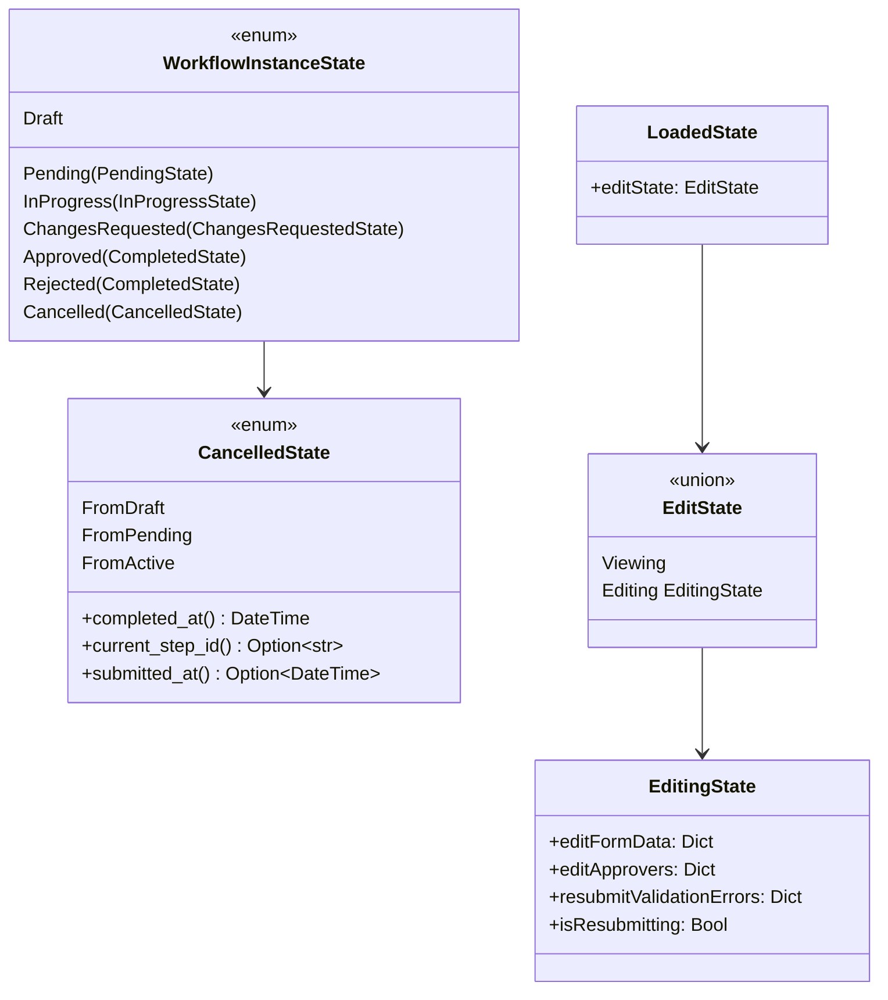
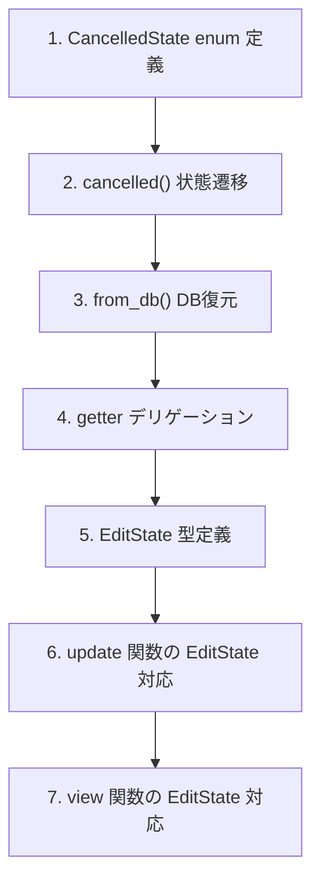
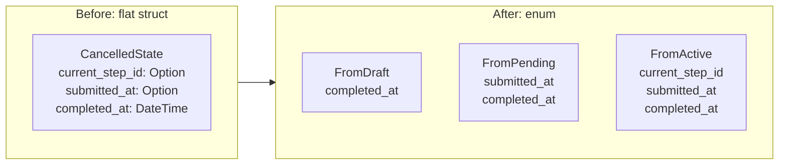
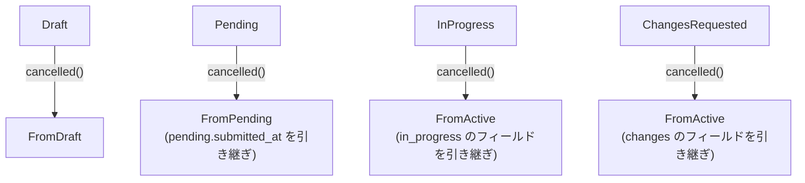
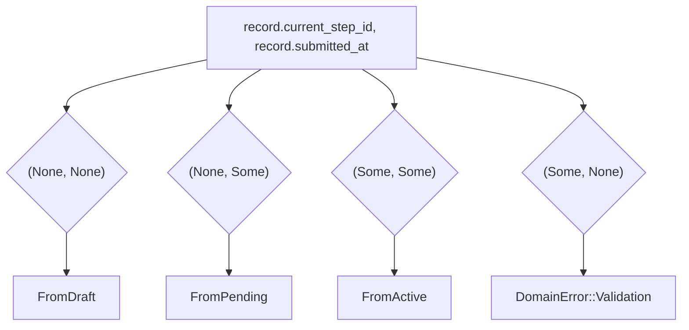

# 型安全ステートマシン再評価 - コード解説

対応 PR: #864
対応 Issue: #859

## 主要な型・関数

| 型/関数 | ファイル | 責務 |
|--------|---------|------|
| `CancelledState` | [`instance.rs:131`](../../../backend/crates/domain/src/workflow/instance.rs) | 取り消し状態を遷移元別に分離する enum |
| `CancelledState::completed_at()` | [`instance.rs:156`](../../../backend/crates/domain/src/workflow/instance.rs) | 全バリアント共通の completed_at を返すヘルパー |
| `CancelledState::current_step_id()` | [`instance.rs:164`](../../../backend/crates/domain/src/workflow/instance.rs) | FromActive のみ Some を返すヘルパー |
| `CancelledState::submitted_at()` | [`instance.rs:173`](../../../backend/crates/domain/src/workflow/instance.rs) | FromPending/FromActive のみ Some を返すヘルパー |
| `EditState` | [`Detail.elm:138`](../../../frontend/src/Page/Workflow/Detail.elm) | 閲覧/編集を分離する Custom Type |
| `EditingState` | [`Detail.elm:149`](../../../frontend/src/Page/Workflow/Detail.elm) | 編集中のみ有効なフィールドを集約する type alias |
| `updateEditing` | [`Detail.elm:715`](../../../frontend/src/Page/Workflow/Detail.elm) | EditState が Editing の場合のみ更新を適用するヘルパー |

### 型の関係



## コードフロー

コードを変更の種類ごとに追う。



### 1. CancelledState enum 定義（型の変更）

flat struct から遷移元別バリアントの enum に変更。各バリアントが必要なフィールドだけを持つ。



```rust
// backend/crates/domain/src/workflow/instance.rs:131-153
pub enum CancelledState {
    FromDraft {
        completed_at: DateTime<Utc>,
    },
    FromPending {
        submitted_at: DateTime<Utc>,
        completed_at: DateTime<Utc>,         // ① FromPending は submitted_at が必須
    },
    FromActive {
        current_step_id: String,             // ② FromActive のみ current_step_id を持つ
        submitted_at:    DateTime<Utc>,
        completed_at:    DateTime<Utc>,
    },
}
```

注目ポイント:
- ① `FromPending` では `submitted_at` が `Option` ではなく必須フィールド。申請済み状態からの取り消しなので、submitted_at は必ず存在する
- ② `current_step_id` は `FromActive` にのみ存在。Draft/Pending からの取り消しではステップ処理が始まっていないため不要

### 2. cancelled() 状態遷移メソッド

各遷移元からの `cancelled()` 呼び出しで適切なバリアントを構築する。



```rust
// backend/crates/domain/src/workflow/instance.rs（cancelled メソッド内）
WorkflowInstanceState::Draft => Ok(Self {
    state: WorkflowInstanceState::Cancelled(CancelledState::FromDraft {
        completed_at: now,
    }),
    ..
}),
WorkflowInstanceState::InProgress(in_progress) => Ok(Self {
    state: WorkflowInstanceState::Cancelled(CancelledState::FromActive {
        current_step_id: in_progress.current_step_id,  // ① 遷移元のフィールドを引き継ぎ
        submitted_at: in_progress.submitted_at,
        completed_at: now,
    }),
    ..
}),
```

注目ポイント:
- ① 遷移元の状態から必要なフィールドを引き継ぐ。型が異なるため、不正な引き継ぎ（Draft から current_step_id を設定する等）はコンパイルエラーになる

### 3. from_db() のパターンマッチ復元

DB からの復元時、`(current_step_id, submitted_at)` のタプルパターンマッチで自然にバリデーションが行われる。



```rust
// backend/crates/domain/src/workflow/instance.rs（from_db 内）
let cancelled_state = match (record.current_step_id, record.submitted_at) {
    (None, None) => CancelledState::FromDraft { completed_at },
    (None, Some(submitted_at)) => CancelledState::FromPending {
        submitted_at,
        completed_at,
    },
    (Some(current_step_id), Some(submitted_at)) => CancelledState::FromActive {
        current_step_id,
        submitted_at,
        completed_at,
    },
    (Some(_), None) => {                                      // ① 不正相関を自然に検出
        return Err(DomainError::Validation(
            "Cancelled インスタンスで current_step_id がある場合は submitted_at が必要です"
                .to_string(),
        ));
    }
};
```

注目ポイント:
- ① `(Some(_), None)` は「ステップ ID はあるが申請日がない」という不正な状態。パターンマッチの網羅性チェックにより、このケースの処理が強制される。追加の `if` 文は不要

### 4. getter のデリゲーション

`WorkflowInstance` の getter は `CancelledState` のヘルパーメソッドにデリゲートする。

```rust
// backend/crates/domain/src/workflow/instance.rs（getter メソッド内）
pub fn completed_at(&self) -> Option<DateTime<Utc>> {
    match &self.state {
        WorkflowInstanceState::Approved(s) | WorkflowInstanceState::Rejected(s) => {
            Some(s.completed_at)
        }
        WorkflowInstanceState::Cancelled(s) => Some(s.completed_at()),  // ① ヘルパーにデリゲート
        WorkflowInstanceState::Draft                                     // ② 全バリアント明示
        | WorkflowInstanceState::Pending(_)
        | WorkflowInstanceState::InProgress(_)
        | WorkflowInstanceState::ChangesRequested(_) => None,
    }
}
```

注目ポイント:
- ① `CancelledState` のヘルパーメソッドがバリアント間の差異を吸収
- ② `_ => None` を全バリアント明示に変更。将来の状態追加時にコンパイラが警告を出す

### 5. EditState 型定義（Elm）

`isEditing: Bool` + フラットフィールドを ADT に分離。

```elm
-- frontend/src/Page/Workflow/Detail.elm:138-154
type EditState
    = Viewing
    | Editing EditingState

type alias EditingState =
    { editFormData : Dict String String
    , editApprovers : Dict String ApproverSelector.State
    , resubmitValidationErrors : Dict String String
    , isResubmitting : Bool
    }
```

### 6. updateEditing ヘルパー

`Editing` 状態のときのみ更新を適用するヘルパー関数。`case loaded.editState of` の繰り返しパターンを削減する。

```elm
-- frontend/src/Page/Workflow/Detail.elm:715-722
updateEditing : LoadedState -> (EditingState -> EditingState) -> ( LoadedState, Cmd Msg )
updateEditing loaded updater =
    case loaded.editState of
        Editing editing ->
            ( { loaded | editState = Editing (updater editing) }, Cmd.none )

        Viewing ->
            ( loaded, Cmd.none )
```

### 7. view 関数の EditState 対応

view 関数に `EditingState` を明示的に渡し、閲覧中に編集データへアクセスすることを型で防止。

```elm
-- frontend/src/Page/Workflow/Detail.elm（viewWorkflowDetail 内）
, case loaded.editState of
    Editing editing ->
        viewEditableFormData loaded editing    -- ① EditingState を明示的に渡す

    Viewing ->
        viewFormData loaded.workflow loaded.definition
```

## テスト

| テスト | 検証対象のステップ | 検証内容 |
|-------|------------------|---------|
| `test_from_db_cancelledでcurrent_step_idありsubmitted_atなしはエラー` | 3 | 不正相関を from_db が拒否する |
| 既存 cancelled() テスト群 | 2 | 各遷移元から正しいバリアントが構築される |
| 既存 from_db テスト群 | 3 | 正当な3パターンが正しく復元される |
| Elm コンパイラ型チェック | 5-7 | EditState の全パスで型の整合性 |

### 実行方法

```bash
# backend テスト
cargo test -p ringiflow-domain

# frontend コンパイルチェック
cd frontend && npx elm make src/Page/Workflow/Detail.elm --output=/dev/null

# 全体チェック
just check-all
```

## 設計解説

コード実装レベルの判断を記載する。機能・仕組みレベルの判断は[機能解説](./01_型安全ステートマシン再評価_機能解説.md#設計判断)を参照。

### 1. CancelledState にヘルパーメソッドを定義

場所: `instance.rs:155-181`

```rust
impl CancelledState {
    pub fn completed_at(&self) -> DateTime<Utc> { ... }
    pub fn current_step_id(&self) -> Option<&str> { ... }
    pub fn submitted_at(&self) -> Option<DateTime<Utc>> { ... }
}
```

なぜこの実装か:
ADT 分離すると `WorkflowInstance` の getter でバリアントごとのマッチが必要になり、既存 getter が複雑化する。ヘルパーメソッドにカプセル化することで getter は `s.completed_at()` の1行デリゲートで済む。

代替案:

| 案 | メリット | デメリット | 判断 |
|----|---------|-----------|------|
| ヘルパーメソッド（採用） | getter の可読性維持 | impl ブロックの追加 | 採用 |
| getter 内で直接マッチ | impl ブロック不要 | getter が3重ネストになり可読性低下 | 見送り |

### 2. updateEditing ヘルパーの抽出

場所: `Detail.elm:715-722`

```elm
updateEditing : LoadedState -> (EditingState -> EditingState) -> ( LoadedState, Cmd Msg )
```

なぜこの実装か:
`EditApproverSearchChanged`, `EditApproverSelected`, `EditApproverCleared` 等の複数メッセージハンドラが `case loaded.editState of` → `Editing editing` → 更新 → `Viewing` → noop の同一パターンを持つ。ヘルパー関数で一元化し、`Viewing` ケースの書き漏れを防止した。

### 3. viewResubmitSection で `== Viewing` を使用

場所: `Detail.elm:1010`

```elm
if isChangesRequested && isInitiator && loaded.editState == Viewing then
```

なぜこの実装か:
`case` 式ではなく `==` 比較を使用。Elm は全カスタム型に構造的等価性を提供し、`Viewing`（引数なしコンストラクタ）との比較ではコンストラクタタグの比較のみで完了する。ここでは `Editing` の中身にアクセスする必要がないため、`if` 式の方が簡潔。

## 関連ドキュメント

- [機能解説](./01_型安全ステートマシン再評価_機能解説.md)
- [ADR-054: 型安全ステートマシンパターンの標準化](../../05_ADR/054_型安全ステートマシンパターンの標準化.md)
- [Workflow/New.elm の FormState パターン](../../../frontend/src/Page/Workflow/New.elm)（参照パターン）
