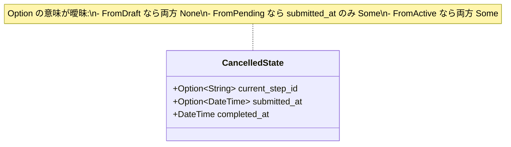
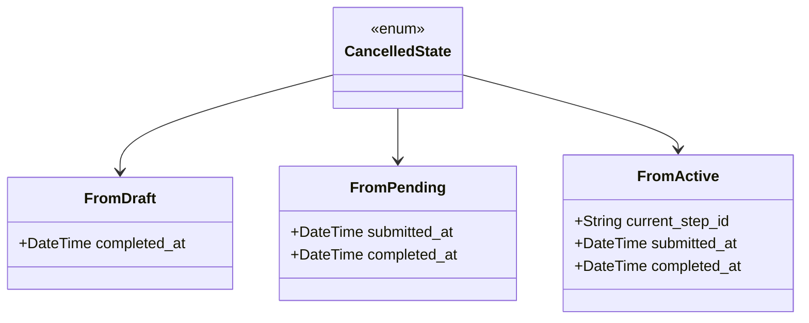
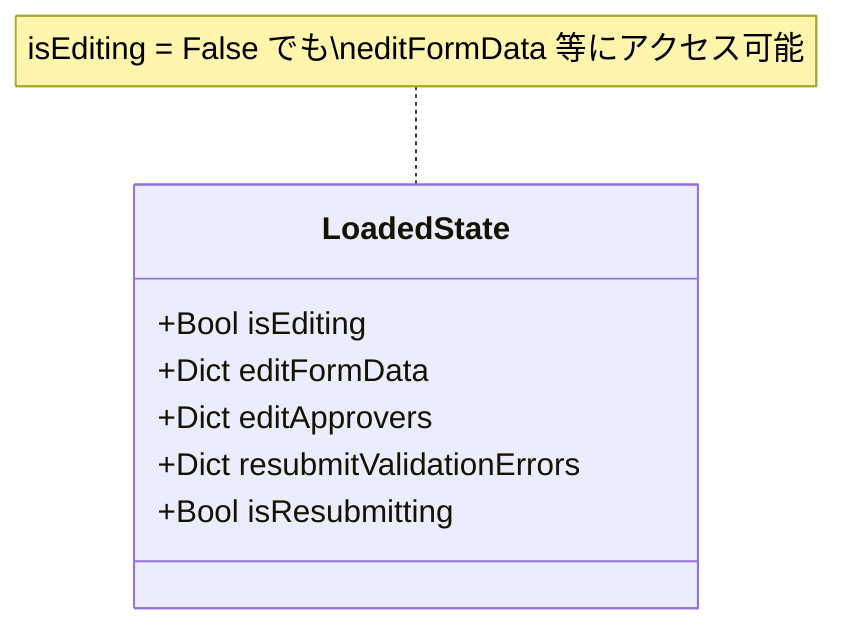
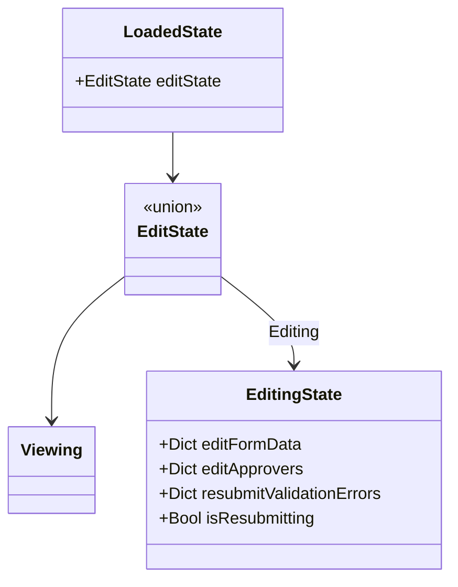
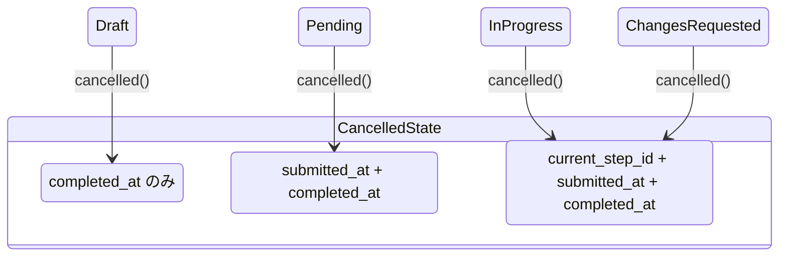
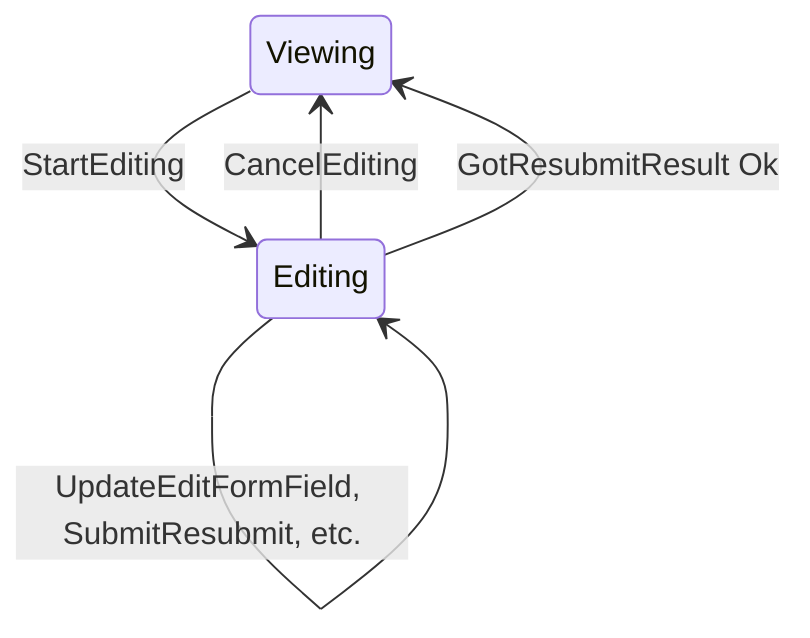

# 型安全ステートマシン再評価 - 機能解説

対応 PR: #864
対応 Issue: #859

## 概要

#855 で型安全ステートマシンの判断基準が「ADT で表現できるか」から「不正な状態遷移が型レベルで防止されているか」に変更された。この新基準で既存実装を再評価し、3つの改善を実施した。

## 背景

### 判断基準の変更（#855）

[ADR-054](../../05_ADR/054_型安全ステートマシンパターンの標準化.md) は当初「ADT ベースステートマシン」と命名され、実装手段（ADT）と目的（型安全性）が混同されていた。#855 で手段非依存の命名に変更し、判断基準を明確化した。

| 項目 | 変更前 | 変更後 |
|------|--------|--------|
| 名称 | ADT ベースステートマシン | 型安全ステートマシン |
| 判断基準 | ADT で表現できるか | 不正な状態遷移が型レベルで防止されているか |

### 再評価で特定された改善候補

既存6実装を新基準で再評価し、4つの改善候補を特定した。

| # | 候補 | 対象 | 分類 |
|---|------|------|------|
| 1 | `CancelledState` の `from_db()` 相関バリデーション | backend | マイナス→ゼロ |
| 2 | `completed_at()` のワイルドカード明示化 | backend | マイナス→ゼロ |
| 3 | `CancelledState` の遷移元 ADT 分離 | backend | ゼロ→プラス |
| 4 | `Detail.elm` LoadedState 編集状態分離 | frontend | ゼロ→プラス |

候補1は候補3の上位互換（型制約に包含される）のため除外し、候補2, 3, 4を実施した。

## 用語・概念

| 用語 | 説明 | 関連コード |
|------|------|-----------|
| 型安全ステートマシン | ADT 等で不正な状態遷移を型レベルで防止するパターン | ADR-054 |
| CancelledState | ワークフローの取り消し状態。遷移元（Draft/Pending/Active）によって保持フィールドが異なる | `WorkflowInstanceState::Cancelled` |
| EditState | 詳細画面の編集状態。閲覧中（Viewing）と編集中（Editing）で有効なフィールドが異なる | `Detail.EditState` |
| 遷移元 ADT 分離 | 状態の「どこから来たか」によってバリアントを分離する手法 | `CancelledState::FromDraft` 等 |

## ビフォー・アフター

### CancelledState（backend）

#### Before

`CancelledState` は全フィールドを `Option` で保持するフラット構造体。遷移元による有効フィールドの違いはロジック（`if` 文）でしか検証できない。

制約・課題:
- `current_step_id = Some, submitted_at = None` という不正な組み合わせが型上は許容される
- `Option` が「この遷移元では存在しない」と「未設定」の2つの意味を持つ

#### After

遷移元ごとにバリアントを分離し、各バリアントが必要なフィールドだけを持つ。

改善点:
- 不正なフィールド組み合わせが型レベルで表現不可能
- `from_db()` のパターンマッチで不正相関が自然にエラーになる
- `Option` の意味が「この遷移元では存在しない」のみに統一

### Detail.elm EditState（frontend）

#### Before

編集状態を `isEditing: Bool` フラグと `LoadedState` 上のフラットフィールドで管理。閲覧中でも編集フィールドが存在する。

#### After

`EditState` ADT で閲覧/編集を分離し、編集フィールドは `Editing` バリアント内にのみ存在する。

改善点:
- 閲覧中に編集データへアクセスすることが型レベルで不可能
- `New.elm` の `FormState = SelectingDefinition | Editing EditingState` パターンと一貫

## 状態遷移

### CancelledState の遷移元

### Detail.elm の EditState 遷移

## 設計判断

機能・仕組みレベルの判断を記載する。コード実装レベルの判断は[コード解説](./01_型安全ステートマシン再評価_コード解説.md#設計解説)を参照。

### 1. CancelledState の制約をどう実現するか

`CancelledState` の遷移元によるフィールド相関を型制約で表現するか、ロジック（`if` 文）で検証するか。

| 案 | 不正状態の防止力 | 将来の安全性 | コード変更量 |
|----|----------------|-------------|-------------|
| **ADT 分離（採用）** | コンパイラが強制 | AI/人が削除できない | 中 |
| ロジックバリデーション | 実行時のみ | `if` 文の削除/回避リスク | 小 |

採用理由: 型制約はコンパイラが強制するため、将来の開発者や AI が誤って制約を削除・回避することがない。プロジェクトの設計原則「型で表現できるものは型で表現する」に直接合致する。

### 2. `users` フィールドをどこに配置するか

詳細画面のユーザー一覧（承認者選択で使用）を `EditingState` に移動するか、`LoadedState` に残すか。

| 案 | 一貫性 | キャッシュ | 引き回しの複雑さ |
|----|--------|----------|-----------------|
| **LoadedState に残す（採用）** | New.elm と一致 | 編集セッション間でキャッシュ可 | 低 |
| EditingState に移動 | 厳密には正しい | 毎回再取得 | 高 |

採用理由: New.elm でも `users` は Model レベル（EditingState の外）に配置されており、プロジェクト内の一貫性を優先した。

## 関連ドキュメント

- [コード解説](./01_型安全ステートマシン再評価_コード解説.md)
- [ADR-054: 型安全ステートマシンパターンの標準化](../../05_ADR/054_型安全ステートマシンパターンの標準化.md)
- [PR #839 WorkflowDetail 型安全ステートマシン](../PR839_WorkflowDetail_型安全ステートマシン/)
