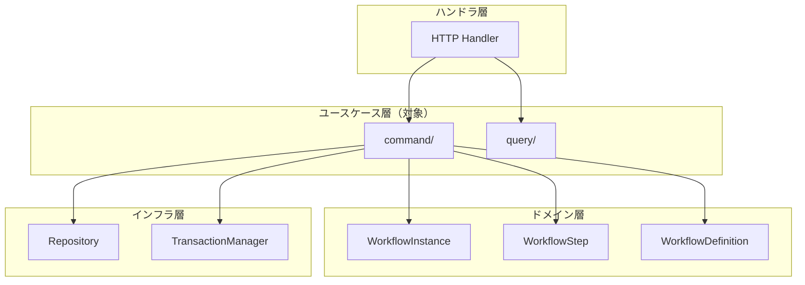
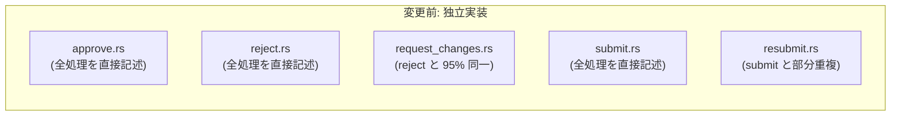
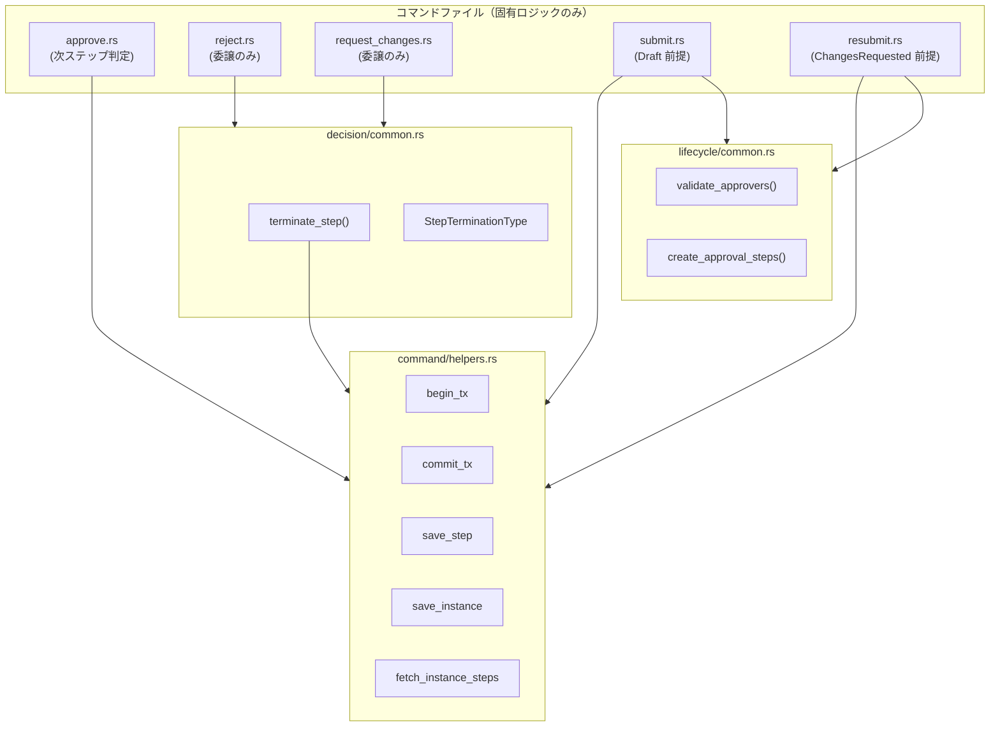
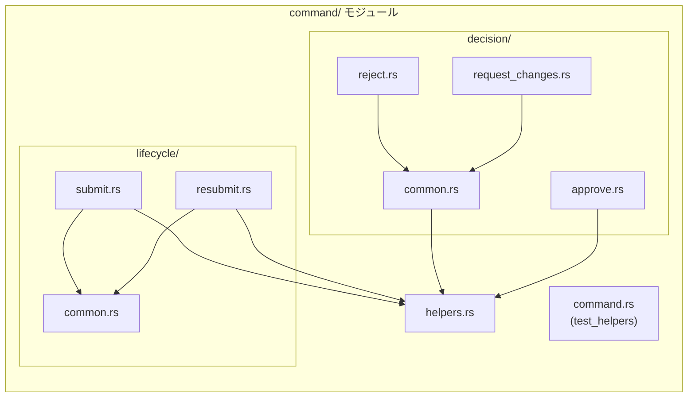
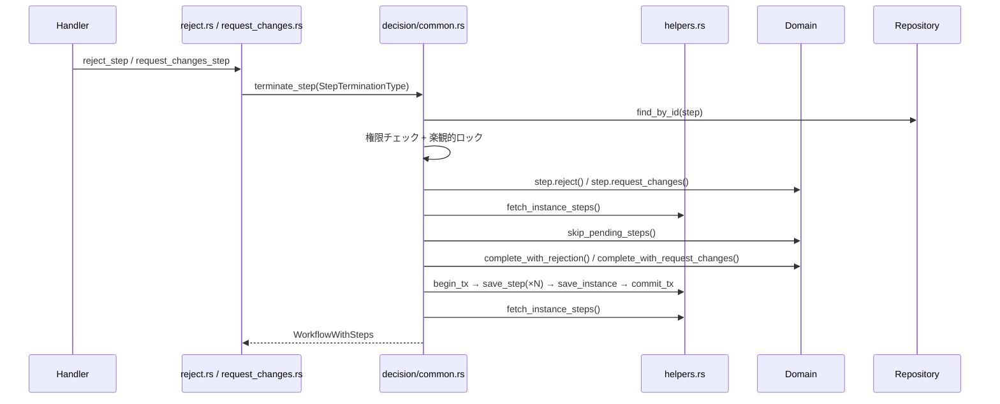
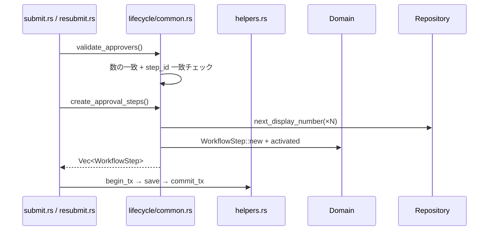

# ワークフローコマンド重複解消 - 機能解説

対応 PR: #904
対応 Issue: #902

## 概要

ワークフローのコマンドユースケース層（`workflow/command/`）に蓄積したコード重複を、ハイブリッドアプローチ（ヘルパー関数 + フロー統合）で解消した。jscpd クローン数を約 200 → 9（95% 以上削減）、重複率を 12.07% → 2.33% に改善し、保守コストの増大と修正漏れリスクを低減した。

## 背景

### アーキテクチャ上の位置づけ

RingiFlow のワークフロー機能は、申請 → 承認 → 完了の承認フローを管理する。ユースケース層は DDD のアプリケーションサービスに相当し、ドメインロジックのオーケストレーションと永続化の責務を担う。

### 変更前の課題

`command/` 配下の 5 ファイル（approve, reject, request_changes, submit, resubmit）は、それぞれ独立に実装されたため、以下のボイラープレートが各ファイルで繰り返されていた:

- トランザクション操作（begin → save → commit）
- version check 付き更新と `InfraError::Conflict` → `CoreError::Conflict` 変換
- ステップ一覧取得
- 権限チェック + 楽観的ロック
- 承認者検証 + ステップ作成ループ

特に reject と request_changes は処理フローの 95% が同一であり、4 箇所の変動点（ドメインメソッド、インスタンス遷移、権限チェックのアクション名、イベントログ）だけが異なっていた。

### Epic/Issue の位置づけ

| Issue | 内容 | 状態 |
|-------|------|------|
| #902 | workflow command usecase のコード重複解消 | 本 PR で対応 |

## 用語・概念

| 用語 | 説明 | 関連コード |
|------|------|-----------|
| コマンドユースケース | 状態変更を伴う操作（CQS の Command 側） | `workflow/command/` |
| ステップ終了操作 | reject / request_changes の総称。ステップを Completed にしインスタンスを終了状態に遷移 | `StepTerminationType` |
| 楽観的ロック | `Version` 値の一致チェックによる同時更新の検出 | `save_step`, `save_instance` |
| Persistence ヘルパー | トランザクション・永続化ボイラープレートの共通関数群 | `command/helpers.rs` |

## ビフォー・アフター

### Before（変更前）

各コマンドファイルが独立に永続化ロジック、バリデーション、フロー制御を実装。

制約・課題:
- 永続化パターンの修正時、5 ファイルすべてを更新する必要がある
- reject と request_changes で修正を片方に適用し忘れるリスク
- jscpd クローン数 約 200、重複率 12.07%

### After（変更後）

3 つの共通モジュールに抽出し、各コマンドは固有ロジックのみ保持。

改善点:
- 永続化パターンの修正は `helpers.rs` の 1 箇所
- reject/request_changes は `terminate_step()` に統合、変動点は enum で切替
- submit/resubmit は承認者検証とステップ作成を共通関数で共有
- jscpd クローン数 9、重複率 2.33%

## アーキテクチャ

## データフロー

### フロー 1: ステップ終了操作（reject / request_changes）

#### 処理ステップ

| # | レイヤー | ファイル:関数 | 処理内容 |
|---|---------|-------------|---------|
| 1 | ユースケース | `reject.rs:reject_step` | `terminate_step` に `Reject` 種別で委譲 |
| 2 | ユースケース | `common.rs:terminate_step` | ステップ取得、権限チェック、楽観的ロック |
| 3 | ドメイン | `WorkflowStep::reject` | ステップを Completed に遷移 |
| 4 | ドメイン | `WorkflowStep::skipped` | 残りの Pending ステップを Skipped に遷移 |
| 5 | ドメイン | `WorkflowInstance::complete_with_rejection` | インスタンスを Rejected に遷移 |
| 6 | ユースケース | `helpers.rs:begin_tx` → `save_step` → `save_instance` → `commit_tx` | 単一トランザクションで全更新 |

### フロー 2: 申請 / 再申請の共通部分

## 設計判断

機能・仕組みレベルの判断を記載する。コード実装レベルの判断は[コード解説](./01_ワークフローコマンド重複解消_コード解説.md#設計解説)を参照。

### 1. 重複解消のアプローチをどうするか

5 つのコマンドファイル間のコード重複を解消する方法を選択する必要があった。

| 案 | 削減効果 | 複雑さ | approve への適合 |
|----|---------|--------|-----------------|
| **ハイブリッド（採用）** | 高 | 中 | approve は独立維持、自然 |
| ヘルパー関数のみ | 中 | 低 | 適合するが reject/request_changes のフロー重複が残る |
| Strategy パターン | 最大 | 高 | approve の次ステップ判定が嵌まらない |

**採用理由**: reject/request_changes は 95% 同一でフロー統合が自然。submit/resubmit は前提条件が異なるため共通部分のみ関数化が適切。approve は独自ロジック（次ステップ判定）があり独立維持。

### 2. reject/request_changes の統合方式をどうするか

2 つのほぼ同一な操作を統合する方式を選択する必要があった。

| 案 | 型安全性 | Rust 適合度 | 変動点の管理 |
|----|---------|-------------|-------------|
| **enum dispatch（採用）** | 高 | 高 | match で明示的に分岐 |
| クロージャ注入 | 低 | 中 | シグネチャが複雑化 |
| トレイト委譲 | 高 | 高 | 変動点 4 箇所には過剰 |

**採用理由**: 変動点が 4 箇所と少なく、enum の match で十分に管理可能。クロージャやトレイトより Rust として自然な表現。

### 3. submit/resubmit はフロー統合すべきか

submit と resubmit は共通部分を持つが、前提条件が大きく異なる。

| 案 | メリット | デメリット |
|----|---------|-----------|
| **共通部分のみ関数抽出（採用）** | 各コマンドの前提条件が明確に読める | 一部の繰り返しが残る |
| フロー全体を統合 | 最大限の削減 | 前提条件の分岐で読みにくくなる |

**採用理由**: submit は「Draft 状態のインスタンスを申請」、resubmit は「ChangesRequested 状態のインスタンスを再申請 + 権限チェック + 楽観的ロック」と前提条件が異なる。フロー統合すると条件分岐が増え、逆に読みにくくなる。

## 関連ドキュメント

- [コード解説](./01_ワークフローコマンド重複解消_コード解説.md)
- [セッションログ](../../../prompts/runs/2026-02/2026-02-24_2129_workflow-command-dedup.md)
- [計画ファイル](../../../prompts/plans/902_workflow-command-dedup.md)
