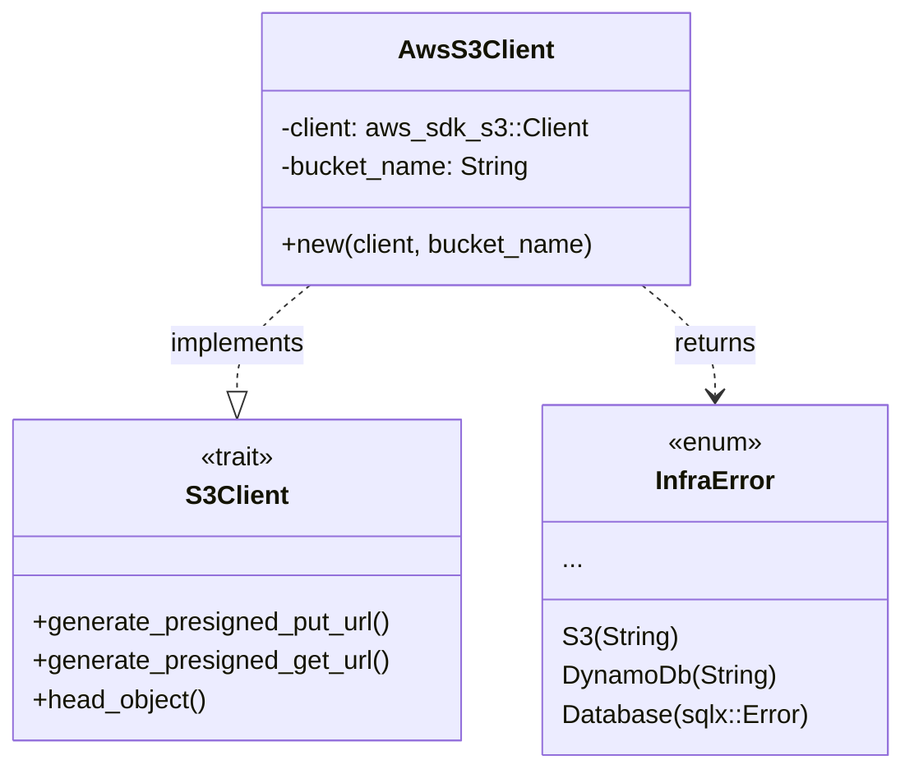
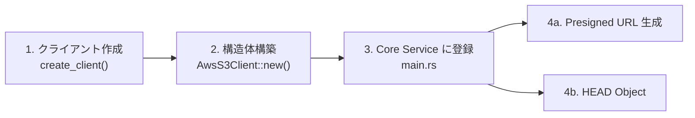
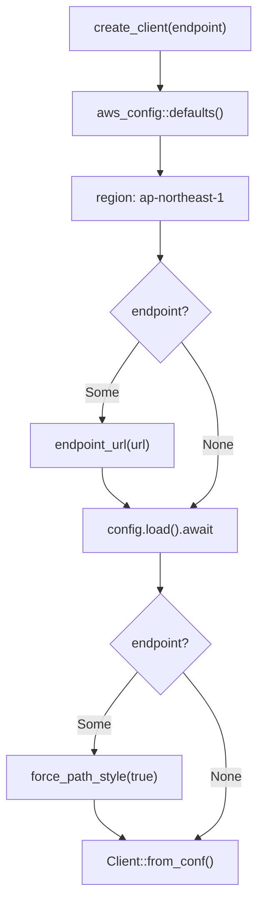
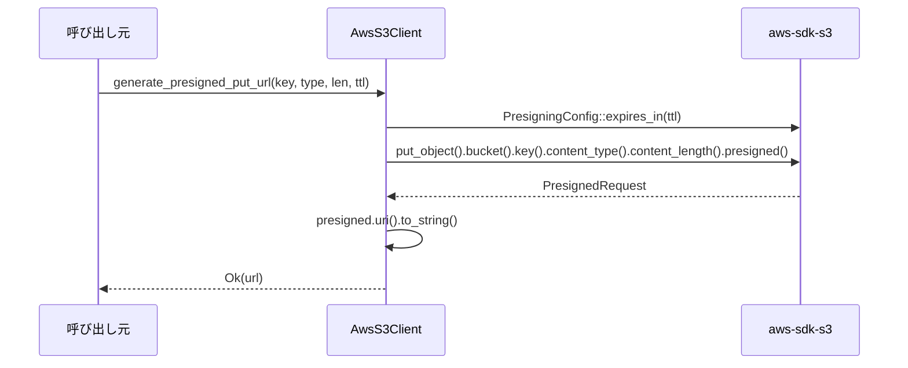
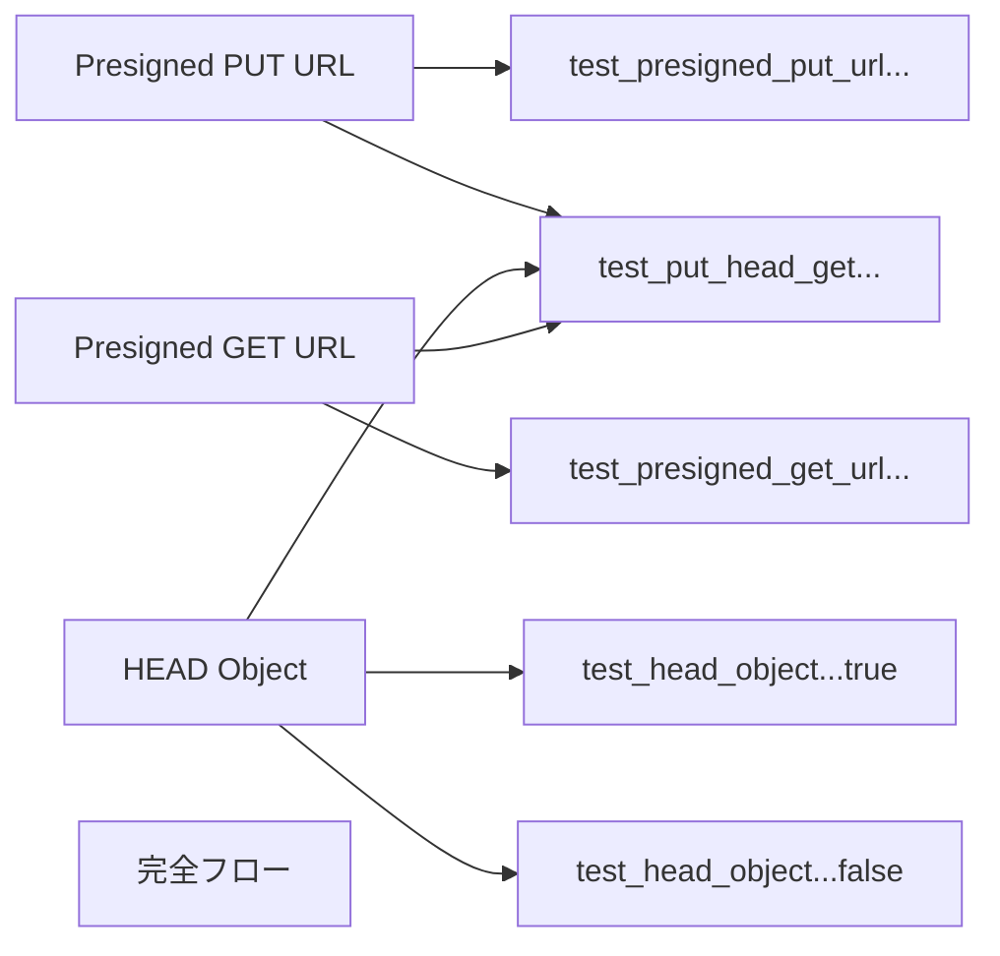

# S3 基盤と MinIO ローカル環境 - コード解説

対応 PR: #917
対応 Issue: #880

## 主要な型・関数

| 型/関数 | ファイル | 責務 |
|--------|---------|------|
| `S3Client` | [`crates/infra/src/s3.rs:42`](../../../backend/crates/infra/src/s3.rs) | S3 操作のインターフェース（トレイト） |
| `AwsS3Client` | [`crates/infra/src/s3.rs:93`](../../../backend/crates/infra/src/s3.rs) | `S3Client` の AWS SDK 実装 |
| `create_client` | [`crates/infra/src/s3.rs:198`](../../../backend/crates/infra/src/s3.rs) | S3 クライアントファクトリ（MinIO / AWS 切替） |
| `InfraError::S3` | [`crates/infra/src/error.rs:63`](../../../backend/crates/infra/src/error.rs) | S3 操作のエラーバリアント |
| `CoreConfig` | [`apps/core-service/src/config.rs:9`](../../../backend/apps/core-service/src/config.rs) | S3 設定を含むサーバー設定 |

### 型の関係



## コードフロー

コードをライフサイクル順に追う。各ステップの構造を図で示した後、対応するコードを解説する。



### 1. クライアント作成（アプリ起動時）

`create_client` が AWS SDK の設定を構築し、MinIO / AWS S3 を切り替える。



```rust
// crates/infra/src/s3.rs:198-218
pub async fn create_client(endpoint: Option<&str>) -> Client {
    let mut config_builder = aws_config::defaults(aws_config::BehaviorVersion::latest())
        .region(aws_config::Region::new("ap-northeast-1"));         // ①

    if let Some(endpoint_url) = endpoint {
        config_builder = config_builder.endpoint_url(endpoint_url);  // ②
    }

    let config = config_builder.load().await;                        // ③

    let s3_config_builder = aws_sdk_s3::config::Builder::from(&config);
    let s3_config = if endpoint.is_some() {
        s3_config_builder.force_path_style(true).build()             // ④
    } else {
        s3_config_builder.build()
    };

    Client::from_conf(s3_config)                                     // ⑤
}
```

注目ポイント:

- ① リージョンは `ap-northeast-1` 固定。本番環境でも東京リージョンを使用する設計
- ② `endpoint_url` は `Option` — `Some` なら MinIO、`None` なら AWS S3 のデフォルトエンドポイント
- ③ `load().await` で環境変数（`AWS_ACCESS_KEY_ID` 等）からクレデンシャルを自動解決
- ④ MinIO は `force_path_style(true)` が必須（バーチャルホスト型 URL に非対応）
- ⑤ `Client::new(&config)` ではなく `Client::from_conf(s3_config)` — S3 固有の設定（`force_path_style`）を適用するため

### 2. 構造体構築（アプリ起動時）

`AwsS3Client` は SDK クライアントとバケット名を保持する。

```rust
// crates/infra/src/s3.rs:93-106
pub struct AwsS3Client {
    client:      Client,
    bucket_name: String,
}

impl AwsS3Client {
    pub fn new(client: Client, bucket_name: String) -> Self {
        Self { client, bucket_name }
    }
}
```

### 3. Core Service への登録（アプリ起動時）

`main.rs` で S3 クライアントを初期化する。この Story では未使用（`_` プレフィックス）だが、#881+ でハンドラ State に注入される。

```rust
// apps/core-service/src/main.rs:190-195
let s3_client_inner =
    ringiflow_infra::s3::create_client(config.s3_endpoint_url.as_deref()).await;  // ①
let _s3_client: Arc<dyn ringiflow_infra::S3Client> = Arc::new(                   // ②
    ringiflow_infra::AwsS3Client::new(s3_client_inner, config.s3_bucket_name.clone()),
);
tracing::info!("S3 クライアントを初期化しました");
```

注目ポイント:

- ① `as_deref()` で `Option<String>` → `Option<&str>` に変換。`create_client` の引数型に合わせる
- ② `Arc<dyn S3Client>` で型消去。テスト時にモック実装に差し替え可能

環境変数の読み込み:

```rust
// apps/core-service/src/config.rs:33-35
s3_endpoint_url: env::var("S3_ENDPOINT_URL").ok(),              // Optional
s3_bucket_name: env::var("S3_BUCKET_NAME").expect("..."),       // Required
```

### 4a. Presigned PUT URL 生成（リクエスト時）



```rust
// crates/infra/src/s3.rs:110-132
async fn generate_presigned_put_url(
    &self,
    s3_key: &str,
    content_type: &str,
    content_length: i64,
    expires_in: Duration,
) -> Result<String, InfraError> {
    let presign_config = PresigningConfig::expires_in(expires_in)         // ①
        .map_err(|e| InfraError::S3(format!("Presigned 設定の構築に失敗: {e}")))?;

    let presigned = self.client
        .put_object()
        .bucket(&self.bucket_name)
        .key(s3_key)
        .content_type(content_type)       // ②
        .content_length(content_length)   // ②
        .presigned(presign_config)        // ③
        .await
        .map_err(|e| InfraError::S3(format!("Presigned PUT URL の生成に失敗: {e}")))?;

    Ok(presigned.uri().to_string())
}
```

注目ポイント:

- ① `expires_in` で URL の有効期限を設定。設計書では PUT は 5 分、GET は 15 分
- ② `content_type` と `content_length` を署名に含めることで、異なるファイルの PUT を防止するセキュリティ対策
- ③ `.presigned()` はネットワーク通信不要 — ローカルで署名計算して URL を構築する

### 4b. HEAD Object（リクエスト時）

アップロード完了通知時に、S3 にファイルが実際に存在するかを確認する。

```rust
// crates/infra/src/s3.rs:154-178
async fn head_object(&self, s3_key: &str) -> Result<bool, InfraError> {
    let result = self.client
        .head_object()
        .bucket(&self.bucket_name)
        .key(s3_key)
        .send()
        .await;

    match result {
        Ok(_) => Ok(true),                                              // ①
        Err(err) => {
            let is_not_found = err
                .as_service_error()
                .map(|e| e.is_not_found())                              // ②
                .unwrap_or(false);
            if is_not_found {
                Ok(false)                                               // ③
            } else {
                Err(InfraError::S3(format!("HEAD Object の実行に失敗: {err}")))
            }
        }
    }
}
```

注目ポイント:

- ① 存在する場合は `true`
- ② AWS SDK の `is_not_found()` で 404 を判定。DynamoDB の `is_resource_not_found_exception()` と同じパターン
- ③ NotFound は正常系（`false`）として返す。それ以外のエラー（ネットワーク障害等）は `InfraError::S3` に伝播

## テスト

各テストがライフサイクルのどのステップを検証しているかを示す。



| テスト | 検証対象 | 検証内容 |
|-------|---------|---------|
| `test_presigned_put_urlでminioにファイルをアップロードできる` | PUT URL 生成 + HTTP PUT | URL が有効で、MinIO にファイルを PUT できる |
| `test_presigned_get_urlでminioからファイルをダウンロードできる` | GET URL 生成 + HTTP GET | URL が有効で、GET した内容がアップロードと一致する |
| `test_head_objectがアップロード済みオブジェクトにtrueを返す` | HEAD Object（存在） | アップロード済みオブジェクトに `true` |
| `test_head_objectが存在しないオブジェクトにfalseを返す` | HEAD Object（不在） | 未アップロードのキーに `false` |
| `test_put_head_getの完全フロー` | PUT → HEAD → GET | 一連のフローが正しく動作する |

テスト分離の仕組み:

```rust
// UUID v7 で各テストのキーを一意化
fn test_s3_key(prefix: &str) -> String {
    format!("test/{prefix}/{}", uuid::Uuid::now_v7())
}
```

### 実行方法

```bash
just dev-deps                                              # MinIO 起動
cd backend && cargo test -p ringiflow-infra --test s3_test  # テスト実行
```

## 依存関係

| クレート | バージョン | 追加理由 |
|---------|-----------|---------|
| `aws-sdk-s3` | `1` (features: `behavior-version-latest`) | S3 API 操作（Presigned URL 生成、HEAD Object） |
| `reqwest` | `0.12`（dev-dependency） | 統合テストで Presigned URL に HTTP リクエストを送信 |

## 設計解説

コード実装レベルの判断を記載する。機能・仕組みレベルの判断は[機能解説](./01_S3基盤_機能解説.md#設計判断)を参照。

### 1. `Client::from_conf` vs `Client::new`

場所: `crates/infra/src/s3.rs:217`

```rust
// S3 固有設定を適用するため from_conf を使用
let s3_config = if endpoint.is_some() {
    s3_config_builder.force_path_style(true).build()
} else {
    s3_config_builder.build()
};
Client::from_conf(s3_config)
```

なぜこの実装か:
`Client::new(&config)` では汎用 AWS Config しか渡せず、`force_path_style` のような S3 固有オプションを設定できない。`aws_sdk_s3::config::Builder::from(&config)` で汎用 Config を S3 Config に変換し、S3 固有のオプションを追加してから `Client::from_conf` で構築する。

DynamoDB の `create_client` が `Client::new(&config)` を使用しているのは、DynamoDB 固有のクライアント設定が不要なため。

| 案 | S3 固有設定 | 既存パターンとの整合 | 判断 |
|----|----------|-------------------|------|
| **`Client::from_conf`（採用）** | 設定可能 | DynamoDB と異なる | 採用（MinIO に必須） |
| `Client::new` | 設定不可 | DynamoDB と同じ | 見送り |

### 2. エラーハンドリング: `String` マッピング

場所: `crates/infra/src/error.rs:63`

```rust
#[error("S3 エラー: {0}")]
S3(String),
```

なぜこの実装か:
AWS SDK のエラー型（`SdkError<PutObjectError>` 等）はジェネリクスのネスト（操作ごとに異なるエラー型）が深く、`#[from]` 属性で自動変換が困難。`DynamoDb(String)` と同じパターンで、`map_err(|e| InfraError::S3(format!(...)))` により手動で文字列化する。

| 案 | 実装コスト | エラー情報 | 判断 |
|----|----------|-----------|------|
| **`S3(String)` 手動マップ（採用）** | 低い | メッセージ文字列 | 採用（既存パターン準拠） |
| 操作ごとの enum バリアント | 高い | 型安全 | 見送り（複雑すぎる） |

### 3. テストでの `dotenvy::dotenv()` 配置

場所: `crates/infra/tests/s3_test.rs:43`

```rust
async fn create_test_client() -> impl S3Client {
    dotenvy::dotenv().ok();  // .env から MinIO クレデンシャルを読み込む
    // ...
}
```

なぜこの実装か:
DynamoDB Local は認証情報を検証しないため `dynamodb_test.rs` では `.env` 読み込みが不要。しかし MinIO は `AWS_ACCESS_KEY_ID` / `AWS_SECRET_ACCESS_KEY` による認証が必要で、テスト実行時にこれらの環境変数がないと「dispatch failure」エラーとなる。

`create_test_client()` 内で `dotenvy::dotenv().ok()` を呼ぶことで、テストごとに `.env` が読み込まれる（複数回呼んでも安全）。

## 関連ドキュメント

- [機能解説](./01_S3基盤_機能解説.md)
- [詳細設計書: ドキュメント管理設計](../../03_詳細設計書/17_ドキュメント管理設計.md)
- [計画ファイル](../../../prompts/plans/880_s3-minio-setup.md)
