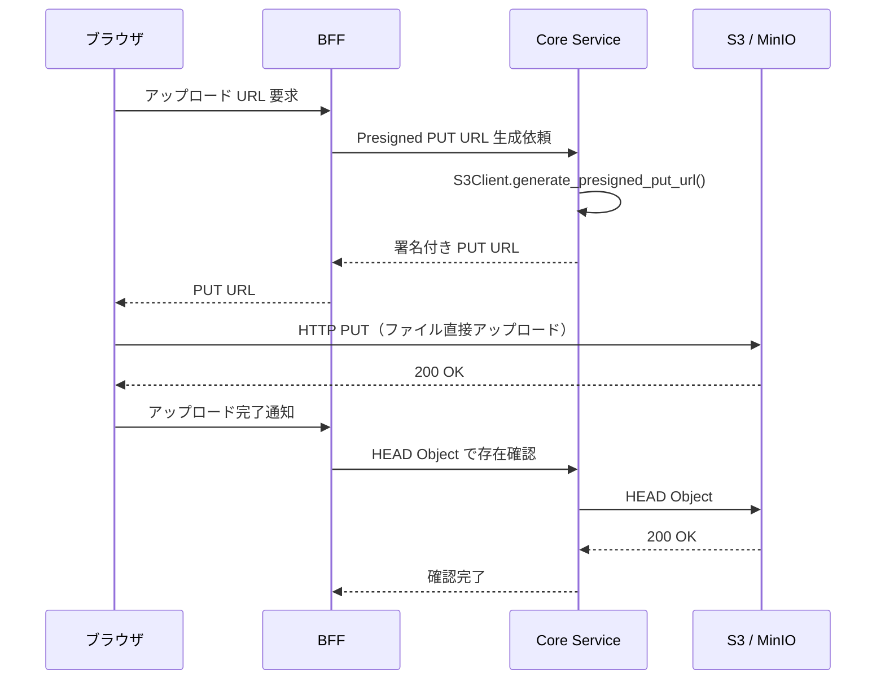
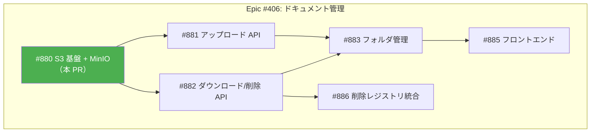
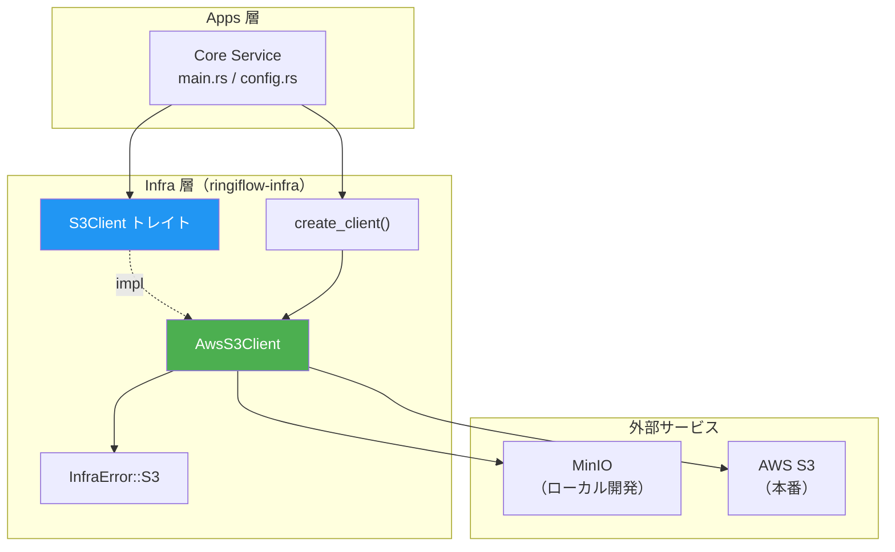
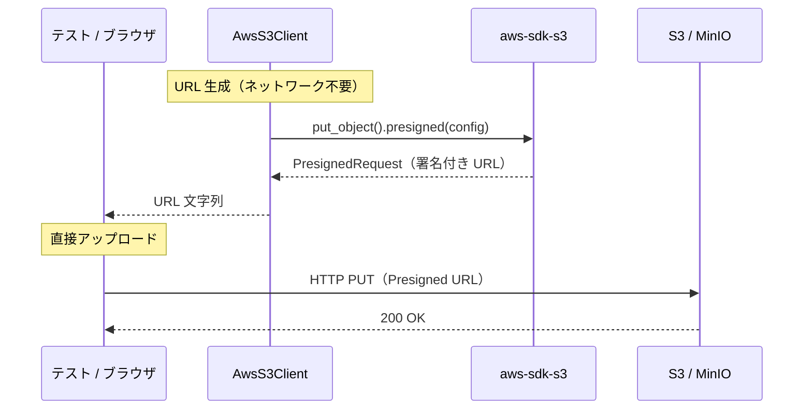
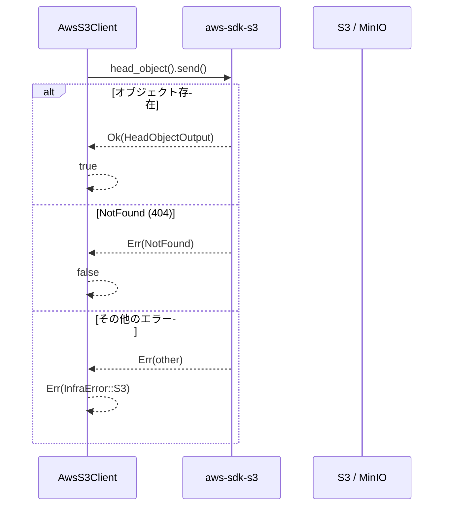
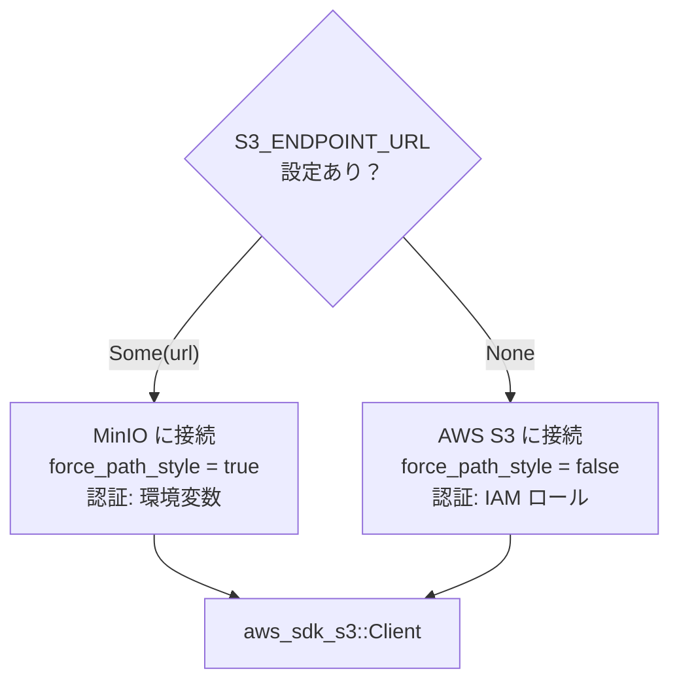

# S3 基盤と MinIO ローカル環境 - 機能解説

対応 PR: #917
対応 Issue: #880

## 概要

Amazon S3 の Presigned URL を活用したドキュメント管理の基盤を構築した。ローカル開発では MinIO（S3 互換ストレージ）を使用し、本番では AWS S3 にシームレスに切り替わる。

この Story は Epic #406（ドキュメント管理）の最初の基盤構築であり、後続 Story でアップロード・ダウンロード・削除の API やフロントエンドを実装する。

## 背景

### Presigned URL 方式

[詳細設計書: ドキュメント管理設計](../../03_詳細設計書/17_ドキュメント管理設計.md) で定められた方式。

ブラウザが S3 に**直接** PUT/GET する。サーバーは署名付き URL の発行のみを担当し、ファイルデータがサーバーを通過しない。これにより:

- サーバーの CPU/メモリ/帯域の負荷を軽減
- 大容量ファイルでもサーバーリソースを消費しない
- S3 の高い可用性と耐久性を直接活用

### Epic #406 における位置づけ

| Issue | 内容 | 状態 |
|-------|------|------|
| #880 | S3 基盤 + MinIO ローカル環境 | 本 PR |
| #881 | アップロード API（Presigned PUT URL 発行 + 完了通知） | 未着手 |
| #882 | ダウンロード/削除 API（Presigned GET URL 発行 + 論理削除） | 未着手 |
| #883 | フォルダ管理（Materialized Path パターン） | 未着手 |
| #885 | フロントエンド（Elm アップロード UI） | 未着手 |
| #886 | 削除レジストリ統合（物理削除スケジューラ） | 未着手 |

### 本 Story のスコープ

本 Story は S3 クライアントの**技術基盤のみ**を構築する。

| 対象（IN） | 対象外（OUT） |
|-----------|-------------|
| S3Client トレイト（Presigned PUT/GET、HEAD Object） | Document ドメインモデル（#881+） |
| MinIO Docker Compose 設定 | API エンドポイント（#881+） |
| 環境変数による MinIO / AWS S3 切替 | フロントエンド（#885） |
| MinIO 統合テスト | フォルダ管理（#883） |
| Core Service の S3 クライアント初期化 | 削除レジストリ統合（#886） |

## 用語・概念

| 用語 | 説明 | 関連コード |
|------|------|-----------|
| Presigned URL | 一定時間有効な署名付き URL。認証情報をブラウザに公開せずに S3 への直接アクセスを許可する | `S3Client::generate_presigned_put_url` |
| HEAD Object | S3 オブジェクトのメタデータのみを取得する操作。存在確認に使用する | `S3Client::head_object` |
| MinIO | S3 互換のオープンソースオブジェクトストレージ。ローカル開発で AWS S3 の代替として使用する | `docker-compose.yaml` の minio サービス |
| force_path_style | `http://host/bucket/key` 形式のパススタイル URL。MinIO が必要とする（バーチャルホスト型 `http://bucket.host/key` に非対応） | `s3::create_client` |

## アーキテクチャ

## データフロー

### フロー 1: Presigned PUT URL によるアップロード

| # | レイヤー | ファイル:関数 | 処理内容 |
|---|---------|-------------|---------|
| 1 | Infra | `s3.rs:generate_presigned_put_url` | PresigningConfig を構築し、SDK の presigned() で署名付き URL を生成 |
| 2 | External | S3 / MinIO | ブラウザ/テストが PUT URL に直接 HTTP PUT |

### フロー 2: HEAD Object による存在確認

### フロー 3: 環境切替（MinIO / AWS S3）

## 設計判断

機能・仕組みレベルの判断を記載する。コード実装レベルの判断は[コード解説](./01_S3基盤_コード解説.md#設計解説)を参照。

### 1. S3Client トレイトをどこに配置するか

ドメイン層には S3 に関する概念（Document エンティティ等）がまだ存在しない。トレイトの配置先を決める必要があった。

| 案 | 依存方向 | 既存パターンとの整合 | テスト時のモック |
|----|---------|-------------------|---------------|
| **infra クレートに配置（採用）** | apps → infra | `SessionManager`, `PasswordChecker` と同じ | `Arc<dyn S3Client>` で注入 |
| domain クレートに配置 | infra → domain（既存） | 新しいパターン | 同上 |

**採用理由**: 既存の infra トレイト配置パターン（`SessionManager`, `PasswordChecker`, `TenantDeleter`）に準拠。Document ドメインモデル導入時（#881+）に再検討可能。

### 2. エンドポイント引数をどう表現するか

DynamoDB の `create_client` は `&str`（常にエンドポイント必須）だが、S3 は本番環境でエンドポイント未指定（SDK デフォルト）が正しい挙動。

| 案 | 本番環境 | ローカル開発 | 型安全性 |
|----|---------|------------|---------|
| **`Option<&str>`（採用）** | `None`（SDK デフォルト） | `Some("http://...")` | 未指定が型で表現される |
| `&str`（DynamoDB と同じ） | 空文字やダミー URL が必要 | 同上 | 不正な値を許容 |

**採用理由**: 本番と開発の切替が型で明示され、`None` のときは SDK のデフォルト認証チェーン（IAM ロール等）がそのまま動作する。

### 3. 認証情報をどう管理するか

DynamoDB Local はダミー認証で動作するが、MinIO は実際のクレデンシャルが必要。

| 案 | ローカル | 本番 | セキュリティ |
|----|---------|------|-----------|
| **SDK デフォルト認証チェーン（採用）** | `.env` の `AWS_ACCESS_KEY_ID` 等 | IAM ロール | クレデンシャルがコードに含まれない |
| `create_client` にハードコード | 動作する | IAM ロール使用不可 | minioadmin がコードに残る |

**採用理由**: AWS SDK のデフォルト認証チェーンに委任することで、ローカル（環境変数）と本番（IAM ロール）の両方に対応。`create_client` は認証情報を一切受け取らない。

## 関連ドキュメント

- [コード解説](./01_S3基盤_コード解説.md)
- [詳細設計書: ドキュメント管理設計](../../03_詳細設計書/17_ドキュメント管理設計.md)
- [計画ファイル](../../../prompts/plans/880_s3-minio-setup.md)
- [セッションログ](../../../prompts/runs/2026-02/2026-02-25_2120_S3基盤とMinIOローカル環境構築.md)
