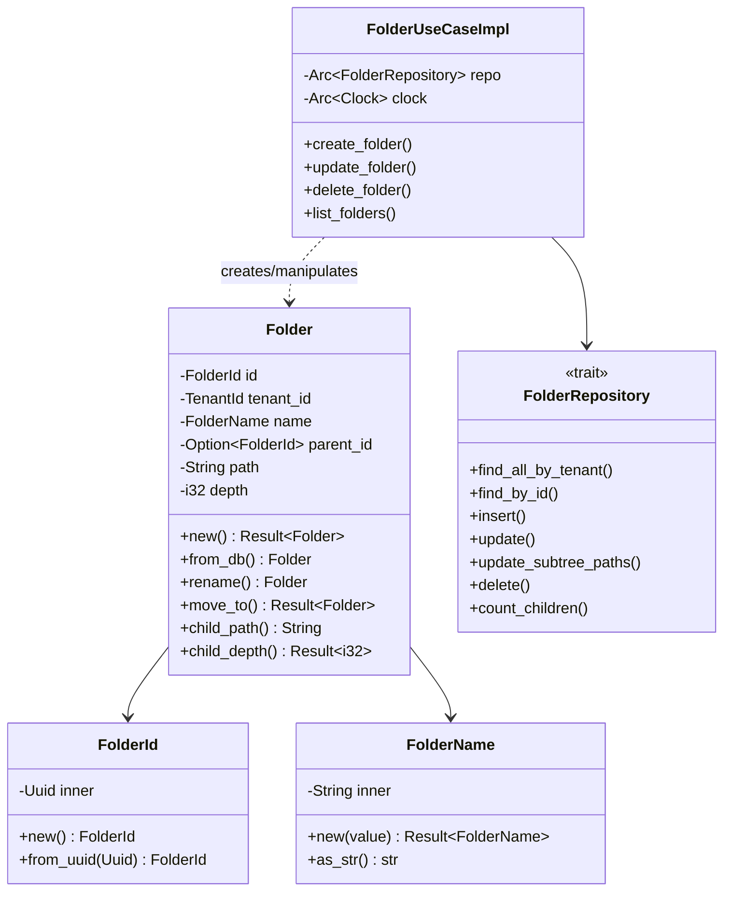
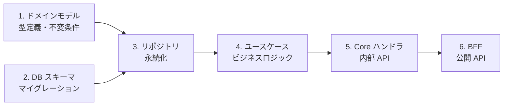
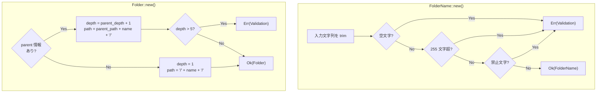
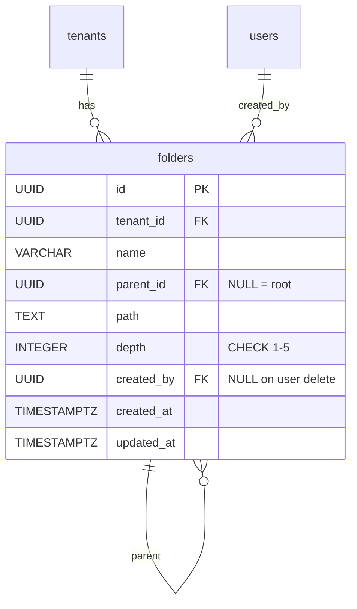
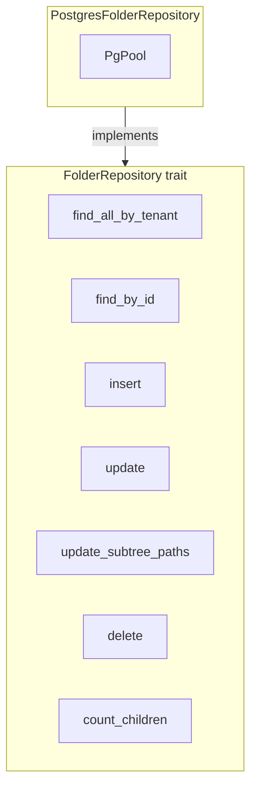
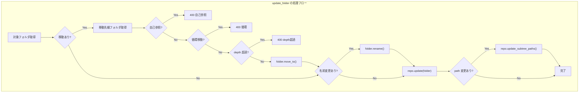
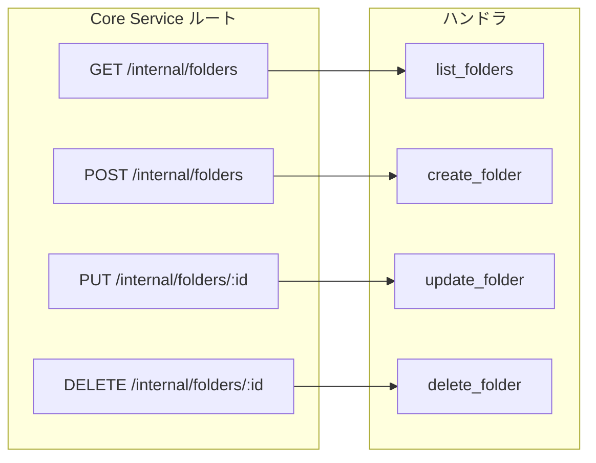
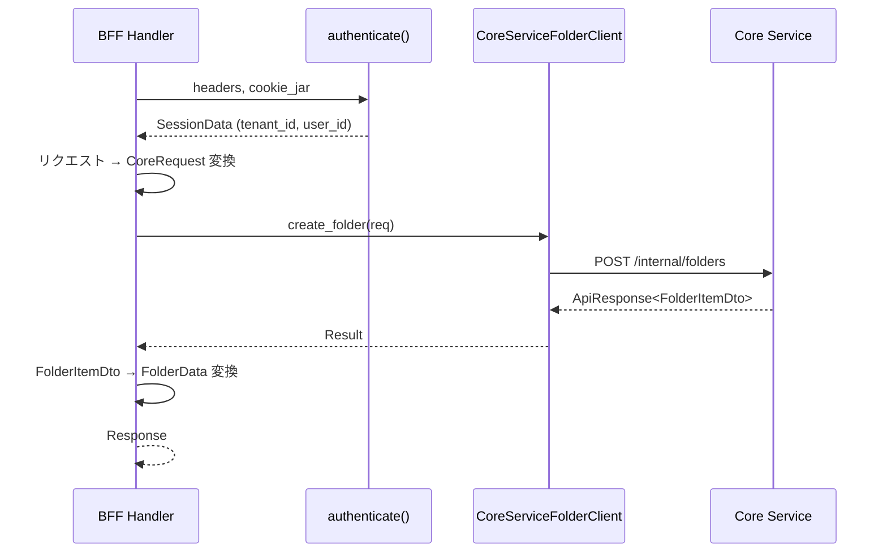
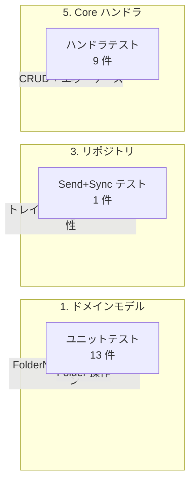
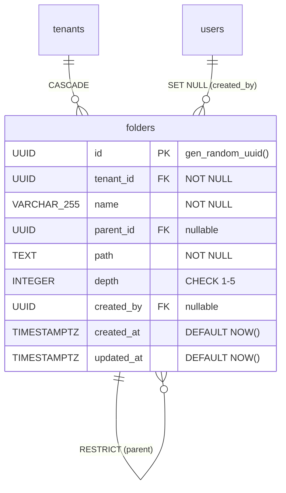

# フォルダ管理 API - コード解説

対応 PR: #918
対応 Issue: #883

## 主要な型・関数

| 型/関数 | ファイル | 責務 |
|--------|---------|------|
| `FolderId` | [`domain/src/folder.rs:50`](../../backend/crates/domain/src/folder.rs) | UUID ベースのフォルダ識別子（`define_uuid_id!` マクロ） |
| `FolderName` | [`domain/src/folder.rs:75`](../../backend/crates/domain/src/folder.rs) | フォルダ名値オブジェクト（禁止文字バリデーション付き） |
| `Folder` | [`domain/src/folder.rs:136`](../../backend/crates/domain/src/folder.rs) | フォルダエンティティ（path/depth を含む） |
| `FolderRepository` | [`infra/src/repository/folder_repository.rs:27`](../../backend/crates/infra/src/repository/folder_repository.rs) | フォルダ永続化トレイト |
| `PostgresFolderRepository` | [`infra/src/repository/folder_repository.rs:65`](../../backend/crates/infra/src/repository/folder_repository.rs) | PostgreSQL 実装 |
| `FolderUseCaseImpl` | [`core-service/src/usecase/folder.rs:37`](../../backend/apps/core-service/src/usecase/folder.rs) | CRUD ビジネスロジック |
| `CoreServiceFolderClient` | [`bff/src/client/core_service/folder_client.rs:17`](../../backend/apps/bff/src/client/core_service/folder_client.rs) | BFF→Core Service HTTP クライアントトレイト |

### 型の関係



## コードフロー

コードをライフサイクル順に追う。各ステップの構造を図で示した後、対応するコードを解説する。



### 1. ドメインモデル（型定義時）

ドメインモデルは `FolderName` の値オブジェクトと `Folder` エンティティで構成される。不変条件をコンストラクタで強制する。



```rust
// backend/crates/domain/src/folder.rs:78-100
impl FolderName {
    pub fn new(value: impl Into<String>) -> Result<Self, DomainError> {
        let value = value.into().trim().to_string();   // ① trim で前後の空白を除去
        if value.is_empty() { return Err(...); }
        if value.chars().count() > MAX_FOLDER_NAME_LENGTH { return Err(...); }
        if value.chars().any(|c| FORBIDDEN_CHARS.contains(&c)) { return Err(...); }  // ② ファイルシステム互換チェック
        Ok(Self(value))
    }
}
```

注目ポイント:

- ① `trim()` でフォルダ名の前後空白を自動除去。`"  経費精算  "` → `"経費精算"` として保存
- ② `FORBIDDEN_CHARS` は `['/', '\\', ':', '*', '?', '"', '<', '>', '|']` の 9 文字。OS のファイルシステム制約に合わせている

```rust
// backend/crates/domain/src/folder.rs:165-181
let (path, depth) = match (parent_path, parent_depth) {
    (Some(pp), Some(pd)) => {
        let depth = pd + 1;
        if depth > MAX_FOLDER_DEPTH {                    // ① 5 階層制限
            return Err(DomainError::Validation(...));
        }
        let path = format!("{}{}/", pp, name.as_str());  // ② 親の path + name + "/"
        (path, depth)
    }
    _ => {
        let path = format!("/{}/", name.as_str());       // ③ ルート: "/" + name + "/"
        (path, 1)
    }
};
```

注目ポイント:

- ① `MAX_FOLDER_DEPTH = 5` を超える場合は即座にエラー。DB の CHECK 制約とアプリケーション層の二重防御
- ② 子フォルダの path は `"{parent.path}{name}/"` で構築。例: 親が `/2026年度/` なら `/2026年度/経費精算/`
- ③ ルートフォルダは `"/{name}/"` 形式。先頭の `/` がルートを表す

### 2. マイグレーション（デプロイ時）

DB スキーマはドメインモデルの不変条件を DB 制約として反映する。



```sql
-- backend/migrations/20260225000001_create_folders.sql:8-21
CREATE TABLE folders (
    id          UUID PRIMARY KEY DEFAULT gen_random_uuid(),
    tenant_id   UUID NOT NULL REFERENCES tenants(id) ON DELETE CASCADE,
    name        VARCHAR(255) NOT NULL,
    parent_id   UUID REFERENCES folders(id) ON DELETE RESTRICT,  -- ① 子がある親は削除不可
    path        TEXT NOT NULL,
    depth       INTEGER NOT NULL CHECK (depth >= 1 AND depth <= 5),  -- ② DB レベルの階層制限
    created_by  UUID REFERENCES users(id) ON DELETE SET NULL,
    created_at  TIMESTAMPTZ NOT NULL DEFAULT NOW(),
    updated_at  TIMESTAMPTZ NOT NULL DEFAULT NOW(),
    UNIQUE NULLS NOT DISTINCT (tenant_id, parent_id, name)  -- ③ NULL 同士も重複として扱う
);
```

注目ポイント:

- ① `ON DELETE RESTRICT` により、子フォルダがある親フォルダの削除を DB レベルで防止
- ② `CHECK (depth >= 1 AND depth <= 5)` でアプリケーションのバグによる不正な depth をガード
- ③ `UNIQUE NULLS NOT DISTINCT` は PostgreSQL 15 の構文。標準の `UNIQUE` では `NULL != NULL` のため、ルート直下（`parent_id = NULL`）で同名フォルダが複数作れてしまう問題を解決

```sql
-- RLS ポリシー（行 27-31）
CREATE POLICY tenant_isolation ON folders
    FOR ALL
    TO ringiflow_app
    USING (tenant_id = NULLIF(current_setting('app.tenant_id', true), '')::UUID)
    WITH CHECK (tenant_id = NULLIF(current_setting('app.tenant_id', true), '')::UUID);
```

`NULLIF` は `app.tenant_id` が未設定（空文字列）の場合に `NULL` を返し、`NULL::UUID` との比較は常に FALSE になるため、テナント ID 未設定時はデータにアクセスできない安全設計。

### 3. リポジトリ（データアクセス時）

リポジトリはドメインモデルと DB の間を橋渡しする。特に `update_subtree_paths` が materialized path パターン固有のメソッド。



```rust
// backend/crates/infra/src/repository/folder_repository.rs:225-240
async fn update_subtree_paths(
    &self, old_path: &str, new_path: &str,
    depth_delta: i32, tenant_id: &TenantId,
) -> Result<(), InfraError> {
    sqlx::query!(
        r#"
        UPDATE folders
        SET path = $2 || SUBSTRING(path FROM LENGTH($1) + 1),  -- ①
            depth = depth + $3,                                  -- ②
            updated_at = NOW()
        WHERE tenant_id = $4
          AND path LIKE $1 || '%'                                -- ③
        "#,
        old_path, new_path, depth_delta, tenant_id.as_uuid()
    ).execute(&self.pool).await?;
    Ok(())
}
```

注目ポイント:

- ① `SUBSTRING(path FROM LENGTH($1) + 1)` で `old_path` のプレフィックスを切り取り、`new_path` で置換。例: old=`/a/b/`, new=`/x/b/`, path=`/a/b/c/` → `/x/b/c/`
- ② `depth_delta` は移動前後の depth 差分。深い階層に移動すれば正、浅い階層なら負
- ③ `LIKE $1 || '%'` でサブツリー全体を一括選択。materialized path パターンの読み取り最適化が書き込み時にも活用される

### 4. ユースケース（リクエスト処理時）

ユースケースはドメインモデルとリポジトリを組み合わせてビジネスロジックを実現する。



```rust
// backend/apps/core-service/src/usecase/folder.rs:150-155
// 循環検出: 移動先が自身のサブツリー内かチェック
if parent.path().starts_with(&old_path) {   // ①
    return Err(CoreError::BadRequest(
        "フォルダを自身の子孫に移動することはできません".to_string(),
    ));
}
```

注目ポイント:

- ① `starts_with` による循環検出。例: `/a/b/` を `/a/b/c/` の子に移動しようとすると、移動先の path `/a/b/c/` が自身の path `/a/b/` で始まるため循環を検出。materialized path の文字列比較だけで O(1) で判定できる

```rust
// backend/apps/core-service/src/usecase/folder.rs:99-108
self.folder_repository.insert(&folder).await.map_err(|e| {
    if let ringiflow_infra::InfraError::Database(ref db_err) = e    // ①
        && let Some(constraint) = db_err.as_database_error()
            .and_then(|d| d.constraint())
        && constraint == "folders_tenant_id_parent_id_name_key"     // ②
    {
        return CoreError::Conflict("同名のフォルダが既に存在します".to_string());
    }
    CoreError::Database(e)
})?;
```

注目ポイント:

- ① `let`-chain（Rust nightly → 1.87 stable 予定）で DB エラーのパターンマッチを簡潔に記述
- ② UNIQUE 制約名 `folders_tenant_id_parent_id_name_key` と照合して、名前の重複エラーのみを `409 Conflict` にマッピング

### 5. Core Service ハンドラ（内部 API 受付時）



```rust
// backend/apps/core-service/src/handler/folder.rs:114-138
pub async fn create_folder(
    State(state): State<Arc<FolderState>>,
    Json(req): Json<CreateFolderRequest>,
) -> Result<impl IntoResponse, CoreError> {
    let input = CreateFolderInput {           // ① リクエストをユースケース入力に変換
        tenant_id:  TenantId::from_uuid(req.tenant_id),
        name:       req.name,
        parent_id:  req.parent_id,
        created_by: req.created_by,
    };
    let folder = state.usecase.create_folder(input).await?;
    let dto = FolderDto { ... };              // ② エンティティを DTO に変換
    let response = ApiResponse::new(dto);
    Ok((StatusCode::CREATED, Json(response))) // ③ 201 Created
}
```

注目ポイント:

- ① ハンドラはリクエスト → ユースケース入力の型変換を担当。ドメイン型（`TenantId`）への変換はここで行う
- ② レスポンスはドメインエンティティから DTO（`FolderDto`）への変換。`created_at` は `to_rfc3339()` で ISO 8601 文字列に
- ③ 作成成功は `201 Created`。一覧は `200 OK`、削除は `204 No Content`

### 6. BFF ハンドラ + クライアント（公開 API 受付時）

BFF はセッション認証後、Core Service に HTTP で転送する thin proxy。



```rust
// backend/apps/bff/src/handler/folder.rs:130-161
pub async fn create_folder(
    State(state): State<Arc<FolderState>>,
    headers: HeaderMap,
    jar: CookieJar,
    Json(req): Json<CreateFolderRequest>,
) -> Result<Response, Response> {
    let session_data = authenticate(                      // ① セッション認証
        state.session_manager.as_ref(), &headers, &jar
    ).await?;
    let core_request = CreateFolderCoreRequest {
        tenant_id:  *session_data.tenant_id().as_uuid(),  // ② セッションから tenant_id 注入
        name:       req.name,
        parent_id:  req.parent_id,
        created_by: *session_data.user_id().as_uuid(),    // ③ セッションから user_id 注入
    };
    let core_response = state.core_service_client
        .create_folder(&core_request).await
        .map_err(|e| log_and_convert_core_error("フォルダ作成", e))?;
    // ...
}
```

注目ポイント:

- ① BFF ハンドラは認証を `authenticate()` に委譲。セッション無効なら 401 が即座に返る
- ② `tenant_id` はリクエストボディからではなくセッションから取得。クライアントによるテナント詐称を防止
- ③ `user_id`（作成者）もセッションから注入。BFF のリクエスト型（`CreateFolderRequest`）には `tenant_id` も `created_by` も含まれない

## テスト

各テストがライフサイクルのどのステップを検証しているかを示す。



| テスト | 検証対象のステップ | 検証内容 |
|-------|-------------------|---------|
| `test_フォルダ名は正常な名前を受け入れる` | 1 | FolderName の正常系 |
| `test_フォルダ名は空文字列を拒否する` | 1 | 空文字列バリデーション |
| `test_フォルダ名は空白のみを拒否する` | 1 | 空白のみバリデーション（trim 後に空） |
| `test_フォルダ名は前後の空白をトリミングする` | 1 | trim の動作確認 |
| `test_フォルダ名は255文字以内を受け入れる` | 1 | 境界値（255 文字） |
| `test_フォルダ名は255文字超を拒否する` | 1 | 境界値超過（256 文字） |
| `test_フォルダ名は禁止文字を拒否する` (9 文字分 rstest) | 1 | 各禁止文字のバリデーション |
| `test_ルート直下にフォルダを作成する` | 1 | path = `"/{name}/"`, depth = 1 |
| `test_子フォルダを作成する` | 1 | path = `"{parent.path}{name}/"`, depth = parent.depth + 1 |
| `test_5階層を超える作成を拒否する` | 1 | depth > 5 のエラー |
| `test_5階層ちょうどは許可される` | 1 | depth = 5 の正常系（境界値） |
| `test_renameで名前とpathが更新される` | 1 | rename の path 再計算 |
| `test_move_toでparent_idとpathとdepthが更新される` | 1 | move_to の全フィールド更新 |
| `test_move_toでルートに移動する` | 1 | ルート移動時の path/depth リセット |
| `test_from_dbでフォルダを復元できる` | 1 | DB からの復元 |
| `test_child_pathで子フォルダのパスを計算する` | 1 | child_path ユーティリティ |
| `test_child_depthで子フォルダのdepthを計算する` | 1 | child_depth ユーティリティ |
| `test_child_depthで5階層の親はエラーを返す` | 1 | 5 階層の親からの子フォルダ作成エラー |
| `test_トレイトはsendとsyncを実装している` | 3 | リポジトリのトレイトオブジェクト安全性 |
| `test_post_ルート直下にフォルダを作成すると201が返る` | 5 | 正常系: ルート作成 |
| `test_post_親フォルダの下にサブフォルダを作成すると201が返る` | 5 | 正常系: サブフォルダ作成 |
| `test_post_フォルダ名が空のとき400が返る` | 5 | 準正常系: バリデーションエラー |
| `test_post_5階層を超えると400が返る` | 5 | 準正常系: 階層制限 |
| `test_put_フォルダ名を変更すると200が返る` | 5 | 正常系: 名前変更 |
| `test_delete_空フォルダを削除すると204が返る` | 5 | 正常系: 削除 |
| `test_delete_子フォルダがあると400が返る` | 5 | 準正常系: 非空フォルダ削除 |
| `test_get_フォルダ一覧がpath順で返る` | 5 | 正常系: 一覧取得 + ソート順 |
| `test_存在しないフォルダ_idで404が返る` | 5 | 準正常系: 存在しないリソース |

### 実行方法

```bash
# ドメインモデルのテスト
cargo test -p ringiflow-domain -- folder

# Core Service ハンドラテスト
cargo test -p ringiflow-core-service -- folder
```

## マイグレーション

### 20260225000001_create_folders

ファイル: `backend/migrations/20260225000001_create_folders.sql`

```sql
CREATE TABLE folders (
    id          UUID PRIMARY KEY DEFAULT gen_random_uuid(),
    tenant_id   UUID NOT NULL REFERENCES tenants(id) ON DELETE CASCADE,
    name        VARCHAR(255) NOT NULL,
    parent_id   UUID REFERENCES folders(id) ON DELETE RESTRICT,
    path        TEXT NOT NULL,
    depth       INTEGER NOT NULL CHECK (depth >= 1 AND depth <= 5),
    created_by  UUID REFERENCES users(id) ON DELETE SET NULL,
    created_at  TIMESTAMPTZ NOT NULL DEFAULT NOW(),
    updated_at  TIMESTAMPTZ NOT NULL DEFAULT NOW(),
    UNIQUE NULLS NOT DISTINCT (tenant_id, parent_id, name)
);
```



インデックス:

| インデックス | カラム | 用途 |
|------------|--------|------|
| `idx_folders_tenant_id` | `tenant_id` | テナント別フォルダ一覧取得 |
| `idx_folders_parent_id` | `parent_id` | 子フォルダ検索、`count_children` |
| `idx_folders_path` | `path` | `LIKE '{path}%'` によるサブツリー検索 |

## 設計解説

コード実装レベルの判断を記載する。機能・仕組みレベルの判断は[機能解説](./01_フォルダ管理API_機能解説.md#設計判断)を参照。

### 1. FolderName を手動 Newtype で実装

場所: `backend/crates/domain/src/folder.rs:75`

```rust
#[derive(Debug, Clone, PartialEq, Eq, Serialize, Deserialize)]
pub struct FolderName(String);

impl FolderName {
    pub fn new(value: impl Into<String>) -> Result<Self, DomainError> {
        // ... 禁止文字チェック含む
    }
}
```

なぜこの実装か:
プロジェクトには `define_validated_string!` マクロ（空チェック + 最大長チェックを自動生成）があるが、禁止文字チェックはマクロの機能範囲外。マクロの拡張よりも手動実装の方がシンプル。

代替案:

| 案 | メリット | デメリット | 判断 |
|----|---------|-----------|------|
| `define_validated_string!` + カスタムバリデータ | マクロの再利用 | マクロの設計変更が必要 | 見送り |
| **手動 Newtype（採用）** | マクロに依存しない | ボイラープレートが増える | 採用 |

### 2. Folder::new の 8 引数に `#[allow(clippy::too_many_arguments)]`

場所: `backend/crates/domain/src/folder.rs:155`

```rust
#[allow(clippy::too_many_arguments)]
pub fn new(
    id: FolderId, tenant_id: TenantId, name: FolderName,
    parent_id: Option<FolderId>, parent_path: Option<&str>,
    parent_depth: Option<i32>, created_by: Option<UserId>,
    now: DateTime<Utc>,
) -> Result<Self, DomainError> { ... }
```

なぜこの実装か:
Builder パターンにすれば引数を減らせるが、既存エンティティ（`Tenant::new` 等）が同じパターンで直接引数を取っている。プロジェクト全体の一貫性を優先した。

### 3. BFF の CoreServiceFolderClient を ISP サブトレイト分割

場所: `backend/apps/bff/src/client/core_service/folder_client.rs:17`

```rust
#[async_trait]
pub trait CoreServiceFolderClient: Send + Sync {
    async fn list_folders(&self, tenant_id: Uuid) -> Result<...>;
    async fn create_folder(&self, req: &CreateFolderCoreRequest) -> Result<...>;
    async fn update_folder(&self, folder_id: Uuid, req: &UpdateFolderCoreRequest) -> Result<...>;
    async fn delete_folder(&self, folder_id: Uuid, tenant_id: Uuid) -> Result<...>;
}
```

なぜこの実装か:
既存の `CoreServiceClient` は `CoreServiceUserClient + CoreServiceWorkflowClient + ...` のスーパートレイト構成。ISP（Interface Segregation Principle）に基づき、ドメインごとにトレイトを分割するパターンを踏襲。ハンドラのテストで必要な機能だけをモック化できる。

### 4. delete_folder の delete レスポンスハンドリング

場所: `backend/apps/bff/src/client/core_service/folder_client.rs:97-124`

```rust
async fn delete_folder(&self, folder_id: Uuid, tenant_id: Uuid) -> Result<(), CoreServiceError> {
    let response = inject_request_id(self.client.delete(&url)).send().await?;
    let status = response.status();
    if status.is_success() {
        return Ok(());    // ① 204 No Content: body がないため直接 Ok を返す
    }
    // ② エラー時はステータスコード別にマッピング
}
```

なぜこの実装か:
他のメソッド（`list_folders`, `create_folder` 等）は `handle_response` 共通関数で JSON レスポンスをデシリアライズするが、DELETE の 204 はボディなし。`handle_response` に通すと空ボディのデシリアライズでエラーになるため、delete のみ個別にハンドリングしている。

## 関連ドキュメント

- [機能解説](./01_フォルダ管理API_機能解説.md)
- [詳細設計書: ドキュメント管理設計](../../03_詳細設計書/17_ドキュメント管理設計.md)
- [機能仕様書: ドキュメント管理](../../01_要件定義書/機能仕様書/06_ドキュメント管理.md)
