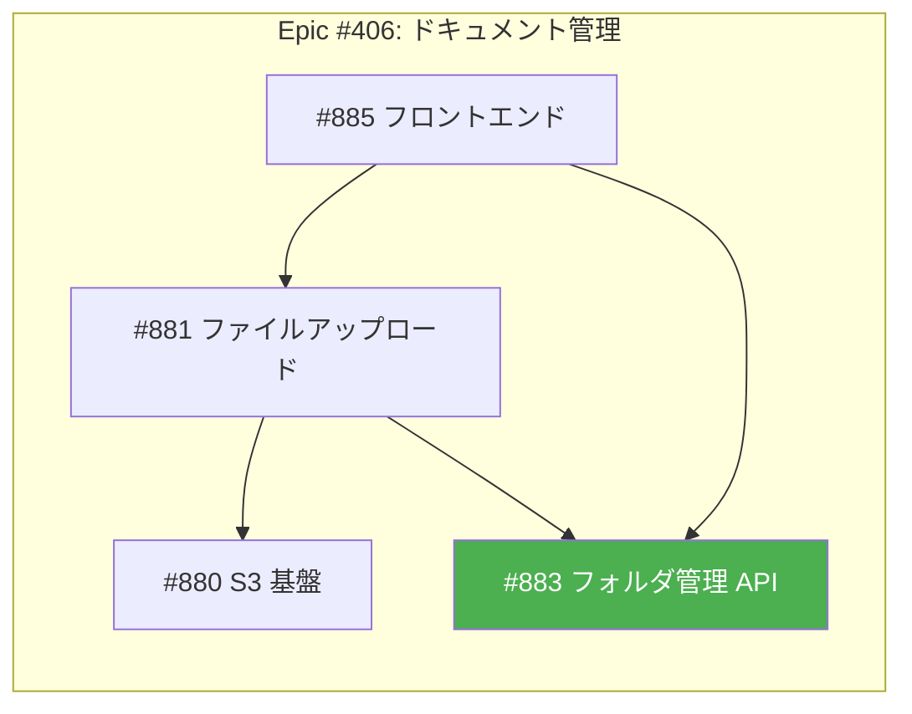
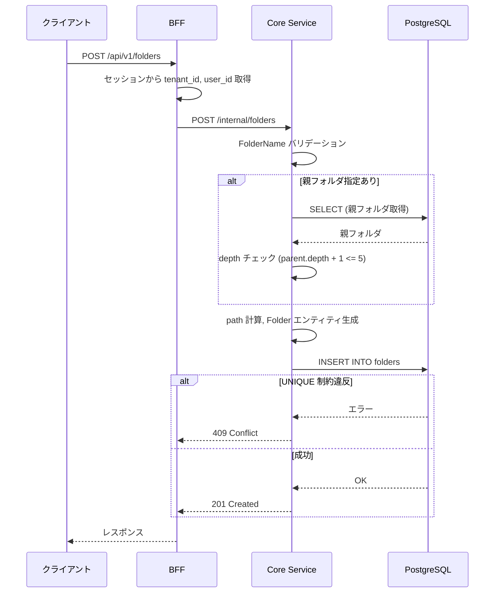
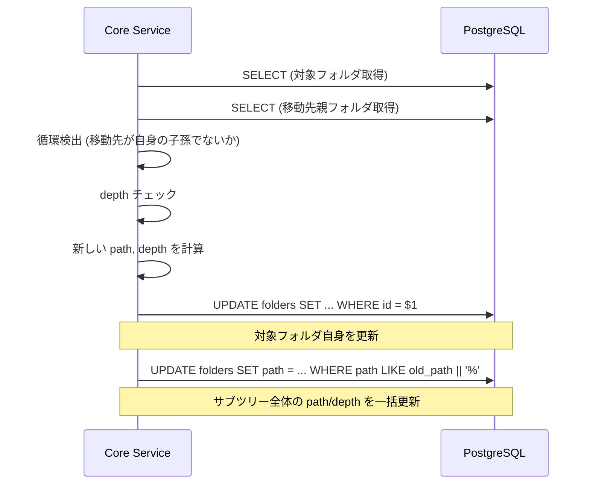
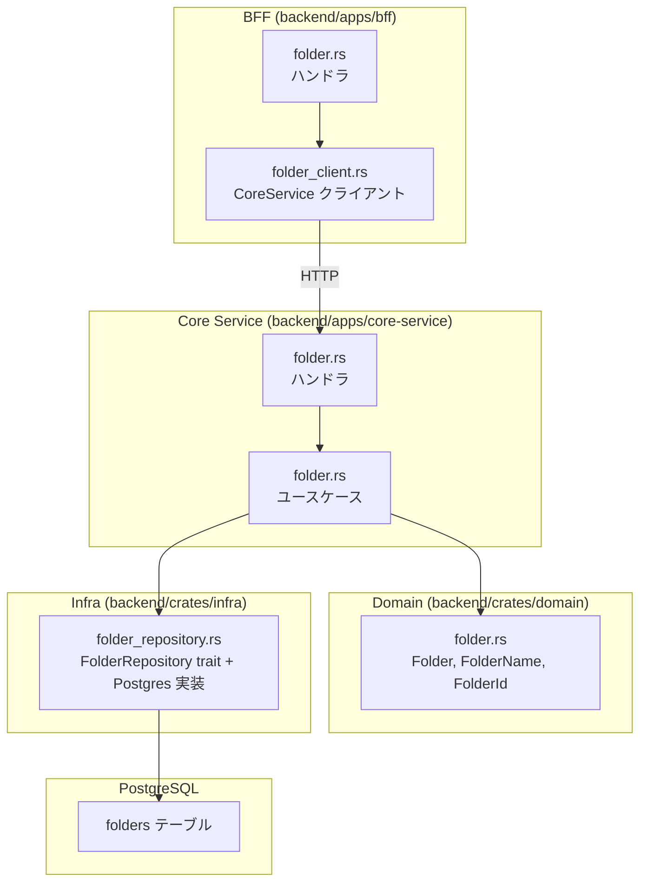
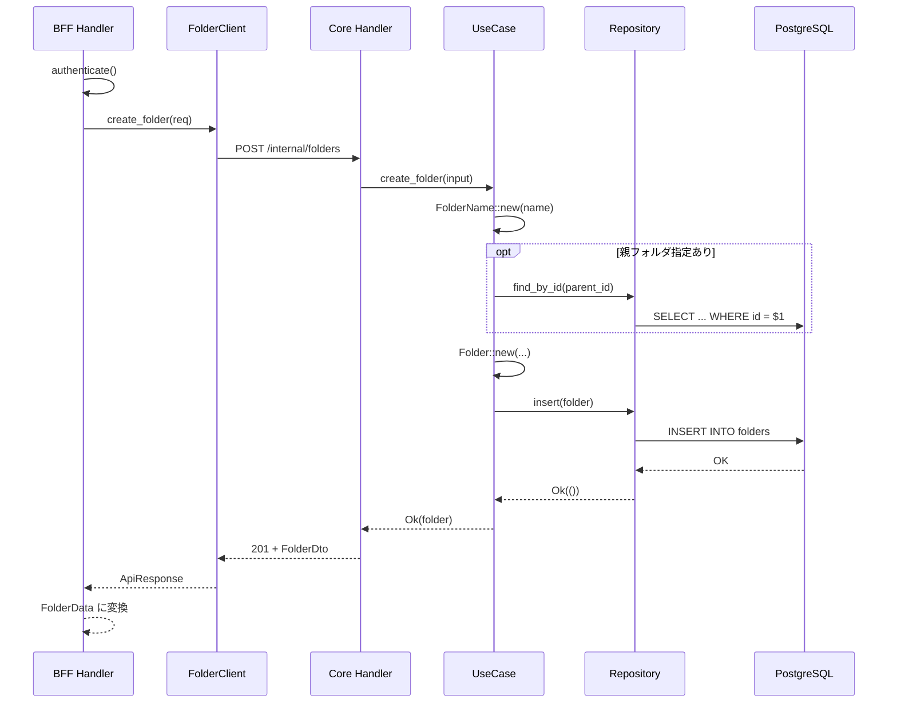

# フォルダ管理 API - 機能解説

対応 PR: #918
対応 Issue: #883

## 概要

ドキュメント管理のフォルダ階層構造を CRUD API として実装した。materialized path パターンによる階層管理、5 階層の depth 制限、テナント分離（RLS）を備え、フォルダの作成・名前変更・移動・削除・一覧取得の 5 操作を提供する。

## 背景

### ドキュメント管理の全体像

ドキュメント管理機能は、テナント内のファイルをフォルダで整理し、S3 にアップロード・ダウンロードする機能。Epic #406 として複数の Story に分割されている。

本 PR（#918）は「フォルダ管理 API」であり、ファイル操作や S3 連携には依存しない独立した Story として実装した。

### 設計方針

フォルダの階層構造を DB でどう管理するかは、ツリー構造の永続化における古典的な課題。本プロジェクトでは詳細設計書で materialized path パターンを採用している。

| 項目 | 方針 |
|------|------|
| 階層構造 | materialized path（`path` カラムに `/parent/child/` 形式で格納） |
| 階層制限 | 最大 5 階層（`depth` カラム + DB CHECK 制約） |
| テナント分離 | PostgreSQL RLS ポリシー |
| 名前の一意性 | テナント × 親フォルダ内で一意（`UNIQUE NULLS NOT DISTINCT`） |
| 削除制約 | 子フォルダがあるフォルダは削除不可（`ON DELETE RESTRICT` + アプリケーションレベルチェック） |

## 用語・概念

| 用語 | 説明 | 関連コード |
|------|------|-----------|
| Materialized path | フォルダの階層パスを文字列として `path` カラムに格納するパターン。`/2026年度/経費精算/` のように各ノードの名前を `/` で連結する | `Folder.path` |
| Depth | フォルダの階層の深さ。ルート直下が 1、最大 5 | `Folder.depth`, `MAX_FOLDER_DEPTH` |
| FolderName | フォルダ名の値オブジェクト。1〜255 文字、ファイルシステム互換の禁止文字チェック付き | `FolderName` |
| UNIQUE NULLS NOT DISTINCT | PostgreSQL 15+ の制約構文。`NULL` 同士を「等しい」と見なして一意性を保証する。ルート直下（`parent_id = NULL`）でも名前の重複を防ぐ | マイグレーション SQL |
| RLS（Row Level Security） | PostgreSQL の行レベルセキュリティ。`app.tenant_id` セッション変数でテナント分離を実現 | `tenant_isolation` ポリシー |

## フロー

新規機能のため Before はなし。

### フォルダ作成フロー

### フォルダ移動フロー

移動操作は名前変更と同時に行える。移動時はフォルダ自身とサブツリー全体の path/depth を更新する。

## アーキテクチャ

## データフロー

### フロー 1: フォルダ作成

#### 処理ステップ

| # | レイヤー | ファイル:関数 | 処理内容 |
|---|---------|-------------|---------|
| 1 | BFF | `bff/handler/folder.rs:create_folder` | セッション認証、Core Service 呼び出し |
| 2 | BFF | `bff/client/core_service/folder_client.rs:create_folder` | HTTP POST で Core Service に転送 |
| 3 | Core | `core-service/handler/folder.rs:create_folder` | リクエストパース、ユースケース呼び出し、DTO 変換 |
| 4 | Core | `core-service/usecase/folder.rs:create_folder` | バリデーション、親フォルダ取得、エンティティ生成 |
| 5 | Domain | `domain/folder.rs:Folder::new` | path/depth 計算、不変条件チェック |
| 6 | Infra | `infra/repository/folder_repository.rs:insert` | INSERT SQL 実行 |

### フロー 2: フォルダ更新（名前変更 + 移動）

| # | レイヤー | ファイル:関数 | 処理内容 |
|---|---------|-------------|---------|
| 1 | Core | `usecase/folder.rs:update_folder` | 対象フォルダ取得 |
| 2 | Core | 同上 | 移動先の検証: 自己参照チェック、循環検出、depth チェック |
| 3 | Domain | `folder.rs:Folder::move_to` | 新しい parent_id, path, depth を計算 |
| 4 | Domain | `folder.rs:Folder::rename` | 名前と path を更新 |
| 5 | Infra | `folder_repository.rs:update` | 対象フォルダの UPDATE |
| 6 | Infra | `folder_repository.rs:update_subtree_paths` | サブツリー全体の path/depth 一括更新 |

## エラーハンドリング

| エラー | 発生箇所 | HTTP Status | ユーザーへの表示 |
|-------|---------|-------------|---------------|
| フォルダ名が空 / 長すぎる / 禁止文字 | `FolderName::new` | 400 | バリデーションエラーメッセージ |
| 5 階層超過 | `Folder::new` / `Folder::move_to` | 400 | 「フォルダの階層が上限（5 階層）を超えています」 |
| 親フォルダが存在しない | `create_folder` / `update_folder` | 404 | 「親フォルダが見つかりません」 |
| 対象フォルダが存在しない | `update_folder` / `delete_folder` | 404 | 「フォルダが見つかりません」 |
| 自己参照移動 | `update_folder` | 400 | 「フォルダを自分自身に移動することはできません」 |
| 循環移動（子孫への移動） | `update_folder` | 400 | 「フォルダを自身の子孫に移動することはできません」 |
| 同名フォルダ重複 | `insert` / `update`（UNIQUE 制約違反） | 409 | 「同名のフォルダが既に存在します」 |
| 子フォルダがある状態で削除 | `delete_folder` | 400 | 「子フォルダが存在するため削除できません」 |

## 設計判断

機能・仕組みレベルの判断を記載する。コード実装レベルの判断は[コード解説](./01_フォルダ管理API_コード解説.md#設計解説)を参照。

### 1. 階層構造をどう永続化するか

フォルダの階層関係を DB でどう表現するかは、読み取りと書き込みのトレードオフ。

| 案 | 読み取り（サブツリー取得） | 書き込み（移動） | 実装の複雑さ |
|----|------------------------|----------------|------------|
| **Materialized path（採用）** | `LIKE '{path}%'` で高速 | サブツリー全体の path 更新が必要 | 低 |
| Adjacency list（parent_id のみ） | 再帰 CTE が必要 | parent_id の更新のみ | 低 |
| Nested set | 範囲条件で高速 | 全ノードの left/right 更新が必要 | 高 |

**採用理由**: 5 階層制限でサブツリーのサイズが限定的なため移動時のコストは低い。一方、一覧取得は `ORDER BY path` だけで階層順のソートが実現できる。

### 2. 移動操作の入力をどう表現するか

`update_folder` の `parent_id` には「変更なし」「ルートに移動」「別フォルダに移動」の 3 状態がある。

| 案 | 表現 | 区別しやすさ |
|----|------|------------|
| **`Option<Option<Uuid>>`（採用）** | `None` = 変更なし, `Some(None)` = ルート, `Some(Some(id))` = 移動 | 型レベルで 3 状態を区別 |
| フラグ + `Option<Uuid>` | `move: bool` + `parent_id: Option<Uuid>` | 冗長、無効な組み合わせが可能 |
| Enum | `NoChange` / `MoveToRoot` / `MoveTo(Uuid)` | 明確だが JSON シリアライズが複雑 |

**採用理由**: `Option<Option<Uuid>>` は Rust の型システムで 3 状態を直接表現でき、serde の JSON デシリアライズでも `null` / `[null]` / `[uuid]` が自然にマッピングされる。

### 3. 循環移動をどう検出するか

フォルダを自身の子孫に移動すると循環が発生する。

| 案 | 方式 | コスト |
|----|------|-------|
| **Path プレフィックスチェック（採用）** | 移動先の path が自身の path で始まるか検査 | O(1)、追加クエリ不要 |
| サブツリークエリ | `LIKE '{path}%'` で子孫を取得して移動先が含まれるか検査 | O(n)、DB クエリ必要 |

**採用理由**: materialized path のプレフィックス比較で O(1) で検出でき、追加の DB アクセスが不要。

### 4. 空フォルダチェックの範囲

フォルダ削除時に「空であること」をどの範囲でチェックするか。

| 案 | 範囲 | 実装時期 |
|----|------|---------|
| **子フォルダのみ（採用）** | `count_children()` で子フォルダ数をチェック | 本 PR |
| 子フォルダ + ドキュメント | documents テーブルも含めてチェック | #881 で追加予定 |

**採用理由**: `documents` テーブルは #881（ファイルアップロード）で作成されるため、本 PR では子フォルダのみチェック。ドキュメント数のチェックは #881 で追加する。

## 関連ドキュメント

- [コード解説](./01_フォルダ管理API_コード解説.md)
- [詳細設計書: ドキュメント管理設計](../../03_詳細設計書/17_ドキュメント管理設計.md)
- [機能仕様書: ドキュメント管理](../../01_要件定義書/機能仕様書/06_ドキュメント管理.md)
