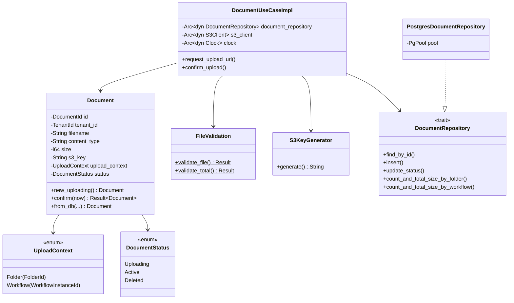
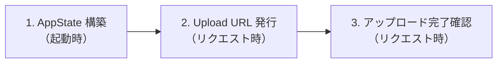
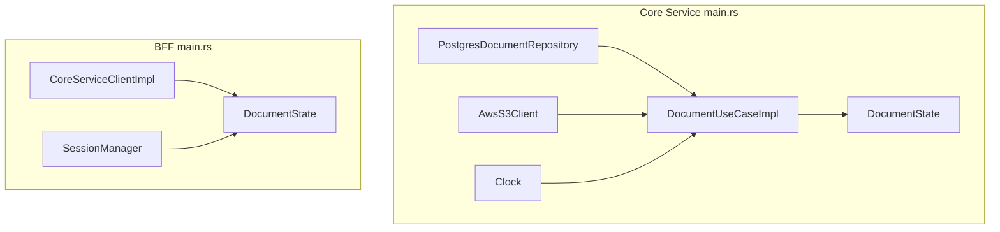
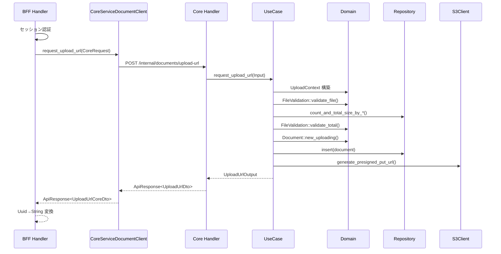
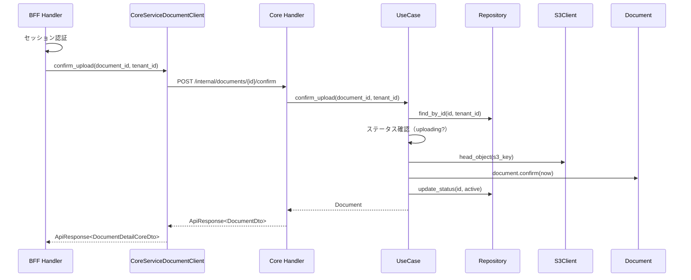
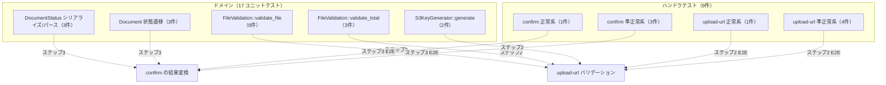
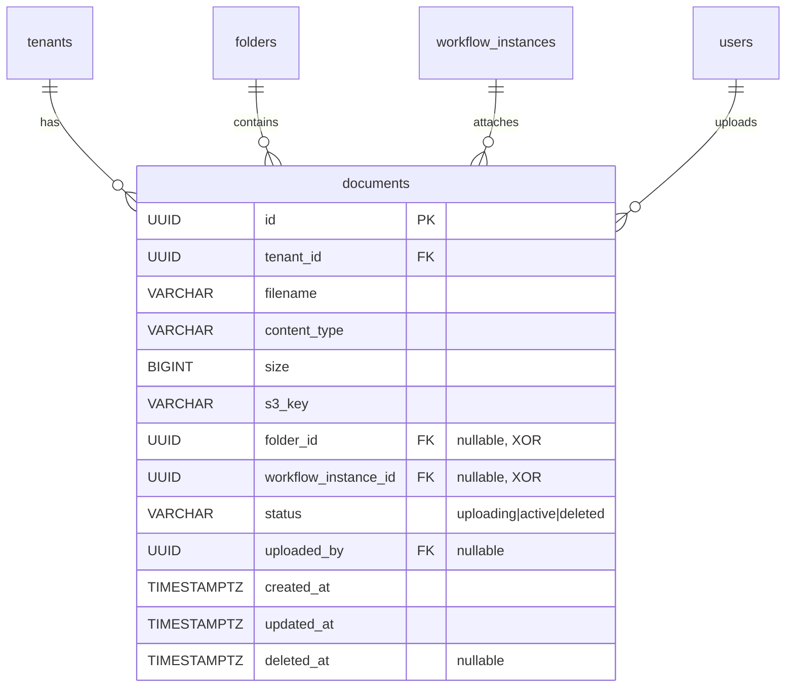

# ファイルアップロード API - コード解説

対応 PR: #935
対応 Issue: #881

## 主要な型・関数

| 型/関数 | ファイル | 責務 |
|--------|---------|------|
| `DocumentId` | `domain/src/document.rs:36` | ドキュメントの一意識別子（UUID v7 Newtype） |
| `DocumentStatus` | `domain/src/document.rs:48` | ドキュメントのライフサイクル状態（Uploading/Active/Deleted） |
| `UploadContext` | `domain/src/document.rs:87` | アップロード先の排他制約を型で強制する enum |
| `FileValidation` | `domain/src/document.rs:120` | Content-Type・サイズ・数量のバリデーションルール |
| `S3KeyGenerator` | `domain/src/document.rs:205` | テナント分離された S3 オブジェクトキーの生成 |
| `Document` | `domain/src/document.rs:245` | ドキュメントエンティティ（状態遷移メソッド付き） |
| `DocumentRepository` | `infra/src/repository/document_repository.rs:30` | ドキュメントの永続化トレイト |
| `PostgresDocumentRepository` | `infra/src/repository/document_repository.rs:67` | DocumentRepository の PostgreSQL 実装 |
| `DocumentUseCaseImpl` | `core-service/src/usecase/document.rs:40` | Upload URL 発行と完了確認のビジネスロジック |
| `request_upload_url` (Core) | `core-service/src/handler/document.rs:82` | Core Service の Upload URL 発行ハンドラ |
| `confirm_upload` (Core) | `core-service/src/handler/document.rs:119` | Core Service のアップロード完了確認ハンドラ |
| `CoreServiceDocumentClient` | `bff/src/client/core_service/document_client.rs:17` | BFF → Core Service のドキュメント API クライアントトレイト |
| `request_upload_url` (BFF) | `bff/src/handler/document.rs:90` | BFF の Upload URL 発行ハンドラ（セッション認証付き） |
| `confirm_upload` (BFF) | `bff/src/handler/document.rs:141` | BFF のアップロード完了確認ハンドラ |

### 型の関係



## コードフロー

コードをライフサイクル順に追う。各ステップの構造を図で示した後、対応するコードを解説する。



### 1. AppState 構築（起動時）

Core Service と BFF の起動時に、DI コンテナとして `DocumentState` を構築し、ルーターに注入する。



```rust
// core-service/src/main.rs:236-262
let document_repo: Arc<dyn DocumentRepository> =
    Arc::new(PostgresDocumentRepository::new(pool.clone())); // ①
let document_usecase = DocumentUseCaseImpl::new(
    document_repo, s3_client, clock.clone()
); // ②
let document_state = Arc::new(DocumentState {
    usecase: document_usecase,
}); // ③
```

注目ポイント:

- ① `PostgresDocumentRepository` は `PgPool` を共有。他のリポジトリと同じ接続プールを使用
- ② `s3_client` は以前 `_s3_client` として未使用だった。本 PR で `TODO(#881)` を解消して有効化
- ③ `DocumentState` は `Arc` で包まれ、axum の `.with_state()` で複数ルートに共有される

```rust
// core-service/src/main.rs:374-382
.route("/internal/documents/upload-url", post(request_upload_url))
.route("/internal/documents/{document_id}/confirm", post(confirm_upload))
.with_state(document_state) // ④
```

- ④ `.with_state()` は直前の `.route()` グループにのみ適用される。axum の State 分割パターンにより、DocumentState は folder/role 等の State と独立

### 2. Upload URL 発行（リクエスト時）

BFF → Core Service → ドメイン → インフラの順にリクエストが流れる。



#### 2a. BFF ハンドラ（セッション認証 → Core 委譲）

```rust
// bff/src/handler/document.rs:90-121
pub async fn request_upload_url(
    State(state): State<Arc<DocumentState>>,
    headers: HeaderMap,
    jar: CookieJar,
    Json(req): Json<RequestUploadUrlRequest>,
) -> Result<Response, Response> {
    let session_data = authenticate(
        state.session_manager.as_ref(), &headers, &jar
    ).await?; // ①

    let core_request = RequestUploadUrlCoreRequest {
        tenant_id: *session_data.tenant_id().as_uuid(), // ②
        // ...
        uploaded_by: *session_data.user_id().as_uuid(),
    };

    let core_response = state
        .core_service_client
        .request_upload_url(&core_request)
        .await
        .map_err(|e| log_and_convert_core_error("Upload URL 発行", e))?;

    let dto = core_response.data;
    let response = ApiResponse::new(UploadUrlData {
        document_id: dto.document_id.to_string(), // ③
        // ...
    });
    Ok((StatusCode::OK, Json(response)).into_response())
}
```

注目ポイント:

- ① BFF はセッション認証を行い、`tenant_id` と `user_id` を取得。フロントエンドからは送信しない
- ② `session_data.tenant_id()` は `TenantId` 型だが、Core Service への HTTP リクエストでは `Uuid` に変換
- ③ BFF のレスポンスでは ID を `String` 型で返す。Core Service は `Uuid` 型。BFF 層で変換する

#### 2b. Core ハンドラ（DTO → UseCase Input 変換）

```rust
// core-service/src/handler/document.rs:82-106
pub async fn request_upload_url(
    State(state): State<Arc<DocumentState>>,
    Json(req): Json<RequestUploadUrlRequest>,
) -> Result<impl IntoResponse, CoreError> {
    let input = RequestUploadUrlInput {
        tenant_id: TenantId::from_uuid(req.tenant_id), // ①
        // ...
    };
    let output = state.usecase.request_upload_url(input).await?;
    let dto = UploadUrlDto {
        document_id: *output.document_id.as_uuid(), // ②
        // ...
    };
    let response = ApiResponse::new(dto);
    Ok((StatusCode::OK, Json(response)))
}
```

注目ポイント:

- ① `Uuid` → `TenantId` への Newtype 変換。境界層でプリミティブ型からドメイン型に変換する
- ② レスポンスでは逆方向。`DocumentId` → `Uuid` に変換して JSON シリアライズ

#### 2c. UseCase（ビジネスロジックのオーケストレーション）

```rust
// core-service/src/usecase/document.rs:66-148
pub async fn request_upload_url(
    &self, input: RequestUploadUrlInput,
) -> Result<UploadUrlOutput, CoreError> {
    // 1. UploadContext 構築
    let upload_context = match (input.folder_id, input.workflow_instance_id) {
        (Some(fid), None) => UploadContext::Folder(FolderId::from_uuid(fid)), // ①
        (None, Some(wid)) => UploadContext::Workflow(WorkflowInstanceId::from_uuid(wid)),
        (Some(_), Some(_)) => return Err(CoreError::BadRequest(/* 両方指定 */)),
        (None, None) => return Err(CoreError::BadRequest(/* 未指定 */)),
    };

    // 2. ファイルバリデーション
    FileValidation::validate_file(&input.content_type, input.content_length)
        .map_err(|e| CoreError::BadRequest(e.to_string()))?; // ②

    // 3. 既存ドキュメントの集計バリデーション
    let (existing_count, existing_total_size) = match &upload_context {
        UploadContext::Folder(folder_id) => {
            self.document_repository
                .count_and_total_size_by_folder(folder_id, &input.tenant_id).await? // ③
        }
        UploadContext::Workflow(instance_id) => {
            self.document_repository
                .count_and_total_size_by_workflow(instance_id, &input.tenant_id).await?
        }
    };
    FileValidation::validate_total(existing_count, existing_total_size, input.content_length)?;

    // 4. Document エンティティ作成・挿入
    let document_id = DocumentId::new();
    let s3_key = S3KeyGenerator::generate(
        &input.tenant_id, &upload_context, &document_id, &input.filename,
    );
    let document = Document::new_uploading(/* ... */);
    self.document_repository.insert(&document).await?; // ④

    // 5. Presigned PUT URL 生成
    let upload_url = self.s3_client
        .generate_presigned_put_url(&s3_key, &input.content_type,
            input.content_length, UPLOAD_URL_EXPIRES_IN)
        .await?; // ⑤

    Ok(UploadUrlOutput { document_id, upload_url, expires_in: 300 })
}
```

注目ポイント:

- ① `UploadContext` 構築は UseCase の責務。`Option<Uuid>` 2 つの XOR 判定を行い、ドメイン型に変換
- ② `DomainError` → `CoreError::BadRequest` への変換。ドメインバリデーションの結果をHTTPステータスに対応付ける
- ③ `UploadContext` の match でコンテキスト別のリポジトリメソッドを呼び分け。フォルダとワークフローで集計対象が異なる
- ④ DB に `uploading` 状態で保存。Presigned URL 生成前に永続化するのは、URL 生成失敗時にもドキュメントの追跡を可能にするため
- ⑤ `UPLOAD_URL_EXPIRES_IN` は 5 分（300 秒）。定数として UseCase モジュールに定義

### 3. アップロード完了確認（リクエスト時）

クライアントが S3 にアップロード完了後、confirm エンドポイントを呼び出す。



```rust
// core-service/src/usecase/document.rs:155-205
pub async fn confirm_upload(
    &self, document_id: &DocumentId, tenant_id: &TenantId,
) -> Result<Document, CoreError> {
    // 1. ドキュメント取得
    let document = self.document_repository
        .find_by_id(document_id, tenant_id).await?
        .ok_or_else(|| CoreError::NotFound(/* ... */))?; // ①

    // ステータスチェック
    if document.status() != DocumentStatus::Uploading {
        return Err(CoreError::BadRequest(/* ... */)); // ②
    }

    // 2. S3 上のファイル存在確認
    let exists = self.s3_client
        .head_object(document.s3_key()).await?;
    if !exists {
        return Err(CoreError::Internal(/* ... */)); // ③
    }

    // 3. ステータスを active に遷移
    let now = self.clock.now();
    let confirmed = document.confirm(now)?; // ④
    self.document_repository
        .update_status(confirmed.id(), confirmed.status(), confirmed.tenant_id(), now)
        .await?;

    Ok(confirmed)
}
```

注目ポイント:

- ① `find_by_id` は `tenant_id` も条件に含む。RLS に加え、WHERE 句でも明示的にテナント分離
- ② ステータスチェックは UseCase で実行。`Document::confirm()` 内にも同じチェックがあるが、UseCase で先にチェックすることで適切な `CoreError` を返す
- ③ S3 にファイルが存在しない場合は `Internal` エラー。クライアント側の問題だが、サーバーの期待する状態と不一致のため 500 を返す
- ④ `document.confirm(now)` は `self` を消費（`fn confirm(self, ...)`) して新しい `Document` を返す。元の uploading 状態のドキュメントは使用不可になる

## テスト

各テストがライフサイクルのどのステップを検証しているかを示す。



| テスト | 検証対象のステップ | 検証内容 |
|-------|------------------|---------|
| `test_document_statusをlowercase文字列にシリアライズできる` | 全般 | Uploading/Active/Deleted が lowercase JSON にシリアライズされる |
| `test_document_status_from_strで有効な文字列をパースできる` | 全般 | DB 文字列からの復元が正しく動作する |
| `test_document_status_from_strで不正な文字列にエラーを返す` | 全般 | 不正な文字列をエラーとして拒否する |
| `test_validate_fileでpdfを受け入れる` | 2（バリデーション） | PDF の Content-Type が許可される |
| `test_validate_fileで全許可content_typeを受け入れる` | 2（バリデーション） | 10 種の Content-Type すべてが許可される |
| `test_validate_fileで非対応content_typeを拒否する` | 2（バリデーション） | ZIP 等の非対応形式が拒否される |
| `test_validate_fileでゼロサイズファイルを拒否する` | 2（バリデーション） | サイズ 0 のファイルが拒否される |
| `test_validate_fileで最大サイズ超過を拒否する` | 2（バリデーション） | 20MB 超が拒否される |
| `test_validate_fileで最大サイズちょうどを受け入れる` | 2（バリデーション） | 境界値: ちょうど 20MB は許可 |
| `test_validate_totalで制限内を受け入れる` | 2（集計バリデーション） | ファイル数・合計サイズが制限内なら許可 |
| `test_validate_totalでファイル数上限超過を拒否する` | 2（集計バリデーション） | 10 件に達していたら拒否 |
| `test_validate_totalで合計サイズ上限超過を拒否する` | 2（集計バリデーション） | 100MB を超える場合に拒否 |
| `test_s3_key_generatorでワークフローコンテキストのキーを生成する` | 2（キー生成） | ワークフロー用パス形式のキーを生成 |
| `test_s3_key_generatorでフォルダコンテキストのキーを生成する` | 2（キー生成） | フォルダ用パス形式のキーを生成 |
| `test_document_new_uploadingでuploadingステータスのドキュメントを作成する` | 2（エンティティ作成） | uploading 状態で初期化される |
| `test_document_confirmでuploadingからactiveに遷移する` | 3（状態遷移） | uploading → active の正常遷移 |
| `test_document_confirmで非uploadingステータスからの遷移を拒否する` | 3（状態遷移） | active → active 等の不正遷移を拒否 |
| `test_post_upload_url正常系_200でupload_urlとdocument_idが返る` | 2（統合） | upload-url エンドポイントが 200 で URL を返す |
| `test_post_upload_url非対応content_typeで400が返る` | 2（統合） | 非対応形式で 400 |
| `test_post_upload_urlサイズ超過で400が返る` | 2（統合） | 20MB 超で 400 |
| `test_post_upload_url_folder_idもworkflow_instance_idも未指定で400が返る` | 2（統合） | コンテキスト未指定で 400 |
| `test_post_upload_url両方指定で400が返る` | 2（統合） | 両方指定で 400 |
| `test_post_confirm正常系_200でactiveドキュメントが返る` | 3（統合） | confirm が 200 で active ドキュメントを返す |
| `test_post_confirm存在しないidで404が返る` | 3（統合） | 存在しない ID で 404 |
| `test_post_confirm非uploadingステータスで400が返る` | 3（統合） | active ドキュメントの confirm で 400 |
| `test_post_confirm_s3にファイルなしで500が返る` | 3（統合） | S3 にファイルなしで 500 |

### 実行方法

```bash
# ドメインのユニットテスト
cargo test -p ringiflow-domain document

# Core Service のハンドラテスト
cargo test -p ringiflow-core-service document

# 全テスト
just check
```

## マイグレーション

### 20260226000001_create_documents

ファイル: `backend/migrations/20260226000001_create_documents.sql`

```sql
CREATE TABLE documents (
    id                    UUID PRIMARY KEY DEFAULT gen_random_uuid(),
    tenant_id             UUID NOT NULL REFERENCES tenants(id) ON DELETE CASCADE,
    filename              VARCHAR(255) NOT NULL,
    content_type          VARCHAR(100) NOT NULL,
    size                  BIGINT NOT NULL,
    s3_key                VARCHAR(1000) NOT NULL,
    folder_id             UUID REFERENCES folders(id) ON DELETE SET NULL,
    workflow_instance_id  UUID REFERENCES workflow_instances(id) ON DELETE CASCADE,
    status                VARCHAR(20) NOT NULL DEFAULT 'uploading',
    uploaded_by           UUID REFERENCES users(id) ON DELETE SET NULL,
    created_at            TIMESTAMPTZ NOT NULL DEFAULT NOW(),
    updated_at            TIMESTAMPTZ NOT NULL DEFAULT NOW(),
    deleted_at            TIMESTAMPTZ,
    CONSTRAINT documents_context_check CHECK (
        (folder_id IS NOT NULL AND workflow_instance_id IS NULL)
        OR (folder_id IS NULL AND workflow_instance_id IS NOT NULL)
    )
);
```



インデックス設計:

| インデックス | 対象 | 条件 | 用途 |
|------------|------|------|------|
| `idx_documents_tenant_id` | `tenant_id` | — | テナント別検索の高速化 |
| `idx_documents_folder_id` | `folder_id` | `WHERE folder_id IS NOT NULL` | フォルダ内のドキュメント一覧・集計 |
| `idx_documents_workflow_instance_id` | `workflow_instance_id` | `WHERE workflow_instance_id IS NOT NULL` | ワークフローの添付ファイル一覧・集計 |
| `idx_documents_status` | `status` | `WHERE status != 'deleted'` | 有効ドキュメントのフィルタリング |

## 設計解説

コード実装レベルの判断を記載する。機能・仕組みレベルの判断は[機能解説](./01_ファイルアップロードAPI_機能解説.md#設計判断)を参照。

### 1. UploadContext ↔ DB カラムの変換パターン

場所: `infra/src/repository/document_repository.rs:115-125`

```rust
let upload_context = match (row.folder_id, row.workflow_instance_id) {
    (Some(fid), None) => UploadContext::Folder(FolderId::from_uuid(fid)),
    (None, Some(wid)) => UploadContext::Workflow(WorkflowInstanceId::from_uuid(wid)),
    _ => {
        return Err(InfraError::Unexpected(
            "documents テーブルの folder_id/workflow_instance_id が不正な状態です".to_string(),
        ));
    }
};
```

なぜこの実装か:
DB には 2 つの nullable カラム + CHECK 制約で格納するが、ドメインでは `UploadContext` enum で XOR を型レベルで保証する。この変換は Repository 層の責務。CHECK 制約が正しく機能していれば `_` ブランチには到達しないが、防御的に `InfraError::Unexpected` を返す。

代替案:

| 案 | メリット | デメリット | 判断 |
|----|---------|-----------|------|
| **match + InfraError（採用）** | 不正データの検出が可能 | コード量がやや多い | 採用 |
| `unreachable!()` | 簡潔 | パニックする | 見送り |
| Domain 層での変換 | Repository が薄くなる | Domain が DB 構造を知る必要がある | 見送り |

### 2. DocumentStatus の文字列変換に strum + 手動 FromStr

場所: `domain/src/document.rs:48-76`

```rust
#[derive(/* ... */ IntoStaticStr, strum::Display)]
#[strum(serialize_all = "snake_case")]
pub enum DocumentStatus { Uploading, Active, Deleted }

impl std::str::FromStr for DocumentStatus {
    fn from_str(s: &str) -> Result<Self, Self::Err> {
        match s {
            "uploading" => Ok(Self::Uploading),
            // ...
        }
    }
}
```

なぜこの実装か:
`strum::Display` で `Uploading` → `"uploading"` 方向の変換を derive し、`FromStr` は手動実装する。`strum::EnumString` を使う代替もあるが、エラー型を `DomainError` にしたいため手動実装を選択。`WorkflowInstanceStatus` と同じパターンを踏襲。

### 3. insert 時の UploadContext → 2 カラムへの分解

場所: `infra/src/repository/document_repository.rs:165-172`

```rust
document.upload_context().folder_id().map(|id| *id.as_uuid()),     // folder_id
document.upload_context().workflow_instance_id().map(|id| *id.as_uuid()), // workflow_instance_id
```

なぜこの実装か:
`UploadContext` enum にアクセサメソッド（`folder_id()`, `workflow_instance_id()`）を定義し、各カラムに `Option<Uuid>` として渡す。enum の分解を Repository 層のパターンマッチではなく、enum 自身のメソッドに委譲することで、INSERT 文の引数が簡潔になる。

### 4. BFF の ISP（Interface Segregation）パターン

場所: `bff/src/client/core_service/document_client.rs:17-34`

```rust
#[async_trait]
pub trait CoreServiceDocumentClient: Send + Sync {
    async fn request_upload_url(&self, req: &RequestUploadUrlCoreRequest)
        -> Result<ApiResponse<UploadUrlCoreDto>, CoreServiceError>;
    async fn confirm_upload(&self, document_id: Uuid, tenant_id: Uuid)
        -> Result<ApiResponse<DocumentDetailCoreDto>, CoreServiceError>;
}
```

なぜこの実装か:
ドメイン別にサブトレイトを定義し（`CoreServiceFolderClient`, `CoreServiceDocumentClient` 等）、`CoreServiceClient` スーパートレイトでまとめる。各ハンドラは必要なサブトレイトのみに依存するため、テスト時のスタブが最小限になる。

代替案:

| 案 | メリット | デメリット | 判断 |
|----|---------|-----------|------|
| **ISP サブトレイト（採用）** | 依存の最小化、テスト容易 | トレイト数が増える | 採用 |
| 単一巨大トレイト | 定義が 1 箇所 | 全メソッドのスタブが必要 | 見送り |
| 機能別の構造体 | 完全な分離 | 接続設定の重複 | 見送り |

### 5. ハンドラテストでのスタブ設計

場所: `core-service/src/handler/document.rs:168-279`

```rust
struct StubDocumentRepository { documents: Vec<Document> }
struct StubS3Client { presigned_url: String, existing_keys: HashSet<String> }
struct StubClock;
```

なぜこの実装か:
ハンドラテストでは実 DB / S3 を使わず、最小限のスタブで動作を制御する。`StubDocumentRepository` は `documents` ベクタでデータを保持し、`StubS3Client` は `existing_keys` で head_object の結果を制御する。`create_test_app` ヘルパーで Router 構築を共通化し、テストケースはリクエスト構築と結果検証に集中する。

## 関連ドキュメント

- [機能解説](./01_ファイルアップロードAPI_機能解説.md)
- [詳細設計書: ドキュメント管理設計](../../03_詳細設計書/17_ドキュメント管理設計.md)
- [機能仕様書: ドキュメント管理](../../01_要件定義書/機能仕様書/06_ドキュメント管理.md)
- [S3 基盤実装解説](../PR917_S3基盤とMinIOローカル環境/)
