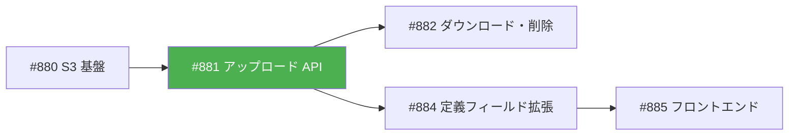
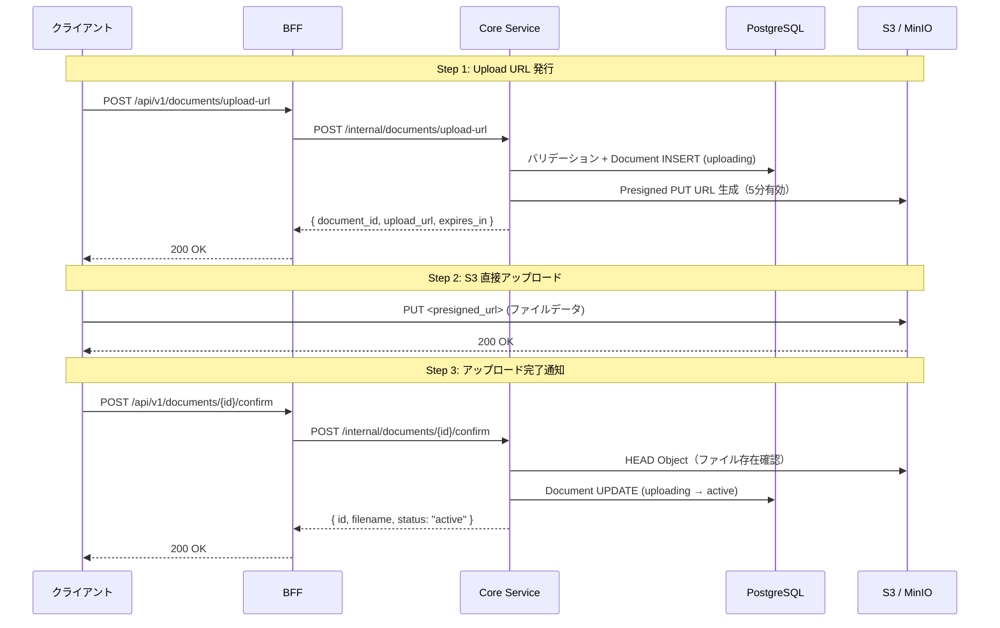
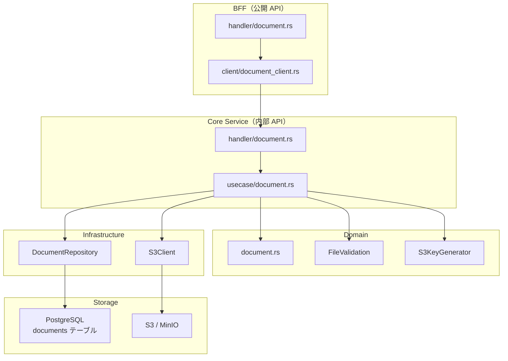
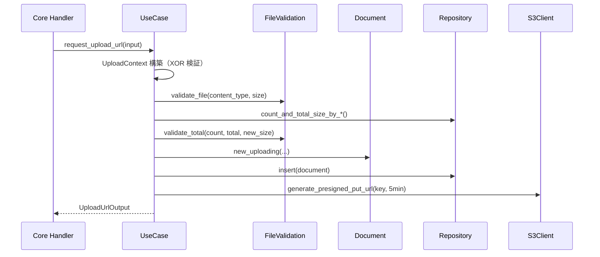
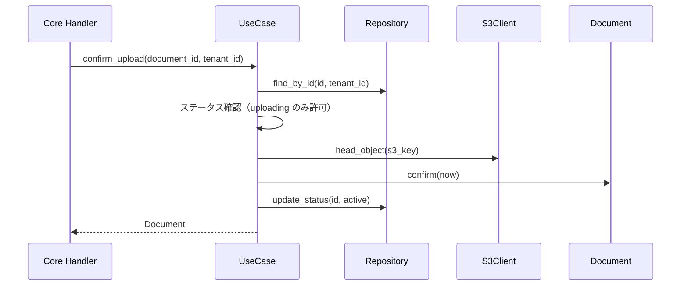

# ファイルアップロード API - 機能解説

対応 PR: #935
対応 Issue: #881

## 概要

Presigned URL 方式のファイルアップロード API。クライアントがサーバーから署名付き URL を取得し、S3 に直接アップロードした後、完了通知でドキュメントを有効化する 3 ステップフロー。

## 背景

### Epic #406（ドキュメント管理）の位置づけ

ドキュメント管理機能は複数の Story に分割されている。本 PR はファイルアップロードの基盤を実装する最初の Story。



| Issue | 内容 | 状態 |
|-------|------|------|
| #880 | S3 基盤（S3Client trait, MinIO Docker） | 完了 |
| #881 | アップロード API（本 PR） | 完了 |
| #882 | ダウンロード URL・ファイル削除・一覧 | 未着手 |
| #884 | ワークフロー定義のファイルフィールド拡張 | 未着手 |
| #885 | フロントエンド UI | 未着手 |

### なぜ Presigned URL 方式か

ファイルをサーバー経由でアップロードする方式と比較し、Presigned URL 方式を採用した。

| 案 | サーバー負荷 | 大容量対応 | 実装複雑度 |
|----|------------|-----------|-----------|
| **Presigned URL（採用）** | 低（S3 直接） | 容易 | URL 発行 + 確認の 2 エンドポイント |
| サーバー経由 | 高（全データ中継） | ストリーミング必要 | シンプルだが非効率 |

## 用語・概念

| 用語 | 説明 | 関連コード |
|------|------|-----------|
| Presigned URL | 一定時間有効な署名付き S3 URL。認証情報なしでアップロード可能 | `S3Client::generate_presigned_put_url` |
| UploadContext | ドキュメントの所属先（フォルダ or ワークフロー）の排他制約 | `UploadContext` enum |
| DocumentStatus | ドキュメントのライフサイクル状態（uploading → active → deleted） | `DocumentStatus` enum |
| FileValidation | Content-Type・サイズ・ファイル数の静的バリデーションルール | `FileValidation` struct |

## フロー

### アップロードフロー（3 ステップ）



## アーキテクチャ



## 状態遷移

### DocumentStatus

```mermaid
stateDiagram-v2
    [*] --> uploading: Document::new_uploading()
    uploading --> active: Document::confirm()
    active --> deleted: (Phase #882 で実装)
    uploading --> deleted: (TTL 超過時、Phase #882 で実装)
```

| 状態 | 意味 | 遷移条件 |
|------|------|---------|
| uploading | Presigned URL 発行済み、S3 アップロード待ち | `new_uploading()` で作成 |
| active | S3 にファイルが存在し、利用可能 | `confirm()` で S3 存在確認後に遷移 |
| deleted | 論理削除済み | Phase #882 で実装予定 |

## データフロー

### フロー 1: Upload URL 発行



#### 処理ステップ

| # | レイヤー | ファイル:関数 | 処理内容 |
|---|---------|-------------|---------|
| 1 | UseCase | `usecase/document.rs:request_upload_url` | UploadContext 構築（folder_id XOR workflow_instance_id） |
| 2 | Domain | `document.rs:FileValidation::validate_file` | Content-Type・サイズの単体バリデーション |
| 3 | Infra | `document_repository.rs:count_and_total_size_by_*` | 既存ドキュメントの集計取得 |
| 4 | Domain | `document.rs:FileValidation::validate_total` | ファイル数・合計サイズの集約バリデーション |
| 5 | Domain | `document.rs:Document::new_uploading` | エンティティ作成（uploading 状態） |
| 6 | Infra | `document_repository.rs:insert` | DB 保存 |
| 7 | Infra | `s3.rs:generate_presigned_put_url` | Presigned URL 生成（5 分有効） |

### フロー 2: アップロード完了通知



## エラーハンドリング

| エラー | 発生箇所 | HTTP Status | メッセージ |
|-------|---------|-------------|-----------|
| 非対応 Content-Type | FileValidation | 400 | 許可されていないファイル形式です |
| サイズ超過（20MB） | FileValidation | 400 | ファイルサイズが上限（20 MB）を超えています |
| ゼロサイズ | FileValidation | 400 | ファイルサイズが 0 です |
| ファイル数超過（10） | FileValidation | 400 | ファイル数が上限（10 件）を超えています |
| 合計サイズ超過（100MB） | FileValidation | 400 | 合計ファイルサイズが上限（100 MB）を超えています |
| コンテキスト未指定 | UseCase | 400 | folder_id または workflow_instance_id のいずれかを指定してください |
| コンテキスト両方指定 | UseCase | 400 | folder_id と workflow_instance_id は同時に指定できません |
| ドキュメント未存在 | UseCase | 404 | ドキュメントが見つかりません |
| 非 uploading で confirm | UseCase | 400 | ドキュメントのステータスが uploading ではありません |
| S3 にファイルなし | UseCase | 500 | S3 上にファイルが存在しません |

## 設計判断

機能・仕組みレベルの判断を記載する。コード実装レベルの判断は[コード解説](./01_ファイルアップロードAPI_コード解説.md#設計解説)を参照。

### 1. folder_id / workflow_instance_id の排他制約をどう表現するか

ドキュメントはフォルダまたはワークフローのいずれか一方にのみ所属する。この XOR 制約をどのレイヤーで保証するかが論点。

| 案 | 型安全性 | DB 整合性 | 実装複雑度 |
|----|---------|----------|-----------|
| **UploadContext enum（採用）** | コンパイル時に保証 | CHECK 制約で二重防御 | enum + Repository で変換 |
| Option 2 つのフラット構造 | 実行時チェックのみ | CHECK 制約 | シンプルだが不正状態が表現可能 |

**採用理由**: ADR-054（不正な状態を表現不可能にする）に従い、ドメイン層で型レベルの保証を行う。DB の CHECK 制約は防御的多重化。

### 2. S3 キー生成ロジックをどこに配置するか

テナント分離やコンテキスト別パスの知識は、インフラの関心か、ビジネスルールか。

| 案 | 責務の明確さ | テスタビリティ | 依存方向 |
|----|-----------|-------------|---------|
| **Domain 層（採用）** | テナント分離はビジネスルール | 純粋関数でテスト容易 | Domain に閉じる |
| Infra 層 | S3 実装の詳細と近い | S3 モックが必要 | Domain → Infra の依存 |

**採用理由**: `{tenant_id}/workflows/{instance_id}/{document_id}_{filename}` のパス構造はテナント分離というビジネスルールの表現であり、S3 の実装詳細ではない。

### 3. アップロード完了時の S3 存在確認をどうするか

confirm 時にファイルが S3 に存在することをどう保証するか。

| 案 | 信頼性 | 実装コスト | ユーザー体験 |
|----|-------|-----------|------------|
| **head_object で確認（採用）** | 高（実ファイル確認） | S3 API 呼び出し 1 回 | confirm 時に即座にフィードバック |
| S3 Event Notification | 高（非同期） | Lambda / SQS 構成必要 | 遅延あり |
| 確認なし（信頼ベース） | 低 | なし | ファイル不在でも active に |

**採用理由**: MVP として最もシンプルかつ信頼性の高い方式。将来的に S3 Event Notification への移行も可能。

## 関連ドキュメント

- [コード解説](./01_ファイルアップロードAPI_コード解説.md)
- [詳細設計書: ドキュメント管理設計](../../03_詳細設計書/17_ドキュメント管理設計.md)
- [機能仕様書: ドキュメント管理](../../01_要件定義書/機能仕様書/06_ドキュメント管理.md)
- [S3 基盤実装解説](../PR917_S3基盤とMinIOローカル環境/)
