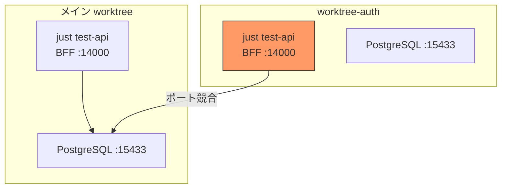
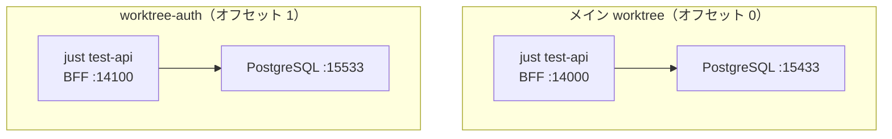
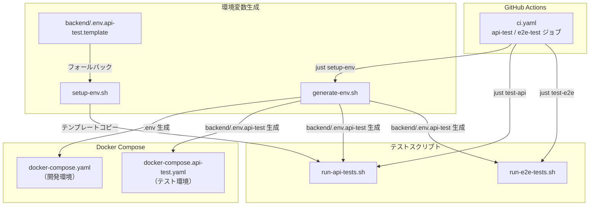
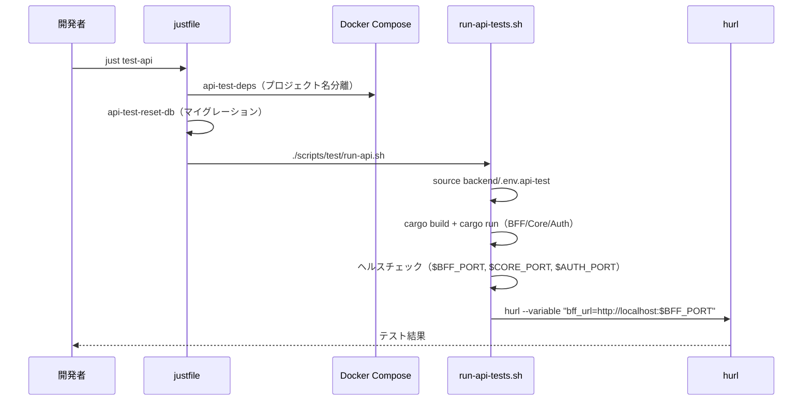
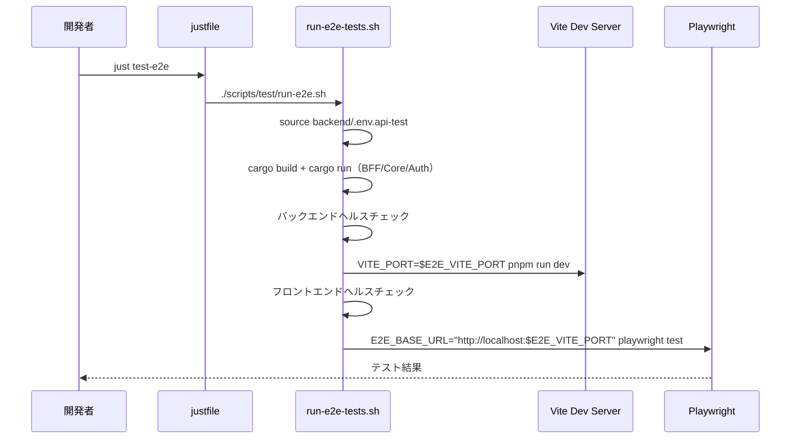
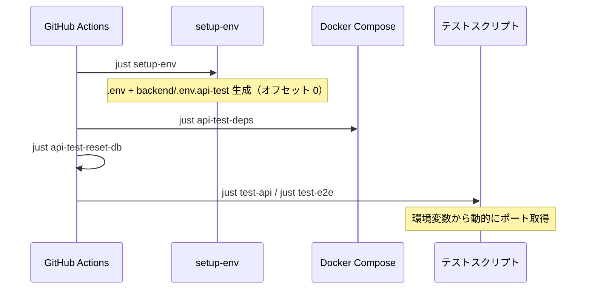

# テスト環境 worktree 対応 - 機能解説

対応 PR: #624
対応 Issue: #617

## 概要

開発環境（`dev-deps`）で既に実現されているポートオフセット方式を、API テスト・E2E テスト環境（`api-test-deps`）に横展開した。これにより、複数の worktree で `just test-api` / `just test-e2e` を同時に実行してもポート競合・DB 汚染が発生しなくなる。

## 背景

### 並行開発環境の現状

PR #96 で開発環境（`dev-deps`）の worktree 対応が完了していた。各 worktree はポートオフセットで Docker コンテナ・アプリケーションサーバーのポートを分離し、独立して `just dev-bff` 等を実行できる。

→ 詳細: [並行開発環境 - 機能解説](./01_並行開発環境_機能解説.md)

### テスト環境のポート固定問題

テスト環境（`api-test-deps`）は開発環境とは別の Docker コンテナ群・ポートを使用するが、ポート番号がハードコードされていた。

| 問題 | 内容 |
|------|------|
| ポート競合 | 複数 worktree で `just test-api` を実行すると同じポート（14000 等）を取り合う |
| DB 汚染 | 同じ PostgreSQL インスタンスを共有するため、テストデータが干渉する |
| Docker プロジェクト名固定 | コンテナ名が共有され、worktree 間で制御できない |

ハードコードされていた箇所:

| レイヤー | ファイル | 内容 |
|---------|---------|------|
| 環境変数 | `backend/.env.api-test` | ポート番号が直接記載（git 追跡対象） |
| Docker Compose | `docker-compose.api-test.yaml` | `"15433:5432"` 等のリテラル |
| テストスクリプト | `run-api-tests.sh` / `run-e2e-tests.sh` | `localhost:14000` 等のリテラル |
| hurl 変数 | `vars.env` | `bff_url=http://localhost:14000` |
| CI ワークフロー | `ci.yaml` | ポート番号のリテラル |

### 設計方針: 開発環境と同一のオフセット方式

開発環境の仕組み（`generate-env.sh` + Docker Compose 環境変数参照 + `basename $(pwd)` プロジェクト名）をテスト環境にも適用する方針とした。

## 用語・概念

| 用語 | 説明 | 関連コード |
|------|------|-----------:|
| ポートオフセット | 各 worktree に割り当てられるポート加算値（100 単位）。同一オフセット内で開発環境とテスト環境のポートは衝突しない | `scripts/env/generate.sh` |
| `api-test-deps` | API テスト・E2E テスト専用の Docker コンテナ群（PostgreSQL, Redis, DynamoDB） | `justfile` |
| テンプレート方式 | `.env.api-test` を git 追跡せず、テンプレート（`.env.api-test.template`）+ 動的生成で管理する方式 | `backend/.env.api-test.template` |

## ビフォー・アフター

### Before（変更前）

テスト環境のポートは全 worktree で固定値。

#### 制約・課題

- 同時に 1 つの worktree でしかテストを実行できない
- CI で並列実行する場合もポート競合のリスクがある

### After（変更後）

テスト環境もオフセットで分離。

#### 改善点

- 各 worktree が独立したテスト環境を持ち、並行実行が可能
- Docker プロジェクト名も `<ディレクトリ名>-api-test` で自動分離

## アーキテクチャ

### ポートオフセット表

#### 開発環境（dev-deps）

| オフセット | PostgreSQL | Redis | DynamoDB | BFF | Core Service | Auth Service | Vite |
|-----------|------------|-------|----------|-----|-------------|-------------|------|
| 0（main） | 15432 | 16379 | 18000 | 13000 | 13001 | 13002 | 15173 |
| 1 | 15532 | 16479 | 18100 | 13100 | 13101 | 13102 | 15273 |

#### テスト環境（api-test-deps）

| オフセット | PostgreSQL | Redis | DynamoDB | BFF | Core Service | Auth Service | E2E Vite |
|-----------|------------|-------|----------|-----|-------------|-------------|----------|
| 0（main） | 15433 | 16380 | 18001 | 14000 | 14001 | 14002 | 15174 |
| 1 | 15533 | 16480 | 18101 | 14100 | 14101 | 14102 | 15274 |

開発環境とテスト環境の差分: インフラポートは +1（15432 → 15433）、サービスポートは +1000（13000 → 14000）。100 単位のオフセット内で衝突しない設計。

## データフロー

### フロー 1: テスト実行（`just test-api`）

### フロー 2: E2E テスト実行（`just test-e2e`）

### フロー 3: CI ワークフロー

## 設計判断

機能・仕組みレベルの判断を記載する。コード実装レベルの判断は[コード解説](./04_テスト環境worktree対応_コード解説.md#設計解説)を参照。

### 1. テスト環境と開発環境のポート差分をどうするか

同一オフセット内で開発環境とテスト環境のポートが衝突しない設計が必要。

| 案 | オフセット内衝突 | ポート可読性 | 設定の複雑さ |
|----|----------------|------------|------------|
| **インフラ +1、サービス +1000（採用）** | なし | 高い（規則的） | 低い |
| 全ポート +1000 | なし | 中 | 低い |
| 全ポート +50 | なし | 中（オフセット幅が狭い） | 低い |
| 完全に別のポート帯 | なし | 低い（規則が見えにくい） | 高い |

**採用理由**: インフラポート（5 桁台）は +1 の差分で十分衝突を回避でき、サービスポート（4 桁台）は +1000 で分離する。100 単位のオフセット内で両環境のポートが重複しない。

### 2. `bff_url` をどう動的化するか

hurl の `--variables-file` と `--variable` の関係が問題になった。

| 案 | hurl 仕様との整合 | 設定の一元性 |
|----|-----------------|------------|
| **`vars.env` から `bff_url` を削除し `--variable` で渡す（採用）** | 互換 | 低い（2 箇所で管理） |
| `--variable` でオーバーライド | 非互換（重複エラー） | 高い |
| `vars.env` をテンプレート化 | 互換 | 高い（複雑） |

**採用理由**: hurl は `--variable` が `--variables-file` をオーバーライドしない（重複変数はエラー）。`vars.env` から `bff_url` を削除し、スクリプト・CI から `--variable` で動的に渡す方式が最もシンプル。

### 3. `.env.api-test` の管理方式をどうするか

開発環境の `.env` と同じく、git 追跡ファイルからテンプレート方式に変更する必要があるか。

| 案 | worktree 対応 | 初回セットアップ |
|----|-------------|----------------|
| **テンプレート方式（採用）** | 可能（動的生成） | `setup-env` で自動 |
| git 追跡ファイル（変更前） | 不可（固定値） | 不要 |
| `.env.local` オーバーライド | 可能 | 手動で作成 |

**採用理由**: `generate-env.sh` で他の `.env` と一括生成する方式にすることで、worktree 追加時のポート設定が自動化される。テンプレートファイルは CI やメイン worktree でのフォールバックとして機能する。

## 関連ドキュメント

- [コード解説](./04_テスト環境worktree対応_コード解説.md)
- [並行開発環境 - 機能解説](./01_並行開発環境_機能解説.md)（PR #96、開発環境の worktree 対応）
- 手順書: [並行開発（Worktree）](../../04_手順書/04_開発フロー/04_並行開発（Worktree）.md)
